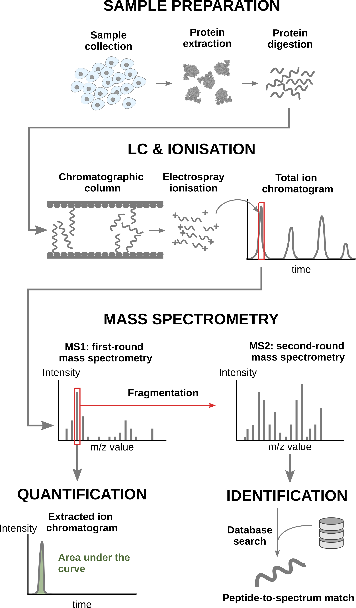
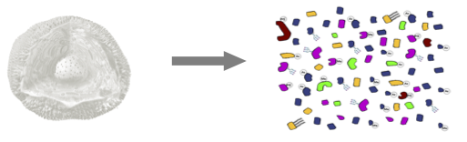
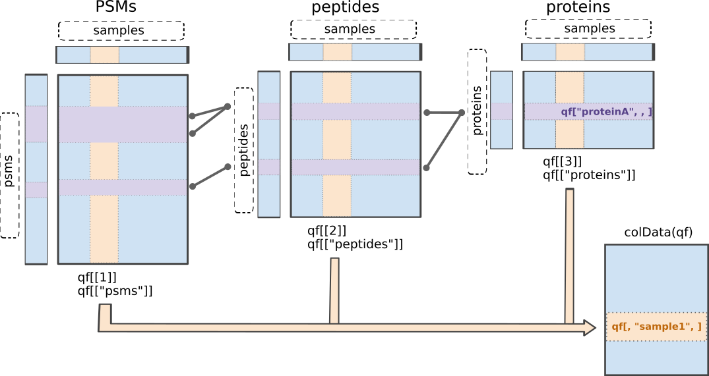

# Statistical analysis with msqrob2 (Data Independent Acquisition, DIA) {#sec-basics-dia}

This chapter explains the main concepts for data-processing and statistical 
analysis of proteomics data using `msqrob2`. Here, these concepts are 
introduced using a spike-in study acquired with Data Independent Acquisition. 

The structure, rationale and code of this chapter is very similar to that of the 
[previous chapter](#sec-basics). The chapters differ primarily in the data 
importing and filtering steps, which are specific to the respective technologies 
and search engines. So we refer users who will mainly work with DDA data to 
[chapter 1](#sec-basics). 

In this chapter, we are using a publicly available 
DIA spike-in study published by Staes et al. [@Staes2024]. 
They spiked digested UPS proteins in a yeast digested background at the 
following ratio's (yeast:ups ratio 10:1, 10:2, 10:4, 10:8, 10:10).
Here we will use a subset of the data, i.e. dilutions 10:2, 10:4 and 10:8. 
We will use output of the search engine DIA-NN 2.2.0. 
The main search output for this DIA-NN version was stored in the report.parquet 
file in the DIA-NN output directory.

Staes et al. [@Staes2024] also searched their data using Spectronaut. These data 
are analysed in @sec-staes-spectronaut. We recommend that Spectronaut 
users first familiarize themselves with the core concepts presented in this 
chapter and then refer to @sec-staes-spectronaut for code specific to 
Spectronaut. The code differs due to other variable naming conventions in DIA-NN 
and Spectronaut, which primarily impacts the data importing and filtering steps.

We recommend that Spectronaut users first familiarize themselves with the core 
concepts presented in this chapter, and then refer to @sec-staes-spectronaut for 
Spectronaut-specific code.

## Background 
### Conventional MS-based workflow

In a nutshell, the wetlab workflow starts with sample preparation where the
samples are collected, and the protein content is extracted and
digested into peptides. To reduce the sample complexity, the peptides
are then separated based on physicochemical properties (mostly
hydrophobicity) using liquid chromatography (LC). Peptides are
then ionised by an electrospray as they elute from the chromatographic
column. The signal over time generated by the eluting ions is called
the total ion chromatogram. The ions are then sent for a first round
of MS to record their m/z distribution for the intact ions. This
provides an overview of the ions that elute from the column and allows
for further separation of the ions in the m/z space. The second round
of MS (MS2) records the fragmented ions for a selection of ions,
generally the most intense MS1 peaks^[The ion selection for MS2
depends on the data recorded in MS1. Therefore, this approach is
referred to as data dependent acquisition (DDA).]. This process is
repeated for every sample so that every sample is acquired in one MS
run. This provides the ion’s mass fingerprint. For LFQ workflows, the
accumulated MS1 intensity over time, also known as the area under the
curve, around the target mass is used as a quantification measure.
On the other hand, the ion mass fingerprint, called the MS2 spectrum,
enables computational identification of the corresponding peptide
using search engines (e.g. Andromeda has been used for this data set)
that will provide peptide-to-spectrum matches (PSM). The quantified
PSM are further processed by the software (MaxQuant) to obtain a
peptide table^[MaxQuant also computes a protein table. However, we
found that starting from MaxQuant's protein table leads to a decrease
in performance. We will illustrate in this tutorial how to build the
protein table.], where every row corresponds to an identified peptide
and every column contains information about the peptide and its
quantification in one of the samples.

```{r, echo = FALSE, out.width = "60%", fig.cap = "Overview of an LFQ-based proteomics workflow."}

```
  


- Peptide Characteristics
  
  - Modifications
  - Ionisation Efficiency: huge variability
  - Identification
    - Misidentification $\rightarrow$ outliers
    - MS$^2$ selection on peptide abundance
    - Context depending missingness
    - Non-random missingness

$\rightarrow$ Unbalanced pepide identifications across samples and messy data

## Data Independent Acquisition 

With data independent acquisition, however, the second round
of MS (MS2) does not record fragmented ions for selected ions. 
Instead the instrument divides the m/z range into sequential windows (e.g., 400–425, 425–450 m/z) and all ions within each window are fragmented together. This continues across the full mass range resulting in a 
systematic fragmentation of all peptides. Hence, the MS2 spectra are complex as many peptides mixed. So search engines and quantification software, such as DIA-NN and Spectronaut, have to deconvolute the complex MS2 spectra so as to identify and quantify individual precursors (MS1) in the m/z window using their MS2 fragments. 
Hence, the quantification can be done using either MS1 or MS2.


- m/z range into sequential windows (e.g., 400–425, 425–450 m/z) 
- MS2 spectra are complex as many peptides mixed
- Deconvolution of the MS2 signal 
- With dedicated software such as Spectronaut or DIA-NN

    - Identification based on spectral libraries
    - Library free: FASTA database to predict in silico spectra, retention times, and ion mobilities, which are then used to search the DIA data
    - Use of decoys sequences to estimate false discovery rate of ID 
    
- Quantification using MS2 and/or MS1 peaks

## Level of quantification

- MS-based proteomics returns peptides or precursors: pieces of proteins

```{r echo=FALSE}

```

- Quantification commonly required on the protein level

```{r echo=FALSE}
knitr::include_graphics("./figs/challenges_proteins.png")
```


## Challenges{#sec-dia_challenges}

Behind this workflow lies several challenges that will affect the data
modelling:

- MS-based proteomics does not measure proteins directly, but their 
constituting **peptide ions**. The protein-level information needs
to be reconstructed from the ion data. In this tutorial, we will
start from the precursor-level data, which has been constructed from the ion
data by DIA-NN.
- All peptides do not ionise with the same efficiency. Poor 
ionisation will lead to reduced signal as less ions will hit the
detector, hence leading to a huge variability in intensity among
different peptide species, even when they originate from the same
protein.
- The identification step is not trivial and prone to 
errors^[Improving peptide identification is outside the scope of
this tutorial]. PSM misidentification leads to the assignment of a
quantitative values from another peptide with likely another
ionisation efficiency and relative abundance. Hence this misassigned
values often lead to outliers.
- Moreover, there is a widespread data missingness, which is often related to the
underlying quantification value. This phenomenon is known as
missingness not at random. Next to that, many reasons can lead to
ions not being identified irrespective of their 
quantification value leading to missingness that is not related to
its quantitative value. This is referred to as missingness 
completely at random. The missingness issue is not negligible as we shall see upon reading the data.
- Identification issues lead to unbalanced peptide missingness
across samples, and the patterns of missing values are potentially
different for every peptide, highlighting the need for an
automatised solution that is robust against missing values.
- Technical variations during the experiment can lead to systematic 
fluctuations across samples. The most obvious reason is when
different sample amounts are injected into the instruments, due to
small pipetting inconsistencies for instance. However, these
differences lead to unwanted variation that should be discarded when
answering biological questions.

## DIA workflow

DIA-NN provides multiple quantifications, e.g. derived from the MS1 or MS2 spectra, and at precursor or protein (protein group) level. The term 'precursor' refers to a charged peptide species and is the basic unit of identification and quantification in DIA. Hence, in the context of DIA we refer to a precursor table, instead of to a PSM table in DDA. 

Examples of different quantities are:

- raw MS1 area: Ms1.Area, normalised MS1 Area: Ms1.Normalised, MS2 Precursor quantities: Precursor.Quantity, Normalised MS2 Precursor quantities: Precursor.Normalised, etc., which are all at the precursor level 
- MS2 based summary at the protein (protein group)-level: PG.MaxLFQ

Here, we will use the `Precursor.Quantity` column.

## Experimental context 

This chapter explains how to analyse a proteomics data set that has 
been generated using data independent acquisition (DIA). We will again
use an in-house spike-in study to illustrate the analysis.
The DIA case-study is a subset of Staes et al. [@Staes2024]. They spiked digested UPS proteins in yeast at the following ratio's (yeast:ups ratio 10:1, 10:2, 10:4, 10:8, 10:10) in a yeast digest background.

Each sample was analyzed in triplicate using an
Ultimate 3000 RSLC ProFlow nano-LC system in-line
connected to a Q Exactive HF BioPharma mass spectrometer
(Thermo). 

Here, we will only use the data of the samples from the middle 3 spike-in ratio's (2,4 and 8) that were searched using DIA-NN 2.2.0. The main search output for this DIA-NN version is stored in the report.parquet file in the DIA-NN output directory.


```{r echo=FALSE, out.width="50%"}
knitr::include_graphics("./figs/cptacLayoutLudger.png")
```


### Load packages

We load the `msqrob2` package, along with additional packages for
data manipulation and visualisation.


```{r load_libraries}
suppressPackageStartupMessages({
library("QFeatures")  
library("dplyr") 
library("tidyr")
library("ggplot2")
library("msqrob2")    
library("stringr")
library("ExploreModelMatrix")
library("MsCoreUtils") 
library("matrixStats")
library("patchwork")
library("kableExtra")
library("ComplexHeatmap")
library("purrr")
library("tibble")
library("scater")
library("ggcorrplot")
})
```

### Parallelisation {#sec-parallel}

`msqrob2` can parallelise computations during the model estimation
to improve speed. However, we will disable parallelisation to ensure
this vignette can be run regardless of hardware. Parallelisation is
controlled using the `BiocParallel` package.

```{r}
library("BiocParallel")
register(SerialParam())
```

If you want to use `msqrob2` with parallelisation enabled and using
4 cores, you can run the following:

```{r, eval = FALSE}
register(MulticoreParam(workers = 4))
```

Be mindful that, while parallelisation can improve speed, it will also
consume more RAM because part of the data will be copied multiple
times over your different workers. If you experience crashes because
you exceeded the amount of available RAM on your machine, you should
reduce the number of requested workers.

## Data

### Precursor table

We load the output from DIA-NN parquet file.

```{r import_data}
library("BiocFileCache")
bfc <- BiocFileCache()
precursorFile <- bfcrpath(bfc,"https://github.com/statOmics/msqrob2data/raw/refs/heads/main/dia/spikeinStaes/spikein248-staesetal2024.parquet") 
```


We can import the report.parquet file using the `read_parquet` function from the `arrow` package. 
Note, that older versions of DIA-NN store the output as report.tsv. 

```{r}
precursors <- arrow::read_parquet(precursorFile) # function from the arrow package
#precursors <- data.table::fread(precursorFile) # For older versions of DIA-NN, where the results are stored as tsv files. Note that the precursorFile then would point to "report.tsv" 
```

Each row in the precursor data table is in "long format" and contains information about one precursor in a specific run (the table below shows the first 6 rows). 
The columns contains various descriptors about the precursor, such as its sequence, its charge, run, etc. Some of these columns contain the quantification values, e.g. Ms1.Area, Precursor.Quantity etc. 


```{r, echo=FALSE}
knitr::kable(head(precursors))
```


We filter the data to reduce the memory footprint. 

```{r}
precursors <- precursors |> 
  select(
         Run, 
         Precursor.Id, 
         Modified.Sequence, 
         Stripped.Sequence, 
         Precursor.Charge, 
         Protein.Group, 
         Protein.Names,
         Protein.Ids,
         Genes,
         Precursor.Quantity,
         Precursor.Normalised,
         Normalisation.Factor,
         Ms1.Area,
         Ms1.Normalised,
         PG.MaxLFQ,
         Q.Value, 
         Lib.Q.Value,
         PG.Q.Value,
         Lib.PG.Q.Value,
         Proteotypic,
         Decoy, # Not available in older versions of DIA-NN
         RT)
```

We known the ground truth: UPS proteins are differentially abundant (DA, spiked in), Yeast proteins are not.  
```{r}
precursors <- precursors |> 
  mutate(species = grepl(pattern = "UPS",Protein.Group) |> 
           as.factor() |>
           recode("TRUE"="ups","FALSE" = "yeast"))
precursors |> 
  pull(species) |>
  table()
```

### Sample annotation table

The [sample annotation table](#sec-annotation_table) is not available
and can be generated from the run labels, as the researchers included information on the design in the filenames.

We will make a new data frame with the annotation. 

1. We first generate variable `runCol`, that gives an overview of the different runs in the experiment, i.e. the unique names in the column Run of the report file. This is a mandatory column in the annotation file that is required by the `readQFeatures` function that will be used to generate a QFeatures object with the quant data. 

2. Next we generate variable `sampleId`, to pinpoint the different samples in the dataset. This can be extracted from the run names as the researchers have stored information on the meta data in the file names for each run. E.g. for run B000282_Ap_6883_EXT-765_DIA_Yeast_UPS2_ratio04_DIA_2 this is the ratio, i.e. ratio04, and the replicate, i.e. _2 after DIA. Note, that the first replicate has no number. 
    
    a. We first replace the redundant pattern "DIA" with an empty character string. 
    b. Next we split the strings according to the pattern "UPS2" using the `strsplit` function and
    c. keep the right part of the string. We do this by looping over the list from `strplit`  with an sapply loop, which takes the output of b. as its first argument, uses the function '[' to subset vector of strings in each list element and uses an optional argument '2' to select the second string of the vector (right part).

3. We make add the variable `ratio` by parsing the variable stringId and

    a. replacing pattern "ratio" by an empty string using the `gsub` function
    b. splitting the output of `gsub` according to pattern "_" and 
    c. keeping the left part of the string (first element of the vector of strings in each list item of the substr output)
    d. converting the output of c to an integer
    e. converting the ratio into a factor

4. We make add the variable `rep` by parsing the variable stringId, and  

    a. splitting it according to pattern "_", 
    b. keeping the right part of the string (second element of the vector of strings in each list item of the substr output)
    c. replacing NA by 1, as for the first replicate no number was added to the filename
    d. converting it into a factor
    
```{r create_metadata}
(
  annot <- data.frame(runCol = precursors |> 
                       pull(Run) |> 
                       unique() # 1. 
                   ) |>
    mutate(sampleId = gsub(x = runCol, pattern = "_DIA", replacement = "") |> #2.a
               str_split("UPS2_") |> #2.b
               sapply(`[`, 2) #2.c
           ) |>
    mutate(
           condition =  gsub("ratio", "", sampleId) |> #3.a
               str_split("_") |> #3.b
               sapply(`[`, 1) |> #3.c
               as.numeric() |> #3.d
               as.factor(), #3.e
           rep = sampleId |> 
               str_split("_") |> #4.a
               sapply(`[`, 2) |> #4.b
               replace_na(replace = "1") |> #4.c
               as.factor(), #4.d
           ratio = condition |> 
             as.character() |> 
             as.double()
           )
)
```

### Convert to QFeatures

`msqrob2` is built around the `QFeatures` class. We refer to the [R
for mass spectrometry
book](https://rformassspectrometry.github.io/book/sec-quant.html) for
a comprehensive description of the class. In a nutshell, the
`QFeatures` package provides infrastructure to manage and analyse
quantitative features from mass spectrometry experiments. It is based
on the `SummarizedExperiment` and `MultiAssayExperiment` classes. It
leverages the hierarchical structure of proteomics experiments: data
proteins are composed of peptides, themselves produced by spectra.
Each piece of information in stored in an individual
`SummarizedExperiment` object, later referred to as a "set".
Throughout the aggregation and processing of these data, the relations
between sets are tracked and recorded, thus allowing users to easily
navigate across spectra, peptide and protein quantitative data.

```{r, echo = FALSE, out.width = "80%", fig.cap = "Illustration of the `QFeatures` data class."}

```

The `readQFeatures()` enables a seamless conversion of tabular data
into a `QFeatures` object. We provide the peptide table and the sample
annotation table. The function will use the `quantCols` column in the
sample annotation table to understand which columns in `peptides`
contain the quantitative values, and automatically link the
corresponding sample annotation with the quantitative values. We also
tell the function to use the `Sequence` column as peptide identifier,
which will be used as rownames. See `?readQFeatures()` for more
details.

First, recall that the precursor table is file in long format. 
Every quantitative column in the precursor table contains
information for multiple runs. Therefore, the function split the table
based on the run identifier, given by the `runCol` argument (for
DIA-NN, that identifier is contained in `run`). 
So, the
`QFeatures` object after import will contain as many sets as there are
runs. 
Next, the function links the annotation table with the PSM data.
To achieve this, the annotation table must contain a `runCol` column
that provides the run identifier in which each sample has been
acquired, and this information will be used to match the identifiers
in the `Run` column of the precursor table. 

Here, we will use the `Precursor.Quantity` column as quantification input. 

Note, that we filter a number of variables to reduce the footprint of the QFeatures object. 

```{r}
(qf <- readQFeatures(assayData = precursors,  
                              colData = annot,
                              quantCols = "Precursor.Quantity",
                              runCol = "Run",
                              fnames = "Precursor.Id"))
```

We now have a `QFeatures` object with 9 sets, one set for each run that are named based on their run name in the runCol.
The sample annotations can be retrieved using `colData()`.

```{r, eval=FALSE}
colData(qf)
```

```{r}
knitr::kable(head(colData(qf)))
```

We can get a sample annotation directly using the `$` accessor.

```{r}
qf$condition
```

We can extract the `SummarizedExperiment` object for the `B000254_Ap_6883_EXT-765_DIA_Yeast_UPS2_ratio02_DIA`
set using double bracket subsetting^[A `QFeatures` object can be seen
as a special list of `SummarizedExperiment` objects.]

```{r}
qf[["B000254_Ap_6883_EXT-765_DIA_Yeast_UPS2_ratio02_DIA"]]
```

But notice that the sample annotations were not extracted along with
the SummarizedExperiment (`colData names(0):`). This can be performed
using `getWithColData()`, which extracts the set of interest (like
`[[]]`) along with all the associated sample annotations.

```{r}
getWithColData(qf, "B000254_Ap_6883_EXT-765_DIA_Yeast_UPS2_ratio02_DIA")
```

The precursor annotations are available for in the corresponding 
`rowData`.

```{r, eval=FALSE}
rowData(qf[["B000254_Ap_6883_EXT-765_DIA_Yeast_UPS2_ratio02_DIA"]])
```

```{r}
knitr::kable(head(rowData(qf[["B000254_Ap_6883_EXT-765_DIA_Yeast_UPS2_ratio02_DIA"]])))
```

We can also retrieve the quantitative values for each set using 
`assay()`. Here we only show the first 5 rows of the intensity matrix for the first summarized experiment. 

```{r}
assay(qf[[1]]) |> head(5)
```
Note, that there is only one column, because each run has been stored in a separate summarized experiment. 
We will join the data of the runs later. 

Since we have a `QFeatures` object, we can directly make use of
`QFeatures`' data preprocessing functionality^[see also the [R for
mass spectrometry
book](https://rformassspectrometry.github.io/book/sec-quant.html)]. A
major advantage of `QFeatures` is it provides the power to build
highly modular workflows, where each step is carried out by a
dedicated function with a large choice of available methods and
parameters. This means that users can adapt the workflow to their
specific use case and their specific needs.

## Data preprocessing{#sec-basic_preprocess}

The data preprocessing workflow for DIA data is similar to the workflow for DDA-LFQ data, but there are suble differences as we start from precursor level data and have additional columns. 

### Encoding missing values

The first preprocessing step is to correctly encode the missing
values. It is important that missing values are encoded using `NA`.
For instance, non-observed values should not be
encoded with a zero because true zeros (the proteomic feature
is absent from the sample) cannot be distinguished from technical
zeros (the feature was missed by the instrument or could not be
identified). We therefore replace any zero in the quantitative data
with an `NA`. 

```{r}
qf <- zeroIsNA(qf, names(qf))
```

Note that `msqrob2` can handle missing data without having to rely on
hard-to-verify imputation assumptions, which is our general recommendation. However, `msqrob2` does not
prevent users from using imputation, which can be performed with
`impute()` from the `QFeatures` package. 

### Precursor Filtering 

Filtering removes low-quality and unreliable precursors that would otherwise introduce noise and artefacts in the data. 

#### Remove questionable identifications


We apply standard filtering advised by DIA-NN: 

1. q-value threshold of 0.01 for the identification of precursors (`Q.Value`) and protein groups (`PG.Q.Value`). If the file is processed via matching between runs, it is also useful to filter on Lib.Q.Value and Lib.PG.Q.Value.

2. Remove precursors that could not be mapped, i.e. when `Precursor.Id` column is an empty string.  

3. Filter decoys, i.e. only keep precursors for which the `Decoy` column equals 0. (Note, that the `Decoy` column is not present in the output of older versions of DIA-NN)

4. Keeping only proteotypic peptides, which map uniquely to a specific protein.


```{r}
qf <-  qf |>
  filterFeatures(~ Q.Value <= 0.01 & #1.
                     PG.Q.Value <= 0.01 &  #1.
                     Lib.Q.Value <= 0.01 & #1.
                     Lib.PG.Q.Value <= 0.01 & #1.
                     Precursor.Id != "" & #2.
                     Decoy == 0 & #3. (Note, that this filter is not available with previous versions of DIA-NN, as the report.tsv file did not include a Decoy column. So other strategies are needed if Decoys are in the output file.)
                     Proteotypic == 1) #4.
```


Note, that it is important that the filtering criteria are not distorting the distribution of the test statistics in the downstream analysis for features that are non-DA. 
It can be shown that filtering will not induce bias results when the filtering criterion is independent of test statistic. The criteria that we proposed above are all based on the results of the identification step, hence, they are independent of the downstream test statistics that will be used to prioritize DA proteins. 

#### Assay joining

Up to now, the data from different runs were kept in separate assays. We can now join the normalised sets into an precursor set using joinAssays(). Sets are joined by stacking the columns (samples) in a matrix and rows (features) are matched according to a row identifier, here the `Precursor.Id`.
We will store the result in the assay with name: `precursor`.

```{r}
(qf <- joinAssays(
  x = qf,
  i = names(qf),
  fcol = "Precursor.Id",
  name = "precursors"
  ))
```

We will again retrieve the quantitative values for each set using 
`assay()`. 
Here we only show the first 5 rows and columns of the intensity matrix and illustrate default subsetting that is possible. 

```{r}
assay(qf [["precursors"]])[1:5, 1:5]
```

#### Filtering: Remove highly missing precursors

```{r}
qf[,,"precursors"] |> 
  longForm(colvars = colnames(colData(qf))) |> 
  ggplot(aes(x = sampleId)) +
  geom_bar(aes(fill = factor(!is.na(value))),
           colour = "black") +
  theme_minimal()
```

We keep peptides that were observed at last 4 times out of the $n
= 9$ samples, so that we can estimate the peptide characteristics. 
We tolerate the following proportion of NAs:
$\text{pNA} = \frac{(n - 4)}{n} = 0.556$, so we keep peptides that
are observed in at least 44.4% of the samples, which corresponds to one treatment condition. This is an arbitrary value that may need to be adjusted depending on the experiment and the data set.


```{r}
nObs <- 4
n <- ncol(qf[["precursors"]])

(qf <- filterNA(qf, i = "precursors", pNA = (n - nObs) / n))
```


#### Filter one-hit wonders

Here, we remove proteins that can only be found by one peptide, as such proteins may not be trustworthy.

1. We first calculate how many distinct peptides map to each protein (`Protein.Group`). We use the stripped precursor sequence, i.e. sequence of the base peptide for this purpose. 

2. We store this information in the row data of the precursors assay

3. We filter precursors of one-hit wonder proteins.  

```{r}
# Filter for peptides per protein
pepsPerProtDf <- qf[["precursors"]] |> 
    rowData() |> 
    data.frame() |>
    dplyr::select("Stripped.Sequence", "Protein.Group") |>
    group_by(Protein.Group) |>
    mutate(pepsPerProt = Stripped.Sequence |>
               unique() |> length()
           ) #1.

rowData(qf[["precursors"]])$pepsPerProt <- pepsPerProtDf$pepsPerProt #2. 

qf <- filterFeatures(qf, 
                              ~ pepsPerProt > 1, 
                              keep = TRUE) #3.
```

### Log-transformation 

We typically start a MS-based proteomics data analysis by log2 transforming the intensities. We illustrate the rationale
using the spike-in data. For this, we perform a short data
manipulation pipeline:

1. We use `longForm()` to convert the `QFeatures` object into a long
table, where each row contains the quantitative information about
one observation, in which column, row and set it was found. Long
tables are particularly useful for manipulating data with the
`tidyverse` ecosystem, namely with `ggplot2` for visualisation.
`longForm()` also allows to include annotations, and we here
include `Mixture` and `TechRepMixture` for filtering and colouring.
2. `longForm()` returns a `DataFrame` which we convert to a
`data.frame`.
3. We filter the data to keep only the data from precursor "(UniMod:1)ADSRDPASDQMQHWK3".

```{r}
dat <- longForm(qf, colvars = colnames(colData(qf))) |> ## 1.
  data.frame() |> ## 2.
  filter(rowname == "(UniMod:1)ADSRDPASDQMQHWK3") ## 3.
```

Next, we visualise the data using `ggplot2`. We will show the
intensities and log2-intensities for one of the precursors, ADSRDPASDQMQHWK3, in
function of the known spike-in ratio. We first define a common
plot from which we generate two plots, one without and the other with
log2 transformation of the quantitative values.

```{r basics_log_plot, echo=FALSE, fig.cap="MS-data is heteroskedastic, but log transformation achieves homoskedasticity. Peptide intensities (left) or log2 intensities (right) are plotted in function of spike-in concentration."}
## Common plot
p <- ggplot(dat) +
  aes(x = ratio) +
  geom_point() +
  theme_minimal()
## Add the x and y axis as linear or log2-transformed
p + aes(y = value) + 
  p + aes(y = log2(value), x = log2(ratio)) +
  plot_annotation(title = "ups precursor ADSRDPASDQMQHWK3") +
  plot_layout(axis_titles = "collect_x") + 
  labs(x = "UPS ratio (left original, right (log2)")
```

We can see that the variation around the mean for each concentration slightly increases as the mean increases. This is known as heteroskedasticity.
We will later see that `msqrob2` assumes that variance of the error
is equal across the different conditions. Upon,
log2-transformation we can see that the problem of unequal variability
is solved.

Another advantages of log2-transformation is that it provides a scale
that directly relates to biological interpretation. In biology, a
change induced by some condition often results in a fold change in
concentration. Interestingly, the log2 fold change (logFC), which is
the log2 of the ratio between two conditions, is identical to the
difference between the log of each condition.

$$log_2FC_{b-a} = log_2b - log_2a = log_2 \frac{b}{a}$$

This simplifies the modelling since the effects are now additive and
it provides a straightforward interpretation, i.e. a logFC of 1 means that the
abundances are on average $2\times$ higher in $b$ than in $a$, a logFC of 2
means an average increase of $4\times$, for instance.
Also, note that the averages calculated at the log2-scale have the interpretation of log2-transformed geometric means. 

We perform log2-transformation with `logTransform()` from the
`QFeatures` package. We use `base = 2` and store the result in a new summarized experiment named `precursors_log`

```{r}
qf <- logTransform(qf, 
                            base = 2, 
                            i = "precursors", 
                            name = "precursors_log")
```

### Normalisation {#sec-norm}

The most common objective of MS-based proteomics experiments is to
understand the biological changes in protein abundance between
experimental conditions. However, changes in measurements between
groups can be caused due to technical factors. For instance, there are
systematic fluctuations from run-to-run that shift the measured
intensity distribution. We can this explore as follows:

1. We extract the sets containing the log transformed data. This is 
performed using `QFeatures`' 3-way subsetting^[We will explain this
with more details at the end of the [summarisation step](#sec-summarisation)].
2. We use `longForm()` to convert the `QFeatures` object into a long
table, including `condition` and `concentration` for filtering and
colouring.
3. We visualise the density of the quantitative values within each
sample. We colour each sample based on its spike-in condition.

```{r}
qf[, , "precursors_log"] |> #1.
  longForm(colvars = colnames(colData(qf))) |>  #2. 
  data.frame() |> 
  filter(!is.na(value)) |>
  ggplot() + #3.
  aes(x = value,
      colour = condition,
      group = colname) +
  geom_density() +
  theme_minimal()
```

Even in this clean synthetic data set (same yeast background with some spiked UPS proteins), the marginal precursor intensity
distributions across samples are not well aligned. Ignoring this
effect will increase the noise and reduce the statistical power of the
experiment, and may also, in case of unbalanced designs, introduce
confounding effects that will bias the results.

There are many ways to perform the normalisation, e.g.  median centering is a popular choice. 
If we subtract the sample median at the log scale from each precursor log2 intensity, this basically boils down to calculating log-ratio's between the precursor intensity and its sample median. 

Here, we will use the Median of Ratios method of DESeq2, which was originally 
developed for RNA-seq data analysis and can also correct for differences in 
composition of the proteomes in the different samples. 
The method first calculates pseudo-reference sample (row-wise mean of log2 
intensities, which corresponds to the log2 transformed geometric mean).
THen calculates log2 ratios of each sample w.r.t. the pseudo-reference.
Finally the column wise median of these log2 ratios is taken to obtain 
the sample based normalisation factor on the log2 scale.
This procedure is implemented in the `msqrob2` function `nfLogMedianOfRatios`.

1. We calculate the log transformed normalisation factor from the Median of 
Ratios method
2.  Subtract these log2-norm factors from the intensities of each corresponding 
column of the assay data and store the result in the new assay peptides_norm. 
(We adopt the sweep function to the `peptides_log` assay of the spikein 
QFeatures object with as statistic the log2 normfactor `STATS = nfLog` the 
default function `FUN = "-"`, `MARGIN = 2` to substract the column wise log2 
norm factor from each entry of the corresponding assay data).


```{r normalize_peptides}
nfLog <- nfLogMedianOfRatios(qf, "precursors_log") #1.
qf<- sweep( #Subtract log2 norm factor column-by-column (MARGIN = 2) #2.
  qf,
  MARGIN = 2,
  STATS = nfLog,
  i = "precursors_log",
  name = "precursors_norm"
)
```

Note that users can also use all normalisation functions that are provided in 
QFeatures, i.e. by replacing the sweep function by `QFeatures::normalize` or that 
they can start from intensities normalised by DIA-NN, e.g. `Precursor.Normalised`.

We explore the effect of the total normalisation in the subsequent plot. 


Formally, the function applies the following operation on each sample
$i$ across all precursors $p$:

$$
y_{ip}^{\text{norm}} = y_{ip} - \log_2(nf_i)
$$

with $y_ip$ the log2-transformed intensities and $nf_i$ the log2-transformed norm factor. Upon normalisation, we can see
that the distribution of the $y_{ip}^{\text{norm}}$ nicely overlap (using the same code as above)

```{r}
qf[, , "precursors_norm"] |>
  longForm(colvars = colnames(colData(qf))) |> 
  data.frame() |> 
  filter(!is.na(value)) |>
  ggplot() + 
  aes(x = value,
      colour = condition,
      group = colname) +
  geom_density() +
  labs(subtitle = "Normalised log2 precursor intensities") +
  theme_minimal()
```

Note, that many different normalisation factors are proposed in the literature. We will evaluate different normalisation strategies in the tutorial session. 

### Summarisation

The objective of summarisation (also referred to as aggregation) is to
summarise the precursor-level intensities into a protein expression value.
We illustrate the motivation for summarisation using all peptide-level data for
one of the spiked UPS proteins. 
The different precursors are shown on the
x axis and plot their log2 normalised intensities across samples on y
axis. All the points belonging to the same sample are linked through a
grey line.

```{r}
protName <- "UPS|P01008ups|ANT3_HUMAN_UPS"
qf[,,"precursors_norm"] |> 
  longForm(colvars = colnames(colData(qf)), rowvars = "Protein.Ids") |> 
  data.frame() |> 
  filter(Protein.Ids == protName) |>
  ggplot() +
  aes(x = rowname, 
      y = value,
      group = colname) +
  geom_line(linewidth = 0.1) +
  geom_point(aes(fill = condition), size = 3, shape = 21) +
  theme(axis.text.x = element_text(angle = 90, hjust = 1, vjus = 0.5),
        legend.position = "top") + 
  labs(
       subtitle = protName,
       x = "Precursor", 
       y = "log2(norm Intensity)") +
  theme_minimal()+
  theme(axis.text.x = element_text(angle = 90, vjust = 0.5, hjust = 1))
```

1. We can see that data for a protein can consist of many precursors, 
hence the need for summarisation.
2. We observe that different precursors have different intensities 
within the same sample (same line). This is because different
precursors have different properties and hence differ in their ionisation
efficiency, which will influence the detectability in the MS 
([Challenges]).
3. The precursor identification are inconsistent between groups of 
interest. We can see the low-concentration group (condition a, red)
display more missing values than the high-concentration group
(condition e, blue). Moreover, which value is missing depends on
the precursor characteristics. All the precursors found in the
low-concentration group are the most intense precursors in the high
concentration group.
4. We also often find outliers, for instance, due to misidentification or fluctuations during MS acquisition.
5. These data also suggest pseudo-replication. The precursor intensities
in one same sample (dots connected by a line) are correlated, i.e.
they more alike than the precursor intensities between samples
(the lines do not perfectly align). 

The fact that different precursors have different intensities (2.), may
be inconsistently identified (3.) and/or quantified (4.), and show
sample correlations (5.) can lead to bias if we use simple
summarisation approaches such as summing or averaging the precursor
intensities for each sample. Instead, we will resort to more advanced
summarisation approaches to accommodate for these issues.


Here, we summarise the precursor-level data into protein intensities using maxLFQ. 
maxLFQ first calculates all pairwise log ratio's between samples only using their shared precursors.
Particularly, it uses the median of the log ratio's between the shared precursors s, i.e. 
$$r_{ij} = median(y_{sj}-y_{si})$$.  
Hence, it first eliminates peptide effects. 
It then estimates the summaries by solving 

$$
\sum_i\sum_j(y^{prot}_j - y^{prot}_i - r_{ij})^2
$$
It is implemented in the `maxLFQ` function of the `iq` package. 

`aggregateFeatures()` streamlines summarisation. It requires the name
of a `rowData` column to group the precursors into proteins (or
protein groups), here `Protein.Group`. We provide the summarisation
approach through the `fun` argument. Other summarisation methods
are available from the `MsCoreUtils` package, see `?aggregateFeatures`
for a comprehensive list. The function will return a `QFeatures`
object with a new set that we called `proteins`.

```{r, warning=FALSE}
(qf <- aggregateFeatures(
  qf, i = "precursors_norm", 
  name = "proteins",
  fcol = "Protein.Group", 
#  fun = MsCoreUtils::medianPolish,
#  na.rm = TRUE
  fun = function(X, ...) iq::maxLFQ(X)$estimate
))
```

Note that all the links between precursors and proteins are kept^[In
fact, this is also true for the previous transformation where the
precursors are linked across sets.]. This come particularly handy when
we want to extract all the data from one protein, P16083 for
instance. This can be performed using the 3-way indexing. Every
`QFeatures` object contains one or more sets, each characterised by
multiple rows (precursors or proteins) and multiple columns (samples).
Therefore, `QFeatures` can subset data based on one or more of these
indices, `data[set_k, feature_i, sample_j]`. The first entry will
subset particular features. This can be the name of a precursor (e.g.
`KGMVAAWSQR2`) or the name of a protein (`UPS|P01008ups|ANT3_HUMAN_UPS`).
The second entry selects the samples columns of interest. The third
entry selects the sets of interest. If an entry is left blank, all the
corresponding features, samples or sets will be selected. Let's
extract all the data (all samples and all sets) related to the ups protein
(`UPS|P01008ups|ANT3_HUMAN_UPS`).


```{r}
qf["UPS|P01008ups|ANT3_HUMAN_UPS", , ]
```
We finally evaluate the marginal distribution of the aggregated protein summaries. 

```{r}
qf[, , "proteins"] |>
  longForm(colvars = colnames(colData(qf))) |> 
  data.frame() |> 
  filter(!is.na(value)) |>
  ggplot() + 
  aes(x = value,
      colour = condition,
      group = colname) +
  geom_density() +
  theme_minimal() +
   labs(subtitle = "Normalised log2 protein intensities")
```

The data processing is complete.

```{r}
plot(qf)
```

## Data exploration and QC

Data exploration aims to highlight the main sources of variation in
the data prior to data modelling and can pinpoint to outlying or
off-behaving samples. 

### Marginal distribution at precursor and protein level 


```{r}
qf[, , "precursors_norm"] |>
  longForm(colvars = colnames(colData(qf))) |> 
  data.frame() |> 
  filter(!is.na(value)) |>
  ggplot() + 
  aes(x = value,
      colour = condition,
      group = colname) +
  geom_density() +
  theme_minimal() +
   labs(subtitle = "Normalised log2 precursor intensities")
```

```{r}
qf[, , "precursors_norm"] |>
  longForm(colvars = colnames(colData(qf))) |> 
  data.frame() |> 
  filter(!is.na(value)) |>
  ggplot() + 
  aes(x = sampleId,
      y = value,
      colour = condition,
      group = colname) +
  xlab("sample") +
  geom_boxplot() +
  theme_minimal() +
   labs(subtitle = "Normalised log2 precursor intensities")
```

```{r}
qf[, , "proteins"] |>
  longForm(colvars = colnames(colData(qf))) |> 
  data.frame() |> 
  filter(!is.na(value)) |>
  ggplot() + 
  aes(x = sampleId,
      y = value,
      colour = condition,
      group = colname) +
  xlab("sample") +
  geom_boxplot() +
  theme_minimal() +
   labs(subtitle = "Normalised log2 protein intensities")
```

```{r}
qf[, , "proteins"] |>
  longForm(colvars = colnames(colData(qf))) |> 
  data.frame() |> 
  filter(!is.na(value)) |>
  ggplot() + 
  aes(x = value,
      colour = condition,
      group = colname) +
  geom_density() +
  theme_minimal() +
   labs(subtitle = "Normalised log2 protein intensities")
```

### Charge state 

```{r}
qf[, , "precursors_norm"] |>
  longForm(colvars = colnames(colData(qf)), rowvars = "Precursor.Charge") |>
  as.data.frame() |>
  filter(!is.na(value)) |>
  filter(Precursor.Charge<=4) |> 
ggplot(aes(x = sampleId)) +
  geom_bar(aes(fill = factor(Precursor.Charge, levels = 4:1)),
           colour = "black") +
  labs(title = "Peptide types per sample",
       x = "Sample",
       fill = "Charge state") +
  theme_bw()
```

### Identifications per sample 

```{r}
qf[,,"precursors_norm"] |> 
  longForm(colvars = colnames(colData(qf)), 
           rowvars= c("Precursor.Id", 
                      "Protein.Group", 
                      "Stripped.Sequence",
                      "Precursor.Charge")) |>
  data.frame() |>
  filter(!is.na(value)) |>
  mutate(cond_rep = paste0("ratio", condition, "_", rep)) |>
  group_by(condition, cond_rep) |>
  summarise(Precursors = length(unique(Precursor.Id)),
            `Protein Groups` = length(unique(Protein.Group))) |> 
  pivot_longer(-(1:2),
               names_to = "Feature",
               values_to = "IDs") |> 
  ggplot(aes(x = cond_rep, y = IDs, fill = condition)) +
  geom_col() +
  #scale_fill_observable() +
  facet_wrap(~Feature,
             scales = "free_y") +
  labs(title = "Precursor and protein group identificiations per sample",
       x = "Sample",
       y = "Identifications") +
  theme_bw() + 
  theme(axis.text.x = element_text(angle = 90))
# Data Modeling (Robust Regression){#sec-modelling}
```

### Dimensionality reduction plot 

A common approach for data exploration is to
perform dimension reduction, such as Multi Dimensional Scaling (MDS).
We will first extract the set to explore along the sample annotations
(used for plot colouring).

```{r}
se <- getWithColData(qf, "proteins")
```


We then use the `scater` package to compute and plot the PCA. For
technical reasons, it requires `SingleCellExperiment` class object,
but these can easily be generated from a `SummarizedExperiment`
object. 

```{r}
se <- runMDS(as(se, "SingleCellExperiment"), exprs_values = 1)
```

We can now explore the data structure while coloring for the factor of
interest, here `condition`.

```{r fig.width=8, fig.height=3, fig.cap="MDS visualisation of the spike-in data set. Each point represents a sample and is coloured by the spike-in condiion."}
plotMDS(se, colour_by = "condition", shape_by = "rep") 
```

This plot reveals interesting information. First, we see that the
samples are nicely separated according to their spike-in condition.
Interestingly, the conditions are sorted by the concentration.

### Correlation matrix

```{r}
corMat <- qf[["proteins"]] |> 
  assay() |>
  cor(method = "spearman", use = "pairwise.complete.obs") 

colnames(corMat) <- qf$sampleId
rownames(corMat) <- qf$sampleId
corMat |> 
  ggcorrplot::ggcorrplot() +
  scale_fill_viridis_c() +
  labs(title = "Correlation matrix",
       fill = "Correlation") +
  theme(axis.text.x = element_text(angle = 90))
```


## Data Modeling (Robust Regression) 

We model the preprocessed data to answer biologically relevant
questions. As described above, each sample has been synthetically
created to contain a constant human background where E. coli lysates
were spiked in at five different concentration. Each sample
preparation has been replicated three times. 
So, the key question is "can our
model retrieve the proteins that have been spiked in across the
conditions?" Moreover, since we know the expected protein abundance in
each sample, we will also be able to assess how accurate the model can
estimate the average fold changes between spike-in conditions.

### Sources of variation

In this experimental design, we can model a single source of variation: 
spike-in concentration^[Note that we have the spike-in concentration
encoded in two ways. `ratio` is encoded as a numerical value
and provides the actual ratio for UPS on 10 for yeast. `condition`
is encoded as a factor, meaning that every concentration is regarded
as an independent group. We will use the latter encoding as most
common research questions consist of group-wise comparisons. The
modelling of concentration as a numeric will be discussed in a
[dedicated section](#sec-numeric_model)]. All remaining sources of
variability, e.g. pipetting errors, MS run to run variability, etc
will be lumped in the residual variability (error term).

**Spike-in condition effects**: we model the source of variation
induced by the experimental treatment of interest as a fixed
effect, which we consider non-random, i.e. the treatment effect is
assumed to be the same in repeated experiments, but it is unknown
and has to be estimated.

When modelling a typical label-free experiment at the protein level, 
the model boils down to the following linear model:

$$
y_i = \mathbf{x}^T_i \boldsymbol{\beta} + \epsilon_i
$$

with $y_i$ the $\log_2$-normalised and summarised protein intensities in sample $i$;
$\mathbf{x}_i$ a vector with the covariate pattern for the sample
encoding the intercept, spike-in condition^[Categorical
variables are encoded using dummy coding.], or other experimental factors; $\boldsymbol{\beta}$ the
vector of parameters that model the association between the covariates
and the outcome; and $\epsilon_i$ the residuals reflecting variation
that is not captured by the fixed effects. Note that $\mathbf{x}_i$
allows for a flexible parameterisation of the treatment beyond a
single covariate, i.e. including a 1 for the intercept, continuous and
categorical variables as well as their interactions. We assume the
residuals to be independent and identically distributed (i.i.d)
according to a normal distribution with zero mean and constant
variance, i.e. $\epsilon_{i} \sim N(0,\sigma_\epsilon^2)$, that can
differ from protein to protein.

In R, this model is encoded using the following simple formula^[We
don't need to specify the intercept as R automatically adds it during
model estimation. you can explicitly add it using `~ 1 + ...`, you can
also suppress it using `~ 0 + `. When an intercept is included, one of
the groups is defined as the reference group and its corresponding
model parameter is absorbed in the intercept. The residuals don't need
to be specified as they are part of the model estimation process.]:

```{r}
model <- ~ condition
```

## Model estimation{#sec-msqrob}

We estimate the model with `msqrob()`. The function takes the
`QFeatures` object, extracts the quantitative values from the
`"proteins"` set generated during summarisation, and fits a simple
linear model with `condition` as covariate, which are
automatically retrieved from `colData(qf)`.

```{r run_msqrob_protein, warning=FALSE}
qf <- msqrob(
  qf,  i = "proteins",
  formula = model,
  robust = TRUE
)
```

We enable M-estimation (`robust = TRUE`) for improved robustness
against outliers. 

The fitting results are available in the `msqrobModels` column of the
`rowData`. More specifically, the modelling output is stored in the
`rowData` as a `statModel` object, one model per row (protein). We
will see in a later section how to perform statistical inference on
the estimated parameters.

```{r}
models <- rowData(qf[["proteins"]])[["msqrobModels"]]
models[1:3]
```

### Statistical inference{#sec-inference}

We can now convert the research question "do the spike-in
conditions affect the protein intensities?" into a statistical
hypothesis. 

In other words, we need to translate this question in a null and alternative hypothesis on a single model parameter or a linear combination of model parameters, which is also referred to with a [contrast](#sec-inference).

To aid defining contrasts, we will visualise the experimental design using the `ExploreModelMatrix` package.

```{r}
vd <- ExploreModelMatrix::VisualizeDesign(
    sampleData =  colData(qf),
    designFormula = model,
    textSizeFitted = 4
)
vd$plotlist
```

This plot shows that the average protein $\log_2$ intensity for condition2 is modelled by `(Intercept)`, for the `condition4` group by `(Intercept) + condtion4` and for the `condition8` group by `(Intercept) + condtion8`.
 
Hence, to assess differential abundance of proteins between spike-in conditions, we will have to assess all pairwise combinations between the spike-in groups, which leads to 3 different contrasts, i.e. the log2 fold change between ratio 4 and ratio 2, $\log_2 FC_{4-2} = (Intercept + condition4) - Intercept = condition4$, the log2 fold change between ratio 8 and ratio 2, $\log_2 FC_{8-2} = (Intercept + condition8) - Intercept = condition8$, and the log2 fold change between ratio 8 and ratio 4, $\log_2 FC_{8-4} = (Intercept + condition8) - (Intercept+condition4) = condition8 - condition4$. 

#### Hypothesis testing 

As shown above, the average difference in log2 intensity between
condition 4 and 2 after correcting for the lab effect is
`condition4`. This combination of parameters is also called a
contrast. Thus, we assess the following null hypothesis for this
contrast: `condition4 = 0` with our statistical test.

```{r}
contrast <- "condition4 = 0"
```

`makeContrast()` converts the hypothesis into a formal contrast matrix
with parameter names as rows and hypotheses in columns^[Note, that we only need to specify the names of the model parameters that are involved in the contrast when using the make contrast function. The hypothesisTest function below will then subset the relevant part from the model output. Also, note that the contrast matrix in this example is trivial. However, we will
[later](#sec-multiple_contrasts) show how to asses multiple hypotheses
at once and then the contrast matrix consists of multiple
columns, with one column for each contrast].
The function `makeContrast()` also has an argument `parameterNames` in which we have to provide all parameter names involved in the contrast. 
Since we already used the `VisualizeDesign` we have a design matrix with all parameter names in the columns.

```{r}
(L <- makeContrast(
  contrast,
   parameterNames = colnames(vd$designmatrix)
))
```

We can now test our null hypothesis using `hypothesisTest()` which
takes the `QFeatures` object with the fitted model and the contrast we
just built. `msqrob2` automatically applies the hypothesis
testing to all proteins in the data.

```{r}
qf <- hypothesisTest(qf, i = "proteins", contrast = L)
```

The results are stored in the set containing the model, here
`proteins`. We retrieve the results from the `rowData`.
Note, that for this spike-in study we know the ground truth, so we also add variable `isUPS` to indicate if the protein is spiked 
(UPS).

```{r}
inference <- rowData(qf[["proteins"]])$condition4 
head(inference)
```

However, it is easier to use the novel getter function from msqrob2 `msqrobCollect`

```{r}
inference <- msqrobCollect(qf[["proteins"]], L)
head(inference)
```

Note, that missing values can occur because data modelling
resulted in a `fitError` (the [advanced vignette](#sec-fiterror)
describes how to deal with proteins that could not be fit).

The results also include an adjusted p-value for each protein $j$ to
correct for multiple testing using the Benjamini-Hochberg False
Discovery Rate (FDR) method, which represents an estimate of the
minimum FDR at which the test result for protein $j$ is considered
significant, i.e. the expected fraction of false positives that are
reported in the shortest top list of the most significant proteins
that include protein $j$.

#### Volcano plots

A volcano plot is a common visualisation that provides an overview of
the hypothesis testing results, plotting the $-\log_{10}$ p-value^[Note, that upon this transformation a value of 1 represents a p-value of 0.1, 2 a p-value of 0.01, 3 a p-value of 0.001, etc.] as a function of
the estimated log fold change. Volcano plots can be used to highlight
the most interesting proteins that have large fold changes and/or are
highly significant. We can use the table above directly to build a
volcano plot using `ggplot2` functionality. We also highlight which
proteins are UPS standards, known to be differentially abundant by
experimental design.

```{r}
alpha <- 0.05 
volcano <- plotVolcano(inference,significanceLevel = alpha) + 
  labs(subtitle = paste0(colnames(L), " = 0"))
volcano 
```

Note, that the log fold changes are nicely around the real log2 fold change: $\log_2(4/2) = 1$ 

```{r}
signif <- inference |>
  filter(adjPval < alpha) |>
  arrange(pval)
knitr::kable(signif)
```

Note, that we return many true positives and one false positive. 

#### Heatmap{#sec-heatmaps}

We can explore the quantitative data of the significant proteins using
a heatmap. First, we select the names of the proteins that were 
declared significant between condition A and condition B and extract
their quantitative data.

```{r}
sig <- inference |> 
  filter(adjPval < alpha) |> 
  arrange(pval) |> 
  pull(feature) #1.
```

Next, we extract the quantitative data and scale by rows^[The
`scales()` function aligns the means and the centered standard
deviations by column. Since we want to scale by row, we need to
transpose (`t())`) before scaling and transpose back after scaling.
Scaling the data will remove changes in feature intensities that are
caused by uninteresting changes in ionisation efficiency.] with
`assay()`. We will create a heatmap using the `ComplexHeatmap`
package, which enables heatmap annotations. We will annotate the
heatmap using our model variables `condition` and `lab`.

```{r}
se <- getWithColData(qf, "proteins")
quants <- t(scale(t(assay(se[sig,])))) #2. 

colnames(quants) <- paste0("con", se$condition,"_rep",se$rep) #specific to this dataset to get short colnames
annotations <- columnAnnotation(
  condition = se$condition
) #3.
```

We now make the heatmap.

```{r}
set.seed(1234) ## annotation colours are randomly generated by default
heatmap <- Heatmap(
                       quants, 
                       name = "log2 intensity",
                       top_annotation = annotations, 
                       column_title = contrast
                       ) #4.
heatmap
```

### All contrasts 

With the createPairwiseContrast function we can make all pairwise contrasts for a model. 

```{r}
(allHypotheses <- createPairwiseContrasts(
  model, colData(qf), "condition"
  )
)

(L <- makeContrast(
  allHypotheses,
  parameterNames = colnames(vd$designmatrix)
))
```

```{r}
qf <- hypothesisTest(qf, 
                              i = "proteins", 
                              contrast = L,
                              overwrite = TRUE)
```

### List with significant differentially abundant proteins

```{r}
inferences <- msqrobCollect(qf[["proteins"]], L)
```

```{r}
#| results: asis
for (j in colnames(L)) #3. 
{
  inference <- inferences |> filter(adjPval < alpha & contrast == j)
  cat("**Contrast:**", j, "= 0 (", nrow(inference |> filter(adjPval < alpha)), "significant proteins)\n\n") #8.
  print(kable(inference |> arrange(pval) |> relocate("feature"), row.names = FALSE)) #9.
  cat("\n\n\n---\n\n") #10.
}
```

#### Volcanoplots 


```{r}
volcanoplots <- inferences |> 
  plotVolcano() +
  facet_wrap(~contrast)
volcanoplots
```
#### Heatmaps

We conduct heatmaps for the significant metabolites for each contrast. 

1. We first extract the normalised assay `metabolites_norm` along with its colData. 
2. We make an empty list `heatmaps` to store the plots.
3. We will loop over the column names of the contrast matrix `L`
4. We extract the names of the significant features for contrast `i`
5. We extract the quant data for the significant metabolites
6. We extract annotation
7. We make the heatmap using the quants data. We do not cluster columns (samples) to keep them together according to the design.

```{r}
heatmaps <- lapply(colnames(L),
                   function(contrast, se, alpha)
                   {
                     sig <- rowData(se)[[contrast]] |> 
                       filter(adjPval < alpha) |> 
                       rownames()
                     quants <- t(scale(t(assay(se[sig,]))))
                     colnames(quants) <- paste0("con", se$condition,"_rep",se$rep)
                     annotations <- columnAnnotation(condition = se$condition)
                     set.seed(1234) ## annotation colours are randomly generated by default
                     return(
                       Heatmap(
                       quants, 
                       name = "log2 intensity",
                       top_annotation = annotations, 
                       column_title = paste0(contrast, " = 0")
                       )
                     )
                   },
                   se = getWithColData(qf, "proteins"),
                   alpha = alpha)
heatmaps
```

## Assess performance

Note, that the evaluations in this section are typically not possible on real experimental data. 
Indeed, we are using a spike-in dataset so we know the ground thruth: all human UPS proteins are differentially abundant (DA) between the conditions and the yeast proteins are non-DA.

### True and false positives

All human UPS proteins are differentially abundant (DA) between the conditions and the yeast proteins are non-DA.
For human UPS proteins the pattern "UPS" is in there protein name. 
We can now assess the number of false positives and true positives at the significance level $\alpha = 0.05$. 

```{r}
inferences <- inferences |> 
  mutate(spikein = grepl("UPS", feature) |> 
             as.factor() |>
             recode("FALSE" = "yeast", 
                    "TRUE" = "ups")
         )

tpFpTable <- group_by(inferences, contrast) |>
    filter(adjPval < alpha) |>
    summarise("TP" = sum(spikein=="ups"),
              "FP" =  sum(spikein!="ups"),
              "FDP" = mean(spikein!="ups")) 
tpFpTable
```


### log-fold changes 

As this is a spike-in study with known ground truth, we can also plot the log2 fold change distributions against the expected values, in this case 0 for the yeast proteins and the difference of the log concentration for the spiked-in UPS standards. We first create a small table with the real values.

1. We extract the levels from factor condition
2. We convert then into a number as they refer to the real ratio
3. We log2-transform them 
4. We calculate all pairwise differences between log2 transformed ratio's to obtain the log2 fold changes

We use a similar operation to construct the name of the corresponding contrast.

```{r}
(realLogFC <- data.frame(
    logFC = colData(qf)$condition |> 
        levels() |> # 1. 
        as.double() |> # 2. 
        log2() |> # 3. 
        combn(m=2, FUN = diff), #4.
    contrast = colData(qf)$condition |> 
        levels() |> 
        combn(m=2, FUN= function(x) paste0("condition",x[2]," - condition",x[1])) |>
        recode("condition4 - condition2" = "condition4", 
               "condition8 - condition2" = "condition8")
    )
)
```

We now evaluate of the estimated fold changes correspond to the real fold changes.

1. We plot the log fold changes in function of the spikein condition and color according to spikein condition.
2. We add a boxplot layer.
3. We use custom colors. 
4. We add a vertical line at 0, which corresponds to the known log2 fold change for yeast proteins
5. We add a vertical lines for known log2 fold changes of the spiked UPS proteins. 

```{r}
logFC <- inferences |> 
  filter(!is.na(logFC)) |>
  ggplot(aes(x = spikein, y = logFC, color= spikein)) + #1.
  geom_boxplot() + #2.
  theme_bw() + 
  scale_color_manual( 
    values = c("grey20", "firebrick"), #3. 
    name = "",
    labels = c("yeast", "ups")
    ) + 
  geom_hline(yintercept = 0, color="grey20") + # 4. 
  facet_wrap(~contrast) +
  geom_hline(aes(yintercept = logFC), color="firebrick", data=realLogFC) #5. 
logFC
```

### volcano-plots

1. We plot the volcano-plots again per contast, 
2. We now add information on the protein type ("yeast" or "ups")
3. We add horizontal lines with the adjusted -log10 significant level for the original p-values that corresponds with the nominal 5% FDR-level.  
4. We add vertical lines that correspond to the real log2 FC of UPS proteins.

```{r}
volcanoplots <-  inferences |> 
  plotVolcano() + 
  facet_wrap(~contrast) + #1.
  aes(color = spikein, shape = adjPval < alpha) + 
    scale_color_manual(
      values = c("grey20", "firebrick"), 
      name = "spikein",
      labels = c("yeast", "ups")
      ) + #2.
  labs(shape="FDR < 0.05")  +
  geom_hline(aes(yintercept = -log10(adjAlpha)), data = inferences |> 
               group_by(contrast) |> 
               summarize(adjAlpha = alpha *mean(adjPval < alpha, na.rm=TRUE), .groups="drop")) + #3.
  geom_vline(aes(xintercept = logFC), data = realLogFC, color = "firebrick") #4.
volcanoplots
```

### True positive - False Discovery Proportion plots

We generate the TPR-FDP curves to assess the performance of the different workflows to prioritise differentially abundant proteins. Again, these curves are built using the ground truth information about which proteins are differentially abundant (spiked in) and which proteins are constant across samples. We create two functions to compute the TPR and the FDP.

```{r}
computeFDP <- function(pval, tp) {
    ord <- order(pval)
    fdp <- cumsum(!tp[ord]) / 1:length(tp)
    fdp[order(ord)]
}
computeTPR <- function(pval, tp, nTP = NULL) {
    if (is.null(nTP)) nTP <- sum(tp)
    ord <- order(pval)
    tpr <- cumsum(tp[ord]) / nTP
    tpr[order(ord)]
}
```

We apply these functions and compute the corresponding metric using the statistical inference results and the ground truth information.

```{r}
performance <- inferences |> 
  group_by(contrast) |> 
    na.exclude() |>
    mutate(tpr = computeTPR(pval, spikein == "ups"),
           fdp = computeFDP(pval, spikein == "ups")) |>
    arrange(fdp)
```

We also highlight the observed FDP at a $alpha = 5\%$ FDR threshold.

```{r}
workPoints <- performance |> 
  group_by(contrast) |>
    filter(adjPval < alpha) |>
    slice_max(pval)
```

```{r}
ggplot(performance) +
    aes(
        y = fdp,
        x = tpr,
    ) +
    geom_line() +
    geom_point(data = workPoints, size = 3) +
    geom_hline(yintercept = 0.05, linetype = 2) +
    facet_wrap( ~ contrast) +
    coord_flip(ylim = c(0, 0.2)) +
    theme_minimal()
```

