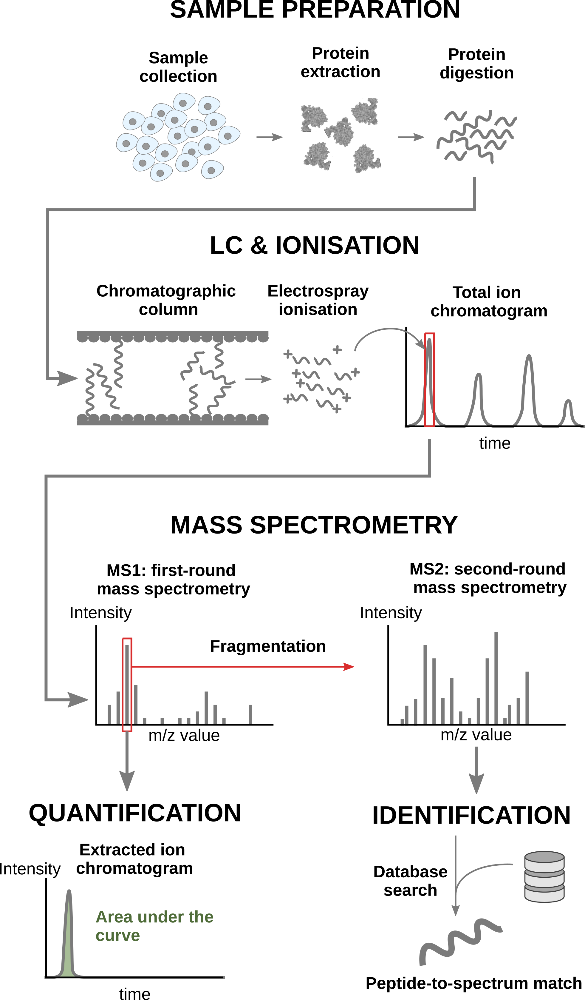
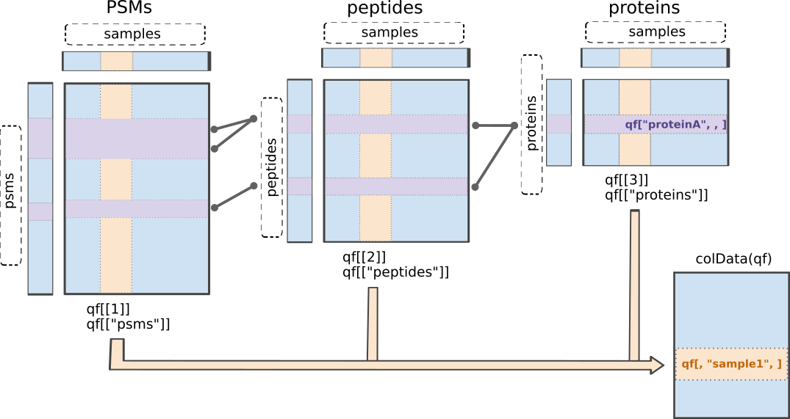

# Statistical analysis with msqrob2 {#sec-basics}

This chapter explains the main concepts for statistical analysis of
proteomics data using `msqrob2`. To illustrate these concepts, we will
use a spike-in dataset from the Clinical Proteomic Tumor Analysis
Consortium (CPTAC), published by @PAULOVICH2010242 and reanalysed by
@Goeminne2016-tr. This is an excellent example dataset since it
contains ground truth information about which proteins are
differentially abundant, enabling us to objectively demonstrate the
performance of `msqrob2`. This dataset has a relatively
simple experimental design (which does not imply that the analysis is
easy), allowing us to assess research questions using a simple
data analysis workflow. For a more advanced analysis with a more complex
expiremental design, we refer to our [advanced concepts
chapter](#sec-advanced)

## Background 

Mass spectrometry (MS)-based proteomics aims at characterising the
proteome abundance of biological samples. The most popular approach is
label-free quantification (LFQ), where every sample is analysed in a
separate MS run. This section provides an overview of the analytical
workflow and its main challenges regarding data modelling.

### LFQ workflow{#sec-lfq_workflow}

In a nutshell, the wetlab workflow starts with sample preparation where the
samples are collected, and the protein content is extracted and
digested into peptides. To reduce the sample complexity, the peptides
are then separated based on physicochemical properties (mostly
hydrophobicity) using liquid chromatography (LC). Peptides are
then ionised by an electrospray as they elute from the chromatographic
column. The signal over time generated by the eluting ions is called
the total ion chromatogram. The ions are then sent for a first round
of MS to record their m/z distribution for the intact ions. This
provides an overview of the ions that elute from the column and allows
for further separation of the ions in the m/z space. The second round
of MS (MS2) records the fragmented ions for a selection of ions,
generally the most intense MS1 peaks^[The ion selection for MS2
depends on the data recorded in MS1. Therefore, this approach is
referred to as data dependent acquisition (DDA).]. This process is
repeated for every sample so that every sample is acquired in one MS
run. This provides the ion’s mass fingerprint. For LFQ workflows, the
accumulated MS1 intensity over time, also known as the area under the
curve, around the target mass is used as a quantitification measure.
On the other hand, the ion mass fingerprint, called the MS2 spectrum,
enables computational identification of the corresponding peptide
using search engines (e.g. Andromeda has been used for this data set)
that will provide peptide-to-spectrum matches (PSM). The quantified
PSM are further processed by the software (MaxQuant) to obtain a
peptide table^[MaxQuant also computes a protein table. However, we
found that starting from MaxQuant's protein table leads to a decrease
in performance. We will illustrate in this tutorial how to build the
protein table.], where every row corresponds to an identified peptide
and every column contains information about the peptide and its
quantification in one of the samples.

```{r, echo = FALSE, out.width = "40%", fig.cap = "Overview of an LFQ-based proteomics workflow."}

```

### Challenges{#sec-lfq_challenges}

Behind this workflow lies several challenges that will affect the data
modelling:

- MS-based proteomics doesn't measure proteins directly, but their 
constituting **peptide ions**. The protein-level information needs
to be reconstructed from the ion data. In this tutorial, we will
start from the peptide data, which has been constructed from the ion
data by MaxQuant.
- All peptides cannot be ionised with the same efficiency. Poor 
ionisation will lead to reduced signal as less ions will hit the
detector, hence leading to a huge variability in intensity among
different peptide species, even when they originate from the same
protein.
- The identification step is not trivial and prone to 
errors^[Improving peptide identification is outside the scope of
this tutorial]. PSM misidentification leads to the assignment of a
quantitative values from another peptide with likely another
ionisation efficiency and relative abundance. Hence this misassigned
value will become an outlier.
- Moreover, the ion selection for MS2 depends on its
intensity^[Recall that only the top most intense ion peaks are send
for MS2]. Therefore, the chance to measure and, subsequently, 
identify a peptide will depend on its abundance. Non identified
peptides will lead to data missingness, which is related to the
underlying quantification value. This phenomenon is known as
missingness not at random. Next to that, many reasons can lead to
ions not being selected or identified irrespective of their 
quantification value leading to missingness that is not related to
its quantitative value. This is referred to as missingness 
completely at random. The missingness issue is not negligible: only
41\% of all proteins are quantified across all samples, and the 
number drops to 6.6\% when considering peptides.
- The identification issues lead to unbalanced peptide missingness
across samples, and the patterns of missing values are potentially
different for every peptide, highlighting the need for an
automatised solution that is robust against missing values.
- Technical variations during the experiment can lead to systematic 
fluctuations across samples. The most obvious reason is when
different sample amounts are injected into the instruments, due to
small pipetting inconsistencies for instance. However, these
differences lead to unwanted variation that should be discarded when
answering biological questions.

### Experimental context{#sec-cptac_experiment}

The CPTAC [@PAULOVICH2010242] study provides a proteomics data set
with ground truth. The samples were syntethically constructed,
starting from a trypsin-digested yeast (L Saccharomyces cerevisiae
strain BY4741) proteome background, hence yeast proteins are known to
be constant across samples. Next, the authors added a trypsin-digested
Sigma Universal Protein Standard mixture 1 (UPS1) standard, which
contains 48 different human proteins. They spiked in these UPS1
proteins at 5 different concentrations: 0.25 fmol/µl (treatment 6A),
0.74 fmol/µl (treatment 6B), 2.22 fmol/µl (treatment 6C), 6.67 fmol/µl
(treatment 6D), and 20 fmol/µl (treatment 6E). So the UPS1 proteins
are known to be differentially expressed, and we know exactly in what
amount they differ. The samples were constructed in triplicate and
each triplicate was sent to one of three labs. In total, the data set
contains 45 samples.

```{r echo=FALSE, out.width="50%", fig.cap = "Overview of the experimental design."}
knitr::include_graphics("figs/cptac_experiment.png")
```

We will start from the peptide data generated by MaxQuant and infer
protein-level differences between samples. To achieve this goal, we
will apply an `msqrob2` workflow, a data processing and modelling
workflow dedicated to the analysis of MS-based proteomics datasets. We
will demonstrate how the workflow can retrieve the spiked-in proteins
from the CPTAC data set, along with explaination of the key
statistical concepts behind proteomics data analysis. Before delving
into the analysis, let us prepare our computational environment.

## Software

### Load packages

We load the `msqrob2` package, along with additional packages for
data manipulation and visualisation.

```{r}
library("msqrob2")
library("dplyr")
library("ggplot2")
library("patchwork")
```

### Parallelisation {#sec-parallel}

`msqrob2` can parallelise computations during the model estimation
to improve speed. However, we will disable parallelisation to ensure
this vignette can be run regardless of hardware. Parallelisation is
controlled using the `BiocParallel` package.

```{r}
library("BiocParallel")
register(SerialParam())
```

If you want to use `msqrob2` with parallelisation enabled and using
4 cores, you can run the following:

```{r, eval = FALSE}
register(MulticoreParam(workers = 4))
```

Be mindful that, while parallelisation can improve speed, it will also
consume more RAM because part of the data will be copied multiple
times over your different workers. If you experience crashes because
you exceeded the amount of available RAM on your machine, you should
reduce the number of requested workers.

## Data

The data were reanalysed by @Goeminne2016-tr using MaxQuant and
deposited on `MsDataHub`, a Bioconductor data package with
quantification data files from MS-based experiments^[Note: the data
will be downloaded the first time the code is called. Afterthat,
running the same code will automatically fetch the data from your
local machine]. We here retrieve MaxQuant's `peptides.txt` for the
full CPTAC study 6.

```{r}
library("MsDataHub")
peptideFile <- cptac_peptides.txt()
```

#### Peptide table{#sec-peptide_table}

Each row in the peptide data table contains information about one
peptide (the table below shows the first 6 rows). The columns contains
various descriptors about the peptide, such as its sequence, its
charge, the amino acid composition, etc. Some of these columns (those
starting with `Intensity.`) contain the quantification values for each
sample. The table format where the quantitative values for each sample
are contained in a separate column is depicted as the "wide format", 
as opposed to the "long format" (eg, the [PSM table]).

```{r}
peptides <- read.delim(peptideFile)
quantCols <- grep("Intensity[.]", names(peptides), value = TRUE)
```
```{r, echo=FALSE}
knitr::kable(head(peptides))
```

#### Sample annotation table{#sec-annotation_table}

Each row in the annotation table contains information about one
sample. The columns contain various descriptors about the sample, such
as the name of the sample or the MS run, the treatment (here the
spike-in condition), the lab that acquired the sample or any other
biological or technical information that may impact the data quality
or the quantification. Without an annotation table, no analysis
can be performed. The sample annotations are generated by the
researcher. In this example, the annotations are extracted from the
sample names, although reporting a detailed design of experiments in a
table is seen as better practice [@Gatto2023-kk].

```{r}
coldata <- data.frame(quantCols = quantCols)
coldata$lab <- rep(rep(paste0("lab", 1:3), each = 3), 5)
coldata$condition <- gsub("Intensity..(.)_.*", "\\1", quantCols)
concentrations <- c(A = 0.25, B = 0.74, C = 2.22, D = 6.67, E = 20)
coldata$concentration <- concentrations[coldata$condition]
```
```{r, echo=FALSE}
knitr::kable(head(coldata))
```

### The QFeatures class{#sec-qfeatures}

`msqrob2` is built around the `QFeatures` class. We refer to the [R
for mass spectrometry
book](https://rformassspectrometry.github.io/book/sec-quant.html) for
a comprehensive description of the class. In a nutshell, the
`QFeatures` package provides infrastructure to manage and analyse
quantitative features from mass spectrometry experiments. It is based
on the `SummarizedExperiment` and `MultiAssayExperiment` classes. It
leverages the hierarchical structure of proteomics experiments: data
proteins are composed of peptides, themselves produced by spectra.
Each piece of information in stored in an individual
`SummarizedExperiment` object, later referred to as a "set".
Throughout the aggregation and processing of these data, the relations
between sets are tracked and recorded, thus allowing users to easily
navigate across spectra, peptide and protein quantitative data.

```{r, echo = FALSE, out.width = "80%", fig.cap = "Illustration of the `QFeatures` data class."}

```

The `readQFeatures()` enables a seamless conversion of tabular data
into a `QFeatures` object. We provide the peptide table and the sample
annotation table. The function will use the `quantCols` column in the
sample annotation table to understand which columns in `peptides`
contain the quantitative values, and automatically link the
corresponding sample annotation with the quantitative values. We also
tell the function to use the `Sequence` column as peptide identifier,
which will be used as rownames. See `?readQFeatures()` for more
details.

```{r}
(spikein <- readQFeatures(
  peptides, coldata, name = "peptides", fnames = "Sequence"
))
```

We now have a `QFeatures` object with 1 set, called `peptides` (which
we specified using the `name` argument). In this toy example, we have
information for `r nrows(spikein)[[1]]` peptides across 45 samples, as
expected (recall the [experimental design](#sec-cptac_experiment)).

The sample annotations can be retrieved using `colData()`.

```{r, eval=FALSE}
colData(spikein)
```
```{r}
knitr::kable(head(colData(spikein)))
```

We can get a sample annotation directly using the `$` accessor.

```{r}
head(spikein$lab)
```


We can extract the `SummarizedExperiment` object for the `peptides`
set using double bracket subsetting^[A `QFeatures` object can be seen
as a special list of `SummarizedExperiment` objects.]

```{r}
spikein[["peptides"]]
```

But notice that the sample annotations were not extracted along with
the SummarizedExperiment (`colData names(0):`). This can be performed
using `getWithColData()`, which extracts the set of interest (like
`[[]]`) along with all the associated sample annotations.

```{r}
getWithColData(spikein, "peptides")
```

The peptides annotations are available for in the corresponding 
`rowData`.

```{r, eval=FALSE}
rowData(spikein[["peptides"]])
```
```{r}
knitr::kable(head(rowData(spikein[["peptides"]])))
```

We can also retrieve the quantitative values for each set using 
`assays()`.

```{r}
assay(spikein[[1]])[1:5, 1:5]
```

## Data preprocessing{#sec-basic_preprocess}

Since we have a `QFeatures` object, we can directly make use of
`QFeatures`' data preprocessing functionality^[see also the [R for
mass spectrometry
book](https://rformassspectrometry.github.io/book/sec-quant.html)]. A
major advantage of `QFeatures` is it provides the power to build
highly modular workflows, where each step is carried out by a
dedicated function with a large choice of available methods and
parameters. This means that users can adapt the workflow to their
specific use case and their specific needs.

### Encoding missing values{#sec-encode_missing}

The first preprocessing step is to correctly encode the missing
values. It is important that missing values are encoded using `NA`.
For instance, non-observed values should not be
encoded with a zero because true zeros (the proteomic feature
is absent from the sample) cannot be distinguished from technical
zeros (the feature was missed by the instrument or could not be
identified). We therefore replace any zero in the quantitative data
with an `NA`.

```{r}
spikein <- zeroIsNA(spikein, names(spikein))
```

Note that `msqrob2` can handle missing data without having to rely on
hard-to-verify imputation assumptions, which is our general recommendation. However, `msqrob2` does not
prevent users from using imputation, which can be performed with
`impute()` from the `QFeatures` package. Below, we show how one could
perform KNN imputation^[We will however not evaluate the code in this
tutorial as our general advice is to avoid imputation.] (see
`?impute` for more options).

```{r, eval = FALSE}
spikein <- impute(
  spikein, method = "knn",
  i = names(spikein), name = paste0(names(spikein), "_imput")
)
```

**TODO** mention the hurdle model here?

### Log2 transformation {#sec-log2}

We need to log2 transform the intensities. We illustrate the rationale
using the spike-in data. For this, we perform a short data
manipulation pipeline:

1. We use `longForm()` to convert the `QFeatures` object into a long
table, where each row contains the quantitative information about
one observation, in which column, row and set it was found. Long
tables are particularly useful for manipulating data with the
`tidyverse` ecosystem, namely with `ggplot2` for visualisation.
`longForm()` also allows to include annotations, and we here
include `Mixture` and `TechRepMixture` for filtering and colouring.
2. `longForm()` returns a `DataFrame` which we convert to a
`data.frame`.
3. We filter the data to keep only the data from AALEELVK (mapping to 
a UPS1 protein) measured in lab1.

```{r}
dat <- longForm(spikein, colvars = colnames(colData(spikein))) |> ## 1.
  data.frame() |> ## 2.
  filter(rowname == "AALEELVK" & lab == "lab1") ## 3.
```

Next, we visualise the data using `ggplot2`. We will show the
intensities and log2-intensities for one of the peptides, AALEELVK, in
function of the UPS spike-in concentration. We first define a common
plot from which we generate two plots, one without and the other with
log2 transformation of the quantitative values.

```{r}
## Common plot
p <- ggplot(dat) +
  aes(x = concentration) +
  geom_point() +
  scale_x_continuous(trans = "log2") +
  labs(x = "Spike-in concentration (fmol/µL)")
## Add the y axis as linear or log2-transformed quant values
p + aes(y = value) +
  p + aes(y = log2(value)) +
  plot_annotation(title = "UPS1 peptide AALEELVK") +
  plot_layout(axis_titles = "collect_x")
```

We can see that the variation around the mean for each dilution factor
increases as the mean increases. This is known as heteroskedasticity.
We will later see that `msqrob2` assumes that variance of the error
should be consistent across the different conditions. Upon,
log2-transformation we can see that the problem of unequal variation
is solved.

Another advantages of log2-transformation is that it provides a scale
that directly relates to biological interpretation. In biology, a
change induced by some condition often results in a fold change in
concentration. Interestingly, the log2 fold change (logFC), which is
the log of the ratio between two conditions, is identical to the
difference between the log of each condition.

$$log_2FC_{B-A} = log_2B - log_2A = log_2 \frac{B}{A}$$

This simplifies the modelling since the effects are now additive and
it simplifies the interpretration since a logFC of 1 means that the
abundance in B are $2\times$ higher in $B$ than in $A$, a logFC of 2
means an increase of $4\times$, for instance.

We perform log2-transformation with `logTransform()` from the
`QFeatures` package.

```{r}
spikein <- logTransform(
  spikein, "peptides", name = "peptides_log", base = 2
)
```

### Peptide filtering{#sec-filter}

Filtering removes low-quality and unreliable peptides that would
otherwise introduce noise and artefacts in the data. There are many
possible criteria for peptide filtering:

- Reverse sequences
- Only identified by modification site (only modified peptides 
detected)
- Razor peptides: non-unique peptides assigned to the protein group 
with the most other peptides 
- Contaminants
- Peptides few identifications
- Proteins that are only identified with one or a few peptides
- FDR of identification
- ...

The filtering will not induce bias as long as the criterion is
independent from the downstream data analysis.

**TODO** the sentence above is taken from the PDA course, but I should
clarify this a bit further.

We use `filterFeatures()` to perform the filtering. It uses
information from the `rowData` and a formula to generate a filter for
each feature (row) in each set across the object. If the filter
returns `TRUE`, the corresponding row is retained, otherwise it is
removed. Defining a filter through a formula offers a flexible
approach, allowing for any customised filter. This dataset requires an
extensive PSM filtering which is an ideal use case to demonstrate the
customisation of a filtering workflow.

#### Remove failed protein inference

We remove peptides that could not be mapped to a protein. We also 
remove peptides that cannot be uniquely mapped to a single proteins
because its sequence is shared across multiple proteins. This often
occurs for homologs or for proteins that share similar functional
domains. Shared peptides are often mapped to protein groups, which are
the set of proteins that share the given peptides. Protein groups are
encoded by appending the constituting protein identifiers, separated
by a `";"`. While these peptides may serve as interesting QC controls, the

```{r}
spikein <- filterFeatures(
  spikein, ~ Proteins != "" & ## Remove failed protein inference
    !grepl(";", Proteins)) ## Remove protein groups
```

#### Remove reverse sequences and contaminants

We now remove the peptides that map to decoy sequences or to
contaminants proteins. Decoy peptides, which consist of fake peptide
sequences generated by reversing a real amino-acid sequence, are used
during the database search to mitigating the number of random-hit PSM,
hence mitigating misidentification. Contaminant proteins are proteins
known to be artificially incorporated during the experiment, but that
are irrelevant to the biological system under study. Typical
contaminants are human or animal keratins (deposited by the
experimenter) or trypsin (used for protein digestion). It is important
to remove these peptides before performing statistical modelling,
otherwise these proteins will be accounted for during the multiple
test adjustment which will cause an unnecessary decrease of
statistical power.

```{r}
spikein <- filterFeatures(spikein, ~ Reverse != "+" & ## Remove decoys
                       Potential.contaminant != "+") ## Remove contaminants
```

#### Remove highly missing peptides

We keep peptides that were observed at last 20 times out of the $n
= 45$ samples. We tolerate the following proportion of NAs:
$\text{pNA} = \frac{(n - 20)}{n} = 0.556$, so we keep peptides that
are at most missing in about half of the samples. This is an arbitrary
value that may need to be adjusted depending on the experiment and the
data set.

```{r}
nObs <- 20
n <- ncol(spikein[["peptides_log"]])
(spikein <- filterNA(spikein, i = "peptides_log", pNA = (n - nObs) / n))
```

We keep `r nrow(spikein[["peptides_log"]])` peptides upon filtering.

### Normalisation{#sec-norm}

The most common objective of MS-based proteomics experiments is to
understand the biological changes in protein abundance between
experimental conditions. However, changes in measurements between
groups can be caused due to technical factors. For instance, there are
systematic fluctuations from run-to-run that shift the measured
intensity distribution. We can this explore as follows:

1. We extract the sets containing the log transformed data. This is 
performed using `QFeatures`' 3-way subsetting^[We will explain this
with more details at the end of the [summarisation step](#sec-summarisation)].
2. We use `longForm()` to convert the `QFeatures` object into a long
table, including `lab` and `concentration` for filtering and
colouring.
3. To facilitate interpretation, we filter the data to keep only one 
of the UPS1 spike-in concentrations.
4. We visualise the density of the quantitative values within each
sample. We colour each sample based on its corresponding lab.
Remember that each spike-in concentration has been acquired in
triplicate for each lab.

```{r}
spikein[, , "peptides_log"] |> ## 1.
  longForm(colvars = c("lab", "concentration")) |> ## 2.
  data.frame() |> 
  filter(concentration == 6.67) |> ## 3.
  ggplot() + ## 4.
  aes(x = value,
      colour = lab,
      group = colname) +
  geom_density() +
  labs(title = "Intensity distribution for all samples with 6.667 fmol/µL UPS1",
       subtitle = "Before normalisation")
```

Even in this clean synthetic data set (same background, only 48 UPS
proteins can be different), the marginal peptide intensity
distributions across samples are not well aligned. The intensity 
distributions seem to impact by within and between lab variability.
Since we show the data for a single experimental condition, we know
that these difference stem from technical variability and not
biological variability. Ignoring this effect will increase the noise
and reduce the statistical power of the experiment, and may also, in
case of unbalanced designs, introduce confounding effects that will
bias the results.

Therefore, normalisation will transform the data to put all the
distributions on the same location, such as centering on the mean or
the median, so that the distributions better coincide and overlap.
Here, we will use `normalize()` to subtract the median intensity within
each run. 

```{r}
spikein <- normalize(
  spikein, "peptides_log", name = "peptides_norm",
  method = "center.median"
)
```

Formally, the function applies the follow operation on each sample $i$
across all PSMs $p$:

$$
y_{ip}^{\text{norm}} = y_{ip} - \hat{\mu}_i
$$

with $\hat{\mu}_i$ the median intensity over all observed peptides in
sample $i$. Upon normalisation, we can see that the distribution
nicely overlap (using the same code as above)

```{r}
spikein[, , "peptides_norm"] |> ## 1.
  longForm(colvars = c("lab", "concentration")) |> ## 2.
  data.frame() |> 
  filter(concentration == 6.67) |> ## 3.
  ggplot() + ## 4.
  aes(x = value,
      colour = lab,
      group = colname) +
  geom_density() +
  labs(title = "Intensity distribution for all samples with 6.667 fmol/µL UPS1",
       subtitle = "After normalisation")
```

Beware there exist numerous types of normalisation methods (see
`?normalize`) and which method to use may be data set dependent. For
instance, some data set may show low overlap of distribution tails
upon normalisation indicating that a simple shift is not sufficient.
In micro-array literature, quantile normalisation is used to force the
median and all other quantiles to be equal across samples, but in
proteomics, quantile normalisation often introduces artifacts due to a
difference in missing peptides across samples (c.f. [Challenges]).

It is important to understand that most normalisation procedures
assume that the majority of the proteins do not change across
conditions and only a small proportion of the proteins are
differentially abundant. This assumption may not be valid in poorly
designed spike-in studies [@O-Brien2024-lr] or for pull-down studies,
for example. Dedicated normalisation strategies are then required. 

### Summarisation{#sec-summarisation}

The objective of summarisation (also referred to as aggregation) is to
summarise the peptide-level intensities into a protein expression value.
We illustrate the motivation behind summarisation using the data for
one of the UPS proteins in Mixture 1 (separating the data for each
technical replicate). We also focus on the 0.125x and the 1x
spike-in conditions. We illustrate the different peptide ions on the
x axis and plot the log2 normalised intensities across samples on y
axis. All the points belonging to the same sample are linked through a
grey line.

```{r, echo = FALSE, fig.height=5, fig.width=6}
spikein[, , "peptides_norm"] |>
  longForm(colvars = colnames(colData(spikein)), rowvars = "Proteins") |> 
  data.frame() |> 
  filter(Proteins == "P12081ups|SYHC_HUMAN_UPS",
         lab == "lab2", 
         condition %in% c("A","E")) |>  
  ggplot() +
  aes(x = rowname, 
      y = value,
      group = colname) +
  geom_line(linewidth = 0.1) +
  geom_point(aes(fill = condition), size = 3, shape = 21) +
  theme(axis.text.x = element_text(angle = 90, hjust = 1, vjus = 0.5),
        legend.position = "top") + 
  labs(title = "P12081ups (in lab2)",
       x = "Peptide", y = "log2(norm Intensity)")
```

1. We can see that data for a protein can consist of many peptides, 
   hence the need for summarisation.
2. We observe that different peptides have different intensities 
   within the same sample (same line). This is because different
   peptides have different properties and hence different ionisation
   properties which will influence the detectability in the MS 
   ([Challenges]).
3. The peptide identification are inconsistent between groups of 
   interest. We can see the low-concentration group (condition A, red)
   display more missing values than the high-concentration group
   (condition B, blue). Moreover, which value is missing depends on
   the peptide intensities. All the peptides found in the
   low-concentration group are the most intense peptides in the high
   concentration group.
4. We also find outliers. For instance, the third peptide 
   (AQLGPDESKQK) is detected in three samples, but one of the two
   samples is strongly offset compared to the two others. These
   outliers can be the result of misidentification or fluctuations
   during MS acquisition.
5. These data also suggest pseudo-replication. The peptide intensities
   in one same sample (dots connected by a line) are correlated, i.e.
   they more alike than the peptide intensities between samples
   (the lines do not perfectly align). 

The fact that different peptides have different intensities (2.), may
be inconsistently identified (3.) and/or quantified (4.), and show
sample correlations (5.) can lead to bias if we use simple
summarisation approaches such as summing or averaging the peptide
intensities for each sample. Instead, we will resort to more advanced
summarisation approaches to accommodate for these issues.

Here, we summarise the peptide-level data into protein intensities
through the robust summarisation approach [@Sticker2020-rl] which is a
model approach that estimates for each protein $P$ separately:

$$
y_{ip} = \beta_p^\text{pep} + \beta_i^\text{samp} + \epsilon_{ip}
$$

where $y_{ip}$ is the log-normalised peptide intensity for peptide $p$
belonging to protein $P$ in sample $i$. $\beta_p^\text{pep}$ is the
average effect of peptide $p$, which account for the fact that
different peptide yield different baseline intensities (see issue 2.
above). $\beta_i^\text{samp}$ is the average effect of sample $i$. In
other words, it provides the estimated log2-transformed and normalised intensity of protein $P$ in
sample $i$ corrected for the peptide effect, which will be used as the summarised protein value.
$\epsilon_{ip}$ is the residual effect that cannot be explained by the
average sample and peptide effects. The method is called robust
summarisation because the estimation process will minimize $\epsilon$
using a robust estimator^[During robust estimation, the least squared
error minimization, that is minimizing $\sum_i\mathbf{\epsilon}^2_i$, is
iteratively reweighted using Huber weights, i.e. $\sum_iw_i\mathbf{\epsilon}^2_i$. This is internally
performed using `MASS::rlm()`.] that will down-weigh extreme values,
effectively tackling issue 4.

`aggregateFeatures()` streamlines summarisation. It requires the name
of a `rowData` column to group the peptides into proteins (or
protein groups), here `Proteins`. We provide the summarisation
approach through the `fun` argument. Other summarisation methods
are available from the `MsCoreUtils` package, see `?aggregateFeatures`
for a comprehensive list. The function will return a `QFeatures`
object with a new set that we called `proteins`.

```{r, warning=FALSE, cache=TRUE}
(spikein <- aggregateFeatures(
  spikein, i = "peptides_norm", 
  name = "proteins",
  fcol = "Proteins", 
  fun = MsCoreUtils::robustSummary,
  na.rm = TRUE
))
```

Note that all the links between peptides and proteins are kept^[In
fact, this is also true for the previous transformation where the
peptides are linked across sets.]. This come particularly handy when
we want to extract all the data from one protein, P12081ups for
instance. This can be performed using the 3-way indexing. Every
`QFeatures` object contains one or more sets, each characterised by
multiple rows (peptides or proteins) and multiple columns (samples).
Therefore, `QFeatures` can subset data based on one or more of these
indices, `data[set_k, feature_i, sample_j]`. The first entry will
subset particular features. This can be the name of a peptide (e.g.
`DAIAQELSLQR`) or the name of a protein (`P12081ups|SYHC_HUMAN_UPS`).
The second entry selects the samples columns of interest. The third
entry selects the sets of interest. If an entry is left blank, all the
corresponding features, samples or sets will be selected. Let's
extract all the data (all samples and all sets) related to the protein
(`P12081ups|SYHC_HUMAN_UPS`).

```{r}
spikein["P12081ups|SYHC_HUMAN_UPS", , ]
```

The function extracted one protein and its 33 related peptides. This
functionality is particularly useful for plotting and exploring the
changes induces by the data processing. For instance:

1. We use the `QFeatures` subsetting functionality to keep only the 
data for protein P12081ups and the sets before and after 
summarisation.
2. We use `longForm()` to convert the object for plotting.
3. We plot the intensities for each sample, facetting by set and
colouring by experimental condition, linking dots from the same
peptide or protein with a line.

```{r}
spikein["P12081ups|SYHC_HUMAN_UPS", , c("peptides_norm", "proteins")] |> ## 1.
  longForm(colvars = colnames(colData(spikein))) |> ## 2.
  data.frame() |>
  ggplot() + ## 3.
  aes(x = colname, 
      y = value,
      group = rowname) +
  geom_line(linewidth = 0.1) +
  geom_point(aes(colour = condition)) +
  facet_grid(~ assay) +
  theme(axis.text.x = element_blank()) +
  ggtitle("Data for protein P12081ups before and after summarisation")
```

### Protein filtering

As a final step, we filter the protein data to keep at least 4 observed
proteins so that most proteins have at least 2 observations in each 
group. So we tolerate a proportion of $\frac{n - 4}{n}$ NAs.

```{r}
nObs <- 4
n <- ncol(spikein[["proteins"]])
spikein <- filterNA(spikein, i = "proteins", pNA = (n - nObs) / n)
```

**TODO** update nObs as it makes no sense when considering all 
comparisons and all labs

The data processing is complete.

```{r}
plot(spikein)
```

## Data exploration{#sec_data_exploration}

Data exploration aims to highlight the main sources of variation in
the data prior to data modelling and can pinpoint to outlying or
off-behaving samples. A common approach for data exploration is to
perform dimension reduction, such as Multi Dimensional Scaling (MDS).
We will first extract the set to explore along the sample annotations
(used for plot colouring).

```{r}
se <- getWithColData(spikein, "proteins")
```

We then use the `scater` package to compute and plot the PCA. For
technical reasons, it requires `SingleCellExperiment` class object,
but these can easily be generated from a `SummarizedExperiment`
object. 

```{r}
library("scater")
se <- runMDS(as(se, "SingleCellExperiment"), exprs_values = 1)
```

We can now explore the data structure while colouring for factors of
interest, here `condition`, and `lab`.

```{r, fig.width=8, fig.height=3}
plotMDS(se, colour_by = "condition") +
  plotMDS(se, colour_by = "lab") 
```

This plot reveals interesting information. First, we see there the
data contains lab effects, as the first MDS axis separates the
different labs. Second, as expected, there are condition effects as
each condition is separated by the second MDS axis. Interestingly, the
conditions are sorted by the concentration^[Recall that A to E
condition imply low to high concentration.]. Finally, we can also spot
an issue in the data generated by lab1. Conditions A-C in lab1 are
much further away than expected from the other groups. This has been
reported as ionisation issues in the original study
[@PAULOVICH2010242] and demonstrates the power of data exploration for
detecting data defects. 

## Data modelling{#sec-modelling}

We model the preprocessed data to answer biologically relevant
questions. As described above, each sample has been synthetically
created to contain a constant yeast background where UPS1 proteins were
spiked in at five different concentration. Each sample preparation has
been replicated three times and each replicate has been sent to three
different labs. So, the research quest is "can our model retrieve the
proteins that have been spiked in across the conditions?" Moreover,
since we know the expected protein abundance in each sample, we will
also be able to assess how accurate the model can estimate the average fold
changes between spike-in conditions.

### Sources of variation

In this experimental design, we have two sources of variation: lab and
spike-in concentration^[Note that we have the spike-in concentration
encoded in two ways. `concentration` is encoded as a numerical value
and provides the actual concentration amount in fmol/µL. `condition`
is encoded as a factor, meaning that every concentration is regarded
as an independent group. We will use the latter encoding as most
common research questions consist of group-wise comparisons. The
modelling of concentration as a numeric will be discussed in a
[dedicated section](#sec-numeric_model)]. The table below confirms we
have a balanced design for each condition and lab.

```{r}
table(condition = spikein$condition, lab = spikein$lab)
```

We will model the two sources of variation:

1. **Spike-in condition effects**: we model the source of variation
induced by the experimental treatment of interest as a fixed
effect, which we consider non-random, i.e. the treatment effect is
assumed to be the same in repeated experiments, but it is unknown
and has to be estimated.
2. **Lab effects**: since each replicate has been analysed by three 
different labs, we need to account for potential lab effects.
Because all spike-in conditions are present in each lab, the lab
effects can be estimated using fixed effects^[If this is not the
case, you will need to model the lab effect as a random effect.
This is introduced in the [advanced tutorial](#sec-advanced)].
Indeed, for these designs, lab acts as a blocking variable since
all spike-in condition effects can be estimated within each lab.

When modelling a typical label-free experiment at the protein level, 
the model boils down to the following linear model:

$$
y_i = \mathbf{x}^T_i \boldsymbol{\beta} + \epsilon_i
$$

with $y_i$ the $\log_2$-normalised protein intensities in sample $i$;
$\mathbf{x}_i$ a vector with the covariate pattern for the sample
encoding the intercept, spike-in condition, and lab^[Categorical
variables are encoded using dummy coding.]; $\boldsymbol{\beta}$ the
vector of parameters that model the association between the covariates
and the outcome; and $\epsilon_i$ the residuals reflecting variation
that is not captured by the fixed effects. Note that $\mathbf{x}_i$
allows for a flexible parameterisation of the treatment beyond a
single covariate, i.e. including a 1 for the intercept, continuous and
categorical variables as well as their interactions. We assume the
residuals to be independent and identically distributed (i.i.d)
according to a normal distribution with zero mean and constant
variance, i.e. $\epsilon_{i} \sim N(0,\sigma_\epsilon^2)$, that can
differ from protein to protein.

In R, this model is encoded using the following simple formula^[We
don't need to specify the intercept as R automatically adds it during
model estimation. you can explicitly add it using `~ 1 + ...`, you can
also suppress it using `~ 0 + `. When an intercept is included, one of
the groups is defined as the reference group and its corresponding
model parameter is absorbed in the intercept. The residuals don't need
to be specified as they are part of the model estimation process.]:

```{r}
model <- ~ condition + lab
```

### Model estimation{#sec-msqrob}

We estimate the model with `msqrob()`. The function takes the
`QFeatures` object, extracts the quantitative values from the
`"proteins"` set generated during summarisation, and fits a simple
linear model with `condition` and `lab` as covariates, which are
automatically retrieved from `colData(spikein)`.

```{r run_msqrob_protein, cache=TRUE, warning=FALSE}
spikein <- msqrob(
  spikein,  i = "proteins",
  formula = model,
  ridge = TRUE, robust = TRUE
)
```

**TODO** discuss that msqrob2 assumes MCAR when correcting for 
peptide-specific missingness. It does not assume MCAR. It assumes MAR. Missingness at Random upon conditioning for peptide species. 

**TODO** need to expand more robust ridge?

We enable M-estimation (`robust = TRUE`) for improved robustness
against outliers. We also enable ridge regression (`ridge = TRUE`).
Ridge regression stabilises the parameter estimation of fixed effects
in case where the number of parameters are close to the number of
available samples. Keep in mind that ridge regression is irrelevant
when modelling a single fixed effect with only 2 factors. (DISCUSS LAST SENTENCE)

The fitting results are available in the `msqrobModels` column of the
`rowData`. More specifically, the modelling output is stored in the
`rowData` as a `statModel` object, one model per row (protein). We
will see in a later section how to perform statistical inference on
the estimated parameters.

```{r}
models <- rowData(spikein[["proteins"]])[["msqrobModels"]]
models[1:3]
```

## Statistical inference{#sec-inference}

We can now convert the biological question "does the spike-in
condition affect the protein intensities?" into a statistical
hypothesis. In other words, we must convert this question in a
combination of the model parameters, also referred to as a contrast.
To aid defining contrasts, we will visualise the experimental design
using the `ExploreModelMatrix` package. 

```{r}
library("ExploreModelMatrix")
VisualizeDesign(
  sampleData =  colData(spikein),
  designFormula = ~ 1 + condition,
  textSizeFitted = 4
)$plotlist[[1]]
```

Spike-in condition `A` is the reference class. So the mean log2
intensity for samples from condition A is `(Intercept)`. The mean
log2 expression for samples from condition B is '(Intercept) +
conditionB'. Hence, the average log2 fold change between condition B
and condition A is modelled using the parameter 'conditionB'. However,
the plot above does not depict the estimated model as it does is not
include the blocking variable `lab`.

```{r}
VisualizeDesign(
  sampleData =  colData(spikein),
  designFormula = model,
  textSizeFitted = 4
)$plotlist[[1]]
```

While the plot seems more complicated, the interpretation of the
condition parameters does not change^[Demonstration: the mean log2
intensity for samples from condition A **in lab1** is `(Intercept)`.
The mean log2 intensity for samples from condition A across labs is
`(Intercept) + (lablab2 + lablab3) / 3`. Similarly, The mean log2
intensity for samples from condition B across labs is `(Intercept) +
conditionB + (lablab2 + lablab3) / 3`. Most parameters cancel out when
computing the difference between A and B, so that the average log2
fold change between condition B and condition A is sill
'conditionB'.].

With `getCoef()`, we can retrieve the estimated model parameters. 
We start with extracting the model output, stored as `StatModel`
objects, from the `rowData`. Next, `getCoef()` retrieves the estimated
model parameters:

```{r}
models <- rowData(spikein[["proteins"]])$msqrobModels
params <- getCoef(models[[1]])
head(params)
```

Note the `"ridge"` tag in front of the parameter names that indicates
the parameters have been estimated using ridge penalisation. The model
estimated `r length(params)` parameters to model the fixed and random
effects. However, we are interested, for this data set, in the
parameters that model the effect of `condition`.

```{r}
params[grep("condition", names(params))]
```

For this protein we can see that the effects of condition are very
close to zero, as expected since the protein is part of the yeast
constant background. However, we can explore the parameters for one of
the UPS proteins.

```{r}
params <- getCoef(models[["O00762ups|UBE2C_HUMAN_UPS"]])
params[grep("condition", names(params))]
```

Since this is a benchmark study and we know the concentration of A
(0.25 fmol/µL) and B (0.74 fmol/µL), the obvious answer is
$log_2(0.74) - log_2(0.25) = 1.566$. The average log2 difference in
intensity between condition B and condition A that has been estimated
by the model is `r params[["ridgeconditionB"]]`, rather close. Now,
the question is if we can conclude that the fold change between condition B and condition A is statistically significant based on the model output. 

### Hypothesis testing

As shown above, the average difference in log2 intensity between condition B 
and A after correcting for the lab effect is `ridgeconditionB`. This combination of parameters is also called a 
contrast. Thus, we assess the following nul hypothesis for this contrast: 'ridgeconditionB = 0' with our 
statistical test.


```{r}
contrast <- "ridgeconditionB = 0"
```

`makeContrast()` converts the hypothesis into a formal contrast matrix
with parameter names as rows and hypotheses in columns^[Note, that we only need to specify the names of the model parameters that are involved in the contrast when using the make contrast function. The hypothesisTest function below will then subset the relevant part from the model output. Also, note that the contrast matrix in this example is trivial. However, we will
[later](#sec-multiple_contrasts) show how to asses multiple hypotheses
at once and then the constrast matrix consists of multiple
columns, with one column for each contrast].

```{r}
(L <- makeContrast(
  "ridgeconditionB = 0",
  "ridgeconditionB"
))
```

We can now test our null hypothesis using `hypothesisTest()` which
takes the `QFeatures` object with the fitted model and the contrast we
just built. `msqrob2` automatically applies the hypothesis
testing to all proteins in the data.

```{r}
spikein <- hypothesisTest(spikein, i = "proteins", contrast = L)
```

The results are stored in the set containing the model, here
`proteins`. We retrieve the results from the `rowData`.

```{r}
inference <- rowData(spikein[["proteins"]])$ridgeconditionB
inference$Protein <- rownames(inference)
inference$isUps <- grepl("ups", inference$Protein)
head(inference)
```

The fifth row is filled with missing values because data modelling
resulted in a `fitError` (the [advanced vignette](#sec-fiterror)
describes how to deal with proteins that could not be fit).

**TODO** discuss multiple test adjustments and FDR correction. Use the
material from the PDA course.

### Volcano plots

A volcano plot is a common visualisation that provides an overview of
the hypothesis testing results, plotting the $-\log_{10}$ p-value^[Note, that upon this transformation a value of 1 represents a p-value of 0.1, 2 a p-value of 0.01, 3 a p-value of 0.001, etc.] as a function of
the estimated log fold change. Volcano plots can be used to highlight
the most interesting proteins that have large fold changes and/or are
highly significant. We can use the table above directly to build a
volcano plot using `ggplot2` functionality. We also highlight which
proteins are UPS standards, known to be differentially abundant by
experimental design.

```{r}
ggplot(inference) +
  aes(x = logFC,
      y = -log10(adjPval),
      color = isUps) +
  geom_point() +
  geom_vline(xintercept = log2(0.74) - log2(0.25), linetype = "dashed") +
  scale_color_manual(
    values = c("grey20", "firebrick"), name = "",
    labels = c("HeLA background", "UPS standard")
  ) +
  ggtitle("Statistical inference results",
          paste0("Hypothesis test: ", colnames(L), " = 0"))
```

We retrieve the proteins that are significantly differentially
abundant based on the FDR-adjusted p-value (`adjPval`). Note that the
majority of the differentially abundant proteins are UPS1 proteins.

```{r}
table(is_significant = inference$adjPval < 0.05, 
      is_ups = grepl("ups", inference$Protein))
```

### Heatmaps 

We can explore the quantitative data of the significant proteins using
a heatmap. First, we select the names of the proteins that were 
declared significant and extract their quantitative data.

```{r}
sigNames <- inference$Protein[!is.na(inference$adjPval) & inference$adjPval < 0.05]
se <- getWithColData(spikein, "proteins")
se <- se[sigNames, se$condition %in% c("A", "B")]
```

Next, we extract the quantitative data and scale by rows^[The
`scales()` function aligns the means and the centered standard
deviations by column. Since we want to scale by row, we need to
transpose (`t())`) before scaling and transpose back after scaling.
Scaling the data will remove changes in feature intensities that are
caused by uninteresting changes in ionisation efficiency.] with
`assay()`. We will create a heatmap using the `ComplexHeatmap`
package, which enables heatmap annotations. We will annotate the
heatmap using our model variables `condition` and `lab`.

```{r}
quants <- t(scale(t(assay(se))))
library("ComplexHeatmap")
annotations <- columnAnnotation(
  condition = se$condition,
  lab = se$lab
)
```

We now make the heatmap.

```{r, fig.width=10, fig.height=7}
set.seed(1234) ## annotation colours are randomly generated by default
Heatmap(
  quants, name = "log2 intensity",
  top_annotation = annotations
)
```

We can see that the majority of the proteins are indeed UPS proteins,
and that 2 yeast proteins that are returned significant. The first 
yeast protein is significant probably due to the outlying lab1^[Note 
that `msqrob2` estimation is robust against outlying observations, but
here the outlying experimental unit (lab1) contains three
observations.]; the significant result for the second yeast protein
probably stems from technical variations that could not be correctly
captured due to the high missingness (lab1 did not detected the 
protein). Note, that the yeast protein indeed shows evidence for 
differential abundance. 

### Fold change distributions

As this is a spike-in study with known ground truth, we can also plot
the log2 fold change distributions against the expected values, in
this case 0 for the yeast proteins and 1.57 for the UPS standards.

```{r}
ggplot(inference) +
  aes(y = logFC,
      x = isUps,
      colour = isUps) +
  geom_boxplot() +
  geom_hline(yintercept = c(0, log2(0.74) - log2(0.25)), 
             colour = c("grey20", "firebrick")) +
  scale_color_manual(
    values = c("grey20", "firebrick"), name = "",
    labels = c("Yeast background", "UPS proteins")
  ) +
  ggtitle("Distribution of the log2 fold changes",
          paste0("Hypothesis test: ", colnames(L), " = 0"))
```

Estimated log2 fold change for HeLa proteins are closely distributed
around 0, as expected. log2 fold changes for UPS standard proteins are
distributed around the fold changes expected from the experimental
design.

### Detail plots{#sec-detail_plot}

We can explore the data for a protein to validate the statistical
inference results. For example, let's explore the peptide and the
summarised protein intensities for the protein with the most
significant difference.

```{r}
(targetProtein <- rownames(inference)[which.min(inference$adjPval)])
```

To obtain the required data, we perform a little data manipulation
pipeline:

We use the `QFeatures` subsetting functionality to retrieve all data
related to `r #targetProtein` and focusing on the `peptides_log` and
`proteins` sets that contains the peptide ion data used for model
fitting. We then convert the data with `longForm()` for plotting.
Finally, we plot the log2 normalised intensities for each sample at
the protein and at the peptide level. Since multiple peptides are
recorded for the protein, we link peptides across samples using a grey
line. Samples are colored according to UPS spike-in condition.

```{r, fig.width=8, fig.height=3}
spikein[targetProtein, , c("peptides_log", "proteins")] |> #1
     longForm(colvars = colnames(colData(spikein)), #2
              rowvars = "Proteins") |>
    data.frame() |> 
    ggplot() +
    aes(x = colname,
        y = value) +
    geom_line(aes(group = rowname), linewidth = 0.1) +
    geom_point(aes(colour = condition)) +
    facet_wrap(~ assay, scales = "free") +
    ggtitle(targetProtein) +
    theme_minimal() +
    theme(axis.text.x = element_blank())
```

## Going further

### Testing muliple contrasts at once{#sec-multiple_contrasts}

We showed how to perform a hypothesis test to answer the question 
"which protein change in abundance between condition B and condition 
A?". However, since we have 5 conditions, we can imagine further 
comparisons.  `msqrob2` can assess multiple hypothesis at once. Like
above we must provide which hypotheses we want to compare. 
`createPairwiseContrasts()` will generate all possible comparisons
between `condition` level. The function requires the model
specification that has been estimated and the sample annotation from
the data. We also specify that we estimated the model using ridge
regression, which influences parameter names.

**TODO**: add automatic pairwise comparisons function to msqrob2 

```{r}
source("utils.R")
(allHypotheses <- createPairwiseContrasts(
  model, colData(spikein), "condition", ridge = TRUE
))
```

We now run the same workflow as above for a single hypothesis, except 
that here `allHypotheses` is a vector of contrasts.

```{r}
(L <- makeContrast(
  allHypotheses,
  parameterNames = paste0("ridgecondition", c("B", "C", "D", "E"))
))
```

The contrast contains multiple hypotheses (multiple column) that 
involve multiple parameters (multiple rows). 

We use again `hypothesisTest()` for performing the hypothesis test. We
already generated results for the contrast `ridgeconditionB = 0` and
the function will throw an error by default, but we can overwrite the
results with the argument `overwrite = TRUE`.

```{r}
spikein <- hypothesisTest(spikein, i = "proteins", L, overwrite = TRUE)
```

We retrieve the inference tables from the `rowData` to generate the
volcano plots.

```{r}
inferences <- rowData(spikein[["proteins"]])[, colnames(L)]
```

We here use a `lapply()` loop to generate additional information, and
then combine all the tables in a single table.

```{r}
inferences <- lapply(colnames(inferences), function(i) {
  inference <- inferences[[i]]
  inference$Protein <- rownames(inference)
  inference$isUps <- grepl("ups", inference$Protein)
  inference$Comparison <- i
  inference
})
inferences <- do.call(rbind, inferences) ## combine in a single table
```

We plot the volcano plots with each comparison in a separate facet.

```{r, fig.width=9, fig.height=8}
ggplot(inferences) +
    aes(x = logFC,
        y = -log10(pval),
        color = isUps) +
    geom_point() +
    geom_hline(yintercept = -log10(0.05)) +
    scale_color_manual(
      values = c("grey20", "firebrick"), name = "",
      labels = c("HeLA background", "UPS standard")
    ) +
    facet_wrap(~ Comparison) +
    ggtitle("Statistical inference for all pairwise comparisons") 
```

**TODO** interpret the results

### What about lab1?{#sec-numeric_model}

**TODO**: discuss this 

We saw during data exploration that lab1 displayed unexpected data
patterns compared to lab2 and lab3, and it was reported in the
original study that lab1 experienced ionisation issues. In a real-life
experiment, it would be advised to remove these low-quality
measurements^[Watch out: the decision of removing low-quality samples
should be performed
**before** any statistical analysis and be independent of its outcome,
otherwise this could be regarded as data snooping. Relying solely on
the data exploration for sample exclusion is also not recommended,
since the same quantitative data is used for exploration and
statistical analysis. In this example, the data exploration allowed to
pinpoint issues with the data and led to searching for possible
explanations, which where confirmed based on data metrics that are
independent of quantification.] So, we will conduct the same analysis
as above, but removing any data coming from lab1.

Filtering samples is performed using `subsetByColData()` which takes a
`QFeatures` object and logical vector which is assumed to be generated
from the `colData` annotations, here we keep all samples that don't
belong to `lab1`. The function will automatically retrieve the samples
that pass the `colData` filter and subset all sets for those samples.

```{r}
(spikeinNoLab1 <- subsetByColData(spikein, spikein$lab != "lab1"))
```

Whereas previously every set contained 45 samples, we here see that 
only 30 samples are retained, all 15 samples belonging to lab1 were
discarded.

```{r}
table(condition = spikeinNoLab1$condition,
      lab = spikeinNoLab1$lab)
```

We now run the same statistical workflow as described above.

```{r}
spikeinNoLab1 <- msqrob(
  spikeinNoLab1,  i = "proteins",
  formula = model,
  ridge = TRUE, robust = TRUE, 
  overwrite = TRUE
)
(allHypotheses <- createPairwiseContrasts(
  model, colData(spikeinNoLab1), "condition", ridge = TRUE
))
(L <- makeContrast(
  allHypotheses,
  parameterNames = paste0("ridgecondition", c("B", "C", "D", "E"))
))
spikeinNoLab1 <- hypothesisTest(
  spikeinNoLab1, i = "proteins", L, overwrite = TRUE
)
inferences <- rowData(spikeinNoLab1[["proteins"]])[, colnames(L)]
```

```{r, fig.width=9, fig.height=8}
inferences <- lapply(colnames(inferences), function(i) {
  inference <- inferences[[i]]
  inference$Protein <- rownames(inference)
  inference$isUps <- grepl("ups", inference$Protein)
  inference$Comparison <- i
  inference
})
inferences <- do.call(rbind, inferences) ## combine in a single table
ggplot(inferences) +
    aes(x = logFC,
        y = -log10(pval),
        color = isUps) +
    geom_point() +
    geom_hline(yintercept = -log10(0.05)) +
    scale_color_manual(
      values = c("grey20", "firebrick"), name = "",
      labels = c("HeLA background", "UPS standard")
    ) +
    facet_wrap(~ Comparison) +
    ggtitle("Statistical inference for all pairwise comparisons",
            subtitle = "Removing all data from lab1")
```

### Model the spike-in concentration as a numeric

**TODO**: discuss this

```{r}
spikeinNoLab1$concentration_log2 <- log2(spikeinNoLab1$concentration)
spikeinNoLab1 <- msqrob(
  spikeinNoLab1, i = "proteins",
  formula = ~ concentration_log2 + lab,
  ridge = TRUE, robust = TRUE, 
  modelColumnName = "concentration_model",
  overwrite = T
)
L <- makeContrast("ridgeconcentration_log2 = 0", parameterNames = "ridgeconcentration_log2")
spikeinNoLab1 <- hypothesisTest(
  spikeinNoLab1, i = "proteins", L, modelColumn = "concentration_model",
  overwrite = T
)
inference <- rowData(spikeinNoLab1[["proteins"]])[, colnames(L)]
inference$Protein <- rownames(inference)
inference$isUps <- grepl("ups", inference$Protein)
ggplot(inference) +
  aes(x = logFC,
      y = -log10(adjPval),
      color = isUps) +
  geom_point() +
  geom_hline(yintercept = -log10(0.05)) +
  scale_color_manual(
    values = c("grey20", "firebrick"), name = "",
    labels = c("HeLA background", "UPS standard")
  ) +
  ggtitle("Statistical inference results",
          paste0("Hypothesis test: ", colnames(L), " = 0"))
```

```{r}
targetProtein <- rownames(inference)[which.min(inference$adjPval)]
params <- getCoef(rowData(spikeinNoLab1)[["proteins"]][["concentration_model"]][[targetProtein]])
spikeinNoLab1[targetProtein, , "proteins"] |>
  longForm(colvars = colnames(colData(spikeinNoLab1)),
           rowvars = "Proteins") |>
  data.frame() |>
  ggplot() +
  aes(x = log2(concentration),
      y = value) +
  geom_point(aes(colour = lab)) +
  geom_abline(slope = c(1, params[["ridgeconcentration_log2"]]), 
              intercept = params[["(Intercept)"]],
              linetype = c("solid", "dashed")) +
  ggtitle(targetProtein) +
  theme_minimal()
```


```{r}
targetProtein <- inference$Protein[which.min(inference$logFC * as.numeric(inference$adjPval < 0.05))]
params <- getCoef(rowData(spikeinNoLab1)[["proteins"]][["concentration_model"]][[targetProtein]])
spikeinNoLab1[targetProtein, , "proteins"] |>
  longForm(colvars = colnames(colData(spikeinNoLab1)),
           rowvars = "Proteins") |>
  data.frame() |>
  ggplot() +
  aes(x = log2(concentration),
      y = value) +
  geom_point(aes(colour = lab)) +
  geom_abline(slope = c(0, params[["ridgeconcentration_log2"]]), 
              intercept = params[["(Intercept)"]],
              linetype = c("solid", "dashed")) +
  ggtitle(targetProtein) +
  theme_minimal()
```

## Conclusion

In this vignette, we have demonstrated a typical data analysis
workflow for LFQ data using `msqrob2`. Because the packages relies on
the `QFeatures` data class, we could demonstrate the implementation of
a complete pre-processing workflow starting from MaxQuant's peptide 
table: log2-transformation, PSM filtering, missing value management, 
normalisation, and summarisation. The data exploration revealed 
expected patterns of variation among samples, as this is a ground
truth data set, but also unexpected patterns which were reported by
the original study.

Once pre-processed, we use the `msqrob2` package to model the (known)
effect of spike-in condition while accounting for effects of lab. We
showed how to run statistical inference on the modelling results to
retrieve the significance of differentially abundant proteins. We
explored statistical results through volcano plots and boxplots of the
log2 fold changes and visually validated the results for one protein
by plotting the input data. We have shown the inference pipeline can
be streamlined when having multiple hypotheses to test.

**TODO**: extend conclusion with the going further topics. 
**TODO**: introduce more complex design, current limitations which 
will be tackled in the advanced vignette
