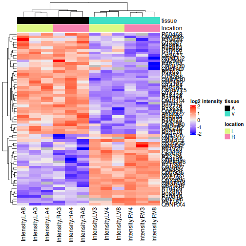

# The francisella use case: a MaxQuant LFQ DDA dataset with technical replication {#sec-francisella}


## Introduction

In this vignette we show how to analyse LFQ data with technical
replication. In the data analysis we have to acknowledge
pseudo-replication, i.e. data for multiple technical replicates from
the same biological repeat are correlated and we cannot treat these as
independent repeats.

We will build upon the mixed model framework in msqrob2 to address
this correlation by introducing a random effect for each biological
repeat.

If you never used `msqrob2`, we suggest to familiarise yourself
with the [concepts chapter](#sec-basics) first.

## Load packages

First, we load the `msqrob2` package and additional packages for data
manipulation and visualisation.


``` r
library("msqrob2")
library("ggplot2")
library("ggrepel")
library("dplyr")
```

We also configure the [parallelisation](#sec-parallel) framework.


``` r
library("BiocParallel")
register(SerialParam())
```

## Load data

### Experimental context

A study on the facultative pathogen Francisella tularensis was
conceived by [@Ramond2015-rz]. F. tularensis enters the cells of its
host by phagocytosis. The authors showed that F. tularensis is
arginine deficient and imports arginine from the host cell via an
arginine transporter, ArgP, in order to efficiently escape from the
phagosome and reach the cytosolic compartment, where it can actively
multiply. In their study, they compared the proteome of wild type F.
tularensis (WT) to ArgP-gene deleted F. tularensis (knock-out, D8).
For this exercise, we use a subset of the F. tularensis dataset where
bacterial cultures were grown in biological triplicate and each biorep
was run in technical triplicate on a nanoRSLC-Q Exactive PLUS
instrument.

### Getting the data

The data were searched with MaxQuant version 1.4.1.2. and are
available on the PRIDE repository:
[PXD001584](https://www.ebi.ac.uk/pride/archive/projects/PXD001584).
We download the peptides file^[The file is
[locally cached](#sec-caching)].

**TODO** put on Zenodo and use BiocFileCache


``` r
library("BiocFileCache")
bfc <- BiocFileCache()
pepFile <- bfcrpath(bfc, "https://raw.githubusercontent.com/statOmics/MSqRobSumPaper/master/Francisella/data/maxquant/peptides.txt")
```

After downloading the files, we can load the [peptide
table]({#sec-peptide_table}). Contrarily a [PSM
table](#sec-psm_table), the peptide table is provided in a "wide
format", meaning that each row represents a single peptide and that
each quantification column (that starts with `"Intensity"`) represents
a single sample.


``` r
peps <- read.delim(pepFile)
quantcols <- grep("Intensity\\.", names(peps), value = TRUE)
```

|Sequence                |Amino.acid.before |First.amino.acid |Second.amino.acid |Second.last.amino.acid |Last.amino.acid |Amino.acid.after | A.Count| R.Count| N.Count| D.Count| C.Count| Q.Count| E.Count| G.Count| H.Count| I.Count| L.Count| K.Count| M.Count| F.Count| P.Count| S.Count| T.Count| W.Count| Y.Count| V.Count| U.Count| Length| Missed.cleavages|      Mass|Proteins     |GI.number         |Leading.razor.protein |Protein.names                                                  |Unique..Groups. |Unique..Proteins. |Charges |       PEP|Score  | Experiment.1WT_20_2h_n3_1| Experiment.1WT_20_2h_n3_2| Experiment.1WT_20_2h_n3_3| Experiment.1WT_20_2h_n4_1| Experiment.1WT_20_2h_n4_2| Experiment.1WT_20_2h_n4_3| Experiment.1WT_20_2h_n5_1| Experiment.1WT_20_2h_n5_2| Experiment.1WT_20_2h_n5_3| Experiment.3D8_20_2h_n3_1| Experiment.3D8_20_2h_n3_2| Experiment.3D8_20_2h_n3_3| Experiment.3D8_20_2h_n4_1| Experiment.3D8_20_2h_n4_2| Experiment.3D8_20_2h_n4_3| Experiment.3D8_20_2h_n5_1| Experiment.3D8_20_2h_n5_2| Experiment.3D8_20_2h_n5_3|  Intensity| Intensity.1WT_20_2h_n3_1| Intensity.1WT_20_2h_n3_2| Intensity.1WT_20_2h_n3_3| Intensity.1WT_20_2h_n4_1| Intensity.1WT_20_2h_n4_2| Intensity.1WT_20_2h_n4_3| Intensity.1WT_20_2h_n5_1| Intensity.1WT_20_2h_n5_2| Intensity.1WT_20_2h_n5_3| Intensity.3D8_20_2h_n3_1| Intensity.3D8_20_2h_n3_2| Intensity.3D8_20_2h_n3_3| Intensity.3D8_20_2h_n4_1| Intensity.3D8_20_2h_n4_2| Intensity.3D8_20_2h_n4_3| Intensity.3D8_20_2h_n5_1| Intensity.3D8_20_2h_n5_2| Intensity.3D8_20_2h_n5_3|Reverse |Contaminant | id|Protein.group.IDs |Mod..peptide.IDs |Evidence.IDs                                                                                                                                                             |MS.MS.IDs                                                                                                                                                                                                                                                                                                                                                       | Best.MS.MS|Oxidation..M..site.IDs |
|:-----------------------|:-----------------|:----------------|:-----------------|:----------------------|:---------------|:----------------|-------:|-------:|-------:|-------:|-------:|-------:|-------:|-------:|-------:|-------:|-------:|-------:|-------:|-------:|-------:|-------:|-------:|-------:|-------:|-------:|-------:|------:|----------------:|---------:|:------------|:-----------------|:---------------------|:--------------------------------------------------------------|:---------------|:-----------------|:-------|---------:|:------|-------------------------:|-------------------------:|-------------------------:|-------------------------:|-------------------------:|-------------------------:|-------------------------:|-------------------------:|-------------------------:|-------------------------:|-------------------------:|-------------------------:|-------------------------:|-------------------------:|-------------------------:|-------------------------:|-------------------------:|-------------------------:|----------:|------------------------:|------------------------:|------------------------:|------------------------:|------------------------:|------------------------:|------------------------:|------------------------:|------------------------:|------------------------:|------------------------:|------------------------:|------------------------:|------------------------:|------------------------:|------------------------:|------------------------:|------------------------:|:-------|:-----------|--:|:-----------------|:----------------|:------------------------------------------------------------------------------------------------------------------------------------------------------------------------|:---------------------------------------------------------------------------------------------------------------------------------------------------------------------------------------------------------------------------------------------------------------------------------------------------------------------------------------------------------------|----------:|:----------------------|
|AAAEELDTR               |K                 |A                |A                 |T                      |R               |K                |       3|       1|       0|       1|       0|       0|       2|       0|       0|       0|       1|       0|       0|       0|       0|       0|       1|       0|       0|       0|       0|      9|                0|  974.4669|WP_003038655 |gi&#124;118497196 |gi&#124;118497196     |hypothetical protein [Francisella tularensis]                  |yes             |yes               |1,2     | 0.0001253|59.35  |                        NA|                        NA|                         1|                         1|                        NA|                         1|                        NA|                         1|                        NA|                        NA|                         1|                        NA|                        NA|                        NA|                        NA|                        NA|                        NA|                        NA| 1.3295e+09|                        0|                        0|                  9290400|                 92996000|                        0|                 98059000|                        0|                 80803000|                        0|                        0|                 95433000|                        0|                        0|                        0|                        0|                        0|                        0|                        0|        |            |  0|419               |0                |0;1;2;3;4;5;6;7;8;9;10;11;12;13;14;15;16;17;18                                                                                                                           |0;1;2;3;4;5;6;7;8;9;10;11;12;13;14;15;16;17;18                                                                                                                                                                                                                                                                                                                  |         15|                       |
|AAAGFVITASHNK           |R                 |A                |A                 |N                      |K               |F                |       4|       0|       1|       0|       0|       0|       0|       1|       1|       1|       0|       1|       0|       1|       0|       1|       1|       0|       0|       1|       0|     13|                0| 1285.6779|WP_003041237 |gi&#124;118498194 |gi&#124;118498194     |phosphoglucosamine mutase [Francisella tularensis]             |yes             |yes               |2       | 0.0000530|45.825 |                        NA|                         1|                        NA|                        NA|                        NA|                        NA|                        NA|                         1|                         1|                         1|                         1|                        NA|                         1|                         1|                         1|                         1|                        NA|                        NA| 1.6719e+08|                        0|                 20679000|                        0|                        0|                        0|                        0|                        0|                 17358000|                 13841000|                 12278000|                 10712000|                        0|                  9500700|                 11111000|                  8723500|                  8125200|                        0|                        0|        |            |  1|1150              |1                |19;20;21;22;23;24;25;26;27;28;29;30;31;32;33                                                                                                                             |19;20;21;22;23;24;25;26;27;28;29;30;31;32;33                                                                                                                                                                                                                                                                                                                    |         26|                       |
|AAANEYELALAYSIEEVAPDLHK |K                 |A                |A                 |H                      |K               |Y                |       6|       0|       1|       1|       0|       0|       4|       0|       1|       1|       3|       1|       0|       0|       1|       1|       0|       0|       2|       1|       0|     23|                0| 2516.2435|WP_003038915 |gi&#124;118497331 |gi&#124;118497331     |glycine--tRNA ligase subunit beta [Francisella tularensis]     |yes             |yes               |3       | 0.0000000|84.327 |                         1|                         1|                         2|                         1|                         1|                         1|                         2|                         2|                         1|                         1|                         2|                         1|                         1|                         1|                         1|                        NA|                         1|                         1| 5.5675e+08|                 28853000|                 28091000|                 30436000|                 19476000|                 22050000|                 20687000|                 36588000|                 28654000|                  7009100|                 14174000|                  8548000|                  7859200|                 14871000|                 11690000|                  4470500|                        0|                  4048100|                  3422300|        |            |  2|513               |2                |34;35;36;37;38;39;40;41;42;43;44;45;46;47;48;49;50;51;52;53;54;55;56;57;58;59;60;61;62;63;64;65;66;67;68;69;70;71;72;73;74;75;76                                         |34;35;36;37;38;39;40;41;42;43;44;45;46;47;48;49;50;51;52;53;54;55;56;57;58;59;60;61;62;63;64;65;66;67;68;69;70;71;72;73;74;75;76;77;78;79                                                                                                                                                                                                                       |         39|                       |
|AAANNPQLEAFK            |K                 |A                |A                 |F                      |K               |K                |       4|       0|       2|       0|       0|       1|       1|       0|       0|       0|       1|       1|       0|       1|       1|       0|       0|       0|       0|       0|       0|     12|                0| 1272.6463|WP_003038264 |gi&#124;118496879 |gi&#124;118496879     |molecular chaperone HtpG [Francisella tularensis]              |yes             |yes               |2       | 0.0000000|108.56 |                         1|                         1|                         1|                         1|                         1|                         1|                         1|                         1|                         1|                         1|                         1|                         1|                         1|                         1|                         1|                         1|                         1|                         1| 1.4830e+10|                339830000|                420390000|                393930000|                235060000|                381090000|                360270000|                255710000|                311370000|                271440000|                225140000|                289880000|                282500000|                209490000|                223610000|                219700000|                169120000|                178150000|                170400000|        |            |  3|199               |3                |77;78;79;80;81;82;83;84;85;86;87;88;89;90;91;92;93;94;95;96;97;98;99;100;101;102;103;104;105;106;107;108;109;110;111;112;113;114;115;116;117;118;119;120;121;122;123;124 |80;81;82;83;84;85;86;87;88;89;90;91;92;93;94;95;96;97;98;99;100;101;102;103;104;105;106;107;108;109;110;111;112;113;114;115;116;117;118;119;120;121;122;123;124;125;126;127;128;129;130;131;132;133;134;135;136;137;138;139;140;141;142;143;144;145;146;147;148;149;150;151;152;153;154;155;156;157;158;159;160;161;162;163;164;165;166;167;168;169;170;171;172 |        159|                       |
|AAASAGLVDEK             |K                 |A                |A                 |E                      |K               |A                |       4|       0|       0|       1|       0|       0|       1|       1|       0|       0|       1|       1|       0|       0|       0|       1|       0|       0|       0|       1|       0|     11|                0| 1030.5295|WP_003035781 |gi&#124;118497152 |gi&#124;118497152     |delta-aminolevulinic acid dehydratase [Francisella tularensis] |yes             |yes               |2       | 0.0000951|67.385 |                         1|                        NA|                         1|                         1|                         1|                        NA|                         1|                         1|                         1|                         1|                         1|                         1|                         1|                         1|                        NA|                         1|                         1|                         1| 4.8209e+09|                240280000|                        0|                241890000|                222250000|                189930000|                        0|                160440000|                147230000|                143340000|                135910000|                185740000|                168620000|                160240000|                158000000|                        0|                 92542000|                102350000|                100090000|        |            |  4|388               |4                |125;126;127;128;129;130;131;132;133;134;135;136;137;138;139;140;141;142;143;144;145;146;147;148;149;150;151;152;153;154;155                                              |173;174;175;176;177;178;179;180;181;182;183;184;185;186;187;188;189;190;191;192;193;194;195;196;197;198;199;200;201;202;203                                                                                                                                                                                                                                     |        191|                       |
|AAASLDLYSYPK            |K                 |A                |A                 |P                      |K               |V                |       3|       0|       0|       1|       0|       0|       0|       0|       0|       0|       2|       1|       0|       0|       1|       2|       0|       0|       2|       0|       0|     12|                0| 1297.6554|WP_003039212 |gi&#124;118497492 |gi&#124;118497492     |phosphorylase [Francisella tularensis]                         |yes             |yes               |2       | 0.0125630|31.675 |                        NA|                         1|                         1|                        NA|                         1|                         1|                        NA|                        NA|                        NA|                        NA|                        NA|                        NA|                        NA|                         1|                        NA|                        NA|                        NA|                        NA| 1.3715e+08|                        0|                 31069000|                 31448000|                        0|                 27721000|                 28657000|                        0|                        0|                        0|                        0|                        0|                        0|                        0|                 18253000|                        0|                        0|                        0|                        0|        |            |  5|624               |5                |156;157;158;159;160                                                                                                                                                      |204;205;206;207;208                                                                                                                                                                                                                                                                                                                                             |        205|                       |

We now extract the [sample annotations](#sec-annotation_table). We
will build a table where each row in the annotation table contains
information for one sample (the table below shows the first 6 rows).
This information is extracted from the sample names.


``` r
coldata <- data.frame(quantCols = quantcols) |> 
  filter(grepl("_20_", quantCols) & grepl("_n\\d", quantCols)) |> 
  mutate(genotype  = substr(quantCols, 12, 13), 
         biorep  = paste0(genotype, "_", substr(quantCols, 21, 22)),
         run = 1:length(quantcols))
```


|quantCols                |genotype |biorep | run|
|:------------------------|:--------|:------|---:|
|Intensity.1WT_20_2h_n3_1 |WT       |WT_n3  |   1|
|Intensity.1WT_20_2h_n3_2 |WT       |WT_n3  |   2|
|Intensity.1WT_20_2h_n3_3 |WT       |WT_n3  |   3|
|Intensity.1WT_20_2h_n4_1 |WT       |WT_n4  |   4|
|Intensity.1WT_20_2h_n4_2 |WT       |WT_n4  |   5|
|Intensity.1WT_20_2h_n4_3 |WT       |WT_n4  |   6|

### The `QFeatures` data class

We combine the two tables into a [`QFeatures` object](#sec-qfeatures).


``` r
(pe <- readQFeatures(
  peps, colData = coldata, fnames = "Sequence", name = "peptides"
))
```

```
## An instance of class QFeatures (type: bulk) with 1 set:
## 
##  [1] peptides: SummarizedExperiment with 10693 rows and 18 columns
```

We now have a `QFeatures` object with 1 set, containing `r
nrows(pe)[[1]]` rows (peptides) and 18 columns
(samples). 

## Data preprocessing

`msqrob2` relies on the `QFeatures` data structure, meaning that we
can directly make use of `QFeatures`' data preprocessing functionality
(see also the `QFeatures`
[documentation](https://rformassspectrometry.github.io/QFeatures/articles/Processing.html)).

### Encoding missing values

Peptides with zero intensities should be
[encoded](#sec-encode_missing) using `NA`.


``` r
pe <- zeroIsNA(pe, "peptides")
```

We calculate how many non zero intensities we have per peptide and
this is often useful for filtering.


``` r
naResults <- nNA(pe, "peptides")
data.frame(naResults$nNArows) |> 
  ggplot() +
  aes(x = nNA) +
  geom_histogram()
```


### Peptide filtering

We filter peptides based on 3 criteria (see [PSM filtering]).

1. Remove failed protein inference

We remove peptides that could not be uniquely mapped to a protein.


``` r
pe <- filterFeatures(pe,
  ~ Proteins != "" & ## Remove failed protein inference
    !grepl(";", Proteins)) ## Remove protein groups
```

2. Remove reverse sequences and contaminants

We now remove the contaminants and peptides that map to decoy
sequences. These features bear no information of interest and will
reduce the statistical power upon multiple test adjustment.


``` r
pe <- filterFeatures(pe, ~ Reverse != "+" & Contaminant != "+")
```

3. Drop peptides that were only identified in a single biorepeat

Note, that in experiments without technical repeats we filter on the
number of samples in which a peptide is picked up (this is typically
performed using `filterNA()`). Here, we will require that a peptide is
picked up in at least two biorepeats. We compute the number
of biorepeats that were observed for each peptide (that is the number
of biorepeats that contain at least one observed value).


``` r
rowData(pe[["peptides"]])$nNonZeroBiorep <- apply(
  assay(pe[["peptides"]]), 1, function(intensity)
    pe$biorep[!is.na(intensity)] |> 
    unique() |> 
    length()
)
```

We keep peptides that are observed in at least two biorepeats.


``` r
(pe <- filterFeatures(pe, ~ nNonZeroBiorep >= 2))
```

```
## An instance of class QFeatures (type: bulk) with 1 set:
## 
##  [1] peptides: SummarizedExperiment with 7542 rows and 18 columns
```

We keep 7542 peptides upon filtering.

### Standard preprocessing workflow

We can now prepare the data for modelling. The workflow ensures the
data complies to `msqrob2`'s requirements:

1. Intensities are [log-transformed](#sec-log2).


``` r
pe <- logTransform(pe, base = 2, i = "peptides", name = "peptides_log")
```

2. Normalisation with the Median of Ratios method.


``` r
pseudoRef <- assay(pe[["peptides_log"]]) |> 
  rowMeans(na.rm = TRUE) #1. Calculate the row means 

nfLog <- sweep(
  assay(pe[["peptides_log"]]), 
  MARGIN = 1, 
  pseudoRef) |> #2. Subtract the row means row-by-row (MARGIN = 1)
  colMedians(na.rm = TRUE)  #3. Calculate the column median 

pe <- 
  sweep(pe, 
        MARGIN = 2, 
        STATS = nfLog , 
        i = "peptides_log", 
        name = "peptides_norm") #4. Subtract log2 norm factor column-by-column (MARGIN = 2)
```

<!--
2. Samples are normalised by substracting the sample median (see [Normalisation])
-->


Upon the normalisation the density curves should be nicely centred. To
confirm this, we will plot the intensity distributions for each
biorepeat (francisella culture). `longForm()` seamlessly combines the quantification
and annotation data into a table suitable for `ggplot2` visualisation.
We also subset the object with the data before and after normalisation.


``` r
longForm(pe[, , c("peptides_log", "peptides_norm")], colvar = "biorep") |> 
  ggplot() +
  aes(x = value, group = colname, color = biorep) +
  geom_density() +
  facet_wrap(~ assay, scale = "free")
```


3. [Summarisation](#sec-summarisation) to protein level. 

We use the robust summary approach to infer protein-level data from
peptide-level data, accounting for the fact that different peptides
have ionisation efficiencies hence leading to different intensity
baselines.


``` r
pe <- aggregateFeatures(
  pe, i = "peptides_norm", fcol = "Proteins", 
  fun = MsCoreUtils::robustSummary, na.rm = TRUE, name = "proteins"
)
```

## Data exploration

We will explore the main sources of variation in the data using
[MDS](#sec_data_exploration).


``` r
library("scater")
getWithColData(pe, "proteins") |> 
  as("SingleCellExperiment") |> 
  runMDS(exprs_values = 1) |> 
  plotMDS(colour_by = "genotype")
```


Note that the samples upon robust summarisation show a clear
separation according to the genotype in the first dimension of the MDS
plot.

## Data modelling

The preprocessed data can now be modelled to answer biologically
relevant questions. As described above, samples (bacterial cultures)
originate from either a wildtype (WT) or a ArgP knockout (D8). Each
genotype was cultured in biological triplicate. Each biological
triplicate was acquired in technical triplicate, leading to $2 \times
3 \times 3 = 18$ samples. In this context, we are interested in the
effects of genotype on the protein abundances.

The table below confirms we have a balanced design
for each condition and biological triplicate.


``` r
table(genotype = pe$genotype, biorep = pe$biorep)
```

```
##         biorep
## genotype D8_n3 D8_n4 D8_n5 WT_n3 WT_n4 WT_n5
##       D8     3     3     3     0     0     0
##       WT     0     0     0     3     3     3
```

### Sources of variation

We will model two [sources of variation](#sec-modelling):

1. **Genotype**: we model the source of variation induced by the
   experimental group of interest as a **fixed effect**. Fixed effects
   are effect that are considered non-random, i.e. the treatment
   effect is assumed to be the same and reproducible across repeated
   experiments, but it is unknown and has to be estimated. We will
   include `genotype` as a fixed effect that models the fact that a
   change in genotype can induce changes in protein abundance.

2. **Biological replicate effect**: the experiment involves biological
   replication as the bacterial cultures are repeated. Replicate-specific
   effects occurs due to uncontrollable factors, such as variation in
   the number of bacterium seeded, position in the incubator,
   transient contamination,... Two bacterial cultures will never
   provide exactly the same sample material. These effects are typically
   modelled as random effects which are considered as a random sample
   from the population of all possible mice and are assumed to be
   i.i.d normally distributed with mean 0 and constant variance,
   $u_{biorep} \sim
   N(0,\sigma^{2,\text{b}})$. The use of random effects thus
   models the correlation in the data, explicitly. We expect that
   intensities from the same bacterial culture are more alike than 
   intensities between cultures.

Hence, the variance-covariance matrix of the 18 protein abundance
values $\mathbf{Y}=(y_{wt\_n3,1}, y_{wt\_n3,2}, y_{wt\_n3,3},
y_{wt\_n4,1} \ldots y_{d8\_n5,1}, y_{d8\_n5,2}, y_{d8\_n5,3})^T$ is
assumed to have a block diagonal structure, with as variance
$\sigma_b^2 + \sigma_\epsilon^2$ and the covariance between protein
abundance values of technical replicates from the same biorepeat
equals $\sigma_b^2$ (with \sigma_\epsilon^2 the variance of the
residuals). More details on mixed models can be found in the [advanced
chapter](#sec-random_effect).

We model the protein level expression values using `msqrob2`.
`msqrob2` workflows rely on linear mixed models, which are models that
can estimate and predict fixed and random effects, respectively. The
fixed effect are estimated using robust regression to avoid that
outliers distort the statistical outcome.

Note, that we cannot use ridge regression here to further stabilize
the parameter estimation of the fixed effects. Ridge regression
typically performs better the more slope parameters there are in the
mean model (more complex designs). Here, the fixed effect consists of
the genotype: knockout (D8) vs wild type (WT). By default the first
group (D8) will become the reference group and its effect will be
absorbed in the intercept of the model. Hence, only a single slope
term is needed to model the average difference between D8 and WT (See
Section [Statistical inference] below).

Now we have identified the sources of variation in the experiment, we
can define a model. 


``` r
model <- ~ genotype + ## (1) fixed effect for genotype
  (1 | biorep)  ## (2) random effect for biological replicate (culture)
```

### Estimate the model

We estimate the model with `msqrob()` (see [the modelling
section](#sec-run_model)). Recall that
variables defined in `model` are automatically retrieved from the
`colData` (i.e. `"genotype"`, and `"biorep"`). Note, that `msqrob2`
also features ridge regression for stabilising the parameter
estimation, but it is irrelevant in this context as the genotype
factor only has 2 levels (WT and D8), so ridge regression . We will
therefore leave the ridge regression disabled (default).


``` r
pe <- msqrob(pe, i = "proteins", formula = model, robust = TRUE)
```

## Statistical inference

Once the models are estimated, we can start answering biological
questions by performing [Statistical inference]. We must convert the
biological question "does the bacterial genotype affect the protein
intensities?" into a statistical hypothesis. In other words, we must
convert this question in a combination of the model parameters, also
referred to as a contrast. To aid defining contrasts, we will
visualise the experimental design using the `ExploreModelMatrix`
package. Note that with ExploreModelMatrix we can only visualise
fixed effects part of the model. This is fine as the mean protein
abundances can only systematically differ from each other according to
the `genotype` (fixed effect).


``` r
library("ExploreModelMatrix")
vd <- VisualizeDesign(
    sampleData =  colData(pe),
    designFormula = ~ genotype,
    textSizeFitted = 4
)
vd$plotlist
```

```
## [[1]]
```


This plot shows that the  average $\log_2$ protein intensity for the D8 group is
modelled by `(Intercept)`, and the the average $\log_2$ protein intensity for
the WT group is modelled by `(Intercept) + genotypeWT`. 

### Hypothesis testing

Hence we can translate the research hypothesis that there is an effect
of the genotype on the protein abundance to the average log2 fold
change ($\log_2 FC$) between the WT and D8 groups, which boils down to
`(Intercept) + genotypeWT - (Intercept)`, and equals the `genotypeWT`
parameter. The null hypothesis of the hypothesis test for this
contrast is that the average $\log2 FC$ between D8 knock-out and WT is
zero, or in other words that the `genotypeWT` parameter is zero.


``` r
hypothesis <- "genotypeWT = 0"
```

We next use `makeContrast()` to build the contrast matrix.


``` r
(L <- makeContrast(hypothesis, parameterNames = "genotypeWT"))
```

```
##            genotypeWT
## genotypeWT          1
```

In this case, the contrast matrix is trivial, but it becomes a matrix
but for [more complex designs](#sec-multiple_contrasts). We can now
test our null hypothesis:


``` r
pe <- hypothesisTest(pe, i = "proteins", contrast = L)
```

Let us retrieve the result table from the `rowData`. Note that the
hypothesis testing results are stored in `rowData` columns named after
the column names (here `genotypeWT`) of the contrast matrix `L`.


``` r
inference <- rowData(pe[["proteins"]])[[colnames(L)]]
inference$Protein <- rownames(inference)
head(inference)
```

```
##                    logFC         se        df          t         pval
## WP_003013731  0.08607313 0.13622311 14.515249  0.6318541 0.5373074487
## WP_003013860 -0.24361570 0.96333877  4.863216 -0.2528868 0.8106957489
## WP_003013909 -0.29604787 0.06878765 15.007538 -4.3037941 0.0006263236
## WP_003014068  0.11520522 0.15938527 14.142659  0.7228097 0.4815800326
## WP_003014122  0.20050168 0.11484365 17.854759  1.7458665 0.0980174216
## WP_003014123  0.11735634 0.14937755 14.599255  0.7856357 0.4446451519
##                  adjPval      Protein
## WP_003013731 0.740335646 WP_003013731
## WP_003013860 0.909709125 WP_003013860
## WP_003013909 0.006914364 WP_003013909
## WP_003014068 0.695546291 WP_003014068
## WP_003014122 0.253571752 WP_003014122
## WP_003014123 0.666917832 WP_003014123
```

Notice that some rows contain missing values. This is because data
modelling resulted in a `fitError` for some proteins, probably because
not enough data was available for model fitting due to missing values
in the quantitative data (see [how to deal with
`fitError`s](#sec-fiterror)).
 
### Volcano-plot

Volcano plots are straightforward to generate from the inference table
above. We also use `ggrepel` to annotate the 20 most significant 
proteins.


``` r
ggplot(inference) +
  aes(x = logFC, y = -log10(pval), color = adjPval < 0.05) +
  geom_point() +
  geom_text_repel(data = slice_min(inference, adjPval, n = 20),
                  aes(label = Protein)) +
  scale_color_manual(values = alpha(c("black", "red"), 0.5)) + 
  ggtitle("Statistical inference on differences between WT and D8",
          paste("Hypothesis test:", colnames(L), "= 0"))
```


Note, that 195 proteins
are found to be differentially abundant.

### Heatmap

We can also build a [heatmap](#sec-heatmaps) for the significant
proteins which are obtained by filtering the inference table. We first
retrieve the data with proteins that are differentially abundant
between the WT and the D8 genotype.


``` r
sigNames <- inference$Protein[!is.na(inference$adjPval) & inference$adjPval < 0.05]
se <- getWithColData(pe, "proteins")[sigNames, ]
```

We then plot the protein-wise standardised data as an annotated 
heatmap.


``` r
quants <- t(scale(t(assay(se))))
library("ComplexHeatmap")
annotations <- columnAnnotation(
  condition = se$genotype
)
set.seed(1234) ## annotation colours are randomly generated by default
Heatmap(
 quants, name = "log2 intensity",
 top_annotation = annotations
)
```


### Detail plots

Let us visualise the most significant protein. We perform this with a
little data manipulation pipeline:

1. Identify the target protein with largest logFC.
2. We use the `QFeatures` subsetting functionality to retrieve all
   data related to the target protein, focusing on the `proteins`
   set that contains the preprocessed data used for modelling.
3. We use `longForm()` to convert the object into a table suitable
   for plotting.
4. We remove missing values for plotting.
5. Plot the data with `ggplot2`.


``` r
targetProtein <- rownames(inference)[which.min(inference$adjPval)] #1
pe[targetProtein, , "proteins"] |> #2
  longForm(colvars = "genotype") |>  #3
  data.frame() |>
  filter(!is.na(value)) |> #4
  ggplot() + #5
  aes(x = colname,
      y = value) +
  geom_point(aes(colour = genotype)) +
  labs(x = "Sample", y = "log2 intensity") +
  ggtitle(targetProtein) +
  theme(axis.text.x = element_text(angle = 30, hjust = 1))
```



## Conclusion

In this chapter, we illustrated the analysis of a label-free
proteomics data set with technical replication. We followed the
workflow described in the previous chapter with minimal changes, with
a few exceptions. 

First, we removed peptides that were missing across biological
replicates instead of across all samples. This filtering strategy uses
the experimental design to better define interesting features. Indeed,
peptides that are only found in a single francisella culture batch
bears no interesting biological information. The `QFeatures` framework
is amenable for this custom filtering.

Second, we could not perform ridge regression because the fixed
effects contained only two levels. However, it is possible to disable
ridge regression within `mssqrob()` thanks to the argument `ridge =
FALSE`.

Third, this data set has a complex experimental design since there
each biological replicate has been acquired in technical triplicate.
Were the design a block design, where every experimental condition
(here genotype) is acquired in a block (here the francisella culture
batch), then we could have corrected for the francisella culture
effect using a fixed effect. However, every francisella strain can
only be of one genotype (either D8 or WT), so we resort to modelling 
the francisella cultur effect as a random effect instead. Read the
[heart use case](#sec-heart_chapter) for an example of randomised
block design were the blocking variable can be modelled as a fixed 
effect.

Note, that we could have performed the differential abundance analysis
at the protein-level using [ion- or peptide-level
models](#sec-ion_level_modelling), i.e. by using the `msqrobAggregate`
on the peptide_log assay with a formula `peptideModel <- ~ genotype +
(1|biorep) + (1|run) + (1|Sequence)`. 
