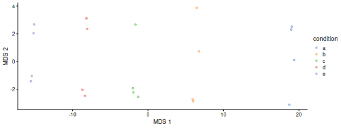
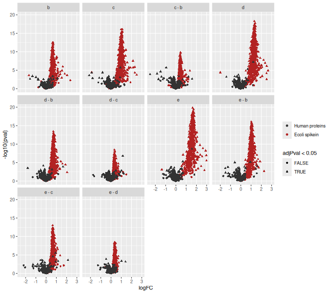

# Statistical analysis with msqrob2 {#sec-basics}


This chapter explains the main concepts for statistical analysis of
proteomics data using `msqrob2`. To illustrate these concepts, we will
use using a publicly available spike-in study with PRIDE identifier
PXD003881 [@Shen2018-gw]. This is an excellent example dataset
since it contains ground truth information about which proteins are
differentially abundant, enabling us to objectively demonstrate the
performance of `msqrob2`. This dataset has a relatively simple
experimental design (which does not imply that the analysis is easy),
allowing us to assess differential abundance using a data analysis
workflow with a single factor for the spike-in condition. For a more
advanced analysis with a more complex expiremental design, we refer to
our [advanced concepts chapter](#sec-advanced)

## Background 

Mass spectrometry (MS)-based proteomics aims at characterising the
proteome abundance of biological samples. The most popular approach is
label-free quantification (LFQ), where every sample is analysed in a
separate MS run. This section provides an overview of the analytical
workflow and its main challenges regarding data modelling.

### LFQ workflow{#sec-lfq_workflow}

In a nutshell, the wetlab workflow starts with sample preparation where the
samples are collected, and the protein content is extracted and
digested into peptides. To reduce the sample complexity, the peptides
are then separated based on physicochemical properties (mostly
hydrophobicity) using liquid chromatography (LC). Peptides are
then ionised by an electrospray as they elute from the chromatographic
column. The signal over time generated by the eluting ions is called
the total ion chromatogram. The ions are then sent for a first round
of MS to record their m/z distribution for the intact ions. This
provides an overview of the ions that elute from the column and allows
for further separation of the ions in the m/z space. The second round
of MS (MS2) records the fragmented ions for a selection of ions,
generally the most intense MS1 peaks^[The ion selection for MS2
depends on the data recorded in MS1. Therefore, this approach is
referred to as data dependent acquisition (DDA).]. This process is
repeated for every sample so that every sample is acquired in one MS
run. This provides the ion’s mass fingerprint. For LFQ workflows, the
accumulated MS1 intensity over time, also known as the area under the
curve, around the target mass is used as a quantitification measure.
On the other hand, the ion mass fingerprint, called the MS2 spectrum,
enables computational identification of the corresponding peptide
using search engines (e.g. Andromeda has been used for this data set)
that will provide peptide-to-spectrum matches (PSM). The quantified
PSM are further processed by the software (MaxQuant) to obtain a
peptide table^[MaxQuant also computes a protein table. However, we
found that starting from MaxQuant's protein table leads to a decrease
in performance. We will illustrate in this tutorial how to build the
protein table.], where every row corresponds to an identified peptide
and every column contains information about the peptide and its
quantification in one of the samples.

<div class="figure">

<p class="caption">Overview of an LFQ-based proteomics workflow.</p>
</div>

### Challenges{#sec-lfq_challenges}

Behind this workflow lies several challenges that will affect the data
modelling:

- MS-based proteomics doesn't measure proteins directly, but their 
constituting **peptide ions**. The protein-level information needs
to be reconstructed from the ion data. In this tutorial, we will
start from the peptide data, which has been constructed from the ion
data by MaxQuant.
- All peptides cannot be ionised with the same efficiency. Poor 
ionisation will lead to reduced signal as less ions will hit the
detector, hence leading to a huge variability in intensity among
different peptide species, even when they originate from the same
protein.
- The identification step is not trivial and prone to 
errors^[Improving peptide identification is outside the scope of
this tutorial]. PSM misidentification leads to the assignment of a
quantitative values from another peptide with likely another
ionisation efficiency and relative abundance. Hence this misassigned
value will become an outlier.
- Moreover, the ion selection for MS2 depends on its
intensity^[Recall that only the top most intense ion peaks are send
for MS2]. Therefore, the chance to measure and, subsequently, 
identify a peptide will depend on its abundance. Non identified
peptides will lead to data missingness, which is related to the
underlying quantification value. This phenomenon is known as
missingness not at random. Next to that, many reasons can lead to
ions not being selected or identified irrespective of their 
quantification value leading to missingness that is not related to
its quantitative value. This is referred to as missingness 
completely at random. The missingness issue is not negligible: only
41\% of all proteins are quantified across all samples, and the 
number drops to 6.6\% when considering peptides.
- The identification issues lead to unbalanced peptide missingness
across samples, and the patterns of missing values are potentially
different for every peptide, highlighting the need for an
automatised solution that is robust against missing values.
- Technical variations during the experiment can lead to systematic 
fluctuations across samples. The most obvious reason is when
different sample amounts are injected into the instruments, due to
small pipetting inconsistencies for instance. However, these
differences lead to unwanted variation that should be discarded when
answering biological questions.

### Experimental context{#sec-ecoli_experiment}

The samples were synthetically constructed, starting from a
trypsin-digested human background, hence human proteins are known to
be constant across samples E. coli lysates were spiked at five
different concentrations (3%, 4.5%, 6%, 7.5% and 9% wt/wt). So the E.
coli proteins are known to be differentially abundant, and we know
exactly in what amount they differ. There are four replicates per
spike-in condition. The samples were run on an Orbitrap Fusion mass
spectrometer. Raw data files were processed with MaxQuant (version
1.6.1.0) using default search settings unless otherwise noted. Spectra
were searched against the UniProtKB/SwissProt human and E. coli
reference proteome databases (07/06/2018), concatenated with the
default Maxquant contaminant database. Carbamidomethylation of Cystein
was set as a fixed modification, and oxidation of Methionine and
acetylation of the protein amino-terminus were allowed as variable
modifications. In silico cleavage was set to use trypsin/P, allowing
two miscleavages. Match between runs was also enabled using default
settings. The resulting peptide-to-spectrum matches (PSMs) were
filtered by MaxQuant at 1% FDR.

We will start from the peptide data generated by MaxQuant and infer
protein-level differences between samples. To achieve this goal, we
will apply an `msqrob2` workflow, a data processing and modelling
workflow dedicated to the analysis of MS-based proteomics datasets. We
will demonstrate how the workflow can retrieve the spiked-in proteins
from the E. coli data set, along with explanation of the key
statistical concepts behind proteomics data analysis. Before delving
into the analysis, we first set the concentrations for the different
spike-ins, and will prepare our computational environment.


``` r
concentrations <- (2:6) * 1.5
names(concentrations) <- letters[1:5]
```

## Software

### Load packages

We load the `msqrob2` package, along with additional packages for
data manipulation and visualisation.


``` r
library("msqrob2")
library("dplyr")
library("ggplot2")
library("patchwork")
```

### Parallelisation {#sec-parallel}

`msqrob2` can parallelise computations during the model estimation
to improve speed. However, we will disable parallelisation to ensure
this vignette can be run regardless of hardware. Parallelisation is
controlled using the `BiocParallel` package.


``` r
library("BiocParallel")
register(SerialParam())
```

If you want to use `msqrob2` with parallelisation enabled and using
4 cores, you can run the following:


``` r
register(MulticoreParam(workers = 4))
```

Be mindful that, while parallelisation can improve speed, it will also
consume more RAM because part of the data will be copied multiple
times over your different workers. If you experience crashes because
you exceeded the amount of available RAM on your machine, you should
reduce the number of requested workers.

## Data{#sec-ecoli_data}

The data were reanalysed by @Sticker2020-rl using MaxQuant and
deposited on `GitHub`. We here retrieve MaxQuant's `peptides.txt` for the
E. coli study.


``` r
library("BiocFileCache")
bfc <- BiocFileCache()
# myurl <- "https://github.com/statOmics/MSqRobSumPaper/raw/refs/heads/master/spikein/data/maxquant/peptides.zip"
# download.file(myurl,"data/sticker2020/peptides.zip", method = "curl", extra = "-L")
# unzip("data/sticker2020/peptides.zip", exdir = "data/sticker2020/")
peptideFile <- "data/sticker2020/peptides.txt"
```

**TODO**: put data on Zenodo. BiocFileCache will be used for fetching 
these data.

#### Peptide table{#sec-peptide_table}

Each row in the peptide data table contains information about one
peptide (the table below shows the first 6 rows). The columns contains
various descriptors about the peptide, such as its sequence, its
charge, the amino acid composition, etc. Some of these columns (those
starting with `Intensity.`) contain the quantification values for each
sample. The table format where the quantitative values for each sample
are contained in a separate column is depicted as the "wide format", 
as opposed to the "long format" (eg, the [PSM table]).


``` r
peptides <- read.delim(peptideFile)
quantCols <- grep("Intensity[.]", names(peptides), value = TRUE)
```


|Sequence                             |N.term.cleavage.window         |C.term.cleavage.window         |Amino.acid.before |First.amino.acid |Second.amino.acid |Second.last.amino.acid |Last.amino.acid |Amino.acid.after | A.Count| R.Count| N.Count| D.Count| C.Count| Q.Count| E.Count| G.Count| H.Count| I.Count| L.Count| K.Count| M.Count| F.Count| P.Count| S.Count| T.Count| W.Count| Y.Count| V.Count| U.Count| O.Count| Length| Missed.cleavages|      Mass|Proteins |Leading.razor.protein | Start.position| End.position|Gene.names |Protein.names                      |Unique..Groups. |Unique..Proteins. |Charges |      PEP|   Score|Identification.type.a1 |Identification.type.a2 |Identification.type.a3 |Identification.type.a4 |Identification.type.b1 |Identification.type.b2 |Identification.type.b3 |Identification.type.b4 |Identification.type.c1 |Identification.type.c2 |Identification.type.c3 |Identification.type.c4 |Identification.type.d1 |Identification.type.d2 |Identification.type.d3 |Identification.type.d4 |Identification.type.e1 |Identification.type.e2 |Identification.type.e3 |Identification.type.e4 | Experiment.a1| Experiment.a2| Experiment.a3| Experiment.a4| Experiment.b1| Experiment.b2| Experiment.b3| Experiment.b4| Experiment.c1| Experiment.c2| Experiment.c3| Experiment.c4| Experiment.d1| Experiment.d2| Experiment.d3| Experiment.d4| Experiment.e1| Experiment.e2| Experiment.e3| Experiment.e4|  Intensity| Intensity.a1| Intensity.a2| Intensity.a3| Intensity.a4| Intensity.b1| Intensity.b2| Intensity.b3| Intensity.b4| Intensity.c1| Intensity.c2| Intensity.c3| Intensity.c4| Intensity.d1| Intensity.d2| Intensity.d3| Intensity.d4| Intensity.e1| Intensity.e2| Intensity.e3| Intensity.e4|Reverse |Potential.contaminant | id|Protein.group.IDs |Mod..peptide.IDs |Evidence.IDs                                                                                                                                             |MS.MS.IDs                                                                                                                                                     | Best.MS.MS|Oxidation..M..site.IDs | MS.MS.Count| LFQ.intensity.a1| LFQ.intensity.a2| LFQ.intensity.a3| LFQ.intensity.a4| LFQ.intensity.b1| LFQ.intensity.b2| LFQ.intensity.b3| LFQ.intensity.b4| LFQ.intensity.c1| LFQ.intensity.c2| LFQ.intensity.c3| LFQ.intensity.c4| LFQ.intensity.d1| LFQ.intensity.d2| LFQ.intensity.d3| LFQ.intensity.d4| LFQ.intensity.e1| LFQ.intensity.e2| LFQ.intensity.e3| LFQ.intensity.e4|
|:------------------------------------|:------------------------------|:------------------------------|:-----------------|:----------------|:-----------------|:----------------------|:---------------|:----------------|-------:|-------:|-------:|-------:|-------:|-------:|-------:|-------:|-------:|-------:|-------:|-------:|-------:|-------:|-------:|-------:|-------:|-------:|-------:|-------:|-------:|-------:|------:|----------------:|---------:|:--------|:---------------------|--------------:|------------:|:----------|:----------------------------------|:---------------|:-----------------|:-------|--------:|-------:|:----------------------|:----------------------|:----------------------|:----------------------|:----------------------|:----------------------|:----------------------|:----------------------|:----------------------|:----------------------|:----------------------|:----------------------|:----------------------|:----------------------|:----------------------|:----------------------|:----------------------|:----------------------|:----------------------|:----------------------|-------------:|-------------:|-------------:|-------------:|-------------:|-------------:|-------------:|-------------:|-------------:|-------------:|-------------:|-------------:|-------------:|-------------:|-------------:|-------------:|-------------:|-------------:|-------------:|-------------:|----------:|------------:|------------:|------------:|------------:|------------:|------------:|------------:|------------:|------------:|------------:|------------:|------------:|------------:|------------:|------------:|------------:|------------:|------------:|------------:|------------:|:-------|:---------------------|--:|:-----------------|:----------------|:--------------------------------------------------------------------------------------------------------------------------------------------------------|:-------------------------------------------------------------------------------------------------------------------------------------------------------------|----------:|:----------------------|-----------:|----------------:|----------------:|----------------:|----------------:|----------------:|----------------:|----------------:|----------------:|----------------:|----------------:|----------------:|----------------:|----------------:|----------------:|----------------:|----------------:|----------------:|----------------:|----------------:|----------------:|
|AAAAAAAAAAAAAAAGAGAGAK               |QSRFQVDLVSENAGRAAAAAAAAAAAAAAA |AAAAAAAAGAGAGAKQTPADGEASGESEPA |R                 |A                |A                 |A                      |K               |Q                |      18|       0|       0|       0|       0|       0|       0|       3|       0|       0|       0|       1|       0|       0|       0|       0|       0|       0|       0|       0|       0|       0|     22|                0| 1595.8380|P55011   |P55011                |             93|          114|SLC12A2    |Solute carrier family 12 member 2  |yes             |yes               |2;3     | 0.00e+00|  98.407|By matching            |                       |                       |                       |                       |                       |                       |By MS/MS               |By MS/MS               |By MS/MS               |                       |By MS/MS               |                       |By matching            |By matching            |                       |                       |                       |By matching            |                       |             1|            NA|            NA|            NA|            NA|            NA|            NA|             1|             1|             1|            NA|             1|            NA|             1|             1|            NA|            NA|            NA|             1|            NA|   39754000|      6378300|            0|            0|            0|            0|            0|            0|            0|      4268500|      7099400|            0|            0|            0|      8563700|      6597000|            0|            0|            0|      6846700|            0|        |                      |  0|2115              |0                |0;1;2;3;4;5;6;7                                                                                                                                          |0;1;2;3                                                                                                                                                       |          2|                       |           2|          5715600|                0|                0|                0|                0|                0|                0|                0|          4324900|          8047900|                0|                0|                0|          9420400|          5673000|                0|                0|                0|          5761500|                0|
|AAAAAAAAAAGAAGGR                     |______________________________ |AAAAAAAAAGAAGGRGSGPGRRRHLVPGAG |M                 |A                |A                 |G                      |R               |G                |      12|       1|       0|       0|       0|       0|       0|       3|       0|       0|       0|       0|       0|       0|       0|       0|       0|       0|       0|       0|       0|       0|     16|                0| 1197.6214|Q86U42   |Q86U42                |              2|           17|PABPN1     |Polyadenylate-binding protein 2    |yes             |yes               |2       | 0.00e+00| 275.000|By MS/MS               |By MS/MS               |By MS/MS               |By MS/MS               |By matching            |By MS/MS               |By MS/MS               |By MS/MS               |                       |By MS/MS               |By MS/MS               |By MS/MS               |By matching            |By MS/MS               |By MS/MS               |By MS/MS               |By MS/MS               |                       |By MS/MS               |By MS/MS               |             1|             1|             1|             1|             1|             1|             1|             1|            NA|             1|             1|             1|             1|             1|             1|             1|             1|            NA|             1|             1| 1211200000|     76718000|     53670000|     86511000|     79070000|     57211000|     56593000|     81544000|     79032000|            0|     46087000|     62303000|     73292000|     60707000|     50560000|     75644000|     75246000|     52106000|            0|     74366000|     70540000|        |                      |  1|3262              |1                |8;9;10;11;12;13;14;15;16;17;18;19;20;21;22;23;24;25                                                                                                      |4;5;6;7;8;9;10;11;12;13;14;15;16;17;18;19                                                                                                                     |          9|                       |          15|         68748000|         59998000|         74863000|         70216000|         57211000|         63173000|         69374000|         69165000|                0|         52244000|         66990000|         62028000|         62554000|         55618000|         65050000|         63171000|         55715000|                0|         62578000|         58656000|
|AAAAAAALQAK                          |TILRQARNHKLRVDKAAAAAAALQAKSDEK |RVDKAAAAAAALQAKSDEKAAVAGKKPVVG |K                 |A                |A                 |A                      |K               |S                |       8|       0|       0|       0|       0|       1|       0|       0|       0|       0|       1|       1|       0|       0|       0|       0|       0|       0|       0|       0|       0|       0|     11|                0|  955.5451|P36578   |P36578                |            354|          364|RPL4       |60S ribosomal protein L4           |yes             |yes               |2       | 1.00e-07| 182.680|By MS/MS               |By MS/MS               |By MS/MS               |By MS/MS               |By MS/MS               |By MS/MS               |By MS/MS               |By MS/MS               |By MS/MS               |By MS/MS               |By MS/MS               |By MS/MS               |By MS/MS               |By MS/MS               |By MS/MS               |By MS/MS               |By MS/MS               |By MS/MS               |By MS/MS               |By MS/MS               |             2|             3|             4|             2|             3|             2|             2|             2|             3|             3|             3|             2|             3|             2|             3|             2|             2|             3|             3|             2| 1829100000|    129520000|     56753000|    114890000|    126100000|     33394000|     66695000|     93968000|    125070000|     84220000|     83186000|    102980000|    108620000|     72544000|     76384000|    100270000|    118790000|     67553000|     52009000|    115880000|    100300000|        |                      |  2|1762              |2                |26;27;28;29;30;31;32;33;34;35;36;37;38;39;40;41;42;43;44;45;46;47;48;49;50;51;52;53;54;55;56;57;58;59;60;61;62;63;64;65;66;67;68;69;70;71;72;73;74;75;76 |20;21;22;23;24;25;26;27;28;29;30;31;32;33;34;35;36;37;38;39;40;41;42;43;44;45;46;47;48;49;50;51;52;53;54;55;56;57                                             |         29|                       |          30|        116060000|         63444000|         99420000|        111980000|         33394000|         74449000|         79944000|        109450000|         85332000|         94299000|        110730000|         91926000|         74751000|         84026000|         86223000|         99722000|         72233000|         56151000|         97516000|         83401000|
|AAAAAAGAASGLPGPVAQGLK                |______________________________ |GAASGLPGPVAQGLKEALVDTLTGILSPVQ |M                 |A                |A                 |L                      |K               |E                |       9|       0|       0|       0|       0|       1|       0|       4|       0|       0|       2|       1|       0|       0|       2|       1|       0|       0|       0|       1|       0|       0|     21|                0| 1747.9581|Q96P70   |Q96P70                |              2|           22|IPO9       |Importin-9                         |yes             |yes               |2;3     | 0.00e+00| 202.440|By MS/MS               |By MS/MS               |By MS/MS               |By MS/MS               |By MS/MS               |By MS/MS               |By MS/MS               |By MS/MS               |By MS/MS               |By MS/MS               |By MS/MS               |By MS/MS               |By MS/MS               |By MS/MS               |By MS/MS               |By MS/MS               |By MS/MS               |By MS/MS               |By MS/MS               |By MS/MS               |             2|             2|             2|             2|             2|             2|             2|             2|             2|             2|             2|             2|             2|             2|             2|             2|             2|             2|             2|             2| 1789100000|    109030000|     72676000|    101320000|     97545000|     77269000|     79290000|    110840000|    110060000|     75937000|     74675000|     68192000|    102570000|     93726000|     72743000|    108550000|     98519000|     70725000|     80125000|     93910000|     91423000|        |                      |  3|3783              |3                |77;78;79;80;81;82;83;84;85;86;87;88;89;90;91;92;93;94;95;96;97;98;99;100;101;102;103;104;105;106;107;108;109;110;111;112;113;114;115;116                 |58;59;60;61;62;63;64;65;66;67;68;69;70;71;72;73;74;75;76;77;78;79;80;81;82;83;84;85;86;87;88;89;90;91;92;93;94;95;96;97;98;99;100;101;102;103;104;105;106;107 |         85|                       |          50|         97706000|         81244000|         87682000|         86622000|         77269000|         88508000|         94294000|         96324000|         76939000|         84650000|         73322000|         86806000|         96578000|         80020000|         93344000|         82709000|         75624000|         86506000|         79024000|         76020000|
|AAAAAAGAGPEMVR                       |______________________________ |MAAAAAAGAGPEMVRGQVFDVGPRYTNLSY |M                 |A                |A                 |V                      |R               |G                |       7|       1|       0|       0|       0|       0|       1|       2|       0|       0|       0|       0|       1|       0|       1|       0|       0|       0|       0|       1|       0|       0|     14|                0| 1241.6187|P28482   |P28482                |              2|           15|MAPK1      |Mitogen-activated protein kinase 1 |yes             |yes               |2       | 0.00e+00| 168.740|By MS/MS               |By MS/MS               |By MS/MS               |By MS/MS               |                       |By MS/MS               |By MS/MS               |By MS/MS               |                       |By MS/MS               |By MS/MS               |By MS/MS               |                       |                       |                       |                       |                       |                       |                       |                       |             1|             1|             1|             1|            NA|             1|             1|             1|            NA|             2|             1|             1|            NA|            NA|            NA|            NA|            NA|            NA|            NA|            NA|   72178000|            0|     29646000|     41064000|            0|            0|            0|            0|            0|            0|      1468400|            0|            0|            0|            0|            0|            0|            0|            0|            0|            0|        |                      |  4|1600              |4                |117;118;119;120;121;122;123;124;125;126;127                                                                                                              |108;109;110;111;112;113;114;115;116;117                                                                                                                       |        109|                       |          10|                0|         33141000|         35535000|                0|                0|                0|                0|                0|                0|          1664500|                0|                0|                0|                0|                0|                0|                0|                0|                0|                0|
|AAAAAAGSGTPREEEGPAGEAAASQPQAPTSVPGAR |______________________________ |AASQPQAPTSVPGARLSRLPLARVKALVKA |M                 |A                |A                 |A                      |R               |L                |      12|       2|       0|       0|       0|       2|       4|       5|       0|       0|       0|       0|       0|       0|       5|       3|       2|       0|       0|       1|       0|       0|     36|                1| 3287.5767|Q9NR33   |Q9NR33                |              2|           37|POLE4      |DNA polymerase epsilon subunit 4   |yes             |yes               |3       | 3.34e-05|  40.328|                       |                       |                       |                       |                       |                       |                       |                       |                       |                       |                       |By MS/MS               |                       |                       |                       |                       |                       |                       |                       |                       |            NA|            NA|            NA|            NA|            NA|            NA|            NA|            NA|            NA|            NA|            NA|             1|            NA|            NA|            NA|            NA|            NA|            NA|            NA|            NA|    6961000|            0|            0|            0|            0|            0|            0|            0|            0|            0|            0|            0|      6961000|            0|            0|            0|            0|            0|            0|            0|            0|        |                      |  5|4289              |5                |128                                                                                                                                                      |118                                                                                                                                                           |        118|                       |           1|                0|                0|                0|                0|                0|                0|                0|                0|                0|                0|                0|          5891200|                0|                0|                0|                0|                0|                0|                0|                0|

#### Sample annotation table{#sec-annotation_table}

Each row in the annotation table contains information about one
sample. The columns contain various descriptors about the sample, such
as the name of the sample or the MS run, the treatment (here the
spike-in condition), the lab that acquired the sample or any other
biological or technical information that may impact the data quality
or the quantification. Without an annotation table, no analysis
can be performed. The sample annotations are generated by the
researcher. In this example, the annotations are extracted from the
sample names, although reporting a detailed design of experiments in a
table is seen as better practice [@Gatto2023-kk].


``` r
coldata <- data.frame(quantCols = quantCols)
coldata$condition <- gsub("Intensity.(.).", "\\1", quantCols)
coldata$concentration <- concentrations[coldata$condition]
```


|quantCols    |condition | concentration|
|:------------|:---------|-------------:|
|Intensity.a1 |a         |           3.0|
|Intensity.a2 |a         |           3.0|
|Intensity.a3 |a         |           3.0|
|Intensity.a4 |a         |           3.0|
|Intensity.b1 |b         |           4.5|
|Intensity.b2 |b         |           4.5|

We will also extract the E. coli protein identifiers from the FASTA
file to later annotate the spike-in proteins which are known to be
differentially abundant.

1. We download the fasta files
2. We read the text file as vector, one line p
3. We keep only the protein headers
4. We extract the proteins identifiers from the headers


``` r
ecoli <- bfcrpath(bfc, "https://raw.githubusercontent.com/statOmics/MSqRobSumPaper/refs/heads/master/spikein/data/fasta/ecoli_up000000625_7_06_2018.fasta")
ecoli <- readLines(ecoli)
ecoli <- ecoli[grepl("^>", ecoli)]
ecoli <- gsub(">sp\\|(.*)\\|.*", "\\1", ecoli)
```


### Convert to QFeatures{#sec-qfeatures}

`msqrob2` is built around the `QFeatures` class. We refer to the [R
for mass spectrometry
book](https://rformassspectrometry.github.io/book/sec-quant.html) for
a comprehensive description of the class. In a nutshell, the
`QFeatures` package provides infrastructure to manage and analyse
quantitative features from mass spectrometry experiments. It is based
on the `SummarizedExperiment` and `MultiAssayExperiment` classes. It
leverages the hierarchical structure of proteomics experiments: data
proteins are composed of peptides, themselves produced by spectra.
Each piece of information in stored in an individual
`SummarizedExperiment` object, later referred to as a "set".
Throughout the aggregation and processing of these data, the relations
between sets are tracked and recorded, thus allowing users to easily
navigate across spectra, peptide and protein quantitative data.

<div class="figure">

<p class="caption">Illustration of the `QFeatures` data class.</p>
</div>

The `readQFeatures()` enables a seamless conversion of tabular data
into a `QFeatures` object. We provide the peptide table and the sample
annotation table. The function will use the `quantCols` column in the
sample annotation table to understand which columns in `peptides`
contain the quantitative values, and automatically link the
corresponding sample annotation with the quantitative values. We also
tell the function to use the `Sequence` column as peptide identifier,
which will be used as rownames. See `?readQFeatures()` for more
details.


``` r
(spikein <- readQFeatures(
  peptides, coldata, name = "peptides", fnames = "Sequence"
))
```

```
## An instance of class QFeatures (type: bulk) with 1 set:
## 
##  [1] peptides: SummarizedExperiment with 32827 rows and 20 columns
```

We now have a `QFeatures` object with 1 set, called `peptides` (which
we specified using the `name` argument). In this toy example, we have
information for 32827 peptides across 45 samples, as
expected (recall the [experimental design](#sec-ecoli_experiment)).

The sample annotations can be retrieved using `colData()`.


``` r
colData(spikein)
```

``` r
knitr::kable(head(colData(spikein)))
```


|             |quantCols    |condition | concentration|
|:------------|:------------|:---------|-------------:|
|Intensity.a1 |Intensity.a1 |a         |           3.0|
|Intensity.a2 |Intensity.a2 |a         |           3.0|
|Intensity.a3 |Intensity.a3 |a         |           3.0|
|Intensity.a4 |Intensity.a4 |a         |           3.0|
|Intensity.b1 |Intensity.b1 |b         |           4.5|
|Intensity.b2 |Intensity.b2 |b         |           4.5|

We can get a sample annotation directly using the `$` accessor.


``` r
head(spikein$concentration)
```

```
## [1] 3.0 3.0 3.0 3.0 4.5 4.5
```

We can extract the `SummarizedExperiment` object for the `peptides`
set using double bracket subsetting^[A `QFeatures` object can be seen
as a special list of `SummarizedExperiment` objects.]


``` r
spikein[["peptides"]]
```

```
## class: SummarizedExperiment 
## dim: 32827 20 
## metadata(0):
## assays(1): ''
## rownames(32827): AAAAAAAAAAAAAAAGAGAGAK AAAAAAAAAAGAAGGR ...
##   YYVTIIDAPGHRDFIK YYYIPQYK
## rowData names(116): Sequence N.term.cleavage.window ...
##   LFQ.intensity.e3 LFQ.intensity.e4
## colnames(20): Intensity.a1 Intensity.a2 ... Intensity.e3 Intensity.e4
## colData names(0):
```

But notice that the sample annotations were not extracted along with
the SummarizedExperiment (`colData names(0):`). This can be performed
using `getWithColData()`, which extracts the set of interest (like
`[[]]`) along with all the associated sample annotations.


``` r
getWithColData(spikein, "peptides")
```

```
## class: SummarizedExperiment 
## dim: 32827 20 
## metadata(0):
## assays(1): ''
## rownames(32827): AAAAAAAAAAAAAAAGAGAGAK AAAAAAAAAAGAAGGR ...
##   YYVTIIDAPGHRDFIK YYYIPQYK
## rowData names(116): Sequence N.term.cleavage.window ...
##   LFQ.intensity.e3 LFQ.intensity.e4
## colnames(20): Intensity.a1 Intensity.a2 ... Intensity.e3 Intensity.e4
## colData names(3): quantCols condition concentration
```

The peptides annotations are available for in the corresponding 
`rowData`.


``` r
rowData(spikein[["peptides"]])
```

``` r
knitr::kable(head(rowData(spikein[["peptides"]])))
```


|                                     |Sequence                             |N.term.cleavage.window         |C.term.cleavage.window         |Amino.acid.before |First.amino.acid |Second.amino.acid |Second.last.amino.acid |Last.amino.acid |Amino.acid.after | A.Count| R.Count| N.Count| D.Count| C.Count| Q.Count| E.Count| G.Count| H.Count| I.Count| L.Count| K.Count| M.Count| F.Count| P.Count| S.Count| T.Count| W.Count| Y.Count| V.Count| U.Count| O.Count| Length| Missed.cleavages|      Mass|Proteins |Leading.razor.protein | Start.position| End.position|Gene.names |Protein.names                      |Unique..Groups. |Unique..Proteins. |Charges |      PEP|   Score|Identification.type.a1 |Identification.type.a2 |Identification.type.a3 |Identification.type.a4 |Identification.type.b1 |Identification.type.b2 |Identification.type.b3 |Identification.type.b4 |Identification.type.c1 |Identification.type.c2 |Identification.type.c3 |Identification.type.c4 |Identification.type.d1 |Identification.type.d2 |Identification.type.d3 |Identification.type.d4 |Identification.type.e1 |Identification.type.e2 |Identification.type.e3 |Identification.type.e4 | Experiment.a1| Experiment.a2| Experiment.a3| Experiment.a4| Experiment.b1| Experiment.b2| Experiment.b3| Experiment.b4| Experiment.c1| Experiment.c2| Experiment.c3| Experiment.c4| Experiment.d1| Experiment.d2| Experiment.d3| Experiment.d4| Experiment.e1| Experiment.e2| Experiment.e3| Experiment.e4|  Intensity|Reverse |Potential.contaminant | id|Protein.group.IDs |Mod..peptide.IDs |Evidence.IDs                                                                                                                                             |MS.MS.IDs                                                                                                                                                     | Best.MS.MS|Oxidation..M..site.IDs | MS.MS.Count| LFQ.intensity.a1| LFQ.intensity.a2| LFQ.intensity.a3| LFQ.intensity.a4| LFQ.intensity.b1| LFQ.intensity.b2| LFQ.intensity.b3| LFQ.intensity.b4| LFQ.intensity.c1| LFQ.intensity.c2| LFQ.intensity.c3| LFQ.intensity.c4| LFQ.intensity.d1| LFQ.intensity.d2| LFQ.intensity.d3| LFQ.intensity.d4| LFQ.intensity.e1| LFQ.intensity.e2| LFQ.intensity.e3| LFQ.intensity.e4|
|:------------------------------------|:------------------------------------|:------------------------------|:------------------------------|:-----------------|:----------------|:-----------------|:----------------------|:---------------|:----------------|-------:|-------:|-------:|-------:|-------:|-------:|-------:|-------:|-------:|-------:|-------:|-------:|-------:|-------:|-------:|-------:|-------:|-------:|-------:|-------:|-------:|-------:|------:|----------------:|---------:|:--------|:---------------------|--------------:|------------:|:----------|:----------------------------------|:---------------|:-----------------|:-------|--------:|-------:|:----------------------|:----------------------|:----------------------|:----------------------|:----------------------|:----------------------|:----------------------|:----------------------|:----------------------|:----------------------|:----------------------|:----------------------|:----------------------|:----------------------|:----------------------|:----------------------|:----------------------|:----------------------|:----------------------|:----------------------|-------------:|-------------:|-------------:|-------------:|-------------:|-------------:|-------------:|-------------:|-------------:|-------------:|-------------:|-------------:|-------------:|-------------:|-------------:|-------------:|-------------:|-------------:|-------------:|-------------:|----------:|:-------|:---------------------|--:|:-----------------|:----------------|:--------------------------------------------------------------------------------------------------------------------------------------------------------|:-------------------------------------------------------------------------------------------------------------------------------------------------------------|----------:|:----------------------|-----------:|----------------:|----------------:|----------------:|----------------:|----------------:|----------------:|----------------:|----------------:|----------------:|----------------:|----------------:|----------------:|----------------:|----------------:|----------------:|----------------:|----------------:|----------------:|----------------:|----------------:|
|AAAAAAAAAAAAAAAGAGAGAK               |AAAAAAAAAAAAAAAGAGAGAK               |QSRFQVDLVSENAGRAAAAAAAAAAAAAAA |AAAAAAAAGAGAGAKQTPADGEASGESEPA |R                 |A                |A                 |A                      |K               |Q                |      18|       0|       0|       0|       0|       0|       0|       3|       0|       0|       0|       1|       0|       0|       0|       0|       0|       0|       0|       0|       0|       0|     22|                0| 1595.8380|P55011   |P55011                |             93|          114|SLC12A2    |Solute carrier family 12 member 2  |yes             |yes               |2;3     | 0.00e+00|  98.407|By matching            |                       |                       |                       |                       |                       |                       |By MS/MS               |By MS/MS               |By MS/MS               |                       |By MS/MS               |                       |By matching            |By matching            |                       |                       |                       |By matching            |                       |             1|            NA|            NA|            NA|            NA|            NA|            NA|             1|             1|             1|            NA|             1|            NA|             1|             1|            NA|            NA|            NA|             1|            NA|   39754000|        |                      |  0|2115              |0                |0;1;2;3;4;5;6;7                                                                                                                                          |0;1;2;3                                                                                                                                                       |          2|                       |           2|          5715600|                0|                0|                0|                0|                0|                0|                0|          4324900|          8047900|                0|                0|                0|          9420400|          5673000|                0|                0|                0|          5761500|                0|
|AAAAAAAAAAGAAGGR                     |AAAAAAAAAAGAAGGR                     |______________________________ |AAAAAAAAAGAAGGRGSGPGRRRHLVPGAG |M                 |A                |A                 |G                      |R               |G                |      12|       1|       0|       0|       0|       0|       0|       3|       0|       0|       0|       0|       0|       0|       0|       0|       0|       0|       0|       0|       0|       0|     16|                0| 1197.6214|Q86U42   |Q86U42                |              2|           17|PABPN1     |Polyadenylate-binding protein 2    |yes             |yes               |2       | 0.00e+00| 275.000|By MS/MS               |By MS/MS               |By MS/MS               |By MS/MS               |By matching            |By MS/MS               |By MS/MS               |By MS/MS               |                       |By MS/MS               |By MS/MS               |By MS/MS               |By matching            |By MS/MS               |By MS/MS               |By MS/MS               |By MS/MS               |                       |By MS/MS               |By MS/MS               |             1|             1|             1|             1|             1|             1|             1|             1|            NA|             1|             1|             1|             1|             1|             1|             1|             1|            NA|             1|             1| 1211200000|        |                      |  1|3262              |1                |8;9;10;11;12;13;14;15;16;17;18;19;20;21;22;23;24;25                                                                                                      |4;5;6;7;8;9;10;11;12;13;14;15;16;17;18;19                                                                                                                     |          9|                       |          15|         68748000|         59998000|         74863000|         70216000|         57211000|         63173000|         69374000|         69165000|                0|         52244000|         66990000|         62028000|         62554000|         55618000|         65050000|         63171000|         55715000|                0|         62578000|         58656000|
|AAAAAAALQAK                          |AAAAAAALQAK                          |TILRQARNHKLRVDKAAAAAAALQAKSDEK |RVDKAAAAAAALQAKSDEKAAVAGKKPVVG |K                 |A                |A                 |A                      |K               |S                |       8|       0|       0|       0|       0|       1|       0|       0|       0|       0|       1|       1|       0|       0|       0|       0|       0|       0|       0|       0|       0|       0|     11|                0|  955.5451|P36578   |P36578                |            354|          364|RPL4       |60S ribosomal protein L4           |yes             |yes               |2       | 1.00e-07| 182.680|By MS/MS               |By MS/MS               |By MS/MS               |By MS/MS               |By MS/MS               |By MS/MS               |By MS/MS               |By MS/MS               |By MS/MS               |By MS/MS               |By MS/MS               |By MS/MS               |By MS/MS               |By MS/MS               |By MS/MS               |By MS/MS               |By MS/MS               |By MS/MS               |By MS/MS               |By MS/MS               |             2|             3|             4|             2|             3|             2|             2|             2|             3|             3|             3|             2|             3|             2|             3|             2|             2|             3|             3|             2| 1829100000|        |                      |  2|1762              |2                |26;27;28;29;30;31;32;33;34;35;36;37;38;39;40;41;42;43;44;45;46;47;48;49;50;51;52;53;54;55;56;57;58;59;60;61;62;63;64;65;66;67;68;69;70;71;72;73;74;75;76 |20;21;22;23;24;25;26;27;28;29;30;31;32;33;34;35;36;37;38;39;40;41;42;43;44;45;46;47;48;49;50;51;52;53;54;55;56;57                                             |         29|                       |          30|        116060000|         63444000|         99420000|        111980000|         33394000|         74449000|         79944000|        109450000|         85332000|         94299000|        110730000|         91926000|         74751000|         84026000|         86223000|         99722000|         72233000|         56151000|         97516000|         83401000|
|AAAAAAGAASGLPGPVAQGLK                |AAAAAAGAASGLPGPVAQGLK                |______________________________ |GAASGLPGPVAQGLKEALVDTLTGILSPVQ |M                 |A                |A                 |L                      |K               |E                |       9|       0|       0|       0|       0|       1|       0|       4|       0|       0|       2|       1|       0|       0|       2|       1|       0|       0|       0|       1|       0|       0|     21|                0| 1747.9581|Q96P70   |Q96P70                |              2|           22|IPO9       |Importin-9                         |yes             |yes               |2;3     | 0.00e+00| 202.440|By MS/MS               |By MS/MS               |By MS/MS               |By MS/MS               |By MS/MS               |By MS/MS               |By MS/MS               |By MS/MS               |By MS/MS               |By MS/MS               |By MS/MS               |By MS/MS               |By MS/MS               |By MS/MS               |By MS/MS               |By MS/MS               |By MS/MS               |By MS/MS               |By MS/MS               |By MS/MS               |             2|             2|             2|             2|             2|             2|             2|             2|             2|             2|             2|             2|             2|             2|             2|             2|             2|             2|             2|             2| 1789100000|        |                      |  3|3783              |3                |77;78;79;80;81;82;83;84;85;86;87;88;89;90;91;92;93;94;95;96;97;98;99;100;101;102;103;104;105;106;107;108;109;110;111;112;113;114;115;116                 |58;59;60;61;62;63;64;65;66;67;68;69;70;71;72;73;74;75;76;77;78;79;80;81;82;83;84;85;86;87;88;89;90;91;92;93;94;95;96;97;98;99;100;101;102;103;104;105;106;107 |         85|                       |          50|         97706000|         81244000|         87682000|         86622000|         77269000|         88508000|         94294000|         96324000|         76939000|         84650000|         73322000|         86806000|         96578000|         80020000|         93344000|         82709000|         75624000|         86506000|         79024000|         76020000|
|AAAAAAGAGPEMVR                       |AAAAAAGAGPEMVR                       |______________________________ |MAAAAAAGAGPEMVRGQVFDVGPRYTNLSY |M                 |A                |A                 |V                      |R               |G                |       7|       1|       0|       0|       0|       0|       1|       2|       0|       0|       0|       0|       1|       0|       1|       0|       0|       0|       0|       1|       0|       0|     14|                0| 1241.6187|P28482   |P28482                |              2|           15|MAPK1      |Mitogen-activated protein kinase 1 |yes             |yes               |2       | 0.00e+00| 168.740|By MS/MS               |By MS/MS               |By MS/MS               |By MS/MS               |                       |By MS/MS               |By MS/MS               |By MS/MS               |                       |By MS/MS               |By MS/MS               |By MS/MS               |                       |                       |                       |                       |                       |                       |                       |                       |             1|             1|             1|             1|            NA|             1|             1|             1|            NA|             2|             1|             1|            NA|            NA|            NA|            NA|            NA|            NA|            NA|            NA|   72178000|        |                      |  4|1600              |4                |117;118;119;120;121;122;123;124;125;126;127                                                                                                              |108;109;110;111;112;113;114;115;116;117                                                                                                                       |        109|                       |          10|                0|         33141000|         35535000|                0|                0|                0|                0|                0|                0|          1664500|                0|                0|                0|                0|                0|                0|                0|                0|                0|                0|
|AAAAAAGSGTPREEEGPAGEAAASQPQAPTSVPGAR |AAAAAAGSGTPREEEGPAGEAAASQPQAPTSVPGAR |______________________________ |AASQPQAPTSVPGARLSRLPLARVKALVKA |M                 |A                |A                 |A                      |R               |L                |      12|       2|       0|       0|       0|       2|       4|       5|       0|       0|       0|       0|       0|       0|       5|       3|       2|       0|       0|       1|       0|       0|     36|                1| 3287.5767|Q9NR33   |Q9NR33                |              2|           37|POLE4      |DNA polymerase epsilon subunit 4   |yes             |yes               |3       | 3.34e-05|  40.328|                       |                       |                       |                       |                       |                       |                       |                       |                       |                       |                       |By MS/MS               |                       |                       |                       |                       |                       |                       |                       |                       |            NA|            NA|            NA|            NA|            NA|            NA|            NA|            NA|            NA|            NA|            NA|             1|            NA|            NA|            NA|            NA|            NA|            NA|            NA|            NA|    6961000|        |                      |  5|4289              |5                |128                                                                                                                                                      |118                                                                                                                                                           |        118|                       |           1|                0|                0|                0|                0|                0|                0|                0|                0|                0|                0|                0|          5891200|                0|                0|                0|                0|                0|                0|                0|                0|

We can also retrieve the quantitative values for each set using 
`assays()`.


``` r
assay(spikein[[1]])[1:5, 1:5]
```

```
##                        Intensity.a1 Intensity.a2 Intensity.a3 Intensity.a4
## AAAAAAAAAAAAAAAGAGAGAK      6378300            0            0            0
## AAAAAAAAAAGAAGGR           76718000     53670000     86511000     79070000
## AAAAAAALQAK               129520000     56753000    114890000    126100000
## AAAAAAGAASGLPGPVAQGLK     109030000     72676000    101320000     97545000
## AAAAAAGAGPEMVR                    0     29646000     41064000            0
##                        Intensity.b1
## AAAAAAAAAAAAAAAGAGAGAK            0
## AAAAAAAAAAGAAGGR           57211000
## AAAAAAALQAK                33394000
## AAAAAAGAASGLPGPVAQGLK      77269000
## AAAAAAGAGPEMVR                    0
```

## Data preprocessing{#sec-basic_preprocess}

Since we have a `QFeatures` object, we can directly make use of
`QFeatures`' data preprocessing functionality^[see also the [R for
mass spectrometry
book](https://rformassspectrometry.github.io/book/sec-quant.html)]. A
major advantage of `QFeatures` is it provides the power to build
highly modular workflows, where each step is carried out by a
dedicated function with a large choice of available methods and
parameters. This means that users can adapt the workflow to their
specific use case and their specific needs.

### Encoding missing values{#sec-encode_missing}

The first preprocessing step is to correctly encode the missing
values. It is important that missing values are encoded using `NA`.
For instance, non-observed values should not be
encoded with a zero because true zeros (the proteomic feature
is absent from the sample) cannot be distinguished from technical
zeros (the feature was missed by the instrument or could not be
identified). We therefore replace any zero in the quantitative data
with an `NA`.


``` r
spikein <- zeroIsNA(spikein, names(spikein))
```

Note that `msqrob2` can handle missing data without having to rely on
hard-to-verify imputation assumptions, which is our general recommendation. However, `msqrob2` does not
prevent users from using imputation, which can be performed with
`impute()` from the `QFeatures` package. Below, we show how one could
perform KNN imputation^[We will however not evaluate the code in this
tutorial as our general advice is to avoid imputation. To run the
code, you'll need to uncomment it first.] (see `?impute` for more
options).


``` r
# spikein <- impute(
#   spikein, method = "knn",
#   i = names(spikein), name = paste0(names(spikein), "_imput")
# )
```

### Log2 transformation{#sec-log2}

We need to log2 transform the intensities. We illustrate the rationale
using the spike-in data. For this, we perform a short data
manipulation pipeline:

1. We use `longForm()` to convert the `QFeatures` object into a long
table, where each row contains the quantitative information about
one observation, in which column, row and set it was found. Long
tables are particularly useful for manipulating data with the
`tidyverse` ecosystem, namely with `ggplot2` for visualisation.
`longForm()` also allows to include annotations, and we here
include `Mixture` and `TechRepMixture` for filtering and colouring.
2. `longForm()` returns a `DataFrame` which we convert to a
`data.frame`.
3. We filter the data to keep only the data from peptide AEMSEYLFDK.


``` r
dat <- longForm(spikein, colvars = colnames(colData(spikein))) |> ## 1.
  data.frame() |> ## 2.
  filter(rowname == "AEMSEYLFDK")
```

Next, we visualise the data using `ggplot2`. We will show the
intensities and log2-intensities for one of the peptides, AALEELVK, in
function of the E. coli spike-in concentration. We first define a common
plot from which we generate two plots, one without and the other with
log2 transformation of the quantitative values.


We can see that the variation around the mean for each concentration slightly increases as the mean increases. This is known as heteroskedasticity.
We will later see that `msqrob2` assumes that variance of the error
should be consistent across the different conditions. Upon,
log2-transformation we can see that the problem of unequal variation
is solved.

Another advantages of log2-transformation is that it provides a scale
that directly relates to biological interpretation. In biology, a
change induced by some condition often results in a fold change in
concentration. Interestingly, the log2 fold change (logFC), which is
the log of the ratio between two conditions, is identical to the
difference between the log of each condition.

$$log_2FC_{b-a} = log_2b - log_2a = log_2 \frac{b}{a}$$

This simplifies the modelling since the effects are now additive and
it simplifies the interpretation since a logFC of 1 means that the
abundances are $2\times$ higher in $b$ than in $a$, a logFC of 2
means an increase of $4\times$, for instance.

We perform log2-transformation with `logTransform()` from the
`QFeatures` package.


``` r
spikein <- logTransform(
  spikein, "peptides", name = "peptides_log", base = 2
)
```

### Peptide filtering{#sec-filter}

Filtering removes low-quality and unreliable peptides that would
otherwise introduce noise and artefacts in the data. There are many
possible criteria for peptide filtering:

- Reverse sequences
- Only identified by modification site (only modified peptides 
detected)
- Razor peptides: non-unique peptides assigned to the protein group 
with the most other peptides 
- Contaminants
- Peptides few identifications
- Proteins that are only identified with one or a few peptides
- FDR of identification
- ...

It is important that the filtering criteria are not distorting the distribution of the test statistics in the downstream analysis for features that are non-DA. It can be shown that filtering will not induce bias results when the filtering criterion is independent of test statistic. Here, the test statistics are based on the average difference between the log2-transformed intensities (effect size) and their corresponding standard error, which is a function of the residual standard deviation. The criteria that we proposed above are all based on the results of the identification step, hence, they are independent of the downstream test statistics that will be used to prioritize DA proteins. 

We use `filterFeatures()` to perform the filtering. It uses
information from the `rowData` and a formula to generate a filter for
each feature (row) in each set across the object. If the filter
returns `TRUE`, the corresponding row is retained, otherwise it is
removed. Defining a filter through a formula offers a flexible
approach, allowing for any customised filter. This dataset requires an
extensive PSM filtering which is an ideal use case to demonstrate the
customisation of a filtering workflow.

#### Remove failed protein inference

We remove peptides that could not be mapped to a protein. We also 
remove peptides that cannot be uniquely mapped to a single proteins
because its sequence is shared across multiple proteins. This often
occurs for homologs or for proteins that share similar functional
domains. Shared peptides are often mapped to protein groups, which are
the set of proteins that share the given peptides. Protein groups are
encoded by appending the constituting protein identifiers, separated
by a `";"`. 


``` r
spikein <- filterFeatures(
  spikein, ~ Proteins != "" & ## Remove failed protein inference
    !grepl(";", Proteins)) ## Remove protein groups
```

#### Remove reverse sequences and contaminants

We now remove the peptides that map to decoy sequences or to
contaminants proteins. Decoy peptides, which consist of fake peptide
sequences generated by reversing a real amino-acid sequence, are used
during the database search to mitigating the number of random-hit PSM,
hence mitigating misidentification. Contaminant proteins are proteins
known to be artificially incorporated during the experiment, but that
are irrelevant to the biological system under study. Typical
contaminants are human or animal keratins (deposited by the
experimenter) or trypsin (used for protein digestion). It is important
to remove these peptides before performing statistical modelling,
otherwise these proteins will be accounted for during the multiple
test adjustment which will cause an unnecessary decrease of
statistical power. Note, that the column name of the contaminants in the peptides file differs according to the MaxQuant version. In our peptide.txt the contaminants are indicated in the column `Potential.contaminant`. 


``` r
spikein <- filterFeatures(spikein, ~ Reverse != "+" & ## Remove decoys
                            Potential.contaminant != "+") ## Remove contaminants
```

#### Remove highly missing peptides

We keep peptides that were observed at last 4 times out of the $n
= 20$ samples, so that we can estimate the peptide characteristics. We tolerate the following proportion of NAs:
$\text{pNA} = \frac{(n - 4)}{n} = 0.8$, so we keep peptides that
are observed in at least 20% of the samples, which corresponds to one treatment condition. This is an arbitrary
value that may need to be adjusted depending on the experiment and the
data set.


``` r
nObs <- 4
n <- ncol(spikein[["peptides_log"]])
(spikein <- filterNA(spikein, i = "peptides_log", pNA = (n - nObs) / n))
```

```
## An instance of class QFeatures (type: bulk) with 2 sets:
## 
##  [1] peptides: SummarizedExperiment with 30661 rows and 20 columns 
##  [2] peptides_log: SummarizedExperiment with 27850 rows and 20 columns
```

We keep 27850 peptides upon filtering.

### Normalisation{#sec-norm}

The most common objective of MS-based proteomics experiments is to
understand the biological changes in protein abundance between
experimental conditions. However, changes in measurements between
groups can be caused due to technical factors. For instance, there are
systematic fluctuations from run-to-run that shift the measured
intensity distribution. We can this explore as follows:

1. We extract the sets containing the log transformed data. This is 
performed using `QFeatures`' 3-way subsetting^[We will explain this
with more details at the end of the [summarisation step](#sec-summarisation)].
2. We use `longForm()` to convert the `QFeatures` object into a long
table, including `lab` and `concentration` for filtering and
colouring.
3. We visualise the density of the quantitative values within each
sample. We colour each sample based on its spike-in condition.
Remember that each spike-in concentration has been acquired in
triplicate for each lab.


``` r
spikein[, , "peptides_log"] |> ## 1.
  longForm(colvars = c("concentration", "condition")) |> ## 2.
  data.frame() |> 
  ggplot() + ## 3.
  aes(x = value,
      colour = condition,
      group = colname) +
  geom_density()
```


Even in this clean synthetic data set (same background with a small
percentage of E. coli lysate), the marginal peptide intensity
distributions across samples are not well aligned. Ignoring this
effect will increase the noise and reduce the statistical power of the
experiment, and may also, in case of unbalanced designs, introduce
confounding effects that will bias the results.

Therefore, normalisation will transform the data to put all the
distributions on the same location, such as centering on the mean or
the median, so that the distributions better coincide and overlap.

Here, we will use the Median of Ratios method of DESeq2: 

1. We first create a pseudo-reference sample (row-wise mean of log2 
intensities, which corresponds to the log2 transformed geometric 
mean). 
2. Calculate the log2 ratios of each sample w.r.t. the 
pseudo-reference 
3. Subsequently take the column wise median of these log2 ratios to 
obtain the sample based normalisation factor on the log2 scale.
4. Subtract the norm factors from the intensities of each 
corresponding column of the assay data and store the result in the
new assay peptides_norm. (We adopt the sweep function to the
`peptides_log` assay of the spikein QFeatures object with as
statistic the log2 normfactor `STATS=nf` the default function `FUN
= "-"`, `MARGIN = 2` to substract the column wise log2 norm factor
from each entry of the corresponding assay data)


``` r
pseudoRef <- assay(spikein[["peptides_log"]]) |> 
  rowMeans(na.rm = TRUE) #1. Calculate the row means 
nfLog <- sweep(
  assay(spikein[["peptides_log"]]), 
  MARGIN = 1, 
  pseudoRef) |> #2. Subtract the row means row-by-row (MARGIN = 1)
  colMedians(na.rm = TRUE)  #3. Calculate the column median 
spikein <- sweep( #4. Subtract log2 norm factor column-by-column (MARGIN = 2)
  spikein,
  MARGIN = 2,
  STATS = nfLog,
  i = "peptides_log",
  name = "peptides_norm"
)
```

Formally, the function applies the following operation on each sample
$i$ across all PSMs $p$:

$$
y_{ip}^{\text{norm}} = y_{ip} - \hat{\mu}_i
$$

with $\hat{\mu}_i$ the norm factor. Upon normalisation, we can see
that the distribution nicely overlap (using the same code as above)


``` r
spikein[, , "peptides_norm"] |> ## 1.
  longForm(colvars = c( "concentration", "condition")) |> ## 2.
  data.frame() |> 
  ggplot() + ## 3.
  aes(x = value,
      colour = condition,
      group = colname) +
  geom_density()
```


Beware there exist numerous types of normalisation methods (see
`?normalize`) and which method to use may be data set dependent. For
instance, some data set may show low overlap of distribution tails
upon normalisation indicating that a simple shift is not sufficient.
In micro-array literature, quantile normalisation is used to force the
median and all other quantiles to be equal across samples, but in
proteomics, quantile normalisation often introduces artifacts due to a
difference in missing peptides across samples (c.f. [Challenges]).

It is important to understand that most normalisation procedures
assume that the majority of the proteins do not change across
conditions and only a small proportion of the proteins are
differentially abundant. This assumption may not be valid in poorly
designed spike-in studies [@O-Brien2024-lr] or for pull-down studies,
for example. Dedicated normalisation strategies are then required. 

### Summarisation{#sec-summarisation}

The objective of summarisation (also referred to as aggregation) is to
summarise the peptide-level intensities into a protein expression value.
We illustrate the motivation behind summarisation using all peptide-level data for
one of the E. coli proteins. We also focus on the lowest (a) and highest (e)
spike-in conditions. We illustrate the different peptides on the
x axis and plot their log2 normalised intensities across samples on y
axis. All the points belonging to the same sample are linked through a
grey line.


1. We can see that data for a protein can consist of many peptides, 
hence the need for summarisation.
2. We observe that different peptides have different intensities 
within the same sample (same line). This is because different
peptides have different properties and hence differ in their ionisation
efficiency, which will influence the detectability in the MS 
([Challenges]).
3. The peptide identification are inconsistent between groups of 
interest. We can see the low-concentration group (condition a, red)
display more missing values than the high-concentration group
(condition e, blue). Moreover, which value is missing depends on
the peptide characteristics. All the peptides found in the
low-concentration group are the most intense peptides in the high
concentration group.
4. We also often find outliers, for instance, due to misidentification or fluctuations during MS acquisition.
5. These data also suggest pseudo-replication. The peptide intensities
in one same sample (dots connected by a line) are correlated, i.e.
they more alike than the peptide intensities between samples
(the lines do not perfectly align). 

The fact that different peptides have different intensities (2.), may
be inconsistently identified (3.) and/or quantified (4.), and show
sample correlations (5.) can lead to bias if we use simple
summarisation approaches such as summing or averaging the peptide
intensities for each sample. Instead, we will resort to more advanced
summarisation approaches to accommodate for these issues.

Here, we summarise the peptide-level data into protein intensities
through the robust summarisation approach [@Sticker2020-rl] which is a
model approach that estimates for each protein $P$ separately:

$$
y_{ip} = \beta_p^\text{pep} + \beta_i^\text{samp} + \epsilon_{ip}
$$

where $y_{ip}$ is the log-normalised peptide intensity for peptide $p$
belonging to protein $P$ in sample $i$. $\beta_p^\text{pep}$ is the
average effect of peptide $p$, which account for the fact that
different peptide yield different baseline intensities (see issue 2.
above). $\beta_i^\text{samp}$ is the average effect of sample $i$. In
other words, it provides the estimated log2-transformed and normalised intensity of protein $P$ in
sample $i$ corrected for the peptide effect, which will be used as the summarised protein value.
$\epsilon_{ip}$ is the residual effect that cannot be explained by the
average sample and peptide effects. The method is called robust
summarisation because the estimation process will minimize $\epsilon$
using a robust estimator^[During robust estimation, the least squared
error minimisation, that is minimising $\sum_i\mathbf{\epsilon}^2_i$, is
iteratively reweighted using Huber weights, i.e. $\sum_iw_i\mathbf{\epsilon}^2_i$. This is internally
performed using `MASS::rlm()`.] that will down-weigh extreme values,
effectively tackling issue 4.

`aggregateFeatures()` streamlines summarisation. It requires the name
of a `rowData` column to group the peptides into proteins (or
protein groups), here `Proteins`. We provide the summarisation
approach through the `fun` argument. Other summarisation methods
are available from the `MsCoreUtils` package, see `?aggregateFeatures`
for a comprehensive list. The function will return a `QFeatures`
object with a new set that we called `proteins`.


``` r
(spikein <- aggregateFeatures(
  spikein, i = "peptides_norm", 
  name = "proteins",
  fcol = "Proteins", 
  fun = MsCoreUtils::robustSummary,
  na.rm = TRUE
))
```

```
## An instance of class QFeatures (type: bulk) with 4 sets:
## 
##  [1] peptides: SummarizedExperiment with 30661 rows and 20 columns 
##  [2] peptides_log: SummarizedExperiment with 27850 rows and 20 columns 
##  [3] peptides_norm: SummarizedExperiment with 27850 rows and 20 columns 
##  [4] proteins: SummarizedExperiment with 4592 rows and 20 columns
```

Note that all the links between peptides and proteins are kept^[In
fact, this is also true for the previous transformation where the
peptides are linked across sets.]. This come particularly handy when
we want to extract all the data from one protein, P0AEE5 for
instance. This can be performed using the 3-way indexing. Every
`QFeatures` object contains one or more sets, each characterised by
multiple rows (peptides or proteins) and multiple columns (samples).
Therefore, `QFeatures` can subset data based on one or more of these
indices, `data[set_k, feature_i, sample_j]`. The first entry will
subset particular features. This can be the name of a peptide (e.g.
`DGQIQFVLLK`) or the name of a protein (`P0AEE5`).
The second entry selects the samples columns of interest. The third
entry selects the sets of interest. If an entry is left blank, all the
corresponding features, samples or sets will be selected. Let's
extract all the data (all samples and all sets) related to the E. coli protein
(`P0AEE5`).


``` r
spikein["P0AEE5", , ]
```

```
## An instance of class QFeatures (type: bulk) with 4 sets:
## 
##  [1] peptides: SummarizedExperiment with 16 rows and 20 columns 
##  [2] peptides_log: SummarizedExperiment with 16 rows and 20 columns 
##  [3] peptides_norm: SummarizedExperiment with 16 rows and 20 columns 
##  [4] proteins: SummarizedExperiment with 1 rows and 20 columns
```

The function extracted one protein and its 16 related peptides. This
functionality is particularly useful for plotting and exploring the
changes induces by the data processing. For instance:

1. We use the `QFeatures` subsetting functionality to keep only the 
data for the E. coli protein P0AEE5 and the sets before and after 
summarisation.
2. We use `longForm()` to convert the object for plotting.
3. We plot the intensities for each sample, facetting by set and
colouring by experimental condition, linking dots from the same
peptide or protein with a line.


``` r
spikein["P0AEE5", , c("peptides_norm", "proteins")] |> ## 1.
  longForm(colvars = colnames(colData(spikein))) |> ## 2.
  data.frame() |>
  ggplot() + ## 3.
  aes(x = colname, 
      y = value,
      group = rowname) +
  geom_line(linewidth = 0.1) +
  geom_point(aes(colour = condition)) +
  facet_grid(~ assay) +
  theme(axis.text.x = element_blank())
```


### Protein filtering

As a final step, we filter the protein data to keep proteins if they
are picked up in at least 4 samples so that most proteins have
observations in more than one group. So we tolerate a proportion of
$\frac{n - 4}{n}$ NAs.


``` r
nObs <- 4
n <- ncol(spikein[["proteins"]])
spikein <- filterNA(spikein, i = "proteins", pNA = (n - nObs) / n)
```

The data processing is complete.


``` r
plot(spikein)
```


## Data exploration{#sec_data_exploration}

Data exploration aims to highlight the main sources of variation in
the data prior to data modelling and can pinpoint to outlying or
off-behaving samples. A common approach for data exploration is to
perform dimension reduction, such as Multi Dimensional Scaling (MDS).
We will first extract the set to explore along the sample annotations
(used for plot colouring).


``` r
se <- getWithColData(spikein, "proteins")
```

We then use the `scater` package to compute and plot the PCA. For
technical reasons, it requires `SingleCellExperiment` class object,
but these can easily be generated from a `SummarizedExperiment`
object. 


``` r
library("scater")
se <- runMDS(as(se, "SingleCellExperiment"), exprs_values = 1)
```

We can now explore the data structure while coloring for the factor of
interest, here `condition`.


``` r
plotMDS(se, colour_by = "condition") 
```



This plot reveals interesting information. First, we see that the
samples are nicely separated according to their spike-in condition.
Interestingly, the conditions are sorted by the concentration^[Recall
that a to e condition imply low to high concentration.]. We also see
some structure in the second dimension. This would probe us to contact
the lab where the data were collected to ask if the samples were
obtained in batches. It demonstrates the power of data exploration for
QC.

## Data modelling{#sec-modelling}

We model the preprocessed data to answer biologically relevant
questions. As described above, each sample has been synthetically
created to contain a constant human background where E. coli lysates
were spiked in at five different concentration. Each sample
preparation has been replicated three times and each replicate has
been sent to three different labs. So, the research quest is "can our
model retrieve the proteins that have been spiked in across the
conditions?" Moreover, since we know the expected protein abundance in
each sample, we will also be able to assess how accurate the model can
estimate the average fold changes between spike-in conditions.

### Sources of variation

In this experimental design, we can model a single source of variation: 
spike-in concentration^[Note that we have the spike-in concentration
encoded in two ways. `concentration` is encoded as a numerical value
and provides the actual concentration amount in fmol/µL. `condition`
is encoded as a factor, meaning that every concentration is regarded
as an independent group. We will use the latter encoding as most
common research questions consist of group-wise comparisons. The
modelling of concentration as a numeric will be discussed in a
[dedicated section](#sec-numeric_model)]. All remaining sources of
variability, e.g. pipetting errors, MS run to run variability, etc
will be lumped in the residual variability (error term).

**Spike-in condition effects**: we model the source of variation
induced by the experimental treatment of interest as a fixed
effect, which we consider non-random, i.e. the treatment effect is
assumed to be the same in repeated experiments, but it is unknown
and has to be estimated.

When modelling a typical label-free experiment at the protein level, 
the model boils down to the following linear model:

$$
y_i = \mathbf{x}^T_i \boldsymbol{\beta} + \epsilon_i
$$

with $y_i$ the $\log_2$-normalised protein intensities in sample $i$;
$\mathbf{x}_i$ a vector with the covariate pattern for the sample
encoding the intercept, spike-in condition^[Categorical
variables are encoded using dummy coding.], or other experimental factors; $\boldsymbol{\beta}$ the
vector of parameters that model the association between the covariates
and the outcome; and $\epsilon_i$ the residuals reflecting variation
that is not captured by the fixed effects. Note that $\mathbf{x}_i$
allows for a flexible parameterisation of the treatment beyond a
single covariate, i.e. including a 1 for the intercept, continuous and
categorical variables as well as their interactions. We assume the
residuals to be independent and identically distributed (i.i.d)
according to a normal distribution with zero mean and constant
variance, i.e. $\epsilon_{i} \sim N(0,\sigma_\epsilon^2)$, that can
differ from protein to protein.

In R, this model is encoded using the following simple formula^[We
don't need to specify the intercept as R automatically adds it during
model estimation. you can explicitly add it using `~ 1 + ...`, you can
also suppress it using `~ 0 + `. When an intercept is included, one of
the groups is defined as the reference group and its corresponding
model parameter is absorbed in the intercept. The residuals don't need
to be specified as they are part of the model estimation process.]:


``` r
model <- ~ condition
```

### Model estimation{#sec-msqrob}

We estimate the model with `msqrob()`. The function takes the
`QFeatures` object, extracts the quantitative values from the
`"proteins"` set generated during summarisation, and fits a simple
linear model with `condition` as covariate, which are
automatically retrieved from `colData(spikein)`.


``` r
spikein <- msqrob(
  spikein,  i = "proteins",
  formula = model,
  ridge = TRUE, robust = TRUE
)
```

We enable M-estimation (`robust = TRUE`) for improved robustness
against outliers. We also enable ridge regression (`ridge = TRUE`).
Ridge regression stabilises the parameter estimation of fixed effects
in case where the number of parameters are close to the number of
available samples. The next chapter provides more details on [robust
regression](#sec-robust) and [ridge regression](#sec-ridge).

The fitting results are available in the `msqrobModels` column of the
`rowData`. More specifically, the modelling output is stored in the
`rowData` as a `statModel` object, one model per row (protein). We
will see in a later section how to perform statistical inference on
the estimated parameters.


``` r
models <- rowData(spikein[["proteins"]])[["msqrobModels"]]
models[1:3]
```

```
## $A0AVT1
## Object of class "StatModel"
## The type is "lmer"
## There number of elements is 5 
## 
## $A0FGR8
## Object of class "StatModel"
## The type is "lmer"
## There number of elements is 5 
## 
## $A0MZ66
## Object of class "StatModel"
## The type is "lmer"
## There number of elements is 5
```

## Statistical inference{#sec-inference}

We can now convert the biological question "does the spike-in
condition affect the protein intensities?" into a statistical
hypothesis. In other words, we must convert this question in a
combination of the model parameters, also referred to as a contrast.
To aid defining contrasts, we will visualise the experimental design
using the `ExploreModelMatrix` package. 


``` r
library("ExploreModelMatrix")
VisualizeDesign(
  sampleData =  colData(spikein),
  designFormula = model,
  textSizeFitted = 4
)$plotlist
```

```
## [[1]]
```


Spike-in condition `a` is the reference class. So the mean log2
intensity for samples from condition a is `(Intercept)`. The mean
log2 expression for samples from condition b is '(Intercept) +
conditionB'. Hence, the average log2 fold change between conditionbB
and condition a is modelled using the parameter 'conditionb'. 

With `getCoef()`, we can retrieve the estimated model parameters. 
We start with extracting the model output, stored as `StatModel`
objects, from the `rowData`. Next, `getCoef()` retrieves the estimated
model parameters:


``` r
models <- rowData(spikein[["proteins"]])$msqrobModels
params <- getCoef(models[[1]])
head(params)
```

```
##     (Intercept) ridgeconditionb ridgeconditionc ridgeconditiond ridgeconditione 
##        23.51052         0.00000         0.00000         0.00000         0.00000
```

Note the `"ridge"` tag in front of the parameter names that indicates
the parameters have been estimated using ridge penalisation. The model
estimated 5 parameters to model the fixed and random
effects. However, we are interested, for this data set, in the
parameters that model the effect of `condition`.


``` r
params[grep("condition", names(params))]
```

```
## ridgeconditionb ridgeconditionc ridgeconditiond ridgeconditione 
##               0               0               0               0
```

For this protein we can see that the effects of condition are zero, as
expected since the protein is part of the human constant background.
However, we can explore the parameters for one of the E. coli
proteins.


``` r
params <- getCoef(models[["P0AEE5"]])
params[grep("condition", names(params))]
```

```
## ridgeconditionb ridgeconditionc ridgeconditiond ridgeconditione 
##       0.6612049       1.0635637       1.3121650       1.6876229
```

Since this is a benchmark study and we know the concentration of A
(0.25 fmol/µL) and B (0.74 fmol/µL), the obvious answer is
$log_2(0.74) - log_2(0.25) = 1.566$. The average log2 difference in
intensity between condition B and condition A that has been estimated
by the model is 0.6612049, rather close. Now,
the question is if we can conclude that the fold change between
condition B and condition A is statistically significant based on the
model output.

### Hypothesis testing{#sec-hypothesis_testing}

As shown above, the average difference in log2 intensity between
condition B and A after correcting for the lab effect is
`ridgeconditionb`. This combination of parameters is also called a
contrast. Thus, we assess the following nul hypothesis for this
contrast: 'ridgeconditionb = 0' with our statistical test.

As shown above, the average difference in log2 intensity between
condition b and a after correcting for the lab effect is
`ridgeconditionb`. This combination of parameters is also called a
contrast. Thus, we assess the following null hypothesis for this
contrast: `ridgeconditionb = 0` with our statistical test.


``` r
contrast <- "ridgeconditionb = 0"
```

`makeContrast()` converts the hypothesis into a formal contrast matrix
with parameter names as rows and hypotheses in columns^[Note, that we only need to specify the names of the model parameters that are involved in the contrast when using the make contrast function. The hypothesisTest function below will then subset the relevant part from the model output. Also, note that the contrast matrix in this example is trivial. However, we will
[later](#sec-multiple_contrasts) show how to asses multiple hypotheses
at once and then the constrast matrix consists of multiple
columns, with one column for each contrast].


``` r
(L <- makeContrast(
  "ridgeconditionb = 0",
  "ridgeconditionb"
))
```

```
##                 ridgeconditionb
## ridgeconditionb               1
```

We can now test our null hypothesis using `hypothesisTest()` which
takes the `QFeatures` object with the fitted model and the contrast we
just built. `msqrob2` automatically applies the hypothesis
testing to all proteins in the data.


``` r
spikein <- hypothesisTest(spikein, i = "proteins", contrast = L)
```

The results are stored in the set containing the model, here
`proteins`. We retrieve the results from the `rowData`.
We also add variable `isEcoli` to indicate if the protein is spiked 
(from E. coli).


``` r
inference <- rowData(spikein[["proteins"]])$ridgeconditionb
inference$Protein <- rownames(inference)
inference$isEcoli <- inference$Protein %in% ecoli
head(inference)
```

```
##              logFC           se       df         t      pval   adjPval Protein
## A0AVT1  0.00000000 8.086020e-11 20.95446  0.000000 1.0000000 1.0000000  A0AVT1
## A0FGR8  0.06647992 3.917165e-02 17.43077  1.697144 0.1074520 0.7248094  A0FGR8
## A0MZ66 -0.04609821 3.641208e-02 19.31900 -1.266014 0.2205624 1.0000000  A0MZ66
## A1L0T0  0.00000000 1.740448e-10 20.95446  0.000000 1.0000000 1.0000000  A1L0T0
## A1X283  0.00000000 3.718563e-10  8.95446  0.000000 1.0000000 1.0000000  A1X283
## A2RRP1  0.00000000 8.224779e-11 19.95446  0.000000 1.0000000 1.0000000  A2RRP1
##        isEcoli
## A0AVT1   FALSE
## A0FGR8   FALSE
## A0MZ66   FALSE
## A1L0T0   FALSE
## A1X283   FALSE
## A2RRP1   FALSE
```

Note, that missing values can occur because data modelling
resulted in a `fitError` (the [advanced vignette](#sec-fiterror)
describes how to deal with proteins that could not be fit).

The results also include an adjusted p-value for each protein $j$ to
correct for multiple testing using the Benjamini-Hochberg False
Discovery Rate (FDR) method, which represents an estimate of the
minimum FDR at which the test result for protein $j$ is considered
significant, i.e. the expected fraction of false positives that are
reported in the shortest top list of the most significant proteins
that include protein $j$.

### Volcano plots

A volcano plot is a common visualisation that provides an overview of
the hypothesis testing results, plotting the $-\log_{10}$ p-value^[Note, that upon this transformation a value of 1 represents a p-value of 0.1, 2 a p-value of 0.01, 3 a p-value of 0.001, etc.] as a function of
the estimated log fold change. Volcano plots can be used to highlight
the most interesting proteins that have large fold changes and/or are
highly significant. We can use the table above directly to build a
volcano plot using `ggplot2` functionality. We also highlight which
proteins are UPS standards, known to be differentially abundant by
experimental design.


``` r
inference |> 
  na.exclude() |>
  ggplot(
    aes(x = logFC,
        y = -log10(pval),
        color = isEcoli,
        shape = adjPval < 0.05)) +
  geom_point() +
  geom_vline(xintercept = log2(4.5) - log2(3), linetype = "dashed") +
  scale_color_manual(
    values = c("grey20", "firebrick"), name = "",
    labels = c("Human proteins", "Ecoli spikein")
  ) +
  ggtitle("Statistical inference results",
          paste0("H0: ", colnames(L), " = 0"))
```


We retrieve the proteins that are significantly differentially
abundant based on the FDR-adjusted p-value (`adjPval`). Note that the
majority of the differentially abundant proteins are E. coli proteins.


``` r
table(is_significant = inference$adjPval < 0.05, 
      is_ecoli = inference$isEcoli)
```

```
##               is_ecoli
## is_significant FALSE TRUE
##          FALSE  3760  203
##          TRUE     19  443
```

Because we known the ground truth, we can also provide a list with
false positives, true positives and the false discovery proprotion
(FP/(FP+TP)) at a nominal 5% FDR level.


``` r
inference |> 
  filter(adjPval < 0.05) |>
  summarise(
    fp = sum(!isEcoli), 
    tp = sum(isEcoli), 
    fdp = round(mean(!isEcoli) * 100, 2))
```

```
##   fp  tp  fdp
## 1 19 443 4.11
```

### Heatmaps{#sec-heatmaps}

We can explore the quantitative data of the significant proteins using
a heatmap. First, we select the names of the proteins that were 
declared significant between condition A and condition B and extract
their quantitative data.


``` r
sigNames <- inference$Protein[!is.na(inference$adjPval) & inference$adjPval < 0.05]
se <- getWithColData(spikein, "proteins")
se <- se[sigNames, se$condition %in% c("a", "b")]
```

Next, we extract the quantitative data and scale by rows^[The
`scales()` function aligns the means and the centered standard
deviations by column. Since we want to scale by row, we need to
transpose (`t())`) before scaling and transpose back after scaling.
Scaling the data will remove changes in feature intensities that are
caused by uninteresting changes in ionisation efficiency.] with
`assay()`. We will create a heatmap using the `ComplexHeatmap`
package, which enables heatmap annotations. We will annotate the
heatmap using our model variables `condition` and `lab`.


``` r
quants <- t(scale(t(assay(se))))
library("ComplexHeatmap")
annotations <- columnAnnotation(
  condition = se$condition
)
```

We now make the heatmap.


``` r
set.seed(1234) ## annotation colours are randomly generated by default
Heatmap(
 quants, name = "log2 intensity",
 cluster_rows = FALSE,
 top_annotation = annotations
)
```


### Fold change distributions

As this is a spike-in study with known ground truth, we can also plot
the log2 fold change distributions against the expected values, in
this case 0 for the human proteins and 0.585 for the
E. coli proteins.


``` r
ggplot(inference) +
  aes(y = logFC,
      x = isEcoli,
      colour = isEcoli) +
  geom_boxplot() +
  geom_hline(yintercept = c(0, log2(4.5) - log2(3)), 
             colour = c("grey20", "firebrick")) +
  scale_color_manual(
    values = c("grey20", "firebrick"), name = "",
    labels = c("Human proteins", "E. coli proteins")
  ) +
  ggtitle(paste0("Hypothesis test: ", colnames(L), " = 0"))
```


Estimated log2 fold change for human proteins are closely distributed
around 0, as expected. log2 fold changes for E. coli proteins are
distributed around the fold changes induced by the experimental
design.

### Detail plots{#sec-detail_plot}

We can explore the data for a protein to validate the statistical
inference results. For example, let's explore the peptide and the
summarised protein intensities for the protein with the most
significant difference.


``` r
(targetProtein <- rownames(inference)[which.min(inference$adjPval)])
```

```
## [1] "P0A799"
```

To obtain the required data, we perform a little data manipulation
pipeline:

We use the `QFeatures` subsetting functionality to retrieve all data
related to  and focusing on the `peptides_log` and
`proteins` sets that contains the peptide ion data used for model
fitting. We then convert the data with `longForm()` for plotting.
Finally, we plot the log2 normalised intensities for each sample at
the protein and at the peptide level. Since multiple peptides are
recorded for the protein, we link peptides across samples using a grey
line. Samples are colored according to E. coli spike-in condition.


``` r
spikein[targetProtein, , c("peptides_log", "proteins")] |> #1
  longForm(colvars = colnames(colData(spikein)), #2
           rowvars = "Proteins") |>
  data.frame() |> 
  ggplot() +
  aes(x = colname,
      y = value) +
  geom_line(aes(group = rowname), linewidth = 0.1) +
  geom_point(aes(colour = condition)) +
  facet_wrap(~ assay, scales = "free") +
  ggtitle(targetProtein) +
  theme_minimal() +
  theme(axis.text.x = element_blank())
```


## Going further

### Testing muliple contrasts at once{#sec-multiple_contrasts}

We showed how to perform a hypothesis test to answer the question 
"which proteins change in abundance between condition b and condition 
c?". However, since we have 5 conditions, we can do further 
comparisons.  `msqrob2` can assess multiple hypothesis at once. Like
above we must provide which hypotheses we want to compare. 
`createPairwiseContrasts()` will generate all possible comparisons
between `condition` level. The function requires the model
specification that has been estimated and the sample annotation from
the data. We also specify that we estimated the model using ridge
regression, which influences parameter names.

**TODO**: add automatic pairwise comparisons function to msqrob2 


``` r
(allHypotheses <- createPairwiseContrasts(
  model, colData(spikein), "condition", ridge = TRUE
))
```

```
##  [1] "ridgeconditionc - ridgeconditionb = 0"
##  [2] "ridgeconditiond - ridgeconditionb = 0"
##  [3] "ridgeconditione - ridgeconditionb = 0"
##  [4] "ridgeconditiond - ridgeconditionc = 0"
##  [5] "ridgeconditione - ridgeconditionc = 0"
##  [6] "ridgeconditione - ridgeconditiond = 0"
##  [7] "ridgeconditionb = 0"                  
##  [8] "ridgeconditionc = 0"                  
##  [9] "ridgeconditiond = 0"                  
## [10] "ridgeconditione = 0"
```

We now run the same workflow as above for a single hypothesis, except 
that here `allHypotheses` is a vector of contrasts.


``` r
(L <- makeContrast(
  allHypotheses,
  parameterNames = paste0("ridgecondition", c("b", "c", "d", "e"))
))
```

```
##                 ridgeconditionc - ridgeconditionb
## ridgeconditionb                                -1
## ridgeconditionc                                 1
## ridgeconditiond                                 0
## ridgeconditione                                 0
##                 ridgeconditiond - ridgeconditionb
## ridgeconditionb                                -1
## ridgeconditionc                                 0
## ridgeconditiond                                 1
## ridgeconditione                                 0
##                 ridgeconditione - ridgeconditionb
## ridgeconditionb                                -1
## ridgeconditionc                                 0
## ridgeconditiond                                 0
## ridgeconditione                                 1
##                 ridgeconditiond - ridgeconditionc
## ridgeconditionb                                 0
## ridgeconditionc                                -1
## ridgeconditiond                                 1
## ridgeconditione                                 0
##                 ridgeconditione - ridgeconditionc
## ridgeconditionb                                 0
## ridgeconditionc                                -1
## ridgeconditiond                                 0
## ridgeconditione                                 1
##                 ridgeconditione - ridgeconditiond ridgeconditionb
## ridgeconditionb                                 0               1
## ridgeconditionc                                 0               0
## ridgeconditiond                                -1               0
## ridgeconditione                                 1               0
##                 ridgeconditionc ridgeconditiond ridgeconditione
## ridgeconditionb               0               0               0
## ridgeconditionc               1               0               0
## ridgeconditiond               0               1               0
## ridgeconditione               0               0               1
```

The contrast contains multiple hypotheses (multiple column) that 
involve multiple parameters (multiple rows). 

We use again `hypothesisTest()` for performing the hypothesis test. We
already generated results for the contrast `ridgeconditionb = 0` and
the function will throw an error by default, but we can overwrite the
results with the argument `overwrite = TRUE`.


``` r
spikein <- hypothesisTest(spikein, i = "proteins", L, overwrite = TRUE)
```

We retrieve the inference tables from the `rowData` to generate the
volcano plots.


``` r
inferences <- rowData(spikein[["proteins"]])[, colnames(L)]
```

We here use a `lapply()` loop to generate additional information, and
then combine all the tables in a single table.


``` r
inferences <- lapply(colnames(inferences), function(i) {
  inference <- inferences[[i]]
  inference$Protein <- rownames(inference)
  inference$isEcoli <- inference$Protein %in% ecoli
  inference$Comparison <- i
  inference
})
inferences <- do.call(rbind, inferences) ## combine in a single table
inferences$Comparison <- gsub("ridgecondition","", inferences$Comparison)
```

**TODO** I created a function `msqrobCollect()` to streamline the 
table extraction above.

We plot the volcano plots with each comparison in a separate facet.


``` r
inferences |>
  na.exclude() |> 
  ggplot(
    aes(x = logFC,
        y = -log10(pval),
        shape = adjPval < 0.05,
        color = isEcoli)) +
  geom_point() +
  scale_color_manual(
    values = c("grey20", "firebrick"), name = "",
    labels = c("Human proteins", "Ecoli spikein")
  ) +
  facet_wrap(~ Comparison)
```



Since we know the ground truth we can again evaluate the number of
true positives, false positives and false discovery proportion.


``` r
inferences |> 
  filter(adjPval < 0.05) |> 
  group_by(Comparison) |> 
  summarise(
    fp = sum(!isEcoli), 
    tp = sum(isEcoli), 
    fdp = round(mean(!isEcoli)*100,2))
```

```
## # A tibble: 10 × 4
##    Comparison    fp    tp   fdp
##    <chr>      <int> <int> <dbl>
##  1 b             19   443  4.11
##  2 c             28   535  4.97
##  3 c - b         22   327  6.3 
##  4 d             28   581  4.6 
##  5 d - b         27   517  4.96
##  6 d - c          5   249  1.97
##  7 e             54   603  8.22
##  8 e - b         47   578  7.52
##  9 e - c         20   501  3.84
## 10 e - d          5   286  1.72
```

We can also assess the fold changes, but we first create a small table
with the real values.


``` r
realLogFC <- data.frame(
  logFC = t(L) %*% lm(log2(concentration) ~ condition, colData(spikein))$coef[-1]
)
realLogFC$Comparison <- gsub("ridgecondition","",colnames(L))
```

We can now create the boxplots with the estimated log2-fold changes,
adding horizontal lines with the corresponding target values.


``` r
inferences |>
  na.exclude() |> 
  ggplot(
    aes(y = logFC,
        x = isEcoli,
        colour = isEcoli)) +
  geom_boxplot()  +
  scale_color_manual(
    values = c("grey20", "firebrick"), name = "",
    labels = c("Human proteins", "E. coli proteins")
  ) +
  facet_wrap(~Comparison) +
  geom_hline(data = realLogFC, aes(yintercept = logFC), 
             colour = "firebrick") +
  geom_hline(yintercept = 0)
```


### Model the spike-in concentration as a numeric

Since the relative concentration of the E. coli spike-in lysate is
known, we can also model the effect of the treatment using the
log2-transformed spike-in concentration as a continuous covariate. We
then expect the slope to be close to 1 for E. coli proteins.

1. We first create a variable with log2 transformed concentration in
   the `colData`.
2. We fit an msqrob model using the log2 transformed concentration as
   a fixed effect. Note, that we set `ridge = FALSE` because we only 
   have one slope parameter in the model. We store the models in a new
   column with name `"concentration_model"`.
3. We setup a contrast for the slope term.
4. We conduct the hypothesis test for all proteins.


``` r
spikein$concentration_log2 <- log2(spikein$concentration) #1.
spikein <- msqrob( #2.
  spikein, i = "proteins",
  formula = ~ concentration_log2,
  ridge = FALSE,
  robust = TRUE, 
  modelColumnName = "concentration_model"
)
L <- makeContrast( #3.
  "concentration_log2 = 0", parameterNames = "concentration_log2"
)
spikein <- hypothesisTest( #4.
  spikein, i = "proteins", L, modelColumn = "concentration_model",
  overwrite = TRUE
)
```

We plot the results using the volcano plot as in the previous section.


``` r
inference <- rowData(spikein[["proteins"]])[, colnames(L)]
inference$Protein <- rownames(inference)
inference$isEcoli <- inference$Protein %in% ecoli
inference |>
  na.exclude() |>
  ggplot(
    aes(x = logFC,
        y = -log10(adjPval),
        color = isEcoli)) +
  geom_point() +
  geom_hline(yintercept = -log10(0.05)) +
  geom_vline(xintercept = 1) +
  scale_color_manual(
    values = c("grey20", "firebrick"), name = "",
    labels = c("Human proteins", "Ecoli spikein")
  )
```


Similarly, we plot the estimated log2 concentration slope against the 
expected value.


``` r
inference |>
  na.exclude() |>
  ggplot(
    aes(y = logFC,
        x = isEcoli,
        colour = isEcoli)) +
  geom_boxplot()  +
  scale_color_manual(
    values = c("grey20", "firebrick"), name = "",
    labels = c("Human proteins", "E. coli proteins")
  ) + 
  geom_hline(yintercept = 0) + 
  geom_hline(yintercept = 1, color = "firebrick")
```


Note, that the slopes for the human and E. coli proteins are centered
around 0 and 1, respectively. However, they seem to be slightly
biased. Probably again because of ion supression effects in the high
spike in conditions.

## Conclusion

In this vignette, we have demonstrated a typical data analysis
workflow for label free data using `msqrob2`. Because the packages
relies on the `QFeatures` data class, we could demonstrate the
implementation of a complete pre-processing workflow starting from
MaxQuant's peptide table: log2-transformation, PSM filtering, missing
value management, normalisation, and summarisation. The data
exploration revealed expected patterns of variation among samples, as
this is a ground truth data set.

Once pre-processed, we use the `msqrob2` package to model the (known)
effect of spike-in condition. We showed how to run statistical
inference on the modelling results to retrieve the significance of
differentially abundant proteins. We explored statistical results
through volcano plots and boxplots of the log2 fold changes and
visually validated the results for one protein by plotting the input
data. We have shown the inference pipeline can be streamlined when
having multiple hypotheses to test. In this example, the spike-in
condition can be encoded as a categorical variable or a numeric
variable, and we showed how to model and interpret the results for 
both cases. 

This chapter hence provides a general framework for analysing simple
experimental designs for label-free proteomics experiments. Remember,
this book provides [an overview](#sec-overview_use_cases) of different
use cases with more complex designs. In the next chapter, we will
illustrate advanced concepts of proteomics data analysis, illustrated
by the analysis of a TMT-labelled spike-in experiment.
