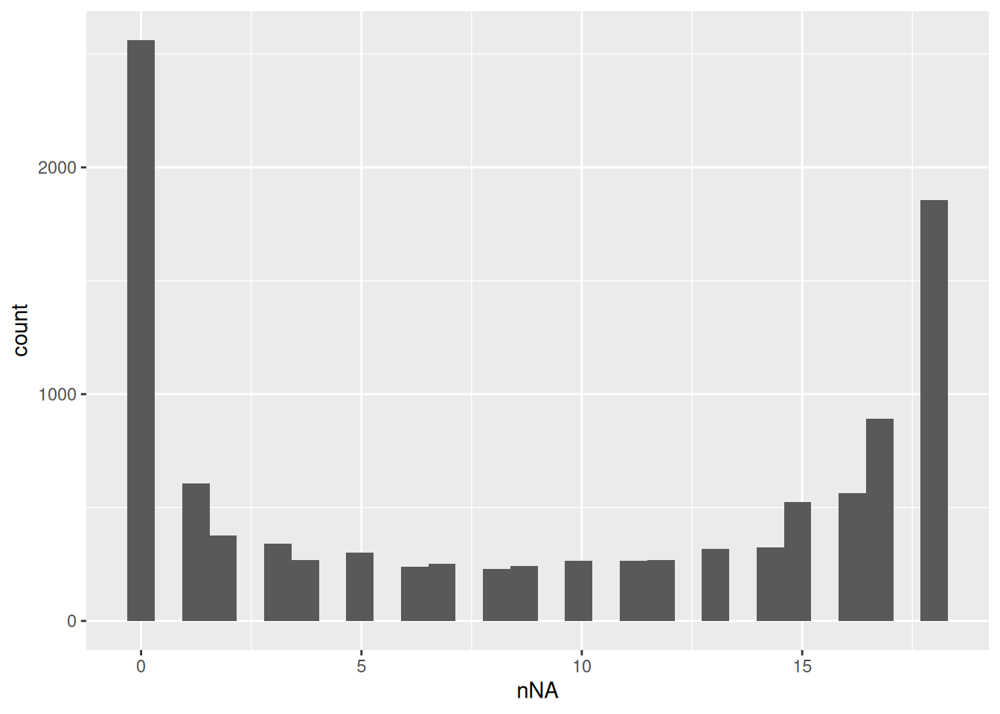
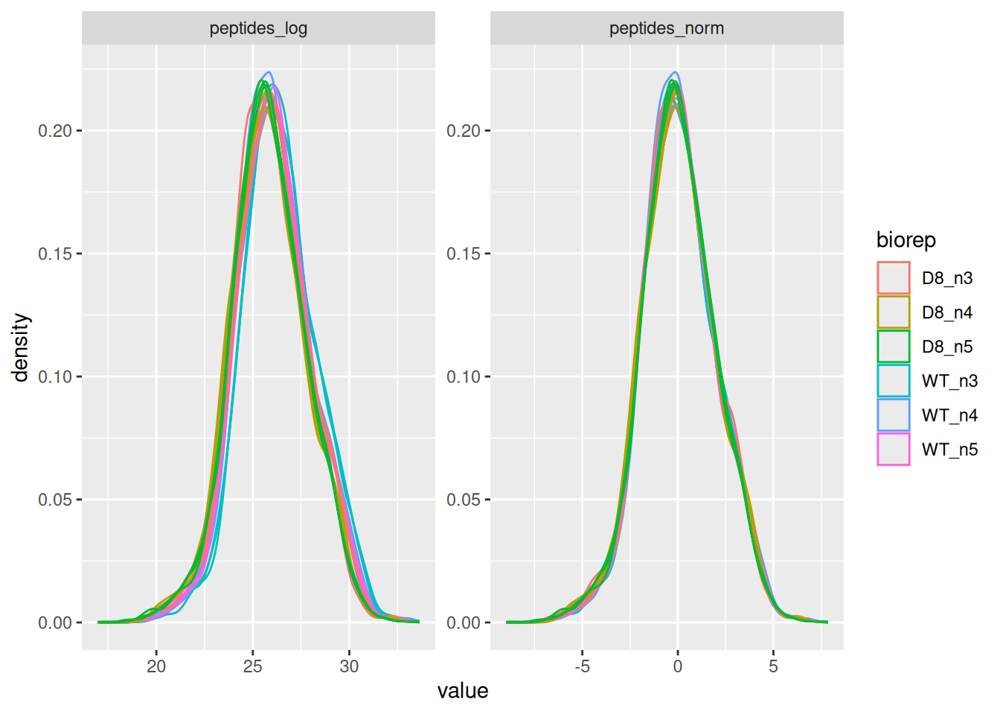
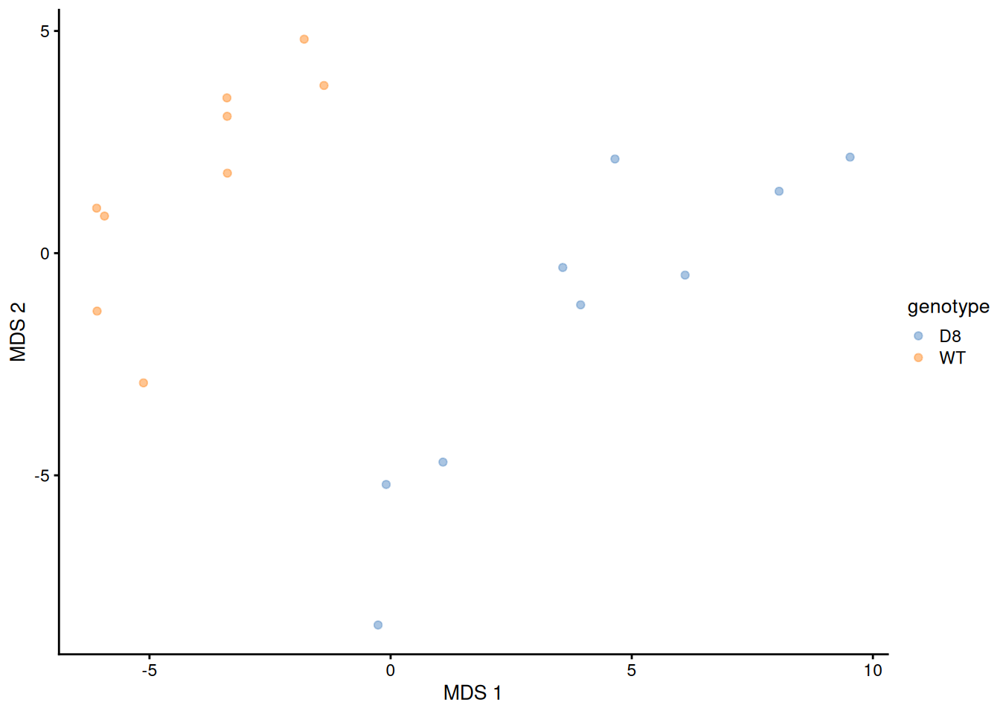
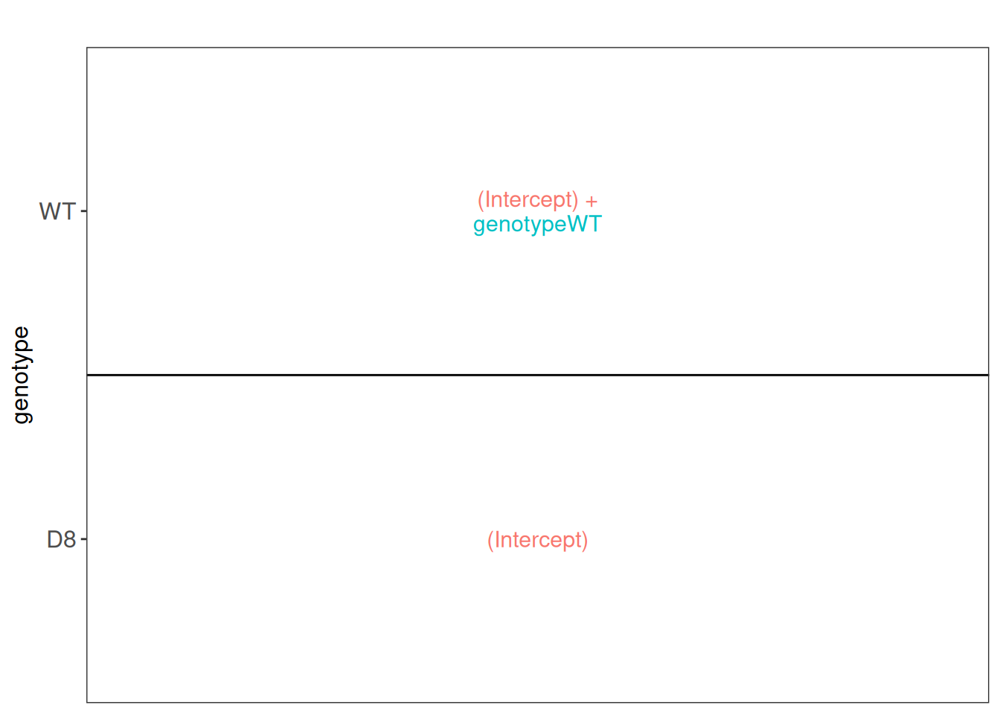
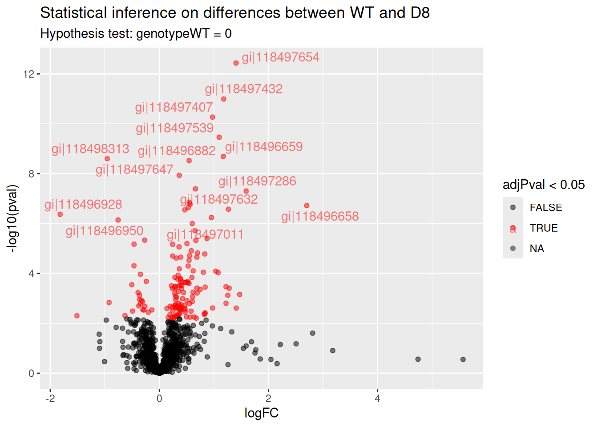
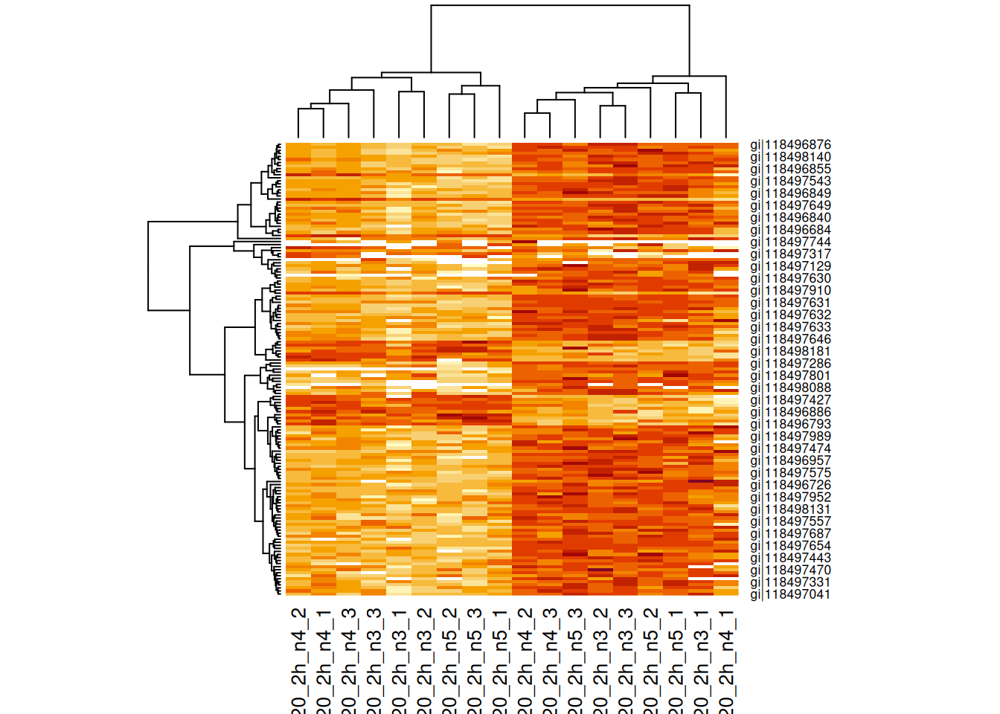
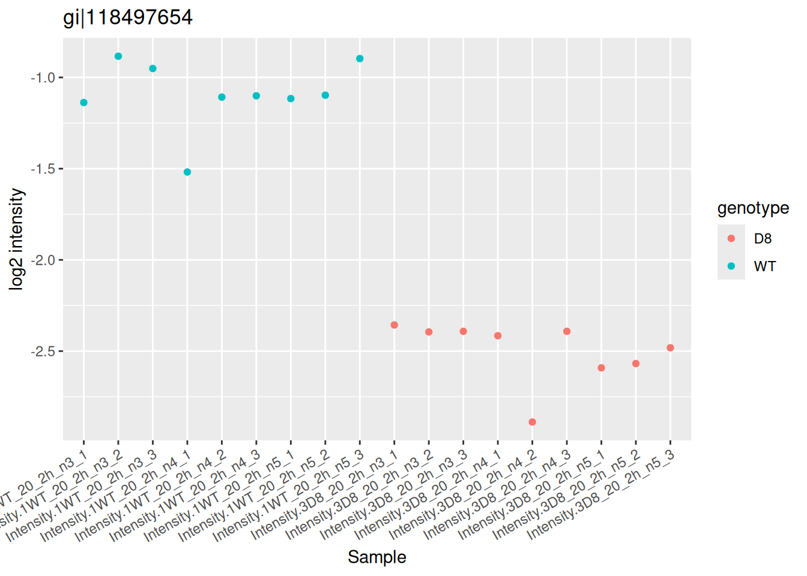

# The francisella use case: a MaxQuant LFQ dataset {#sec-francisella}


## Introduction

TODO write section

In this vignette,...

## Load packages

First, we load the `msqrob2` package.


``` r
library("msqrob2")
```

We also load 4 additional packages for data manipulation and
visualisation.


``` r
library("ggplot2")
library("ggrepel")
library("dplyr")
```

`msqrob2` relies on parallelisation to improve computational speed.
To ensure this vignette can be run regardless of hardware, we will
disable parallelisation. Parallelisation is controlled using the
`BiocParallel` package.


``` r
library("BiocParallel")
register(SerialParam())
```

## Load data

### Experimental context

A study on the facultative pathogen Francisella tularensis was
conceived by [Ramond et al.
(2015)](https://www.mcponline.org/article/S1535-9476(20)33188-1/fulltext).
F. tularensis enters the cells of its host by phagocytosis. The
authors showed that F. tularensis is arginine deficient and imports
arginine from the host cell via an arginine transporter, ArgP, in
order to efficiently escape from the phagosome and reach the cytosolic
compartment, where it can actively multiply. In their study, they
compared the proteome of wild type F. tularensis (WT) to ArgP-gene
deleted F. tularensis (knock-out, D8). For this exercise, we use a
subset of the F. tularensis dataset where bacterial cultures were
grown in biological quadruplicate and each biorep was run in technical
triplicate on a nanoRSLC-Q Exactive PLUS instrument. 

**TODO** the design mentions quadruplicates, but the vignette has triplicates

### Getting the data

The data were
searched with MaxQuant version 1.4.1.2. and are available on the PRIDE
repository:
[PXD001584](https://www.ebi.ac.uk/pride/archive/projects/PXD001584).

**TODO** put on Zenodo and use BiocFileCache

``` r
pepFile <- "../data/francisella/peptides.txt"
```

Now the files are downloaded, we can load the psm table. Each row in
the psm data table contains information for one PSM (the table below
shows the first 6 rows). Note that columns that start with
`"Abundance."` contain the quantitative values for each TMT label.


``` r
peps <- read.delim(pepFile)
quantcols <- grep("Intensity\\.", names(peps), value = TRUE)
```

|Sequence                |Amino.acid.before |First.amino.acid |Second.amino.acid |Second.last.amino.acid |Last.amino.acid |Amino.acid.after | A.Count| R.Count| N.Count| D.Count| C.Count| Q.Count| E.Count| G.Count| H.Count| I.Count| L.Count| K.Count| M.Count| F.Count| P.Count| S.Count| T.Count| W.Count| Y.Count| V.Count| U.Count| Length| Missed.cleavages|      Mass|Proteins          |Leading.razor.protein |Unique..Groups. |Unique..Proteins. |Charges |       PEP|Score  | Experiment.1WT_20_2h_n3_1| Experiment.1WT_20_2h_n3_2| Experiment.1WT_20_2h_n3_3| Experiment.1WT_20_2h_n4_1| Experiment.1WT_20_2h_n4_2| Experiment.1WT_20_2h_n4_3| Experiment.1WT_20_2h_n5_1| Experiment.1WT_20_2h_n5_2| Experiment.1WT_20_2h_n5_3| Experiment.2WT_100_2h_n3_1| Experiment.2WT_100_2h_n3_2| Experiment.2WT_100_2h_n3_3| Experiment.2WT_100_2h_n4_1| Experiment.2WT_100_2h_n4_2| Experiment.2WT_100_2h_n4_3| Experiment.2WT_100_2h_n5_1| Experiment.2WT_100_2h_n5_2| Experiment.2WT_100_2h_n5_3| Experiment.3D8_20_2h_n3_1| Experiment.3D8_20_2h_n3_2| Experiment.3D8_20_2h_n3_3| Experiment.3D8_20_2h_n4_1| Experiment.3D8_20_2h_n4_2| Experiment.3D8_20_2h_n4_3| Experiment.3D8_20_2h_n5_1| Experiment.3D8_20_2h_n5_2| Experiment.3D8_20_2h_n5_3| Experiment.3WT_20_2h_1| Experiment.3WT_20_2h_2| Experiment.3WT_20_2h_3| Experiment.4D8_100_2h_n3_1| Experiment.4D8_100_2h_n3_2| Experiment.4D8_100_2h_n3_3| Experiment.4D8_100_2h_n4_1| Experiment.4D8_100_2h_n4_2| Experiment.4D8_100_2h_n4_3| Experiment.4D8_100_2h_n5_1| Experiment.4D8_100_2h_n5_2| Experiment.4D8_100_2h_n5_3| Experiment.4WT_100_2h_1| Experiment.4WT_100_2h_2| Experiment.4WT_100_2h_3| Experiment.7D8_20_2h_1| Experiment.7D8_20_2h_2| Experiment.7D8_20_2h_3| Experiment.8D8_100_2h_1| Experiment.8D8_100_2h_2| Experiment.8D8_100_2h_3|  Intensity| Intensity.1WT_20_2h_n3_1| Intensity.1WT_20_2h_n3_2| Intensity.1WT_20_2h_n3_3| Intensity.1WT_20_2h_n4_1| Intensity.1WT_20_2h_n4_2| Intensity.1WT_20_2h_n4_3| Intensity.1WT_20_2h_n5_1| Intensity.1WT_20_2h_n5_2| Intensity.1WT_20_2h_n5_3| Intensity.2WT_100_2h_n3_1| Intensity.2WT_100_2h_n3_2| Intensity.2WT_100_2h_n3_3| Intensity.2WT_100_2h_n4_1| Intensity.2WT_100_2h_n4_2| Intensity.2WT_100_2h_n4_3| Intensity.2WT_100_2h_n5_1| Intensity.2WT_100_2h_n5_2| Intensity.2WT_100_2h_n5_3| Intensity.3D8_20_2h_n3_1| Intensity.3D8_20_2h_n3_2| Intensity.3D8_20_2h_n3_3| Intensity.3D8_20_2h_n4_1| Intensity.3D8_20_2h_n4_2| Intensity.3D8_20_2h_n4_3| Intensity.3D8_20_2h_n5_1| Intensity.3D8_20_2h_n5_2| Intensity.3D8_20_2h_n5_3| Intensity.3WT_20_2h_1| Intensity.3WT_20_2h_2| Intensity.3WT_20_2h_3| Intensity.4D8_100_2h_n3_1| Intensity.4D8_100_2h_n3_2| Intensity.4D8_100_2h_n3_3| Intensity.4D8_100_2h_n4_1| Intensity.4D8_100_2h_n4_2| Intensity.4D8_100_2h_n4_3| Intensity.4D8_100_2h_n5_1| Intensity.4D8_100_2h_n5_2| Intensity.4D8_100_2h_n5_3| Intensity.4WT_100_2h_1| Intensity.4WT_100_2h_2| Intensity.4WT_100_2h_3| Intensity.7D8_20_2h_1| Intensity.7D8_20_2h_2| Intensity.7D8_20_2h_3| Intensity.8D8_100_2h_1| Intensity.8D8_100_2h_2| Intensity.8D8_100_2h_3|Reverse |Contaminant | id|Protein.group.IDs |Mod..peptide.IDs |Evidence.IDs                                                                                                                                                             |MS.MS.IDs                                                                                                                                                                                                                                                                                                                                                       | Best.MS.MS|Oxidation..M..site.IDs |
|:-----------------------|:-----------------|:----------------|:-----------------|:----------------------|:---------------|:----------------|-------:|-------:|-------:|-------:|-------:|-------:|-------:|-------:|-------:|-------:|-------:|-------:|-------:|-------:|-------:|-------:|-------:|-------:|-------:|-------:|-------:|------:|----------------:|---------:|:-----------------|:---------------------|:---------------|:-----------------|:-------|---------:|:------|-------------------------:|-------------------------:|-------------------------:|-------------------------:|-------------------------:|-------------------------:|-------------------------:|-------------------------:|-------------------------:|--------------------------:|--------------------------:|--------------------------:|--------------------------:|--------------------------:|--------------------------:|--------------------------:|--------------------------:|--------------------------:|-------------------------:|-------------------------:|-------------------------:|-------------------------:|-------------------------:|-------------------------:|-------------------------:|-------------------------:|-------------------------:|----------------------:|----------------------:|----------------------:|--------------------------:|--------------------------:|--------------------------:|--------------------------:|--------------------------:|--------------------------:|--------------------------:|--------------------------:|--------------------------:|-----------------------:|-----------------------:|-----------------------:|----------------------:|----------------------:|----------------------:|-----------------------:|-----------------------:|-----------------------:|----------:|------------------------:|------------------------:|------------------------:|------------------------:|------------------------:|------------------------:|------------------------:|------------------------:|------------------------:|-------------------------:|-------------------------:|-------------------------:|-------------------------:|-------------------------:|-------------------------:|-------------------------:|-------------------------:|-------------------------:|------------------------:|------------------------:|------------------------:|------------------------:|------------------------:|------------------------:|------------------------:|------------------------:|------------------------:|---------------------:|---------------------:|---------------------:|-------------------------:|-------------------------:|-------------------------:|-------------------------:|-------------------------:|-------------------------:|-------------------------:|-------------------------:|-------------------------:|----------------------:|----------------------:|----------------------:|---------------------:|---------------------:|---------------------:|----------------------:|----------------------:|----------------------:|:-------|:-----------|--:|:-----------------|:----------------|:------------------------------------------------------------------------------------------------------------------------------------------------------------------------|:---------------------------------------------------------------------------------------------------------------------------------------------------------------------------------------------------------------------------------------------------------------------------------------------------------------------------------------------------------------|----------:|:----------------------|
|AAAEELDTR               |K                 |A                |A                 |T                      |R               |K                |       3|       1|       0|       1|       0|       0|       2|       0|       0|       0|       1|       0|       0|       0|       0|       0|       1|       0|       0|       0|       0|      9|                0|  974.4669|gi&#124;118497196 |gi&#124;118497196     |yes             |yes               |1,2     | 0.0001253|59.35  |                        NA|                        NA|                         1|                         1|                        NA|                         1|                        NA|                         1|                        NA|                          1|                          1|                          1|                          1|                         NA|                         NA|                          1|                         NA|                         NA|                        NA|                         1|                        NA|                        NA|                        NA|                        NA|                        NA|                        NA|                        NA|                     NA|                      1|                     NA|                          1|                         NA|                         NA|                          1|                         NA|                         NA|                         NA|                         NA|                         NA|                      NA|                      NA|                      NA|                      1|                      1|                      1|                       1|                       1|                       1| 1.3295e+09|                        0|                        0|                  9290400|                 92996000|                        0|                 98059000|                        0|                 80803000|                        0|                  77073000|                  96987000|                  88792000|                  92370000|                         0|                         0|                  64715000|                         0|                         0|                        0|                 95433000|                        0|                        0|                        0|                        0|                        0|                        0|                        0|                     0|               7130200|                     0|                  86907000|                         0|                         0|                  92052000|                         0|                         0|                         0|                         0|                         0|                      0|                      0|                      0|              80270000|              70885000|              59782000|               44146000|               46969000|               44875000|        |            |  0|419               |0                |0;1;2;3;4;5;6;7;8;9;10;11;12;13;14;15;16;17;18                                                                                                                           |0;1;2;3;4;5;6;7;8;9;10;11;12;13;14;15;16;17;18                                                                                                                                                                                                                                                                                                                  |         15|                       |
|AAAGFVITASHNK           |R                 |A                |A                 |N                      |K               |F                |       4|       0|       1|       0|       0|       0|       0|       1|       1|       1|       0|       1|       0|       1|       0|       1|       1|       0|       0|       1|       0|     13|                0| 1285.6779|gi&#124;118498194 |gi&#124;118498194     |yes             |yes               |2       | 0.0000530|45.825 |                        NA|                         1|                        NA|                        NA|                        NA|                        NA|                        NA|                         1|                         1|                         NA|                         NA|                         NA|                         NA|                         NA|                         NA|                          1|                          1|                         NA|                         1|                         1|                        NA|                         1|                         1|                         1|                         1|                        NA|                        NA|                     NA|                     NA|                     NA|                          1|                         NA|                          1|                         NA|                         NA|                         NA|                          1|                          1|                         NA|                      NA|                      NA|                      NA|                     NA|                     NA|                     NA|                      NA|                      NA|                      NA| 1.6719e+08|                        0|                 20679000|                        0|                        0|                        0|                        0|                        0|                 17358000|                 13841000|                         0|                         0|                         0|                         0|                         0|                         0|                  14142000|                  10098000|                         0|                 12278000|                 10712000|                        0|                  9500700|                 11111000|                  8723500|                  8125200|                        0|                        0|                     0|                     0|                     0|                         0|                         0|                  14059000|                         0|                         0|                         0|                   8245100|                   8318400|                         0|                      0|                      0|                      0|                     0|                     0|                     0|                      0|                      0|                      0|        |            |  1|1150              |1                |19;20;21;22;23;24;25;26;27;28;29;30;31;32;33                                                                                                                             |19;20;21;22;23;24;25;26;27;28;29;30;31;32;33                                                                                                                                                                                                                                                                                                                    |         26|                       |
|AAANEYELALAYSIEEVAPDLHK |K                 |A                |A                 |H                      |K               |Y                |       6|       0|       1|       1|       0|       0|       4|       0|       1|       1|       3|       1|       0|       0|       1|       1|       0|       0|       2|       1|       0|     23|                0| 2516.2435|gi&#124;118497331 |gi&#124;118497331     |yes             |yes               |3       | 0.0000000|84.327 |                         1|                         1|                         2|                         1|                         1|                         1|                         2|                         2|                         1|                          1|                          1|                          1|                          1|                          1|                          2|                          1|                         NA|                          1|                         1|                         2|                         1|                         1|                         1|                         1|                        NA|                         1|                         1|                      2|                     NA|                      3|                          1|                          1|                          1|                          1|                         NA|                         NA|                          1|                         NA|                          1|                       1|                       1|                      NA|                     NA|                     NA|                     NA|                      NA|                      NA|                      NA| 5.5675e+08|                 28853000|                 28091000|                 30436000|                 19476000|                 22050000|                 20687000|                 36588000|                 28654000|                  7009100|                  13881000|                  15549000|                  30239000|                  13921000|                  27386000|                  32287000|                  12201000|                         0|                  14278000|                 14174000|                  8548000|                  7859200|                 14871000|                 11690000|                  4470500|                        0|                  4048100|                  3422300|              15967000|                     0|              12772000|                   8623400|                   8716100|                  17835000|                  12707000|                         0|                         0|                  11324000|                         0|                   6540800|                4177900|                7417900|                      0|                     0|                     0|                     0|                      0|                      0|                      0|        |            |  2|513               |2                |34;35;36;37;38;39;40;41;42;43;44;45;46;47;48;49;50;51;52;53;54;55;56;57;58;59;60;61;62;63;64;65;66;67;68;69;70;71;72;73;74;75;76                                         |34;35;36;37;38;39;40;41;42;43;44;45;46;47;48;49;50;51;52;53;54;55;56;57;58;59;60;61;62;63;64;65;66;67;68;69;70;71;72;73;74;75;76;77;78;79                                                                                                                                                                                                                       |         39|                       |
|AAANNPQLEAFK            |K                 |A                |A                 |F                      |K               |K                |       4|       0|       2|       0|       0|       1|       1|       0|       0|       0|       1|       1|       0|       1|       1|       0|       0|       0|       0|       0|       0|     12|                0| 1272.6463|gi&#124;118496879 |gi&#124;118496879     |yes             |yes               |2       | 0.0000000|108.56 |                         1|                         1|                         1|                         1|                         1|                         1|                         1|                         1|                         1|                          1|                          1|                          1|                          1|                          1|                          1|                          1|                          1|                          1|                         1|                         1|                         1|                         1|                         1|                         1|                         1|                         1|                         1|                      1|                      1|                      1|                          1|                          1|                          1|                          1|                          1|                          1|                          1|                          1|                          1|                       1|                       1|                       1|                      1|                      1|                      1|                       1|                       1|                       1| 1.4830e+10|                339830000|                420390000|                393930000|                235060000|                381090000|                360270000|                255710000|                311370000|                271440000|                 331550000|                 349710000|                 357230000|                 327850000|                 361880000|                 379820000|                 237000000|                 204480000|                 211470000|                225140000|                289880000|                282500000|                209490000|                223610000|                219700000|                169120000|                178150000|                170400000|             389360000|             428050000|             405040000|                 232100000|                 358170000|                 376940000|                 319950000|                 291330000|                 362520000|                 183570000|                 198970000|                 190690000|              437080000|              411460000|              392540000|             481300000|             487260000|             453840000|              231800000|              265460000|              234340000|        |            |  3|199               |3                |77;78;79;80;81;82;83;84;85;86;87;88;89;90;91;92;93;94;95;96;97;98;99;100;101;102;103;104;105;106;107;108;109;110;111;112;113;114;115;116;117;118;119;120;121;122;123;124 |80;81;82;83;84;85;86;87;88;89;90;91;92;93;94;95;96;97;98;99;100;101;102;103;104;105;106;107;108;109;110;111;112;113;114;115;116;117;118;119;120;121;122;123;124;125;126;127;128;129;130;131;132;133;134;135;136;137;138;139;140;141;142;143;144;145;146;147;148;149;150;151;152;153;154;155;156;157;158;159;160;161;162;163;164;165;166;167;168;169;170;171;172 |        159|                       |
|AAASAGLVDEK             |K                 |A                |A                 |E                      |K               |A                |       4|       0|       0|       1|       0|       0|       1|       1|       0|       0|       1|       1|       0|       0|       0|       1|       0|       0|       0|       1|       0|     11|                0| 1030.5295|gi&#124;118497152 |gi&#124;118497152     |yes             |yes               |2       | 0.0000951|67.385 |                         1|                        NA|                         1|                         1|                         1|                        NA|                         1|                         1|                         1|                          1|                         NA|                          1|                          1|                         NA|                         NA|                         NA|                          1|                         NA|                         1|                         1|                         1|                         1|                         1|                        NA|                         1|                         1|                         1|                     NA|                     NA|                     NA|                          1|                         NA|                         NA|                          1|                         NA|                         NA|                          1|                          1|                          1|                      NA|                       1|                      NA|                      1|                      1|                      1|                       1|                       1|                       1| 4.8209e+09|                240280000|                        0|                241890000|                222250000|                189930000|                        0|                160440000|                147230000|                143340000|                 221650000|                         0|                 220950000|                 221400000|                         0|                         0|                         0|                 107540000|                         0|                135910000|                185740000|                168620000|                160240000|                158000000|                        0|                 92542000|                102350000|                100090000|                     0|                     0|                     0|                 172000000|                         0|                         0|                 160480000|                         0|                         0|                  97827000|                 107600000|                 105750000|                      0|              129440000|                      0|             163580000|             160210000|             140770000|              117920000|              126570000|              118410000|        |            |  4|388               |4                |125;126;127;128;129;130;131;132;133;134;135;136;137;138;139;140;141;142;143;144;145;146;147;148;149;150;151;152;153;154;155                                              |173;174;175;176;177;178;179;180;181;182;183;184;185;186;187;188;189;190;191;192;193;194;195;196;197;198;199;200;201;202;203                                                                                                                                                                                                                                     |        191|                       |
|AAASLDLYSYPK            |K                 |A                |A                 |P                      |K               |V                |       3|       0|       0|       1|       0|       0|       0|       0|       0|       0|       2|       1|       0|       0|       1|       2|       0|       0|       2|       0|       0|     12|                0| 1297.6554|gi&#124;118497492 |gi&#124;118497492     |yes             |yes               |2       | 0.0125630|31.675 |                        NA|                         1|                         1|                        NA|                         1|                         1|                        NA|                        NA|                        NA|                         NA|                         NA|                         NA|                         NA|                         NA|                         NA|                         NA|                         NA|                         NA|                        NA|                        NA|                        NA|                        NA|                         1|                        NA|                        NA|                        NA|                        NA|                     NA|                     NA|                     NA|                         NA|                         NA|                         NA|                         NA|                         NA|                         NA|                         NA|                         NA|                         NA|                      NA|                      NA|                      NA|                     NA|                     NA|                     NA|                      NA|                      NA|                      NA| 1.3715e+08|                        0|                 31069000|                 31448000|                        0|                 27721000|                 28657000|                        0|                        0|                        0|                         0|                         0|                         0|                         0|                         0|                         0|                         0|                         0|                         0|                        0|                        0|                        0|                        0|                 18253000|                        0|                        0|                        0|                        0|                     0|                     0|                     0|                         0|                         0|                         0|                         0|                         0|                         0|                         0|                         0|                         0|                      0|                      0|                      0|                     0|                     0|                     0|                      0|                      0|                      0|        |            |  5|624               |5                |156;157;158;159;160                                                                                                                                                      |204;205;206;207;208                                                                                                                                                                                                                                                                                                                                             |        205|                       |

We now extract the sample annotations. We will build a table where
each row in the annotation table contains information for one sample
(the table below shows the first 6 rows). This information is
extracted from the sample names.

**TODO** work on full data (20 and 100) or on subset?


``` r
coldata <- data.frame(quantCols = quantcols) |> 
  filter(grepl("_20_", quantCols) & grepl("_n\\d", quantCols)) |> 
  mutate(genotype  = substr(quantCols, 12, 13)) |> 
  mutate(biorep  = paste0(genotype, "_", substr(quantCols, 21, 22)))
```

|quantCols                |genotype |biorep |
|:------------------------|:--------|:------|
|Intensity.1WT_20_2h_n3_1 |WT       |WT_n3  |
|Intensity.1WT_20_2h_n3_2 |WT       |WT_n3  |
|Intensity.1WT_20_2h_n3_3 |WT       |WT_n3  |
|Intensity.1WT_20_2h_n4_1 |WT       |WT_n4  |
|Intensity.1WT_20_2h_n4_2 |WT       |WT_n4  |
|Intensity.1WT_20_2h_n4_3 |WT       |WT_n4  |

### The `QFeatures` data class

Finally, we combine the data into a `QFeatures` object. The
`QFeatures` package provides infrastructure to manage and analyse
quantitative features from mass spectrometry experiments. The
`readQFeatures()` allows for seamless conversion of tabular data into
a `QFeatures` object. The `quantCols` column in the annotation will be
used to link the annotations with the quantitative columns of the
peptide data. See `?readQFeatures()` for more details.


``` r
pe <- readQFeatures(
  peps, colData = coldata, fnames = "Sequence", name = "peptides"
)
```

Peptides with zero intensities are missing peptides and should be
represent with a `NA` value rather than `0`.


``` r
pe <- zeroIsNA(pe, "peptides") # convert 0 to NA
```

We calculate how many non zero intensities we have per peptide and
this is often useful for filtering.


``` r
naResults <- nNA(pe, "peptides")
data.frame(naResults$nNArows) |> 
  ggplot() +
  aes(x = nNA) +
  geom_histogram()
```



Because every biorep is assessed in technical triplicate, we will also
calculate the number of biorepeats in which each peptide is observed.

**TODO** make a function for this?


``` r
rowData(pe[["peptides"]])$nNonZeroBiorep <- apply(
  assay(pe[["peptides"]]), 1, function(intensity)
    pe$biorep[intensity > 0] |> 
    unique() |> 
    length()
)
```

## Data preprocessing

`msqrob2` relies on the `QFeatures` data structure, meaning that we
can directly make use of `QFeatures`' data preprocessing functionality
(see also the `QFeatures`
[documentation](https://rformassspectrometry.github.io/QFeatures/articles/Processing.html)).

### PSM filtering

We filter features based on 3 criteria.

1. Handling overlapping protein groups

In our approach a peptide can map to multiple proteins, as long as
there is none of these proteins present in a smaller subgroup. We use
`filterFeatures()` to perform the filtering. It uses information from
the `rowData` (here the `Proteins` column) and a formula to generate a
filter for each feature (row) in each set across the object. If the
filter returns `TRUE`, the corresponding row is retained, otherwise it
is removed. In this case, we build a filter that only keeps the
protein groups for which none of its member proteins is present in a
smaller protein group.


``` r
pe <- filterFeatures(pe,
  ~ Proteins %in% smallestUniqueGroups(Proteins)
)
```

2. Remove reverse sequences (decoys) and contaminants

We now remove the contaminants and peptides that map to decoy 
sequences. These features bear no information of interest and will
reduce the statistical power upon multiple test adjustment.


``` r
pe <- filterFeatures(pe, ~ Reverse != "+" & Contaminant != "+")
```

3. Drop peptides that were only identified in a single biorepeat

Note, that in experiments without technical repeats we filter on the
number of samples in which a peptide is picked up (this is typically 
performed using `filterNA()`). Here, we will require that a peptide is
picked up in at least two biorepeats. We already computed the number
of biorepeats that were observed for each peptide (that is the number
of biorepeats that contain at least one observed value).


``` r
(pe <- filterFeatures(pe, ~ nNonZeroBiorep >= 2))
```

```
## An instance of class QFeatures (type: bulk) with 1 set:
## 
##  [1] peptides: SummarizedExperiment with 8640 rows and 18 columns
```

We keep 8640 peptides upon filtering.

### Preprocessing workflow

We can now prepare the data for modelling. The workflow ensures the
data complies to `msqrob2`'s requirements:

1. Intensities are log-transformed.


``` r
pe <- logTransform(pe, base = 2, i = "peptides", name = "peptides_log")
```

2. Samples are normalised by substracting the sample median from every
   intensity for peptide $p$  in a sample $i$. $y_{ip}^\text{norm} =
   y_{ip} - \hat\mu_i$, with $\hat\mu_i$ the median intensity over all
   observed peptides in sample $i$.


``` r
pe <- normalize(
  pe, i = "peptides_log", name = "peptides_norm", method = "center.median"
)
```

Upon the normalisation the density curves should be nicely centred. To
confirm this, we will plot the intensity distributions for each
biorepeat (mouse). `longForm()` seamlessly combines the quantification
and annotation data into a table suitable for `ggplot2` visualisation.
We also subset the object with the data before and after normalisation.


``` r
longForm(pe[, , c("peptides_log", "peptides_norm")], colvar = "biorep") |> 
  ggplot() +
  aes(x = value, group = colname, color = biorep) +
  geom_density() +
  facet_wrap(~ assay, scale = "free")
```



3. Summarisation to protein level. We use the robust summary approach 
   to infer protein-level data from peptide-level data, accounting for
   the fact that different peptides have ionisation efficiencies hence
   leading to different intensity baselines. This effect can be
   ignored if the same set of peptides were measured across all
   samples, but this is often not the case, leading to biased
   estimates. Moreover, our approach also uses a robust estimation to
   avoid that outliers distort the summaries.


``` r
pe <- aggregateFeatures(
  pe, i = "peptides_norm", fcol = "Proteins", 
  fun = MsCoreUtils::robustSummary, na.rm = TRUE, name = "proteins"
)
```

## Statistical modelling

The preprocessed data can now be modelled to answer biologically
relevant questions. First, we will explore the data. 

### Data exploration

Data exploration aims to highlight the sources of variation in the
data prior to data modelling and can pinpoint to outlying or
off-behaving samples. A common approach for data exploration is to
perform Multi Dimensional Scaling (MDS). We will first extract the set
to explore using `getWithColData()`. This function extracts the set of
interest along with all the associated sample annotations (used for
plot colouring).


``` r
se <- getWithColData(pe, "proteins")
```

We then use the `scater` package to compute and plot the PCA. For
technical reasons, it requires `SingleCellExperiment` class object,
but these can easily be generated from a `SummarizedExperiment`
object.


``` r
library("scater")
se <- runMDS(as(se, "SingleCellExperiment"), exprs_values = 1)
plotMDS(se, colour_by = "genotype")
```


Note that the samples upon robust summarisation show a clear
separation according to the genotype in the first dimension of the MDS
plot.

### Model definition

#### Experimental design

As described above, samples (bacterial cultures) originate from either
a wildtype (WT) or a ArgP knockout (D8). Each genotype was cultured in
biological triplicate. Each biological triplicate was acquired in
technical triplicate, leading to $2 \times 3 \times 3 = 18$ samples.
In this context, we are interested in the effects of genotype on the
protein abundances. 

The table below confirms we have a balanced design
for each condition and biological triplicate.


``` r
table(genotype = pe$genotype, biorep = pe$biorep)
```

```
##         biorep
## genotype D8_n3 D8_n4 D8_n5 WT_n3 WT_n4 WT_n5
##       D8     3     3     3     0     0     0
##       WT     0     0     0     3     3     3
```

### Sources of variation

We will model two sources of variation:

1. **Genotype**: we model the source of variation induced by the
   experimental group of interest as a **fixed effect**. Fixed effects
   are effect that are considered non-random, i.e. the treatment
   effect is assumed to be the same and reproducible across repeated
   experiments, but it is unknown and has to be estimated. We will
   include `genotype` as a fixed effect that models the fact that a
   change in genotype can induce changes in protein abundance.

2. **Biological replicate effect**: the experiment involves biological
   replication as the bacterial cultures are repeated. Replicate-specific
   effects occurs due to uncontrollable factors, such as variation in
   the number of bacterium seeded, position in the incubator,
   transient contamination,... Two bacterial cultures will never
   provide exactly the same sample material. These effects are typically
   modelled as random effects which are considered as a random sample
   from the population of all possible mice and are assumed to be
   i.i.d normally distributed with mean 0 and constant variance,
   $u_{biorep} \sim
   N(0,\sigma^{2,\text{biorep}})$. The use of random effects thus
   models the correlation in the data, explicitly. We expect that
   intensities from the same bacterial culture are more alike than 
   intensities between cultures.

We model the protein level expression values using `msqrob2`.
`msqrob2` workflows rely on linear mixed models, which are models that
can estimate and predict fixed and random effects, respectively. The
fixed effect are estimated using robust regression to avoid that
outliers distort the statistical outcome.

Now we have identified the sources of variation in the experiment, we
can define a model. 


``` r
model <- ~ genotype + ## (1) fixed effect for genotype
  (1 | biorep)  ## (2) random effect for biological replicate (culture)
```

We can run the `msqrob2` statistical workflow.

### Run the model

The statistical workflow starts with `msqrob()`. The function takes
the `QFeatures` object, extracts the quantitative values from the
`proteins` set generated after preprocessing, and fits `model`. The
variables defined in `model` are automatically retrieved from the
`colData` (i.e. `"genotype"`, and `"biorep"`). Upon modelling, the
function return the `Qfeatures` object containing the modelling
output, stored in the `rowData` (by default, the new column is called
`msqrobModels`). More specifically, the modelling output is stored in
the `rowData` as a `statModel` object, one model per row (protein). We
also enable M-estimation (`robust = TRUE`) for improved robustness
against outliers. Note, that `msqrob2` also features ridge regression
for fixed effects. Ridge regression stabilises the parameter
estimation in case where the number of parameters are close to the
number of available samples. In this case, the genotype factor only
has 2 levels (WT and D8), so ridge regression is irrelevant in this
context. We will therefore leave the ridge regression disabled
(default).


``` r
pe <- msqrob(pe, i = "proteins", formula = model, robust = TRUE)
```

Once the models are estimated, we can start answering biological
questions.

### Hypothesis testing

We must now convert the biological question "does the bacterial
genotype affect the protein intensities?" into a statistical
hypothesis. In other words, we must convert
this question in a combination of the model parameters, also referred
to as a contrast. To aid defining contrasts, we will visualise the
experimental design using the `ExploreModelMatrix` package. Since we
are not interested in technical effects, we will only focus on the
variable of interest, here `genotype`.


``` r
library("ExploreModelMatrix")
vd <- VisualizeDesign(
    sampleData =  colData(pe),
    designFormula = ~ genotype,
    textSizeFitted = 4
)
vd$plotlist
```

```
## [[1]]
```



This plot shows that the average protein intensity for the D8 group is
estimated by `(Intercept)`, and the the average protein intensity for
the WT group is estimated by `(Intercept) + genotypeWT`. These values
can get be retrieved from the `rowData`, here showing an example for
the first protein:


``` r
getCoef(rowData(pe)[["proteins"]]$msqrobModels[[1]])
```

```
##            (Intercept)             genotypeWT (Intercept)biorepD8_n3 
##          -1.0183363539           0.1178423141          -0.0219907924 
## (Intercept)biorepD8_n4 (Intercept)biorepD8_n5 (Intercept)biorepWT_n3 
##           0.0407303948          -0.0187396024          -0.0003158213 
## (Intercept)biorepWT_n4 (Intercept)biorepWT_n5 
##          -0.0196435972           0.0199594185
```

Note that additionnal intercepts are printed, one for each level of
the random effect.

Assessing the difference between the WT and D8 groups boils down to 
`(Intercept) + genotypeWT - (Intercept)`, which simplifies to the
`genotypeWT` parameters:


``` r
contrast <- "genotypeWT"
```

We can further specify the null hypothesis, that is we are interest
whether the differences between the two groups is different from zero.


``` r
(hypothesis <- paste(contrast, "= 0"))
```

```
## [1] "genotypeWT = 0"
```

We next use `makeContrast()` to build a contrast matrix.


``` r
(L <- makeContrast(hypothesis, parameterNames = "genotypeWT"))
```

```
##            genotypeWT
## genotypeWT          1
```

In this case, the contrast matrix is trivial, but for more complex
design, it becomes a matrix with parameter names as rows and
hypotheses in columns (you can specify multiple hypotheses).

We can now test our null hypothesis using `hypothesisTest()` which
takes the `QFeatures` object with the fitted model and the contrast
matrix we just built. Again, the results are stored in the set
containing the model, here `proteins`.


``` r
pe <- hypothesisTest(pe, i = "proteins", contrast = L)
```

Let us retrieve the result table from the `rowData`. Note that the
model column is named after the column name (here `genotypeWT`) of the
contrast matrix `L`.


``` r
inference <- rowData(pe[["proteins"]])[[colnames(L)]]
inference$Protein <- rownames(inference)
head(inference)
```

```
##                   logFC         se       df         t         pval      adjPval
## gi|118496616 0.11784231 0.05986775 16.37914 1.9683773 6.618849e-02 0.2289531725
## gi|118496617 0.01583769 0.07893303 17.99716 0.2006472 8.432245e-01 0.9374721247
## gi|118496621 0.66085954 0.26954611 12.99716 2.4517495 2.912069e-02 0.1283594396
## gi|118496635 0.24384779 0.03838535 17.21457 6.3526263 6.804599e-06 0.0002832729
## gi|118496636 0.17315742 0.06042136 16.03249 2.8658310 1.119025e-02 0.0706619984
## gi|118496637 0.35403038 0.09239590 15.22182 3.8316675 1.595094e-03 0.0187831770
##                   Protein
## gi|118496616 gi|118496616
## gi|118496617 gi|118496617
## gi|118496621 gi|118496621
## gi|118496635 gi|118496635
## gi|118496636 gi|118496636
## gi|118496637 gi|118496637
```

`msqrob2` automatically applied the hypothesis testing to all proteins
in the data. Notice that some rows contain missing values. Notice that
some rows contain missing values. This is because data modelling
resulted in a `fitError` for some proteins, probably because not
enough data was available for model fitting due to missing values in
the quantitative data.

### Plots

We will now demonstrate how to visualise the results upon modelling
and hypothesis testing.

#### Volcano-plot

Volcano plots are straightforward to generate from the inference table
above. We also use `ggrepel` to annotate the 20 most significant 
proteins.


``` r
ggplot(inference) +
  aes(x = logFC, y = -log10(pval), color = adjPval < 0.05) +
  geom_point() +
  geom_text_repel(data = slice_min(inference, adjPval, n = 20),
                  aes(label = Protein)) +
  scale_color_manual(values = alpha(c("black", "red"), 0.5)) + 
  ggtitle("Statistical inference on differences between WT and D8",
          paste("Hypothesis test:", colnames(L), "= 0"))
```



Note, that 149 proteins
are found to be differentially abundant.

#### Heatmap

We can also build a heatmap for the significant proteins which are
obtained by filtering the inference table.

**TODO** use ComplexHeatmap for adding annotations? 


``` r
sigNames <- inference |> 
  filter(!is.na(adjPval), adjPval < 0.05) |> 
  pull()
heatmap(assay(pe[["proteins"]])[sigNames, ])
```



#### Detail plots

Let us visualise the most significant protein. We perform this with a
little data manipulation pipeline:

1. Identify the target protein with largest logFC.
2. We use the `QFeatures` subsetting functionality to retrieve all
   data related to the target protein, focusing on the `proteins`
   set that contains the preprocessed data used for modelling.
3. We use `longForm()` to convert the object into a table suitable
   for plotting.
4. We remove missing values for plotting.
5. Plot the data with `ggplot2`.


``` r
targetProtein <- rownames(inference)[which.min(inference$adjPval)] #1
pe[targetProtein, , "proteins"] |> #2
  longForm(colvars = "genotype") |>  #3
  data.frame() |>
  filter(!is.na(value)) |> #4
  ggplot() + #5
  aes(x = colname,
      y = value) +
  geom_point(aes(colour = genotype)) +
  labs(x = "Sample", y = "log2 intensity") +
  ggtitle(targetProtein) +
  theme(axis.text.x = element_text(angle = 30, hjust = 1))
```



**TODO** include peptide workflow as well? add one line that quickly shows how to perform it.

## Conclusion

**TODO**

## License

This vignette is distributed under a
[Artistic-2.0](https://opensource.org/license/artistic-2-0) license.

## Session Info


``` r
sessionInfo()
```

```
## R version 4.5.1 (2025-06-13)
## Platform: x86_64-pc-linux-gnu
## Running under: Ubuntu 24.04.3 LTS
## 
## Matrix products: default
## BLAS:   /usr/lib/x86_64-linux-gnu/blas/libblas.so.3.12.0 
## LAPACK: /usr/lib/x86_64-linux-gnu/lapack/liblapack.so.3.12.0  LAPACK version 3.12.0
## 
## locale:
##  [1] LC_CTYPE=en_US.UTF-8       LC_NUMERIC=C              
##  [3] LC_TIME=en_US.UTF-8        LC_COLLATE=en_US.UTF-8    
##  [5] LC_MONETARY=en_US.UTF-8    LC_MESSAGES=en_US.UTF-8   
##  [7] LC_PAPER=en_US.UTF-8       LC_NAME=C                 
##  [9] LC_ADDRESS=C               LC_TELEPHONE=C            
## [11] LC_MEASUREMENT=en_US.UTF-8 LC_IDENTIFICATION=C       
## 
## time zone: Europe/Brussels
## tzcode source: system (glibc)
## 
## attached base packages:
## [1] stats4    stats     graphics  grDevices utils     datasets  methods  
## [8] base     
## 
## other attached packages:
##  [1] ExploreModelMatrix_1.21.0   scater_1.37.0              
##  [3] scuttle_1.19.0              SingleCellExperiment_1.31.0
##  [5] BiocParallel_1.43.0         dplyr_1.1.4                
##  [7] ggrepel_0.9.6               ggplot2_3.5.2              
##  [9] msqrob2_1.17.1              QFeatures_1.19.3           
## [11] MultiAssayExperiment_1.35.1 SummarizedExperiment_1.39.0
## [13] Biobase_2.69.0              GenomicRanges_1.61.0       
## [15] GenomeInfoDb_1.45.3         IRanges_2.43.0             
## [17] S4Vectors_0.47.0            BiocGenerics_0.55.0        
## [19] generics_0.1.3              MatrixGenerics_1.21.0      
## [21] matrixStats_1.5.0          
## 
## loaded via a namespace (and not attached):
##   [1] Rdpack_2.6.4            gridExtra_2.3           rlang_1.1.6            
##   [4] magrittr_2.0.3          shinydashboard_0.7.3    clue_0.3-66            
##   [7] compiler_4.5.1          vctrs_0.6.5             reshape2_1.4.4         
##  [10] stringr_1.5.1           ProtGenerics_1.41.0     pkgconfig_2.0.3        
##  [13] crayon_1.5.3            fastmap_1.2.0           XVector_0.49.0         
##  [16] labeling_0.4.3          promises_1.3.2          rmarkdown_2.29         
##  [19] UCSC.utils_1.5.0        nloptr_2.2.1            ggbeeswarm_0.7.2       
##  [22] purrr_1.0.4             xfun_0.52               cachem_1.1.0           
##  [25] beachmat_2.25.0         jsonlite_2.0.0          later_1.4.2            
##  [28] DelayedArray_0.35.1     irlba_2.3.5.1           parallel_4.5.1         
##  [31] cluster_2.1.8.1         R6_2.6.1                bslib_0.9.0            
##  [34] stringi_1.8.7           RColorBrewer_1.1-3      limma_3.65.0           
##  [37] boot_1.3-31             jquerylib_0.1.4         Rcpp_1.0.14            
##  [40] bookdown_0.44           knitr_1.50              BiocBaseUtils_1.11.0   
##  [43] httpuv_1.6.16           Matrix_1.7-3            splines_4.5.1          
##  [46] igraph_2.1.4            tidyselect_1.2.1        rstudioapi_0.17.1      
##  [49] abind_1.4-8             yaml_2.3.10             viridis_0.6.5          
##  [52] codetools_0.2-20        lattice_0.22-7          tibble_3.2.1           
##  [55] plyr_1.8.9              shiny_1.10.0            withr_3.0.2            
##  [58] evaluate_1.0.3          xml2_1.3.8              pillar_1.10.2          
##  [61] DT_0.33                 shinyjs_2.1.0           reformulas_0.4.1       
##  [64] scales_1.4.0            minqa_1.2.8             xtable_1.8-4           
##  [67] glue_1.8.0              lazyeval_0.2.2          tools_4.5.1            
##  [70] BiocNeighbors_2.3.0     lme4_1.1-37             ScaledMatrix_1.17.0    
##  [73] cowplot_1.1.3           grid_4.5.1              tidyr_1.3.1            
##  [76] rbibutils_2.3           msmbstyle_0.0.22        MsCoreUtils_1.21.0     
##  [79] nlme_3.1-168            beeswarm_0.4.0          BiocSingular_1.25.0    
##  [82] vipor_0.4.7             cli_3.6.5               rsvd_1.0.5             
##  [85] viridisLite_0.4.2       S4Arrays_1.9.0          AnnotationFilter_1.33.0
##  [88] gtable_0.3.6            rintrojs_0.3.4          sass_0.4.10            
##  [91] digest_0.6.37           SparseArray_1.9.0       htmlwidgets_1.6.4      
##  [94] farver_2.1.2            htmltools_0.5.8.1       lifecycle_1.0.4        
##  [97] httr_1.4.7              mime_0.13               statmod_1.5.0          
## [100] MASS_7.3-65
```


## References
