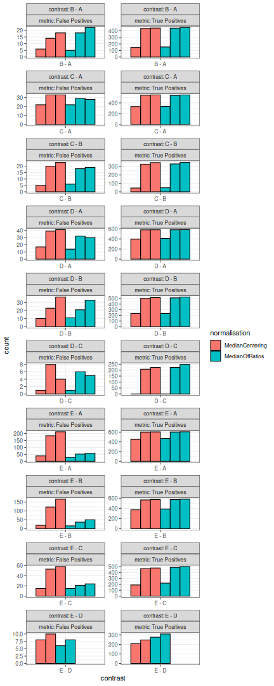
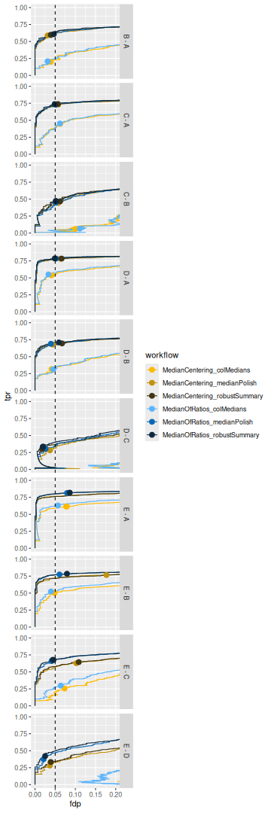
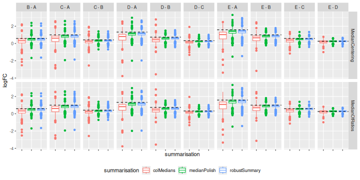

# Optimisation of a data analysis workflow{#sec-worflow_optimisation}


In the previous chapter we have seen how to benchmark the data
analysis performance when starting from different types of data. This
chapter presents how to assess the impact of different methods for the
same sequence of steps on the same data, effectively optimising the
workflow.

To illustrate the approach, we will again use the data set by
[@Shen2018-gw], a spike-in data set with known ground truth. The
optimisation focuses on two steps: we will explore different methods
for normalisation and summarisation.

**Important**: the first sections of the chapter are again meant for 
advanced users that are familiar with R scripting. Novice users
interested in the key messages and best practices can refer to the 
[take home message section](#sec-take_home).

## Load packages

We load the `msqrob2` package, along with additional packages for data
manipulation and visualisation.


``` r
library("msqrob2")
library("data.table")
library("dplyr")
library("tidyr")
library("ggplot2")
library("patchwork")
library("tidyverse")
```

We also configure the [parallelisation](#sec-parallel) framework.


``` r
library("BiocParallel")
register(SerialParam())
```

## Data

We will reuse the data by [@Shen2018-gw] as in chapter
\@ref(sec-basics) and \@ref(sec-benchmarking). The
[data](#sec-ecoli_data) were reanalysed using MaxQuant, and we will
use start from the evidence file as suggested in the [previous
chapter](#sec-benchmarking).

### PSM table

We here retrieve the evidence file containig the [PSM
table](#sec-psm_table).

**TODO**: put data on Zenodo or MsDataHub, and update code below


``` r
# myurl <- "https://github.com/statOmics/MSqRobSumPaper/raw/refs/heads/master/spikein/data/maxquant/evidence.zip"
# download.file(myurl,"data/sticker2020/evidence.zip", method = "curl", extra = "-L")
# unzip("data/sticker2020/evidence.zip", exdir = "data/sticker2020/")
evidenceFile <- "data/sticker2020/evidence.txt"
```

We also load the [annotation table](#sec-annotation_table)) that has
been generated by the authors. Since the evidence, peptides and
protein-groups tables all contain the same samples, the annotation
table will be shared across the MaxQuant data tables.


``` r
annotFile <- "data/sticker2020/sticker2020_annotation.csv"
coldata <- read.csv(annotFile)
```

We retrieve all the E. coli protein identifiers to later identify
which proteins are known to be differentially abundant (E. coli
proteins) or constant (human) across condition.


``` r
library("BiocFileCache")
bfc <- BiocFileCache()
ecoli <- bfcrpath(bfc, "https://raw.githubusercontent.com/statOmics/MSqRobSumPaper/refs/heads/master/spikein/data/fasta/ecoli_up000000625_7_06_2018.fasta")
ecoli <- readLines(ecoli)
ecoli <- ecoli[grepl("^>", ecoli)]
ecoli <- gsub(">sp\\|(.*)\\|.*", "\\1", ecoli)
```

### Convert to QFeatures

We combine the evidence file with the annotation table into a 
[`QFeatures` object](#sec-qfeatures).


``` r
spikein <- fread(evidenceFile, check.names = TRUE)
coldata$runCol <- coldata$Raw.file
(spikein <- readQFeatures(
    spikein, colData = coldata, runCol = "Raw.file", 
    quantCols = "Intensity"
))
```

```
## An instance of class QFeatures (type: bulk) with 20 sets:
## 
##  [1] B03_02_150304_human_ecoli_B_3ul_3um_column_95_HCD_OT_2hrs_30B_9B: SummarizedExperiment with 40057 rows and 1 columns 
##  [2] B03_03_150304_human_ecoli_C_3ul_3um_column_95_HCD_OT_2hrs_30B_9B: SummarizedExperiment with 41266 rows and 1 columns 
##  [3] B03_04_150304_human_ecoli_D_3ul_3um_column_95_HCD_OT_2hrs_30B_9B: SummarizedExperiment with 41396 rows and 1 columns 
##  ...
##  [18] B03_19_150304_human_ecoli_B_3ul_3um_column_95_HCD_OT_2hrs_30B_9B: SummarizedExperiment with 39388 rows and 1 columns 
##  [19] B03_20_150304_human_ecoli_A_3ul_3um_column_95_HCD_OT_2hrs_30B_9B: SummarizedExperiment with 39000 rows and 1 columns 
##  [20] B03_21_150304_human_ecoli_A_3ul_3um_column_95_HCD_OT_2hrs_30B_9B: SummarizedExperiment with 38783 rows and 1 columns
```

We now have a `QFeatures` object with 20 sets, as many as the number
of MS runs. We cannot yet join the sets together since we don't have a
specific feature identifier and the data does not fullfill to the
modelling assumptions, yet. We will therefore preprocess the data 
first.

## Data preprocessing{#sec-basic_preprocess}

We will follow the same data [preprocessing
workflow]({#sec-preprocess_evidence}) as in the previous chapter. We
will however explore different normalisation strategies and
summarisation methods.

1. Encoding missing values as zeros.


``` r
spikein <- zeroIsNA(spikein, names(spikein))
```

2. Log2 transforming


``` r
inputNames <- names(spikein)
logNames <- paste0(inputNames, "_log")
spikein <- logTransform(spikein, inputNames, name = logNames, base = 2)
```

3. Keeping only the most intense PSM per ion (see 
   [here](#sec-duplicated_psms) for a step-by-step explanation of the
   code). Upon this filtering every feature is unique to a ion
   identifier (peptide sequence + charge), and we hence can join sets
   using that identifier.


``` r
for (i in logNames) {
  rowdata <- rowData(spikein[[i]]) 
  rowdata$ionID <- paste0(rowdata$Sequence, rowdata$Charge) 
  rowdata$value <- assay(spikein[[i]])[, 1]
  rowdata <- data.frame(rowdata) |>
    group_by(ionID) |>
    mutate(psmRank = rank(-value))
  rowData(spikein[[i]])$psmRank <- rowdata$psmRank
  rowData(spikein[[i]])$ionID <- rowdata$ionID
}
spikein <- filterFeatures(spikein, ~ psmRank == 1, keep = TRUE)
spikein <- joinAssays(spikein, logNames, "ions_log", "ionID")
```

4. Feature filtering


``` r
spikein <- filterFeatures(
        spikein, ~ Proteins != "" & ## Remove failed protein inference
          !grepl(";", Proteins) & ## Remove protein groups
          Reverse != "+" & ## Remove decoys
          (Potential.contaminant != "+") ## Remove contaminants
)
```

5. Missing value filtering


``` r
n <- ncol(spikein[["ions_log"]])
spikein <- filterNA(spikein, i = "ions_log", pNA = (n - 4) / n)
```

### Explore normalisation methods

[Remember](#sec-norm) that normalisation aims to correct for
systematic fluctuations across samples, as illustrated by plotting the
intensity distribution for each sample. The method applies the
following operation on each sample $i$ across all PSMs $p$:

$$
y_{ip}^{\text{norm}} = y_{ip} - \hat{\mu}_i
$$

with $\mathbf{y}$ the log intensities and \hat{\mu}_i$ the norm
factor.

We previously showed that the [Median of Ratios](#sec-norm)
(popularized by DESeq2) method could (partly) correct for these
systematic fluctuations. We abbreviate this method as the MedianOfRatios method.
The norm factor used by MedianOfRatios is estimated as follows:

$$
\hat{\mu}^\text{MedianOfRatios}_i = \text{median}(y_{i\cdot} - \frac{1}{n}\sum\limits_{i = 1}^ny_{i\cdot})
$$ 

We create a new set called `ions_norm_MedianOfRatios` that contains the
values normalised by MedianOfRatios.


``` r
pseudoRef <- rowMeans(assay(spikein[["ions_log"]]), na.rm = TRUE)
nfLog <- sweep(assay(spikein[["ions_log"]]), MARGIN = 1, pseudoRef) |> 
  colMedians(na.rm = TRUE)
spikein <- sweep(
  spikein, MARGIN = 2, STATS = nfLog, 
  i = "ions_log", name = "ions_norm_MedianOfRatios"
)
```

However, other methods exist, median centering being the most popular.
Median centering normalisation subtracts the median intensity of each
sample from all its measurements. A key assumption for this method is
that the majority of proteins are not differentially abundant. We
abbreviate this method as the MedianCentering method. The norm factor used by MedianOfRatios
is estimated as follows:

$$
\hat{\mu}^\text{MedianCentering}_i = \text{median}(y_{i\cdot})
$$

We create a new set called `ions_norm_MedianCentering` that contains the
values normalised by MedianCentering.


``` r
spikein <- normalize(
  spikein, method = "center.median", i = "ions_log", 
  name = "ions_norm_MedianCentering"
)
```

We visually explore the impact of the normalisation methods on the
intensity distribution for each sample.


``` r
longForm(
  spikein[, , c("ions_norm_MedianOfRatios", "ions_norm_MedianCentering")],
  colvars = c("Concentration", "Condition")
) |>
  data.frame() |> 
  mutate(normalisation = sub("ions_norm_", "", assay)) |>
  ggplot() +
  aes(x = value,
      colour = Condition,
      group = colname) +
  geom_density() +
  facet_grid(~ normalisation, scales = "free") +
  labs(title = "Intensity distribution for all samples",
       subtitle = "After normalisation")
```


Both the median centering and median or ratio normalisation achieve
similar alignment of the intensity distributions. Although they appear
visually similar, we will see later that they can lead to different
results in statistical inference. 

Notice that the `QFeatures` object contains two diverging assays, one
for each normalisation method.


``` r
plot(spikein, interactive = TRUE)
```

```
## Error in loadNamespace(name): there is no package called 'webshot'
```


### Explore summarisation methods

With the data normalised, the next step is to
[summarise](#sec-summarisation) ion-level intensities to obtain
protein-level expression values. In this chapter, we will compare 
three summarisation methods:

- **Robust summarisation** [@Sticker2020-rl], as we described in a 
  [previous chapter](#sec-summarisation). 
- **Median summarisation**, which calculates the median of the 
  log-transformed intensities of all peptides belonging to a protein 
  for each sample separately. While robust to outliers, it can be 
  heavily influenced by inconsistent peptide identification across 
  samples.
- **Median polish summarisation**, a non-parametric iterative method 
  that decomposes the peptide-by-sample intensity matrix into peptide
  effects (rows) and sample effects (columns). The resulting column
  effects are used as the summarised protein abundances. It is robust
  and much faster than model-based approaches.

All these summarisation methods are available in `MsCoreUtils` and can
be integrated feeded to `QFeatures`.


``` r
library("MsCoreUtils")
summMethods <- c(
  robustSummary = MsCoreUtils::robustSummary, 
  colMedians = colMedians, 
  medianPolish = MsCoreUtils::medianPolish
)
```

We will therefore create a loop that iterates over the normalised data
sets and over the summarisation methods.


``` r
for (i in c("ions_norm_MedianOfRatios", "ions_norm_MedianCentering")) {
  for (j in names(summMethods)) {
    newSet <- paste0("proteins_", sub("ions_norm_", "", i), "_", j)
    spikein <- aggregateFeatures(
      spikein, i = i, 
      name = newSet,
      fcol = "Proteins", 
      fun = summMethods[[j]],
      na.rm = TRUE
    )
  }
}
```

The data processing is now complete. The `QFeatures` object now
contains a workflow of assays, from input PSMs to normalised and
summarised proteins. The data set contains 2 sets obtained using 2
normalisation methods, and each normalised set has been summarised
with 3 different methods.


``` r
plot(spikein, interactive = TRUE)
```

```
## Error in loadNamespace(name): there is no package called 'webshot'
```

## Data modelling

The preprocessed data for all 6 workflows^[There are 2 normalisaion
methods * 3 summarisation methods.] can now be modelled to assess our
research hypothesis using the same approach, as described in the
[basics chapter](#sec-modelling)^[Note that while we changed the
preprocessing workflow, the sources of variation and the model to
estimate remain the same as in Chapter \@ref(sec-basics).]. Remember,
the central research question is to "prioritise proteins that have
been spiked in across the conditions." Since we know the ground truth,
we can assess how accurately the model estimates the fold changes
between spike-in conditions, and hence which preprocessing workflow
leads to the best results.

We loop over the different assays to fit the model for the different
preprocessed sets^[Those sets that start with `proteins_`.]. Recall
that the model estimation results are stored in the `rowData` of each
set.


``` r
proteinSets <- grep("proteins_", names(spikein), value = TRUE)
for (i in proteinSets) {
  spikein <- msqrob(
    spikein,  i = i, formula = ~ Condition, ridge = TRUE, robust = TRUE
  )
}
```

We enable [M-estimation](#sec-robust) (`robust = TRUE`) for improved
robustness against outliers and [ridge regression](#sec-ridge) (`ridge
= TRUE`) to stabilise parameter estimates. While the stabilising
effects of ridge regression are most pronounced in complex models with
many parameters, we enable it here to ensure robust parameter
estimation and for consistency with more advanced workflows.

We can create our [contrasts of interest](#sec-inference) and perform
[hypothesis testing](#sec-hypothesis_testing).


``` r
allContrasts <- createPairwiseContrasts(
    ~ Condition, colData(spikein), var = "Condition", ridge = TRUE
)
L <- makeContrast(
    allContrasts, 
    c("ridgeConditionB", "ridgeConditionC", "ridgeConditionD", "ridgeConditionE")
)
inferences <- lapply(proteinSets, function(i) {
  spikein <- hypothesisTest(spikein, i, contrast = L)
  inference <- msqrobCollect(spikein[[i]], L)
  inference$method <- i
  inference
})
inferences <- do.call(rbind, inferences)
```

We also add the information whether a protein is differentially
abundant or not, since all E. Coli proteins are known to be spiked in
different concentrations.


``` r
inferences <- mutate(
  inferences,
  isEcoli = feature %in% ecoli,
  normalisation = sub("(.*)_(.*)_(.*)", "\\2", method),
  summarisation = sub("(.*)_(.*)_(.*)", "\\3", method),
  contrast = gsub("ridgeCondition", "", contrast),
  contrast = gsub("^([B-E])$", "\\1 - A", contrast),
)
```


## Performance Evaluation

Since we have ground truth information (i.e., we know which proteins
are from E. coli and should be differentially abundant), we can
objectively evaluate the performance of each workflow. Similarly to
the [previous chapter](#sec-performance), we will assess the number of
true positives (TP, that are correctly identified E. coli proteins)
and false positives (FP, that are human proteins incorrectly
identified as significant), the false discovery proportion (FDP), the
accuracy of the estimated log2 fold changes (LFC), and finally, the
overall performance using True Positive Rate (TPR) versus False
Discovery Proportion (FDP) curves.

### TP and FP at 5% FDR

We will first construct the table with TPs and FPs obtained
from each data modelling approach for each comparison.


``` r
tpFpTable <- group_by(inferences, normalisation, summarisation, contrast) |>
    filter(adjPval < 0.05) |>
    summarise("True Positives" = sum(isEcoli),
              "False Positives" = sum(!isEcoli),
              FDP = mean(!isEcoli)) |>
    pivot_longer(cols = c("True Positives", "False Positives"),
                 names_to = "metric", values_to = "count")
```

We then plot the table as a bar plot, facetting for every comparison. 


``` r
tpFpTable |> 
  ggplot() +
  aes(
    x = contrast, y = count, 
    fill = normalisation, 
    pattern = summarisation
  ) +
  geom_bar(
    stat = "identity", position = position_dodge(preserve = "single"),
    color = "black"
  ) +
  facet_wrap(
    contrast ~ metric, scales = "free",
    labeller = label_both, ncol = 2
  ) +
  theme_bw()
```



We also plot the FDP at 5% FDR across comparisons and workflows using
bar plots.


``` r
ggplot(tpFpTable) +
  aes(x = contrast, y = FDP, fill = summarisation) +
  geom_bar(stat = "identity", position = position_dodge(preserve = "single")) +
  facet_wrap(
    contrast ~ normalisation, scales = "free_x", labeller = label_both,
    ncol = 2
  ) +
  geom_hline(yintercept = 0.05, linetype = 2) +
  coord_cartesian(ylim = c(0, 0.45)) +
  theme_bw()
```


### TPR-FDP curves


``` r
computeFDP <- function(pval, tp) {
    ord <- order(pval)
    fdp <- cumsum(!tp[ord]) / 1:length(tp)
    fdp[order(ord)]
}
computeTPR <- function(pval, tp, nTP = NULL) {
    if (is.null(nTP)) nTP <- sum(tp)
    ord <- order(pval)
    tpr <- cumsum(tp[ord]) / nTP
    tpr[order(ord)]
}
```


``` r
workPoints <- group_by(performance, summarisation, normalisation, contrast) |>
    filter(adjPval < 0.05) |>
    slice_max(adjPval)
```


``` r
ggplot(performance) +
    aes(y = fdp,
        x = tpr,
        colour = summarisation) +
    geom_line() +
    geom_point(data = workPoints, size = 3) +
    geom_hline(yintercept = 0.05, linetype = 2) +
    facet_wrap(contrast ~ normalisation, ncol = 2, labeller = label_both) +
    coord_flip(ylim = c(0, 0.2)) +
    theme(legend.position = "bottom")
```




### Fold change boxplots


``` r
realLogFC <- data.frame(
  expectedLogFC = t(L) %*% lm(log2(Concentration) ~ Condition, colData(spikein))$coef[-1]
)
realLogFC$contrast <- gsub("ridgeCondition","",colnames(L))
realLogFC$contrast <- gsub("^([B-E])$", "\\1 - A", realLogFC$contrast)
```


``` r
filter(inferences, isEcoli) |> 
  ggplot() +
  aes(y = logFC,
      x = summarisation,
      colour = summarisation) +
  geom_boxplot()  +
  facet_grid(normalisation ~ contrast) +
  geom_hline(data = realLogFC, aes(yintercept = expectedLogFC), 
             linetype = "dashed") +
  theme(legend.position = "bottom", axis.text.x = element_blank())
```



## Conclusion

In this chapter, we objectively compared different normalisation and
summarisation strategies using a spike-in dataset with known ground
truth.

1.  **Normalisation is critical**: The performance evaluation clearly
shows that the choice of normalisation method has a significant impact
on the results. Workflows using the median-of-ratios normalisation
consistently outperformed those using simple median centering. They
yielded more true positives, better control of the false discovery
proportion, and more accurate log-fold change estimates, particularly
for smaller fold changes.

2.  **Robust summarization offers the best performance**: Among the
three summarization methods tested, robust summarisation
(`robustSummary`) generally provided the best balance between
sensitivity (high True Positive Rate) and specificity (low False
Discovery Proportion). The TPR vs. FDP curves show that the pipelines
incorporating robust summarisation are consistently closer to the
ideal top-left corner. This indicates that explicitly modeling
peptide-specific effects and down-weighting outliers leads to more
reliable protein-level quantification and inference.

Based on this comprehensive evaluation, the recommended pipeline for
this type of dataset is **DESeq2-style normalization followed by
robust summarization**. This combination provided the most accurate
and powerful results, demonstrating the strength of `msqrob2` in
identifying truly differentially abundant proteins while controlling
for false discoveries.

**TODO** update discussion, I don't see difference between median
polish and robust summarisation. 

**TODO** discuss that ddata analysis optimisation is data set 
dependent, and other conclusion may be reached on other datasets. 
