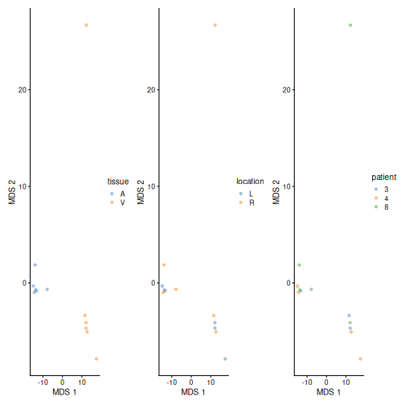
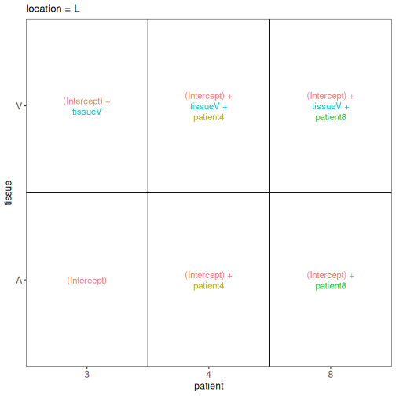
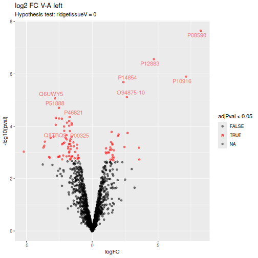
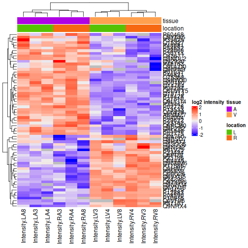
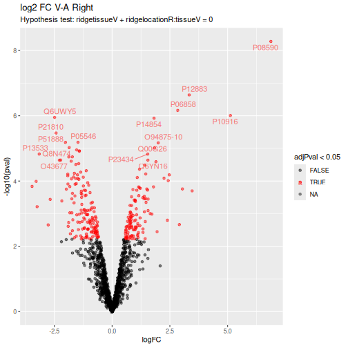
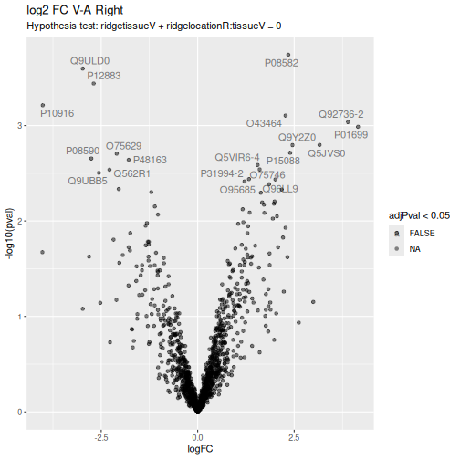

# Heart use case: a MaxQuant LFQ DDA dataset with a more complex design{#sec-heart}


## Introduction

In this chapter we show how to analyse LFQ data from an experiment
with a more complex design. The data are a small subset of the public
dataset PXD006675 on PRIDE.

Particularly, the proteomes of the atrium and ventriculum in the left
and the right heart region are profiled for 3 patients (identifiers 3,
4, and 8). Hence, the design consists of a factor tissue (atrium,
ventriculum), region (left, right) and block (patient 3,4, and 8).

Suppose that researchers are mainly interested in comparing the
ventricular to the atrial proteome. Particularly, they would like to
compare the left atrium to the left ventricle, the right atrium to the
right ventricle, the average ventricular vs atrial proteome and if
ventricular vs atrial proteome shifts differ between left and right
heart region.

## Load packages

First, we load the `msqrob2` package and additional packages for data
manipulation and visualisation.


``` r
library("msqrob2")
library("ggplot2")
library("patchwork")
library("ggrepel")
library("dplyr")
```

We also configure the [parallelisation](#sec-parallel) framework.


``` r
library("BiocParallel")
register(SerialParam())
```

## Load Data

### Getting the data

The data were searched with MaxQuant version version 1.5.5.6 and are
deposited on the PRIDE repository
[PXD006675](https://www.ebi.ac.uk/pride/archive/projects/PXD006675).

In this chapter we use a small subset of the data that is available on
**TODO** put on Zenodo and use BiocFileCache.


``` r
library("BiocFileCache")
bfc <- BiocFileCache()
pepFile <- bfcrpath(bfc, "https://raw.githubusercontent.com/statOmics/PDA21/data/quantification/heart/peptides.txt")
```

After downloading the files, we can load the peptide table, which is
in ["wide format"](#sec-peptide_table). Hence, each row represents a
single peptide and that each quantification column (that starts with
`"Intensity"`) represents a single sample.


``` r
peps <- read.delim(pepFile)
quantcols <- grep("Intensity\\.", names(peps), value = TRUE)
```

|Sequence                                |N.term.cleavage.window |C.term.cleavage.window |Amino.acid.before |First.amino.acid |Second.amino.acid |Second.last.amino.acid |Last.amino.acid |Amino.acid.after | A.Count| R.Count| N.Count| D.Count| C.Count| Q.Count| E.Count| G.Count| H.Count| I.Count| L.Count| K.Count| M.Count| F.Count| P.Count| S.Count| T.Count| W.Count| Y.Count| V.Count| U.Count| O.Count| Length| Missed.cleavages|      Mass|Proteins |Leading.razor.protein | Start.position| End.position|Gene.names |Protein.names                                      |Unique..Groups. |Unique..Proteins. |Charges |       PEP|   Score|Identification.type.LA3 |Identification.type.LA4 |Identification.type.LA8 |Identification.type.LV3 |Identification.type.LV4 |Identification.type.LV8 |Identification.type.RA3 |Identification.type.RA4 |Identification.type.RA8 |Identification.type.RV3 |Identification.type.RV4 |Identification.type.RV8 | Fraction.Average| Fraction.Std..Dev.| Fraction.1| Fraction.2| Fraction.3| Fraction.4| Fraction.5| Fraction.6| Fraction.7| Fraction.8| Fraction.100| Experiment.LA3| Experiment.LA4| Experiment.LA8| Experiment.LV3| Experiment.LV4| Experiment.LV8| Experiment.RA3| Experiment.RA4| Experiment.RA8| Experiment.RV3| Experiment.RV4| Experiment.RV8|  Intensity| Intensity.LA3| Intensity.LA4| Intensity.LA8| Intensity.LV3| Intensity.LV4| Intensity.LV8| Intensity.RA3| Intensity.RA4| Intensity.RA8| Intensity.RV3| Intensity.RV4| Intensity.RV8|Reverse |Potential.contaminant | id| Protein.group.IDs|Mod..peptide.IDs |Evidence.IDs                                                                                                                                                                                                                                                                                                                                                                                                                                                            |MS.MS.IDs                                                                                                                                                        | Best.MS.MS|Oxidation..M..site.IDs | MS.MS.Count|
|:---------------------------------------|:----------------------|:----------------------|:-----------------|:----------------|:-----------------|:----------------------|:---------------|:----------------|-------:|-------:|-------:|-------:|-------:|-------:|-------:|-------:|-------:|-------:|-------:|-------:|-------:|-------:|-------:|-------:|-------:|-------:|-------:|-------:|-------:|-------:|------:|----------------:|---------:|:--------|:---------------------|--------------:|------------:|:----------|:--------------------------------------------------|:---------------|:-----------------|:-------|---------:|-------:|:-----------------------|:-----------------------|:-----------------------|:-----------------------|:-----------------------|:-----------------------|:-----------------------|:-----------------------|:-----------------------|:-----------------------|:-----------------------|:-----------------------|----------------:|------------------:|----------:|----------:|----------:|----------:|----------:|----------:|----------:|----------:|------------:|--------------:|--------------:|--------------:|--------------:|--------------:|--------------:|--------------:|--------------:|--------------:|--------------:|--------------:|--------------:|----------:|-------------:|-------------:|-------------:|-------------:|-------------:|-------------:|-------------:|-------------:|-------------:|-------------:|-------------:|-------------:|:-------|:---------------------|--:|-----------------:|:----------------|:-----------------------------------------------------------------------------------------------------------------------------------------------------------------------------------------------------------------------------------------------------------------------------------------------------------------------------------------------------------------------------------------------------------------------------------------------------------------------|:----------------------------------------------------------------------------------------------------------------------------------------------------------------|----------:|:----------------------|-----------:|
|AAAAAAAAAK                              |AKFRKQERAAAAAAAA       |AAAAAAAKNGSSGKKS       |R                 |A                |A                 |A                      |K               |N                |       9|       0|       0|       0|       0|       0|       0|       0|       0|       0|       0|       1|       0|       0|       0|       0|       0|       0|       0|       0|       0|       0|     10|                0|  785.4396|Q99453   |Q99453                |            159|          168|PHOX2B     |Paired mesoderm homeobox protein 2B                |yes             |yes               |2       | 0.0000121| 170.060|By matching             |By matching             |                        |By matching             |By matching             |                        |                        |By matching             |By matching             |By matching             |By matching             |                        |             83.5|               35.9|         NA|          2|          1|          5|          1|          7|          2|          6|          113|              1|              1|             NA|              1|              1|             NA|             NA|              1|              1|              1|              1|             NA| 3.4832e+10|     288590000|     118170000|             0|     257550000|     308710000|             0|             0|     194640000|     144740000|     456330000|     107900000|             0|NA      |                      |  1|              9885|1                |9;10;11;12;13;14;15;16;17;18;19;20;21;22;23;24;25;26;27;28;29;30;31;32;33;34;35;36;37;38;39;40;41;42;43;44;45;46;47;48;49;50;51;52;53;54;55;56;57;58;59;60;61;62;63;64;65;66;67;68;69;70;71;72;73;74;75;76;77;78;79;80;81;82;83;84;85;86;87;88;89;90;91;92;93;94;95;96;97;98;99;100;101;102;103;104;105;106;107;108;109;110;111;112;113;114;115;116;117;118;119;120;121;122;123;124;125;126;127;128;129;130;131;132;133;134;135;136;137;138;139;140;141;142;143;144;145 |9;10;11;12;13;14;15;16;17;18;19;20;21;22;23;24;25;26;27;28;29;30;31;32;33;34;35;36;37;38;39;40;41;42;43;44;45;46;47;48;49;50;51;52;53;54;55;56;57;58;59;60;61;62 |         18|                       |          50|
|AAAAAAAAEQQSSNGPVK                      |________________       |QSSNGPVKKSMREKAV       |M                 |A                |A                 |V                      |K               |K                |       8|       0|       1|       0|       0|       2|       1|       1|       0|       0|       0|       1|       0|       0|       1|       2|       0|       0|       0|       1|       0|       0|     18|                0| 1640.8118|Q16585   |Q16585                |              2|           19|SGCB       |Beta-sarcoglycan                                   |yes             |yes               |2       | 0.0000000| 185.250|                        |                        |                        |                        |                        |                        |                        |                        |                        |By MS/MS                |By MS/MS                |                        |              4.5|                1.8|         NA|          2|         NA|         NA|          1|          3|         NA|         NA|           NA|             NA|             NA|             NA|             NA|             NA|             NA|             NA|             NA|             NA|              1|              1|             NA| 9.4024e+07|             0|             0|             0|             0|             0|             0|             0|             0|             0|             0|      29925000|             0|NA      |                      |  4|              7001|4;5              |149;150;151;152;153;154                                                                                                                                                                                                                                                                                                                                                                                                                                                 |67;68;69;70;71;72;73                                                                                                                                             |         67|                       |           7|
|AAAAAAAAGAFAGR                          |APLLGARRAAAAAAAA       |AAGAFAGRRAACGAVL       |R                 |A                |A                 |G                      |R               |R                |      10|       1|       0|       0|       0|       0|       0|       2|       0|       0|       0|       0|       0|       1|       0|       0|       0|       0|       0|       0|       0|       0|     14|                0| 1145.5942|Q8N697   |Q8N697                |             20|           33|SLC15A4    |Solute carrier family 15 member 4                  |yes             |yes               |2       | 0.0003300| 119.620|                        |                        |                        |                        |                        |                        |                        |                        |                        |                        |                        |                        |              7.0|                0.0|         NA|         NA|         NA|         NA|         NA|         NA|          5|         NA|           NA|             NA|             NA|             NA|             NA|             NA|             NA|             NA|             NA|             NA|             NA|             NA|             NA| 2.5454e+08|             0|             0|             0|             0|             0|             0|             0|             0|             0|             0|             0|             0|NA      |                      |  5|              8631|6                |155;156;157;158;159                                                                                                                                                                                                                                                                                                                                                                                                                                                     |74;75                                                                                                                                                            |         74|                       |           1|
|AAAAAAAPEPPLGLQQLSALQPEPGGVPLHSSWTFWLDR |AREPPGSRAAAAAAAP       |SWTFWLDRSLPGATAA       |R                 |A                |A                 |D                      |R               |S                |       8|       1|       0|       1|       0|       3|       2|       3|       1|       0|       6|       0|       0|       1|       6|       3|       1|       2|       0|       1|       0|       0|     39|                0| 4049.0799|Q8N5X7   |Q8N5X7                |             21|           59|EIF4E3     |Eukaryotic translation initiation factor 4E type 3 |yes             |yes               |3;4     | 0.0000700|  57.832|By matching             |                        |                        |                        |                        |                        |By MS/MS                |                        |                        |                        |                        |                        |              2.5|                1.5|          1|          2|         NA|         NA|          1|         NA|         NA|         NA|           NA|              1|             NA|             NA|             NA|             NA|             NA|              1|             NA|             NA|             NA|             NA|             NA| 8.5505e+07|      15932000|             0|             0|             0|             0|             0|       8996400|             0|             0|             0|             0|             0|NA      |                      |  9|              8622|10               |601;602;603;604                                                                                                                                                                                                                                                                                                                                                                                                                                                         |349;350;351                                                                                                                                                      |        349|                       |           3|
|AAAAAAGAASGLPGPVAQGLK                   |________________       |GPVAQGLKEALVDTLT       |M                 |A                |A                 |L                      |K               |E                |       9|       0|       0|       0|       0|       1|       0|       4|       0|       0|       2|       1|       0|       0|       2|       1|       0|       0|       0|       1|       0|       0|     21|                0| 1747.9581|Q96P70   |Q96P70                |              2|           22|IPO9       |Importin-9                                         |yes             |yes               |2       | 0.0000001| 177.810|                        |                        |                        |                        |                        |                        |                        |                        |                        |                        |                        |                        |              1.0|                0.0|          1|         NA|         NA|         NA|         NA|         NA|         NA|         NA|           NA|             NA|             NA|             NA|             NA|             NA|             NA|             NA|             NA|             NA|             NA|             NA|             NA| 3.3872e+07|             0|             0|             0|             0|             0|             0|             0|             0|             0|             0|             0|             0|NA      |                      | 12|              9760|13               |686                                                                                                                                                                                                                                                                                                                                                                                                                                                                     |450                                                                                                                                                              |        450|                       |           1|
|AAAAAATAPPSPGPAQPGPR                    |AAPARAPRAAAAAATA       |GPAQPGPRAQRAAPLA       |R                 |A                |A                 |P                      |R               |A                |       8|       1|       0|       0|       0|       1|       0|       2|       0|       0|       0|       0|       0|       0|       6|       1|       1|       0|       0|       0|       0|       0|     20|                0| 1754.9064|Q6SPF0   |Q6SPF0                |            151|          170|SAMD1      |Atherin                                            |yes             |yes               |2       | 0.0007018|  72.290|                        |                        |                        |                        |                        |                        |                        |                        |                        |                        |                        |                        |              7.0|                0.0|         NA|         NA|         NA|         NA|         NA|         NA|          1|         NA|           NA|             NA|             NA|             NA|             NA|             NA|             NA|             NA|             NA|             NA|             NA|             NA|             NA| 9.4351e+06|             0|             0|             0|             0|             0|             0|             0|             0|             0|             0|             0|             0|NA      |                      | 16|              7795|18               |720                                                                                                                                                                                                                                                                                                                                                                                                                                                                     |472                                                                                                                                                              |        472|                       |           1|

We now extract the [sample annotations](#sec-annotation_table). We
will build a table where each row in the annotation table contains
information for one sample (the table below shows the first 6 rows).
This information is extracted from the sample names.


``` r
coldata <- data.frame(quantCols = quantcols) |> 
  mutate(location  = substr(quantCols, 11, 11)) |> # heart region left-right
  mutate(tissue  = substr(quantCols, 12, 12)) |> # tissue Atrium-Ventriculum
  mutate(patient  = substr(quantCols, 13, 13)) # patient id
```

|quantCols     |location |tissue |patient |
|:-------------|:--------|:------|:-------|
|Intensity.LA3 |L        |A      |3       |
|Intensity.LA4 |L        |A      |4       |
|Intensity.LA8 |L        |A      |8       |
|Intensity.LV3 |L        |V      |3       |
|Intensity.LV4 |L        |V      |4       |
|Intensity.LV8 |L        |V      |8       |

### The `QFeatures` data class

We combine the two tables into a [`QFeatures` object](#sec-qfeatures).


``` r
(pe <- readQFeatures(
  peps, colData = coldata, fnames = "Sequence", name = "peptides"
))
```

```
## An instance of class QFeatures (type: bulk) with 1 set:
## 
##  [1] peptides: SummarizedExperiment with 31319 rows and 12 columns
```

We now have a `QFeatures` object with 1 set, containing `r
nrows(pe)[[1]]` rows (peptides) and 12 columns
(samples). 

## Data preprocessing

`msqrob2` relies on the `QFeatures` data structure, meaning that we
can directly make use of `QFeatures`' data preprocessing functionality
(see also the `QFeatures`
[documentation](https://rformassspectrometry.github.io/QFeatures/articles/Processing.html)).

### Encoding missing values

Peptides with zero intensities should be
[encoded](#sec-encode_missing) using `NA`.


``` r
pe <- zeroIsNA(pe, "peptides")
```

We calculate how many non zero intensities we have per peptide and
this is often useful for filtering.


``` r
naResults <- nNA(pe, "peptides")
data.frame(naResults$nNArows) |> 
  ggplot() +
  aes(x = nNA) +
  geom_histogram()
```


### PSM filtering

We filter features based on 3 criteria (see [PSM filtering]).

1. Remove failed protein inference

We remove peptides that could not be uniquely mapped to a protein.


``` r
pe <- filterFeatures(pe,
  ~ Proteins != "" & ## Remove failed protein inference
    !grepl(";", Proteins)) ## Remove protein groups
```

2. Remove reverse sequences (decoys) and contaminants

We remove the contaminants and peptides that map to decoy sequences.
These features bear no information of interest and will reduce the
statistical power upon multiple test adjustment.


``` r
pe <- filterFeatures(pe, ~ Reverse != "+" & Potential.contaminant != "+")
```

3. Remove highly missing peptides. 

We keep peptides that were observed at last 3 times out of the $n =
12$ samples, so we tolerate the following proportion of NAs:
$\text{pNA} = \frac{(n - 3)}{n} = 0.75$, so we keep peptides that are
observed in at least 25% of the samples.


``` r
nObs <- 3
n <- ncol(pe[["peptides"]])
(pe <- filterNA(pe, i = "peptides", pNA = (n - nObs) / n))
```

```
## An instance of class QFeatures (type: bulk) with 1 set:
## 
##  [1] peptides: SummarizedExperiment with 15630 rows and 12 columns
```

We keep 15630 peptides upon filtering.

### Standard preprocessing workflow

We can now prepare the data for modelling. The workflow ensures the
data complies to `msqrob2`'s requirements:

1. Intensities are [log-transformed](#sec-log2).


``` r
pe <- logTransform(pe, base = 2, i = "peptides", name = "peptides_log")
```

2. Normalisation with Median of Ratios method.


``` r
pseudoRef <- assay(pe[["peptides_log"]]) |> 
  rowMeans(na.rm = TRUE) #1. Calculate the row means 

nfLog <- sweep(
  assay(pe[["peptides_log"]]), 
  MARGIN = 1, 
  pseudoRef) |> #2. Subtract the row means row-by-row (MARGIN = 1)
  colMedians(na.rm = TRUE)  #3. Calculate the column median 

pe <- 
  sweep(pe, 
        MARGIN = 2, 
        STATS = nfLog , 
        i = "peptides_log", 
        name = "peptides_norm") #4. Subtract log2 norm factor column-by-column (MARGIN = 2)
```
<!--
2. Samples are normalised by substracting the sample median (see [Normalisation])
-->


Upon the normalisation the density curves should be nicely centred. To
confirm this, we will plot the intensity distributions for each
biorepeat (mouse). `longForm()` seamlessly combines the quantification
and annotation data into a table suitable for `ggplot2` visualisation.
We also subset the object with the data before and after normalisation.


``` r
longForm(pe[, , c("peptides_log", "peptides_norm")], colvar = "patient") |> 
  ggplot() +
  aes(x = value, group = colname, color = patient) +
  geom_density() +
  facet_wrap(~ assay, scale = "free")
```


3. [Summarisation](#sec-summarisation) to protein level.

We use the robust summary approach to infer protein-level data from
peptide-level data, accounting for the fact that different peptides
have ionisation efficiencies hence leading to different intensity
baselines.


``` r
pe <- aggregateFeatures(
  pe, i = "peptides_norm", fcol = "Proteins", 
  fun = MsCoreUtils::robustSummary, na.rm = TRUE, name = "proteins"
)
```

## Data exploration

We will explore the main sources of variation in the data using
[MDS](#sec_data_exploration).


``` r
library("scater")
se <- getWithColData(pe, "proteins") |> 
  as("SingleCellExperiment") |> 
  runMDS(exprs_values = 1) 
plotMDS(se, colour_by = "tissue") +
  plotMDS(se, colour_by = "location") +
  plotMDS(se, colour_by = "patient")
```



Note, that the samples upon robust summarisation show a clear
separation according to the tissue type in the first dimension and
according to location in the second dimension.

## Data modelling

The preprocessed data can now be modelled to answer biologically
relevant questions. Particularly, the protein abundance can differ
according to tissue type (A-V) and location (L-R). Moreover, the
effect of the tissue type can differ according to the location and
vice versa. Hence, there can be an interaction between tissue and
location.

The samples are also not independent as four biopsies (LA, RA, LV and
RV) were taken for each patient. Because the proteome is profiled for
each tissue x location combination within each patient, the design is
a randomised complete block (RCB) design.

RCB designs can be correctly analysed by incorporating the block
effect for patient either as a fixed or a random effect. The use of a
fixed patient effect is here also possible because the effect of each
factor combination can be estimated within block (patient).

Here, we choose to account for the patient effect using fixed effects
because mixed models are computationally more demanding and rely on
asymptotic inference (i.e.  statistical inference is only valid for
experiments with large sample sizes).

Now we have identified the sources of variation in the experiment that
we have to account for (tissue, location and patient id), we can
define a model.


``` r
model <- ~ location*tissue + ## (1) fixed effects: main effects for location and tissue type, and a tissue x location interaction
  patient  ## (2) fixed block effect for patient
```

### Estimate the model

We estimate the model with `msqrob()`. Recall that
variables defined in `model` are automatically retrieved from the
`colData` (i.e. `"tissue"`, `"location"`, and `"patient"`). 


``` r
pe <- msqrob(pe, i = "proteins", formula = model, robust = TRUE)
```

## Statistical inference

Once the models are estimated, we can start answering biological
questions by performing [Statistical inference]. We must translate the
biological questions into a statistical hypotheses:

 1. Is there an effect of tissue type (V-A) in the left heart region?
 2. Is there an effect of tissue type (V-A) in the right heart region?
 3. Is there on average an effect of tissue type in the heart. 
 4. Does the effect of tissue type (V-A) differ according to the heart region (L-R)? 
 
In other words, we must translate these questions in a linear
combination of the model parameters, also referred to as a contrast.
To aid defining contrasts, we will visualise the experimental design
using the `ExploreModelMatrix` package.


``` r
library("ExploreModelMatrix")
vd <- VisualizeDesign(
    sampleData =  colData(pe),
    designFormula = ~ location*tissue + patient,
    textSizeFitted = 4
)
vd$plotlist
```

```
## $`location = L`
```



```
## 
## $`location = R`
```


### Research question 1: is there an effect of tissue in the left heart region? 

From the plot we can see that the average log2 intensity for patient 3
in the left ventriculum equals `(Intercept) + tissueV':

$$
\mu^L_{V,3} = \beta_0 + \beta_V
$$
and for the left atrium `(Intercept)`:

$$
\mu^L_{A,3} = \beta_0 
$$
So the average $\log_2 FC$ between atrium and ventriculum for patient
3 equals to parameter `tissueV`

$$
\log_2 FC_{V-A}^L = \mu^L_{V,3} -\mu^L_{A,3} = \beta_V
$$
The same can be seen for patient 4: 

$$
\log_2 FC_{V-A}^L= \mu^L_{V,4} -\mu^L_{A,4} = \beta_0 + \beta_V + \beta_4 - (\beta_0 + \beta_4) = \beta_V
$$
So the parameter `tissueV` has the interpretation of the average
$\log_2 FC$ between ventriculum and atrium after correction for the
patient effect, which quantifies the effect size for the first
research hypothesis.

### Research question 2: is there an effect of tissue in the right heart region? 

When we use the same rationale for the right heart region, we can see
that the average $\log_2 FC$ between atrium and ventriculum upon
correction for the patient effect equals `tissueV +
locationR:tissueV`. So, it consists of the main effect for tissue and
the location x tissue interaction.

We will illustrate this here for patient 4: 

$$
\begin{array}{rcl}
\log_2 FC_{V-A}^R& =&\mu^R_{V,4} -\mu^R_{A,4} \\
&=& \beta_0 + 
\beta_R + \beta_V + \beta_{R:V} + \beta_4 - (\beta_0 + 
\beta_R + \beta_4) \\
&=& \beta_V + \beta_{R:V}
\end{array}
$$

### Research question 3: is there an effect of tissue on average in the heart? 

This research question can be quantified by calculating the averaging
the $\log_2$ fold change between Ventriculum and Atrium over the left
and right heart regions, which equals `tissueV +
0.5*locationR:tissueV`

$$
\begin{array}{rcl}
(\log_2 FC_{V-A}^R + \log_2 FC_{V-A}^R)/ 2 &=& (\beta_V + \beta_V + \beta_{R:V})/2 \\
&=& \beta_V + 0.5\times\beta_{R:V}
\end{array}
$$

### Research question 4: does the effect of tissue differs according to the heart region? 

This research question can be quantified by calculating the difference
in the $\log_2$ fold change between Ventriculum and Atrium in the
right and left heart regions, which equals `locationR:tissueV`

$$
\begin{array}{rcl}
\log_2 FC_{V-A}^R- \log_2 FC_{V-A}^R &=& \beta_V + \beta_{R:V}-\beta_V  \\
&=& \beta_{R:V}
\end{array}
$$
### Setting up the contrasts 

We can set up the four contrasts:

1. We make the design matrix so that we can easily extract all 
   parameter names from the model 
2. We make the contrast matrix for the four contrasts 


``` r
design <- model.matrix(~ location*tissue + patient, data = colData(pe))
L <- makeContrast(
  c(
    "tissueV = 0",
    "tissueV + locationR:tissueV = 0",
    "tissueV + 0.5*locationR:tissueV = 0",
    "locationR:tissueV = 0"
  ),
  parameterNames = colnames(design)
  )
```

We can now falsify the null hypothesis of each contrast:


``` r
pe <- hypothesisTest(
  object = pe, i = "proteins", contrast = L, overwrite = TRUE
)
```

### Evaluate results for contrast $\log_2 FC_{V-A}^L$

Let us retrieve the result table from the `rowData`. Note that the
hypothesis testing results are stored in `rowData` columns named after
the column names of the contrast matrix `L`. The first column contains
the results for contrast $\log_2 FC_{V-A}^L$.


``` r
inferenceLeft <- rowData(pe[["proteins"]])[[colnames(L)[1]]]
inferenceLeft$Protein <- rownames(inferenceLeft)
head(inferenceLeft)
```

```
##             logFC        se       df         t      pval   adjPval Protein
## A0PJW6  0.5935576 0.5331166 7.990114  1.113373 0.2979183 0.5261831  A0PJW6
## A0PJZ3         NA        NA       NA        NA        NA        NA  A0PJZ3
## A0PK00         NA        NA       NA        NA        NA        NA  A0PK00
## A1A4S6  0.4495631 0.3002632 8.825715  1.497230 0.1692140 0.3829979  A1A4S6
## A1A5D9         NA        NA       NA        NA        NA        NA  A1A5D9
## A1IGU5 -0.4132889 0.3635156 8.602465 -1.136922 0.2862473 0.5170413  A1IGU5
```

Notice that some rows contain missing values. This is because data
modelling resulted in a `fitError` for some proteins, probably because
not enough data was available for model fitting due to missing values
in the quantitative data (see [how to deal with
`fitError`s](#sec-fiterror)).

#### Volcano plot

Volcano plots are straightforward to generate from the inference table
above. We also use `ggrepel` to annotate the 20 most significant 
proteins.


``` r
ggplot(inferenceLeft) +
  aes(x = logFC, y = -log10(pval), color = adjPval < 0.05) +
  geom_point() +
  geom_text_repel(data = slice_min(inferenceLeft, adjPval, n = 20),
                  aes(label = Protein)) +
  scale_color_manual(values = alpha(c("black", "red"), 0.5)) + 
  ggtitle("log2 FC V-A left",
          paste("Hypothesis test:", colnames(L)[1], "= 0"))
```



#### Heatmap

We can also build a [heatmap](#sec-heatmaps) for the significant
proteins which are obtained by filtering the inference table. We first
retrieve the data with proteins that are differentially abundant
between the atrium and the ventriculum in the left heart.


``` r
sigNamesLeft <- inferenceLeft |> 
  filter(!is.na(adjPval), adjPval < 0.05) |> 
  pull()
se <- getWithColData(pe, "proteins")[sigNamesLeft, ]
```

We then plot the protein-wise standardised data as an annotated 
heatmap.


``` r
quants <- t(scale(t(assay(se))))
library("ComplexHeatmap")
annotations <- columnAnnotation(
  tissue = se$tissue,
  location = se$location
)
set.seed(1234) ## annotation colours are randomly generated by default
Heatmap(
 quants, name = "log2 intensity",
 top_annotation = annotations
)
```


There are 118 proteins significantly
differentially expressed at the 5% FDR level. Below you can find the
list of significant proteins.


``` r
inferenceLeft |>
  na.exclude() |>
  filter(adjPval<0.05) |>
  arrange(pval)  |>
  knitr::kable()
```


|          |     logFC|        se|       df|         t|      pval|   adjPval|Protein   |
|:---------|---------:|---------:|--------:|---------:|---------:|---------:|:---------|
|P08590    |  8.329225| 0.4625932| 9.137766| 18.005507| 0.0000000| 0.0000382|P08590    |
|P12883    |  5.048463| 0.3647171| 9.030710| 13.842133| 0.0000002| 0.0002204|P12883    |
|P10916    |  7.297615| 0.4996326| 7.137766| 14.605961| 0.0000014| 0.0009468|P10916    |
|Q6UWY5    | -2.936986| 0.3663695| 8.789452| -8.016458| 0.0000250| 0.0126188|Q6UWY5    |
|P14854    |  2.740701| 0.3116340| 7.278888|  8.794614| 0.0000392| 0.0142103|P14854    |
|Q0VF96    |  7.419055| 0.6592285| 5.558739| 11.254148| 0.0000492| 0.0142103|Q0VF96    |
|P51888    | -2.664941| 0.3667980| 8.880416| -7.265417| 0.0000508| 0.0142103|P51888    |
|O75368    | -1.922257| 0.2736229| 9.064324| -7.025203| 0.0000594| 0.0142103|O75368    |
|O94875-10 |  2.729968| 0.3332554| 7.271610|  8.191819| 0.0000634| 0.0142103|O94875-10 |
|P46821    | -1.832464| 0.2627701| 8.562885| -6.973641| 0.0000832| 0.0153195|P46821    |
|Q9ULL5-3  | -3.081151| 0.4302547| 7.977151| -7.161226| 0.0000974| 0.0153195|Q9ULL5-3  |
|P21810    | -2.887074| 0.4219656| 8.418360| -6.841966| 0.0001039| 0.0153195|P21810    |
|P29622    | -1.747129| 0.2637826| 8.780141| -6.623369| 0.0001083| 0.0153195|P29622    |
|Q8TBQ9    | -2.422790| 0.3758440| 9.133378| -6.446265| 0.0001111| 0.0153195|Q8TBQ9    |
|P05546    | -1.605665| 0.2479062| 8.931298| -6.476907| 0.0001185| 0.0153195|P05546    |
|Q15113    | -2.392168| 0.3753584| 9.128311| -6.373023| 0.0001215| 0.0153195|Q15113    |
|O14967    | -2.044625| 0.3181711| 8.839999| -6.426179| 0.0001315| 0.0156044|O14967    |
|P06858    |  2.076744| 0.3295023| 8.750335|  6.302670| 0.0001586| 0.0158609|P06858    |
|Q16647    | -2.449761| 0.3961254| 8.931155| -6.184306| 0.0001672| 0.0158609|Q16647    |
|Q92508    |  4.477077| 0.5541070| 6.137766|  8.079807| 0.0001714| 0.0158609|Q92508    |
|Q8N474    | -2.892766| 0.3993766| 6.992430| -7.243204| 0.0001718| 0.0158609|Q8N474    |
|O95865    | -1.803859| 0.2986925| 9.134801| -6.039183| 0.0001817| 0.0158609|O95865    |
|P36955    | -1.982222| 0.3175138| 8.605071| -6.242947| 0.0001825| 0.0158609|P36955    |
|P08294    | -2.431082| 0.3838085| 8.286871| -6.334100| 0.0001932| 0.0158609|P08294    |
|P02452    | -2.545038| 0.4199343| 8.902413| -6.060563| 0.0001966| 0.0158609|P02452    |
|Q53GQ0    | -2.067674| 0.3496749| 9.137766| -5.913132| 0.0002123| 0.0164687|Q53GQ0    |
|P24311    |  2.149799| 0.3684280| 9.134801|  5.835057| 0.0002345| 0.0175176|P24311    |
|P18428    | -1.699112| 0.2870837| 8.542783| -5.918527| 0.0002746| 0.0196315|P18428    |
|P13533    | -3.665289| 0.6357359| 8.890214| -5.765426| 0.0002839| 0.0196315|P13533    |
|P24844    | -2.192662| 0.3763272| 8.652061| -5.826478| 0.0002920| 0.0196315|P24844    |
|P00325    | -1.756089| 0.3023173| 8.338164| -5.808761| 0.0003432| 0.0217518|P00325    |
|P02743    | -1.786982| 0.3234314| 9.137766| -5.525070| 0.0003487| 0.0217518|P02743    |
|P23083    | -3.889514| 0.6172751| 7.137766| -6.301103| 0.0003729| 0.0217518|P23083    |
|P05997    | -2.711447| 0.4855740| 8.776640| -5.584005| 0.0003735| 0.0217518|P05997    |
|P51884    | -1.817041| 0.3286163| 8.922431| -5.529370| 0.0003774| 0.0217518|P51884    |
|Q9NZ01    | -2.021711| 0.3721728| 8.948605| -5.432185| 0.0004235| 0.0233039|Q9NZ01    |
|Q9UKX3    |  2.655918| 0.4932358| 8.966869|  5.384683| 0.0004474| 0.0233039|Q9UKX3    |
|Q9P2B2    | -1.683823| 0.3172294| 9.137766| -5.307904| 0.0004646| 0.0233039|Q9P2B2    |
|O43677    | -2.379147| 0.4440829| 8.862210| -5.357439| 0.0004823| 0.0233039|O43677    |
|Q06828    | -4.024085| 0.7444148| 8.663120| -5.405703| 0.0004897| 0.0233039|Q06828    |
|P02747    | -2.398026| 0.4296973| 8.127542| -5.580732| 0.0004934| 0.0233039|P02747    |
|P07451    | -1.497403| 0.2800233| 8.801061| -5.347423| 0.0005001| 0.0233039|P07451    |
|Q6YN16    |  1.962135| 0.3558634| 8.213383|  5.513732| 0.0005151| 0.0233039|Q6YN16    |
|Q8WWA0    | -5.550522| 1.0047751| 8.172717| -5.524144| 0.0005176| 0.0233039|Q8WWA0    |
|Q9UL18    | -2.278816| 0.3982095| 7.652317| -5.722657| 0.0005208| 0.0233039|Q9UL18    |
|O60760    | -3.286879| 0.5960451| 8.137766| -5.514481| 0.0005315| 0.0233039|O60760    |
|Q9UBG0    | -2.170583| 0.4132265| 8.902586| -5.252767| 0.0005448| 0.0233806|Q9UBG0    |
|Q9UGT4    | -1.948476| 0.3768733| 9.021342| -5.170108| 0.0005827| 0.0244799|Q9UGT4    |
|Q14764    | -1.274129| 0.2486131| 9.137766| -5.124947| 0.0005947| 0.0244799|Q14764    |
|P23434    |  1.494665| 0.2936559| 9.137766|  5.089852| 0.0006239| 0.0251673|P23434    |
|Q9UKS6    |  1.752743| 0.3388006| 8.486074|  5.173376| 0.0007049| 0.0275366|Q9UKS6    |
|O95980    | -2.208544| 0.4307774| 8.629791| -5.126880| 0.0007099| 0.0275366|O95980    |
|P36021    | -2.753027| 0.5261539| 8.137766| -5.232361| 0.0007484| 0.0284803|P36021    |
|Q9UNW9    |  4.365952| 0.8761214| 8.830616|  4.983273| 0.0008004| 0.0295467|Q9UNW9    |
|P04209    |  1.699180| 0.3436713| 8.969481|  4.944202| 0.0008057| 0.0295467|P04209    |
|Q9BW30    | -2.347559| 0.4677729| 8.555190| -5.018587| 0.0008401| 0.0302596|Q9BW30    |
|Q9NVN8    | -5.672898| 0.8291000| 5.137766| -6.842237| 0.0009127| 0.0322973|Q9NVN8    |
|O00180    | -3.916945| 0.7753620| 8.137766| -5.051763| 0.0009371| 0.0325889|O00180    |
|P01699    | -3.927443| 0.6605897| 6.068040| -5.945359| 0.0009714| 0.0332089|P01699    |
|P09619    | -1.403887| 0.2949336| 9.009230| -4.760011| 0.0010267| 0.0344964|P09619    |
|Q04721    |  1.917938| 0.4057291| 9.108802|  4.727139| 0.0010433| 0.0344964|Q04721    |
|P19429    |  2.694001| 0.5545070| 8.180326|  4.858372| 0.0011807| 0.0381818|P19429    |
|P00748    | -1.653188| 0.3488115| 8.562420| -4.739489| 0.0012155| 0.0381818|P00748    |
|Q96LL9    | -2.021570| 0.4294961| 8.695709| -4.706842| 0.0012183| 0.0381818|Q96LL9    |
|O95631    | -3.598863| 0.5606955| 5.137766| -6.418570| 0.0012304| 0.0381818|O95631    |
|Q9GZY4    | -2.783919| 0.5529950| 7.341569| -5.034257| 0.0013064| 0.0387348|Q9GZY4    |
|O00264    | -1.599109| 0.3446383| 8.741436| -4.639963| 0.0013174| 0.0387348|O00264    |
|O75629    |  1.859564| 0.4068058| 8.888884|  4.571133| 0.0013886| 0.0387348|O75629    |
|Q9Y4W6    |  1.236483| 0.2732276| 9.096984|  4.525469| 0.0013970| 0.0387348|Q9Y4W6    |
|Q86VU5    |  1.953823| 0.4138372| 8.206572|  4.721236| 0.0013991| 0.0387348|Q86VU5    |
|P35754    |  1.552531| 0.3438312| 9.137766|  4.515386| 0.0014015| 0.0387348|P35754    |
|O75394    |  2.262780| 0.4945348| 8.812704|  4.575573| 0.0014110| 0.0387348|O75394    |
|P17540    |  1.374408| 0.2941071| 8.374656|  4.673155| 0.0014117| 0.0387348|P17540    |
|Q92736-2  | -2.963445| 0.6435400| 8.651611| -4.604912| 0.0014211| 0.0387348|Q92736-2  |
|Q5M9N0    | -3.200391| 0.6841387| 8.137766| -4.677985| 0.0015150| 0.0406224|Q5M9N0    |
|P46060    | -1.546259| 0.3310947| 8.137766| -4.670140| 0.0015306| 0.0406224|P46060    |
|Q96H79    | -2.889808| 0.5324972| 6.063681| -5.426897| 0.0015680| 0.0410213|Q96H79    |
|Q07954    | -1.303862| 0.2950192| 9.137766| -4.419582| 0.0016116| 0.0410213|Q07954    |
|Q9NRX4    |  1.651470| 0.3733020| 9.090865|  4.423951| 0.0016215| 0.0410213|Q9NRX4    |
|P15924    |  1.608115| 0.3239841| 7.005886|  4.963560| 0.0016270| 0.0410213|P15924    |
|Q9NRG4    |  2.529876| 0.5506902| 8.137766|  4.594010| 0.0016923| 0.0410923|Q9NRG4    |
|Q5NDL2    | -1.939256| 0.4278929| 8.393402| -4.532106| 0.0016983| 0.0410923|Q5NDL2    |
|Q9BXV9    |  1.975269| 0.4444796| 8.712702|  4.444005| 0.0017481| 0.0410923|Q9BXV9    |
|P35442    | -1.795058| 0.3930028| 8.137766| -4.567544| 0.0017528| 0.0410923|P35442    |
|Q92604    | -1.971800| 0.4480570| 8.857221| -4.400778| 0.0017861| 0.0410923|Q92604    |
|A6NMZ7    | -2.185499| 0.4957188| 8.786598| -4.408748| 0.0018004| 0.0410923|A6NMZ7    |
|Q14195-2  | -2.178106| 0.4958149| 8.841556| -4.392981| 0.0018139| 0.0410923|Q14195-2  |
|P14555    | -4.267885| 0.8489218| 6.563910| -5.027418| 0.0018357| 0.0410923|P14555    |
|Q96FJ2    |  1.902891| 0.4204296| 8.145594|  4.526063| 0.0018478| 0.0410923|Q96FJ2    |
|P12110    | -1.669812| 0.3500847| 7.186812| -4.769738| 0.0018943| 0.0410923|P12110    |
|O43920    |  1.325869| 0.3062518| 9.023332|  4.329344| 0.0018954| 0.0410923|O43920    |
|Q9BXN1    | -2.318311| 0.5311572| 8.808511| -4.364642| 0.0019062| 0.0410923|Q9BXN1    |
|P02775    | -1.606688| 0.3739077| 9.137766| -4.297019| 0.0019305| 0.0410923|P02775    |
|Q5T481    |  1.204152| 0.2782769| 8.958925|  4.327172| 0.0019336| 0.0410923|Q5T481    |
|P24298    |  1.654069| 0.3743769| 8.482174|  4.418192| 0.0019354| 0.0410923|P24298    |
|Q9Y5U8    | -3.774074| 0.8758961| 8.888215| -4.308814| 0.0020230| 0.0425037|Q9Y5U8    |
|O14949    |  1.648333| 0.3864288| 8.920012|  4.265555| 0.0021370| 0.0444365|O14949    |
|Q8WZ42-6  |  1.127965| 0.2658924| 8.849717|  4.242187| 0.0022512| 0.0461272|Q8WZ42-6  |
|Q6SZW1    | -2.352957| 0.5076187| 7.137766| -4.635285| 0.0022641| 0.0461272|Q6SZW1    |
|Q13011    |  1.361001| 0.3257248| 9.137766|  4.178376| 0.0023038| 0.0464066|Q13011    |
|Q92621    | -1.311154| 0.3142274| 9.137766| -4.172629| 0.0023238| 0.0464066|Q92621    |
|O43464    | -1.553202| 0.3729166| 9.114138| -4.165012| 0.0023638| 0.0467424|O43464    |
|P40261    | -1.995424| 0.4522003| 7.771442| -4.412698| 0.0024123| 0.0472394|P40261    |
|Q9HBL0    |  1.701371| 0.3932547| 8.063010|  4.326384| 0.0024782| 0.0477573|Q9HBL0    |
|P04004    | -1.292826| 0.3132004| 9.137132| -4.127790| 0.0024861| 0.0477573|P04004    |
|O75489    |  1.408865| 0.3374455| 8.781885|  4.175089| 0.0025256| 0.0480588|O75489    |
|Q9NNX1    |  3.836475| 0.7880015| 6.137766|  4.868614| 0.0026275| 0.0491295|Q9NNX1    |
|P04083    | -1.164823| 0.2849879| 9.132512| -4.087272| 0.0026456| 0.0491295|P04083    |
|P50552    | -1.166918| 0.2835792| 8.929719| -4.114963| 0.0026616| 0.0491295|P50552    |
|Q53FA7    |  2.203946| 0.5362452| 8.908333|  4.109959| 0.0026952| 0.0491295|Q53FA7    |
|P31994-2  | -1.190393| 0.2923275| 9.137766| -4.072120| 0.0027037| 0.0491295|P31994-2  |
|O15230    | -1.078866| 0.2609922| 8.698087| -4.133712| 0.0027392| 0.0493305|O15230    |
|Q13636    | -2.925680| 0.6060788| 6.065852| -4.827227| 0.0028326| 0.0493505|Q13636    |
|Q53GG5-2  | -2.562075| 0.6124833| 8.281744| -4.183094| 0.0028408| 0.0493505|Q53GG5-2  |
|P22748    |  2.395344| 0.5776250| 8.467835|  4.146885| 0.0028482| 0.0493505|P22748    |
|P24752    |  1.210755| 0.2969882| 8.878407|  4.076776| 0.0028514| 0.0493505|P24752    |
|P02671    | -1.749911| 0.3655353| 6.134801| -4.787256| 0.0028627| 0.0493505|P02671    |
|P14923    |  1.068389| 0.2612871| 8.704689|  4.088949| 0.0029195| 0.0499039|P14923    |

### Evaluate results for contrast $\log_2 FC_{V-A}^R$

Let us retrieve the result table from the `rowData`. The second column
contains the results for contrast $\log_2 FC_{V-A}^R$.


``` r
inferenceRight <- rowData(pe[["proteins"]])[[colnames(L)[2]]]
inferenceRight$Protein <- rownames(inferenceRight)
head(inferenceRight)
```

```
##             logFC        se       df          t      pval   adjPval Protein
## A0PJW6  0.4611037 0.5697298 7.990114  0.8093375 0.4417536 0.6792717  A0PJW6
## A0PJZ3         NA        NA       NA         NA        NA        NA  A0PJZ3
## A0PK00         NA        NA       NA         NA        NA        NA  A0PK00
## A1A4S6  0.4201975 0.3089822 8.825715  1.3599409 0.2075703 0.4543736  A1A4S6
## A1A5D9         NA        NA       NA         NA        NA        NA  A1A5D9
## A1IGU5 -0.6251472 0.3572207 8.602465 -1.7500304 0.1155889 0.3351572  A1IGU5
```

#### Volcano plot

Volcano plots are straightforward to generate from the inference table
above. We also use `ggrepel` to annotate the 20 most significant 
proteins.


``` r
ggplot(inferenceRight) +
  aes(x = logFC, y = -log10(pval), color = adjPval < 0.05) +
  geom_point() +
  geom_text_repel(data = slice_min(inferenceRight, adjPval, n = 20),
                  aes(label = Protein)) +
  scale_color_manual(values = alpha(c("black", "red"), 0.5)) + 
  ggtitle("log2 FC V-A Right",
          paste("Hypothesis test:", colnames(L)[2], "= 0"))
```


#### Heatmap

We can also build a heatmap for the significant proteins which are
obtained by filtering the inference table^[Note that we use the same
heatmap annotations so we don't need to generate it again.].


``` r
sigNamesRight <- inferenceRight |> 
  filter(!is.na(adjPval), adjPval < 0.05) |> 
  pull()
se <- getWithColData(pe, "proteins")[sigNamesRight, ]
quants <- t(scale(t(assay(se))))
set.seed(1234) ## annotation colours are randomly generated by default
Heatmap(
 quants, name = "log2 intensity",
 top_annotation = annotations
)
```



There are 65 proteins significantly differentially expressed at the 5% FDR level.

Below you can find the list of significant proteins. 

``` r
inferenceRight |>
  na.exclude() |>
  filter(adjPval<0.05) |>
  arrange(pval)  |>
  knitr::kable()
```


|       |     logFC|        se|       df|         t|      pval|   adjPval|Protein |
|:------|---------:|---------:|--------:|---------:|---------:|---------:|:-------|
|P08590 |  5.827434| 0.4625932| 9.137766| 12.597319| 0.0000004| 0.0008784|P08590  |
|P06858 |  3.683640| 0.3170511| 8.750335| 11.618443| 0.0000013| 0.0012871|P06858  |
|P02776 | -2.489397| 0.3293394| 8.736936| -7.558758| 0.0000408| 0.0248712|P02776  |
|P54652 | -2.447332| 0.3599444| 9.137766| -6.799194| 0.0000736| 0.0248712|P54652  |
|P35442 | -3.214645| 0.4538006| 8.137766| -7.083827| 0.0000953| 0.0248712|P35442  |
|Q0VF96 |  5.257093| 0.5405054| 5.558739|  9.726253| 0.0001069| 0.0248712|Q0VF96  |
|P48163 | -2.704828| 0.3952799| 8.090395| -6.842816| 0.0001252| 0.0248712|P48163  |
|P12883 |  2.294613| 0.3613272| 9.030710|  6.350512| 0.0001308| 0.0248712|P12883  |
|Q9ULD0 | -3.155340| 0.3759079| 6.046916| -8.393917| 0.0001494| 0.0248712|Q9ULD0  |
|P21810 | -2.613770| 0.4024527| 8.418360| -6.494602| 0.0001511| 0.0248712|P21810  |
|Q69YU5 |  3.620266| 0.5800718| 8.791631|  6.241065| 0.0001671| 0.0248712|Q69YU5  |
|Q00G26 |  2.286498| 0.3627855| 8.297976|  6.302617| 0.0001989| 0.0248712|Q00G26  |
|P23434 |  1.735443| 0.2936559| 9.137766|  5.909784| 0.0002132| 0.0248712|P23434  |
|Q6UWY5 | -2.127907| 0.3541340| 8.789452| -6.008764| 0.0002203| 0.0248712|Q6UWY5  |
|P11586 |  2.380131| 0.3666788| 7.695704|  6.491052| 0.0002248| 0.0248712|P11586  |
|Q04760 |  2.535090| 0.4145047| 8.422573|  6.115949| 0.0002308| 0.0248712|Q04760  |
|Q6PI78 |  2.236469| 0.3807514| 8.945729|  5.873829| 0.0002423| 0.0248712|Q6PI78  |
|Q9NRG4 |  2.951460| 0.4769117| 8.137766|  6.188692| 0.0002449| 0.0248712|Q9NRG4  |
|O43677 | -2.664358| 0.4534430| 8.862210| -5.875839| 0.0002506| 0.0248712|O43677  |
|P24298 |  2.370748| 0.4009313| 8.482174|  5.913102| 0.0002842| 0.0248712|P24298  |
|P13533 | -3.568214| 0.6212771| 8.890214| -5.743353| 0.0002918| 0.0248712|P13533  |
|A6NMZ7 | -2.767127| 0.4796931| 8.786598| -5.768536| 0.0002956| 0.0248712|A6NMZ7  |
|Q15327 | -1.918689| 0.3418022| 9.137766| -5.613448| 0.0003109| 0.0248712|Q15327  |
|Q9UGT4 | -2.150106| 0.3807359| 9.021342| -5.647236| 0.0003120| 0.0248712|Q9UGT4  |
|P60468 | -2.095858| 0.3466895| 7.882292| -6.045347| 0.0003261| 0.0248712|P60468  |
|P29622 | -1.502371| 0.2651229| 8.780141| -5.666694| 0.0003363| 0.0248712|P29622  |
|P05546 | -1.366071| 0.2432824| 8.931298| -5.615168| 0.0003371| 0.0248712|P05546  |
|P10916 |  3.170748| 0.4996326| 7.137766|  6.346158| 0.0003569| 0.0253903|P10916  |
|O75368 | -1.489630| 0.2753397| 9.064324| -5.410152| 0.0004170| 0.0279060|O75368  |
|Q9P2B2 | -1.706259| 0.3172294| 9.137766| -5.378628| 0.0004229| 0.0279060|Q9P2B2  |
|P28066 | -1.855483| 0.3425991| 8.938077| -5.415901| 0.0004343| 0.0279060|P28066  |
|Q06828 | -3.844689| 0.7101299| 8.663120| -5.414064| 0.0004845| 0.0301269|Q06828  |
|Q96MM6 |  3.589621| 0.5954944| 7.101160|  6.027967| 0.0004991| 0.0301269|Q96MM6  |
|Q14764 | -1.276453| 0.2486131| 9.137766| -5.134294| 0.0005872| 0.0339763|Q14764  |
|P35625 | -3.559607| 0.6126712| 7.185061| -5.809980| 0.0005970| 0.0339763|P35625  |
|P04004 | -1.591888| 0.3132170| 9.137132| -5.082381| 0.0006304| 0.0348835|P04004  |
|Q5NDL2 | -2.439944| 0.4633658| 8.393402| -5.265697| 0.0006495| 0.0349660|Q5NDL2  |
|P02775 | -1.876576| 0.3739077| 9.137766| -5.018823| 0.0006878| 0.0360532|P02775  |
|P46821 | -1.280795| 0.2491549| 8.562885| -5.140559| 0.0007147| 0.0365029|P46821  |
|Q9HAT2 |  2.214363| 0.4435418| 8.904600|  4.992456| 0.0007709| 0.0378685|Q9HAT2  |
|Q9HAV7 |  1.531331| 0.3107135| 9.137766|  4.928433| 0.0007794| 0.0378685|Q9HAV7  |
|Q9NRX4 |  1.813177| 0.3718168| 9.090865|  4.876534| 0.0008505| 0.0398976|Q9NRX4  |
|P23786 |  1.252343| 0.2578231| 9.114420|  4.857373| 0.0008670| 0.0398976|P23786  |
|Q9BSD7 |  3.194926| 0.5735252| 6.874129|  5.570680| 0.0008956| 0.0398976|Q9BSD7  |
|P18428 | -1.421336| 0.2860733| 8.542783| -4.968432| 0.0009013| 0.0398976|P18428  |
|Q6PCB0 | -1.949071| 0.3897995| 8.231027| -5.000189| 0.0009665| 0.0418556|Q6PCB0  |
|Q8N142 |  1.620681| 0.3403504| 8.925439|  4.761802| 0.0010511| 0.0433949|Q8N142  |
|P61925 |  2.334822| 0.4565108| 7.630303|  5.114496| 0.0010572| 0.0433949|P61925  |
|P30711 | -1.992773| 0.3894620| 7.592593| -5.116734| 0.0010707| 0.0433949|P30711  |
|O00180 | -4.414052| 0.8953109| 8.137766| -4.930188| 0.0010932| 0.0433949|O00180  |
|Q92930 | -2.410524| 0.4818621| 7.820598| -5.002518| 0.0011232| 0.0433949|Q92930  |
|Q6YN16 |  1.859279| 0.3808832| 8.213383|  4.881494| 0.0011328| 0.0433949|Q6YN16  |
|Q9Y4W6 |  1.265429| 0.2741739| 9.096984|  4.615426| 0.0012274| 0.0461335|Q9Y4W6  |
|Q9BW30 | -2.128158| 0.4546438| 8.555190| -4.680935| 0.0013191| 0.0479424|Q9BW30  |
|P48681 | -1.160226| 0.2547001| 9.110445| -4.555265| 0.0013331| 0.0479424|P48681  |
|P23142 | -2.351372| 0.4934555| 8.099326| -4.765115| 0.0013699| 0.0479424|P23142  |
|P19429 |  2.481400| 0.5245927| 8.180326|  4.730145| 0.0013950| 0.0479424|P19429  |
|P01031 | -1.263739| 0.2748215| 8.658169| -4.598400| 0.0014311| 0.0479424|P01031  |
|Q9Y6X5 | -1.277564| 0.2850306| 9.137766| -4.482201| 0.0014708| 0.0479424|Q9Y6X5  |
|Q15113 | -1.675613| 0.3756555| 9.128311| -4.460503| 0.0015219| 0.0479424|Q15113  |
|P08294 | -1.672216| 0.3606259| 8.286871| -4.636982| 0.0015239| 0.0479424|P08294  |
|P51151 |  1.188039| 0.2612922| 8.663408|  4.546784| 0.0015351| 0.0479424|P51151  |
|Q96FN9 | -2.383523| 0.5108484| 8.137766| -4.665813| 0.0015394| 0.0479424|Q96FN9  |
|Q04446 |  1.822451| 0.3990579| 8.558708|  4.566884| 0.0015403| 0.0479424|Q04446  |
|Q53GG5 |  1.915139| 0.4323846| 9.074077|  4.429249| 0.0016163| 0.0495325|Q53GG5  |

### Evaluate results average contrast $\log_2 FC_{V-A}$

Let us retrieve the result table from the `rowData`. The second column
contains the results for contrast $\log_2 FC_{V-A}$.


``` r
inferenceAvg <- rowData(pe[["proteins"]])[[colnames(L)[3]]]
inferenceAvg$Protein <- rownames(inferenceAvg)
head(inferenceAvg)
```

```
##             logFC        se       df         t       pval   adjPval Protein
## A0PJW6  0.5273307 0.3895665 7.990114  1.353635 0.21289715 0.3848377  A0PJW6
## A0PJZ3         NA        NA       NA        NA         NA        NA  A0PJZ3
## A0PK00         NA        NA       NA        NA         NA        NA  A0PK00
## A1A4S6  0.4348803 0.2154228 8.825715  2.018729 0.07489582 0.1932545  A1A4S6
## A1A5D9         NA        NA       NA        NA         NA        NA  A1A5D9
## A1IGU5 -0.5192180 0.2551204 8.602465 -2.035189 0.07377174 0.1918451  A1IGU5
```

#### Volcano plot

Volcano plots are straightforward to generate from the inference table
above. We also use `ggrepel` to annotate the 20 most significant 
proteins.


``` r
ggplot(inferenceAvg) +
  aes(x = logFC, y = -log10(pval), color = adjPval < 0.05) +
  geom_point() +
  geom_text_repel(data = slice_min(inferenceAvg, adjPval, n = 20),
                  aes(label = Protein)) +
  scale_color_manual(values = alpha(c("black", "red"), 0.5)) + 
  ggtitle("log2 FC V-A Right",
          paste("Hypothesis test:", colnames(L)[2], "= 0"))
```



#### Heatmap

We can also build a heatmap for the significant proteins which are
obtained by filtering the inference table.


``` r
sigNamesAvg <- inferenceAvg |> 
  filter(!is.na(adjPval), adjPval < 0.05) |> 
  pull()
se <- getWithColData(pe, "proteins")[sigNamesAvg, ]
quants <- t(scale(t(assay(se))))
set.seed(1234) ## annotation colours are randomly generated by default
Heatmap(
 quants, name = "log2 intensity",
 top_annotation = annotations
)
```


There are 327 proteins significantly
differentially expressed at the 5% FDR level.

Below you can find the list of significant proteins. 


``` r
inferenceAvg |>
  na.exclude() |>
  filter(adjPval<0.05) |>
  arrange(pval)  |>
  knitr::kable()
```


|          |      logFC|        se|       df|         t|      pval|   adjPval|Protein   |
|:---------|----------:|---------:|--------:|---------:|---------:|---------:|:---------|
|P08590    |  7.0783297| 0.3271028| 9.137766| 21.639466| 0.0000000| 0.0000073|P08590    |
|P12883    |  3.6715380| 0.2566982| 9.030710| 14.302934| 0.0000002| 0.0001638|P12883    |
|P06858    |  2.8801923| 0.2286335| 8.750335| 12.597419| 0.0000007| 0.0004384|P06858    |
|P10916    |  5.2341811| 0.3456950| 7.137766| 15.141037| 0.0000011| 0.0005464|P10916    |
|Q6UWY5    | -2.5324465| 0.2547732| 8.789452| -9.940005| 0.0000045| 0.0017875|Q6UWY5    |
|Q0VF96    |  6.3380737| 0.3999412| 5.558739| 15.847513| 0.0000077| 0.0024611|Q0VF96    |
|P21810    | -2.7504224| 0.2913577| 8.418360| -9.440018| 0.0000092| 0.0024611|P21810    |
|O75368    | -1.7059432| 0.1940886| 9.064324| -8.789509| 0.0000099| 0.0024611|O75368    |
|P29622    | -1.6247500| 0.1869513| 8.780141| -8.690767| 0.0000133| 0.0026965|P29622    |
|P05546    | -1.4858682| 0.1736691| 8.931298| -8.555744| 0.0000135| 0.0026965|P05546    |
|P46821    | -1.5566298| 0.1810568| 8.562885| -8.597466| 0.0000170| 0.0030368|P46821    |
|P51888    | -2.1057342| 0.2563052| 8.880416| -8.215730| 0.0000194| 0.0030368|P51888    |
|P13533    | -3.6167515| 0.4444506| 8.890214| -8.137578| 0.0000208| 0.0030368|P13533    |
|P02776    | -1.9398419| 0.2371483| 8.736936| -8.179867| 0.0000221| 0.0030368|P02776    |
|P23434    |  1.6150539| 0.2076461| 9.137766|  7.777918| 0.0000254| 0.0030368|P23434    |
|O43677    | -2.5217527| 0.3173501| 8.862210| -7.946280| 0.0000256| 0.0030368|O43677    |
|Q15113    | -2.0338902| 0.2655235| 9.128311| -7.659924| 0.0000289| 0.0030368|Q15113    |
|P35442    | -2.5048515| 0.3001609| 8.137766| -8.345030| 0.0000291| 0.0030368|P35442    |
|P14854    |  2.0318309| 0.2217670| 7.278888|  9.162008| 0.0000298| 0.0030368|P14854    |
|Q9UGT4    | -2.0492906| 0.2678588| 9.021342| -7.650638| 0.0000312| 0.0030368|Q9UGT4    |
|Q9P2B2    | -1.6950412| 0.2243151| 9.137766| -7.556519| 0.0000320| 0.0030368|Q9P2B2    |
|Q06828    | -3.9343871| 0.5144020| 8.663120| -7.648467| 0.0000391| 0.0034346|Q06828    |
|P18428    | -1.5602240| 0.2023167| 8.542783| -7.711789| 0.0000397| 0.0034346|P18428    |
|P08294    | -2.0516489| 0.2632722| 8.286871| -7.792881| 0.0000434| 0.0034665|P08294    |
|Q14764    | -1.2752906| 0.1757960| 9.137766| -7.254379| 0.0000443| 0.0034665|Q14764    |
|P54652    | -1.8413261| 0.2545192| 9.137766| -7.234528| 0.0000452| 0.0034665|P54652    |
|O94875-10 |  2.2278159| 0.2611754| 7.271610|  8.529960| 0.0000484| 0.0035735|O94875-10 |
|A6NMZ7    | -2.4763132| 0.3449067| 8.786598| -7.179660| 0.0000588| 0.0039182|A6NMZ7    |
|P24298    |  2.0124085| 0.2742736| 8.482174|  7.337230| 0.0000599| 0.0039182|P24298    |
|Q92508    |  3.8275537| 0.3965622| 6.137766|  9.651837| 0.0000618| 0.0039182|Q92508    |
|Q9NRG4    |  2.7406680| 0.3642474| 8.137766|  7.524195| 0.0000619| 0.0039182|Q9NRG4    |
|Q69YU5    |  2.8707694| 0.4036301| 8.791631|  7.112377| 0.0000630| 0.0039182|Q69YU5    |
|Q00G26    |  1.8414901| 0.2498542| 8.297976|  7.370258| 0.0000649| 0.0039182|Q00G26    |
|Q6PI78    |  1.8504345| 0.2669204| 8.945729|  6.932534| 0.0000702| 0.0040694|Q6PI78    |
|Q6YN16    |  1.9107070| 0.2608125| 8.213383|  7.325979| 0.0000715| 0.0040694|Q6YN16    |
|P02452    | -2.0333022| 0.2953599| 8.902413| -6.884150| 0.0000758| 0.0041970|P02452    |
|P24844    | -1.8174310| 0.2606346| 8.652061| -6.973099| 0.0000791| 0.0042603|P24844    |
|Q8N474    | -2.2931904| 0.2838029| 6.992430| -8.080223| 0.0000860| 0.0044905|Q8N474    |
|P02743    | -1.5106822| 0.2287006| 9.137766| -6.605503| 0.0000920| 0.0044905|P02743    |
|P02775    | -1.7416323| 0.2643926| 9.137766| -6.587295| 0.0000939| 0.0044905|P02775    |
|Q9BW30    | -2.2378587| 0.3260955| 8.555190| -6.862586| 0.0000941| 0.0044905|Q9BW30    |
|Q5NDL2    | -2.1895998| 0.3153570| 8.393402| -6.943242| 0.0000947| 0.0044905|Q5NDL2    |
|Q9NRX4    |  1.7323235| 0.2634398| 9.090865|  6.575786| 0.0000975| 0.0045163|Q9NRX4    |
|O00180    | -4.1654985| 0.5921925| 8.137766| -7.034028| 0.0001002| 0.0045370|O00180    |
|P04004    | -1.4423569| 0.2214720| 9.137132| -6.512592| 0.0001026| 0.0045403|P04004    |
|Q9Y4W6    |  1.2509562| 0.1935359| 9.096984|  6.463689| 0.0001108| 0.0047990|Q9Y4W6    |
|P05997    | -2.2109501| 0.3375315| 8.776640| -6.550351| 0.0001178| 0.0049446|P05997    |
|Q16647    | -1.8122952| 0.2800137| 8.931155| -6.472166| 0.0001191| 0.0049446|Q16647    |
|P19429    |  2.5877002| 0.3812406| 8.180326|  6.787577| 0.0001258| 0.0051160|P19429    |
|P60468    | -1.5700579| 0.2308622| 7.882292| -6.800844| 0.0001475| 0.0058763|P60468    |
|Q9UKX3    |  2.1841045| 0.3514754| 8.966869|  6.214103| 0.0001587| 0.0061969|Q9UKX3    |
|P51884    | -1.4476708| 0.2346856| 8.922431| -6.168554| 0.0001711| 0.0065532|P51884    |
|P00748    | -1.5996464| 0.2542855| 8.562420| -6.290749| 0.0001764| 0.0065564|P00748    |
|P11586    |  1.6348418| 0.2431324| 7.695704|  6.724081| 0.0001777| 0.0065564|P11586    |
|Q9HAT2    |  1.9276046| 0.3170618| 8.904600|  6.079587| 0.0001919| 0.0068704|Q9HAT2    |
|Q15327    | -1.4474537| 0.2416906| 9.137766| -5.988870| 0.0001931| 0.0068704|Q15327    |
|Q53GQ0    | -1.4756103| 0.2472575| 9.137766| -5.967909| 0.0001982| 0.0069282|Q53GQ0    |
|Q8N142    |  1.4335666| 0.2383618| 8.925439|  6.014247| 0.0002058| 0.0070004|Q8N142    |
|P48681    | -1.0688324| 0.1798931| 9.110445| -5.941486| 0.0002073| 0.0070004|P48681    |
|O95865    | -1.2474310| 0.2111814| 9.134801| -5.906918| 0.0002142| 0.0071122|O95865    |
|Q86VU5    |  1.7465764| 0.2810285| 8.206572|  6.214943| 0.0002297| 0.0074096|Q86VU5    |
|P17540    |  1.2964617| 0.2112489| 8.374656|  6.137129| 0.0002306| 0.0074096|P17540    |
|O14967    | -1.3275191| 0.2265079| 8.839999| -5.860807| 0.0002578| 0.0080698|O14967    |
|O75489    |  1.3798890| 0.2347908| 8.781885|  5.877101| 0.0002593| 0.0080698|O75489    |
|Q9Y6X5    | -1.1547503| 0.2015471| 9.137766| -5.729432| 0.0002678| 0.0080951|Q9Y6X5    |
|Q9NZ01    | -1.5294821| 0.2641140| 8.948605| -5.790991| 0.0002682| 0.0080951|Q9NZ01    |
|P48163    | -1.6299540| 0.2668050| 8.090395| -6.109159| 0.0002739| 0.0081425|P48163    |
|P01031    | -1.1391500| 0.1943437| 8.658169| -5.861523| 0.0002791| 0.0081766|P01031    |
|Q9UNW9    |  3.6264910| 0.6281236| 8.830616|  5.773531| 0.0002883| 0.0083219|Q9UNW9    |
|Q9BXV9    |  1.8330473| 0.3173576| 8.712702|  5.775967| 0.0003024| 0.0086048|Q9BXV9    |
|Q6P1L8    |  1.0238598| 0.1809733| 9.012520|  5.657517| 0.0003090| 0.0086703|Q6P1L8    |
|P36955    | -1.3294130| 0.2299551| 8.605071| -5.781185| 0.0003149| 0.0087123|P36955    |
|A6NDG6    |  1.4172689| 0.2488874| 8.753387|  5.694418| 0.0003286| 0.0089657|A6NDG6    |
|P24311    |  1.4481609| 0.2604857| 9.134801|  5.559463| 0.0003338| 0.0089868|P24311    |
|Q92604    | -1.8033229| 0.3210916| 8.857221| -5.616225| 0.0003470| 0.0090772|Q92604    |
|Q8WWA0    | -4.0928589| 0.6980964| 8.172717| -5.862885| 0.0003477| 0.0090772|Q8WWA0    |
|P23083    | -2.8984783| 0.4558879| 7.137766| -6.357875| 0.0003528| 0.0090772|P23083    |
|Q04760    |  1.6902691| 0.2940924| 8.422573|  5.747409| 0.0003554| 0.0090772|Q04760    |
|O15230    | -1.0544498| 0.1876192| 8.698087| -5.620158| 0.0003688| 0.0092983|O15230    |
|P46060    | -1.4657690| 0.2528778| 8.137766| -5.796354| 0.0003816| 0.0095028|P46060    |
|Q9UKS6    |  1.3104912| 0.2318574| 8.486074|  5.652143| 0.0003878| 0.0095368|Q9UKS6    |
|Q14195-2  | -1.9090309| 0.3460339| 8.841556| -5.516890| 0.0003961| 0.0095809|Q14195-2  |
|Q9ULL5-3  | -1.9400017| 0.3331921| 7.977151| -5.822471| 0.0003992| 0.0095809|Q9ULL5-3  |
|Q04721    |  1.5515306| 0.2872449| 9.108802|  5.401421| 0.0004148| 0.0098362|Q04721    |
|P35625    | -2.5777185| 0.4205265| 7.185061| -6.129741| 0.0004304| 0.0099766|P35625    |
|P63316    |  1.2251601| 0.2162584| 8.175426|  5.665260| 0.0004372| 0.0099766|P63316    |
|O43920    |  1.1598760| 0.2154798| 9.023332|  5.382759| 0.0004390| 0.0099766|O43920    |
|Q9HAV7    |  1.1748809| 0.2197076| 9.137766|  5.347474| 0.0004407| 0.0099766|Q9HAV7    |
|P14550    | -0.9615334| 0.1793714| 9.054415| -5.360572| 0.0004468| 0.0099996|P14550    |
|P23142    | -1.9280635| 0.3411125| 8.099326| -5.652281| 0.0004592| 0.0101643|P23142    |
|P28066    | -1.2995643| 0.2432812| 8.938077| -5.341819| 0.0004783| 0.0103160|P28066    |
|P24752    |  1.1297329| 0.2111537| 8.878407|  5.350286| 0.0004838| 0.0103160|P24752    |
|Q13011    |  1.2143993| 0.2303222| 9.137766|  5.272610| 0.0004871| 0.0103160|Q13011    |
|P23786    |  0.9603172| 0.1821296| 9.114420|  5.272713| 0.0004912| 0.0103160|P23786    |
|P51970    |  1.0648102| 0.2022366| 9.137766|  5.265172| 0.0004920| 0.0103160|P51970    |
|O95980    | -1.6251018| 0.3023167| 8.629791| -5.375494| 0.0005155| 0.0106970|O95980    |
|Q8TBQ9    | -1.3856916| 0.2657132| 9.133378| -5.214990| 0.0005272| 0.0108261|Q8TBQ9    |
|Q7L4S7    | -1.8502103| 0.3018431| 6.785410| -6.129708| 0.0005386| 0.0108523|Q7L4S7    |
|P01042    | -2.1922858| 0.3695606| 7.137766| -5.932142| 0.0005393| 0.0108523|P01042    |
|Q6PCB0    | -1.4750228| 0.2707828| 8.231027| -5.447255| 0.0005540| 0.0110357|Q6PCB0    |
|Q9BXN1    | -1.9945906| 0.3817031| 8.808511| -5.225502| 0.0005846| 0.0115290|Q9BXN1    |
|Q9HBL0    |  1.4231716| 0.2610595| 8.063010|  5.451523| 0.0005915| 0.0115520|Q9HBL0    |
|Q5M9N0    | -2.4432903| 0.4525152| 8.137766| -5.399355| 0.0006103| 0.0118035|Q5M9N0    |
|P04196    | -1.3220339| 0.2334726| 7.365175| -5.662480| 0.0006385| 0.0122288|P04196    |
|Q9HCB6    | -1.7607386| 0.3306266| 8.211036| -5.325460| 0.0006481| 0.0122726|Q9HCB6    |
|P02747    | -1.5527407| 0.2903941| 8.127542| -5.347011| 0.0006531| 0.0122726|P02747    |
|P36021    | -2.1343707| 0.4018566| 8.137766| -5.311274| 0.0006793| 0.0125568|P36021    |
|Q96MM6    |  2.1810068| 0.3815359| 7.101160|  5.716386| 0.0006868| 0.0125568|Q96MM6    |
|P00325    | -1.1718628| 0.2237257| 8.338164| -5.237945| 0.0006871| 0.0125568|P00325    |
|P10109    |  1.1944161| 0.2357550| 8.863782|  5.066344| 0.0007077| 0.0127719|P10109    |
|P30405    | -1.3548444| 0.2715920| 9.134801| -4.988527| 0.0007178| 0.0127719|P30405    |
|P12814    | -1.6249193| 0.3048385| 7.945854| -5.330426| 0.0007181| 0.0127719|P12814    |
|P51151    |  0.9616920| 0.1891014| 8.663408|  5.085590| 0.0007403| 0.0129196|P51151    |
|P04083    | -1.0005520| 0.2014727| 9.132512| -4.966192| 0.0007409| 0.0129196|P04083    |
|Q86SX6    |  1.0140597| 0.2044419| 9.137766|  4.960137| 0.0007459| 0.0129196|Q86SX6    |
|P41240    | -1.0226237| 0.2090050| 9.137766| -4.892820| 0.0008191| 0.0140654|P41240    |
|P50453    | -0.8712564| 0.1780212| 9.051930| -4.894115| 0.0008404| 0.0143078|P50453    |
|P07195    |  1.1331244| 0.2305838| 8.937137|  4.914155| 0.0008485| 0.0143242|P07195    |
|P35754    |  1.1638733| 0.2431254| 9.137766|  4.787132| 0.0009500| 0.0159030|P35754    |
|Q9BTV4    | -1.2780587| 0.2692441| 9.137766| -4.746839| 0.0010057| 0.0166951|Q9BTV4    |
|Q15274    | -1.6862412| 0.3292342| 7.704946| -5.121707| 0.0010172| 0.0167452|Q15274    |
|Q5T481    |  0.9310359| 0.1952060| 8.958925|  4.769505| 0.0010291| 0.0168029|Q5T481    |
|P15924    |  1.2375476| 0.2304880| 7.005886|  5.369249| 0.0010395| 0.0168347|P15924    |
|P61925    |  1.7244076| 0.3367811| 7.630303|  5.120262| 0.0010500| 0.0168516|P61925    |
|P07585    | -1.7846803| 0.3730956| 8.810959| -4.783440| 0.0010575| 0.0168516|P07585    |
|O60760    | -1.9488338| 0.3942468| 8.137766| -4.943183| 0.0010752| 0.0169984|O60760    |
|P04003    | -1.0579897| 0.2256733| 9.107616| -4.688148| 0.0011030| 0.0173011|P04003    |
|P14923    |  0.8597853| 0.1808981| 8.704689|  4.752870| 0.0011406| 0.0177501|P14923    |
|Q53GG5-2  | -2.0876245| 0.4306519| 8.281744| -4.847592| 0.0011560| 0.0178501|Q53GG5-2  |
|Q9BUF5    | -1.4270827| 0.3077890| 9.030466| -4.636562| 0.0012143| 0.0186067|Q9BUF5    |
|O75828    | -1.1490023| 0.2493491| 9.137766| -4.608007| 0.0012261| 0.0186441|O75828    |
|P17174    |  1.1665903| 0.2360115| 7.654153|  4.942939| 0.0012873| 0.0194260|P17174    |
|Q9ULC3    | -1.1569098| 0.2433561| 8.294902| -4.753979| 0.0013012| 0.0194889|Q9ULC3    |
|Q07954    | -0.9511396| 0.2086101| 9.137766| -4.559413| 0.0013150| 0.0195020|Q07954    |
|Q9Y3D0    |  1.9053794| 0.3401722| 6.076755|  5.601221| 0.0013217| 0.0195020|Q9Y3D0    |
|Q53FA7    |  1.7248963| 0.3752370| 8.908333|  4.596818| 0.0013315| 0.0195025|Q53FA7    |
|P21399    |  0.7848860| 0.1726991| 9.137766|  4.544818| 0.0013430| 0.0195280|P21399    |
|P07451    | -0.9225561| 0.2004193| 8.801061| -4.603129| 0.0013622| 0.0195647|P07451    |
|Q9NNX1    |  3.7169599| 0.6720099| 6.137766|  5.531108| 0.0013652| 0.0195647|Q9NNX1    |
|Q8IXM3    |  1.0909445| 0.2357452| 8.614788|  4.627643| 0.0013928| 0.0197410|Q8IXM3    |
|Q6SZW1    | -1.7271989| 0.3422365| 7.137766| -5.046799| 0.0014010| 0.0197410|Q6SZW1    |
|P49207    | -1.0110483| 0.2190457| 8.584904| -4.615695| 0.0014289| 0.0197410|P49207    |
|P06732    |  0.9008836| 0.1972238| 8.745241|  4.567825| 0.0014550| 0.0197410|P06732    |
|Q9Y3B4    | -0.9728504| 0.2072244| 8.179054| -4.694671| 0.0014620| 0.0197410|Q9Y3B4    |
|P25940    | -1.3061596| 0.2763608| 8.048863| -4.726285| 0.0014655| 0.0197410|P25940    |
|O76031    |  0.8231453| 0.1812274| 8.821936|  4.542058| 0.0014752| 0.0197410|O76031    |
|Q6DKK2    |  1.1423782| 0.2550900| 9.137766|  4.478334| 0.0014791| 0.0197410|Q6DKK2    |
|O14980    | -0.7767668| 0.1708979| 8.796311| -4.545209| 0.0014797| 0.0197410|O14980    |
|P01034    | -1.1560519| 0.2570767| 8.996745| -4.496914| 0.0014969| 0.0197410|P01034    |
|Q14353    |  1.3517415| 0.3017704| 9.062473|  4.479371| 0.0015076| 0.0197410|Q14353    |
|Q04446    |  1.2565597| 0.2743126| 8.558708|  4.580759| 0.0015112| 0.0197410|Q04446    |
|P14543    | -1.0202344| 0.2264394| 8.918332| -4.505552| 0.0015114| 0.0197410|P14543    |
|Q9UI47    |  0.9570315| 0.2134409| 9.006051|  4.483824| 0.0015215| 0.0197410|Q9UI47    |
|Q9UI09    |  0.9005696| 0.2020652| 9.137766|  4.456827| 0.0015262| 0.0197410|Q9UI09    |
|Q53GG5    |  1.3609063| 0.3052781| 9.074077|  4.457923| 0.0015503| 0.0199235|Q53GG5    |
|P30711    | -1.4363481| 0.2994892| 7.592593| -4.795993| 0.0015765| 0.0199992|P30711    |
|Q9ULD0    | -1.6332565| 0.3010438| 6.046916| -5.425313| 0.0015844| 0.0199992|Q9ULD0    |
|Q53T59    | -1.5338910| 0.3204223| 7.598710| -4.787092| 0.0015903| 0.0199992|Q53T59    |
|Q0VAK6    |  1.4837914| 0.3262376| 8.525582|  4.548192| 0.0015963| 0.0199992|Q0VAK6    |
|Q9UKR5    | -3.3942695| 0.7423001| 8.335704| -4.572638| 0.0016361| 0.0202999|Q9UKR5    |
|Q9NQZ5    |  1.6777632| 0.3749257| 8.782210|  4.474922| 0.0016407| 0.0202999|Q9NQZ5    |
|Q96H79    | -1.8928001| 0.3524738| 6.063681| -5.370045| 0.0016553| 0.0203539|Q96H79    |
|Q8NDY3    |  1.6262232| 0.3679046| 8.993670|  4.420231| 0.0016735| 0.0204515|Q8NDY3    |
|P13671    | -1.0694028| 0.2440420| 9.137766| -4.382045| 0.0017028| 0.0205720|P13671    |
|Q9UBG0    | -1.2963524| 0.2929681| 8.902586| -4.424892| 0.0017040| 0.0205720|Q9UBG0    |
|Q8WY22    | -1.2325965| 0.2690703| 8.089030| -4.580945| 0.0017489| 0.0209868|Q8WY22    |
|Q13541    |  1.2597784| 0.2894505| 9.137766|  4.352310| 0.0017790| 0.0211687|Q13541    |
|Q00688    |  0.9901934| 0.2231084| 8.663631|  4.438172| 0.0017872| 0.0211687|Q00688    |
|O00264    | -1.0562672| 0.2390142| 8.741436| -4.419266| 0.0017959| 0.0211687|O00264    |
|P12110    | -1.2363549| 0.2573597| 7.186812| -4.803996| 0.0018193| 0.0212002|P12110    |
|Q8WZ42-6  |  0.8131839| 0.1856031| 8.849717|  4.381306| 0.0018405| 0.0212002|Q8WZ42-6  |
|Q13825    |  1.7301992| 0.3992625| 9.095400|  4.333488| 0.0018491| 0.0212002|Q13825    |
|Q9BQ69    |  0.8999648| 0.2082009| 9.137766|  4.322578| 0.0018588| 0.0212002|Q9BQ69    |
|P11766    |  0.8562310| 0.1940048| 8.594543|  4.413453| 0.0018869| 0.0212002|P11766    |
|P13073    |  0.8611279| 0.1989265| 9.035344|  4.328876| 0.0018908| 0.0212002|P13073    |
|P09619    | -0.9088990| 0.2097398| 9.009230| -4.333460| 0.0018909| 0.0212002|P09619    |
|Q5JUQ0    |  3.1192278| 0.6283181| 6.650052|  4.964409| 0.0018912| 0.0212002|Q5JUQ0    |
|P49770    |  1.0621144| 0.2426150| 8.762180|  4.377778| 0.0018944| 0.0212002|P49770    |
|Q9H479    |  0.8491786| 0.1975346| 9.137766|  4.298884| 0.0019251| 0.0213772|Q9H479    |
|Q9UHG2    | -2.0440275| 0.4652065| 8.589430| -4.393807| 0.0019425| 0.0213772|Q9UHG2    |
|Q86VP6    | -1.0312130| 0.2335758| 8.453253| -4.414897| 0.0019605| 0.0213772|Q86VP6    |
|Q9BSL1    |  0.7904333| 0.1844720| 9.137766|  4.284842| 0.0019656| 0.0213772|Q9BSL1    |
|P01024    | -0.8042330| 0.1872547| 9.066269| -4.294861| 0.0019720| 0.0213772|P01024    |
|P02461    | -2.5581092| 0.5676207| 8.015699| -4.506723| 0.0019746| 0.0213772|P02461    |
|Q5VUM1    |  1.0913999| 0.2447731| 8.179075|  4.458823| 0.0020017| 0.0215532|Q5VUM1    |
|P54296    |  0.7609244| 0.1782501| 9.137766|  4.268859| 0.0020128| 0.0215568|P54296    |
|Q14314    | -1.5609030| 0.3661326| 9.137766| -4.263218| 0.0020298| 0.0216221|Q14314    |
|Q86WV6    | -0.8513679| 0.1975953| 8.803707| -4.308645| 0.0020689| 0.0217988|Q86WV6    |
|Q9BZH6    |  2.8396410| 0.6449478| 8.321438|  4.402901| 0.0020707| 0.0217988|Q9BZH6    |
|O14531    |  2.0661559| 0.4391648| 7.137766|  4.704739| 0.0020843| 0.0217988|O14531    |
|Q9BS26    | -0.8418983| 0.1983959| 9.137766| -4.243527| 0.0020901| 0.0217988|Q9BS26    |
|P48047    |  0.9140492| 0.2140218| 8.906980|  4.270823| 0.0021277| 0.0220749|P48047    |
|Q8TBP6    | -1.2487700| 0.2858478| 8.333082| -4.368654| 0.0021635| 0.0223148|Q8TBP6    |
|O94919    | -0.8109441| 0.1886109| 8.651186| -4.299562| 0.0021828| 0.0223148|O94919    |
|P20774    | -1.6089692| 0.3753403| 8.717644| -4.286694| 0.0021844| 0.0223148|P20774    |
|Q9HAN9    |  1.6201975| 0.3435900| 6.913202|  4.715497| 0.0022430| 0.0226252|Q9HAN9    |
|O60503    |  1.6981443| 0.3384507| 6.137766|  5.017406| 0.0022569| 0.0226252|O60503    |
|Q96KR1    |  0.7915083| 0.1882494| 9.056080|  4.204574| 0.0022598| 0.0226252|Q96KR1    |
|O75190-3  |  1.5653993| 0.3735027| 9.137766|  4.191132| 0.0022602| 0.0226252|O75190-3  |
|O14949    |  1.1645627| 0.2760145| 8.920012|  4.219209| 0.0022872| 0.0227807|O14949    |
|O43678    |  1.1193381| 0.2619289| 8.567525|  4.273443| 0.0023169| 0.0229610|O43678    |
|Q15773    |  0.9448744| 0.2270271| 9.137766|  4.161946| 0.0023613| 0.0232860|Q15773    |
|P07357    | -0.8437783| 0.2032119| 9.132743| -4.152209| 0.0023990| 0.0235406|P07357    |
|P13667    | -0.7744086| 0.1867257| 9.137766| -4.147306| 0.0024138| 0.0235703|P13667    |
|Q2TAA5    | -0.9606209| 0.2280683| 8.696296| -4.211988| 0.0024463| 0.0236987|Q2TAA5    |
|O95182    |  0.9669415| 0.2169885| 7.539539|  4.456187| 0.0024563| 0.0236987|O95182    |
|Q12996    | -1.2817766| 0.2683632| 6.512117| -4.776275| 0.0024627| 0.0236987|Q12996    |
|Q8TDB4    | -2.0169931| 0.3953040| 5.702840| -5.102385| 0.0025737| 0.0245711|Q8TDB4    |
|P49458    | -1.5110318| 0.3292087| 6.932213| -4.589890| 0.0025780| 0.0245711|P49458    |
|P62760    | -1.5308501| 0.3686351| 8.792956| -4.152752| 0.0026023| 0.0246851|P62760    |
|P01008    | -1.2038879| 0.2946730| 9.137766| -4.085505| 0.0026495| 0.0250134|P01008    |
|Q9H3K6    |  0.8381193| 0.2044406| 8.847976|  4.099574| 0.0027767| 0.0260908|Q9H3K6    |
|Q9Y287    | -1.2545336| 0.3108136| 9.137766| -4.036289| 0.0028546| 0.0266970|Q9Y287    |
|I3L505    |  1.5175637| 0.3509275| 7.538719|  4.324437| 0.0029092| 0.0269194|I3L505    |
|P31930    |  0.7656715| 0.1895193| 9.026517|  4.040072| 0.0029106| 0.0269194|P31930    |
|P03950    | -1.4521524| 0.3587580| 8.963848| -4.047721| 0.0029190| 0.0269194|P03950    |
|Q92681    | -1.4207954| 0.3266711| 7.406913| -4.349315| 0.0029375| 0.0269653|Q92681    |
|Q9H6S0    |  1.9757464| 0.4533113| 7.337006|  4.358476| 0.0029696| 0.0270325|Q9H6S0    |
|Q92621    | -0.8909473| 0.2221923| 9.137766| -4.009803| 0.0029719| 0.0270325|Q92621    |
|P15848    |  1.2187132| 0.2867864| 7.742358|  4.249550| 0.0030174| 0.0273213|P15848    |
|Q9NQR4    |  1.0116911| 0.2513664| 8.891033|  4.024767| 0.0030720| 0.0276894|Q9NQR4    |
|P27144    |  1.6451123| 0.4131390| 9.137766|  3.981983| 0.0031007| 0.0278222|P27144    |
|P22748    |  1.6782826| 0.4128013| 8.467835|  4.065595| 0.0032005| 0.0285888|P22748    |
|Q13424    |  0.7816118| 0.1977730| 9.137766|  3.952066| 0.0032457| 0.0288042|Q13424    |
|Q9H511    |  0.8561345| 0.2137419| 8.766647|  4.005460| 0.0032535| 0.0288042|Q9H511    |
|Q8IYQ7    |  0.6560855| 0.1662574| 9.102055|  3.946204| 0.0033002| 0.0289627|Q8IYQ7    |
|P00352    | -0.8149401| 0.2047731| 8.850510| -3.979722| 0.0033164| 0.0289627|P00352    |
|P04209    |  0.9696338| 0.2448022| 8.969481|  3.960887| 0.0033221| 0.0289627|P04209    |
|P04275    | -0.8907253| 0.2193592| 8.322857| -4.060579| 0.0033421| 0.0289627|P04275    |
|Q99983    | -2.5207289| 0.5704559| 6.764384| -4.418797| 0.0033528| 0.0289627|Q99983    |
|P35052    | -1.0237023| 0.2427778| 7.527019| -4.216622| 0.0033586| 0.0289627|P35052    |
|Q6UXG3    |  1.9659315| 0.4985226| 8.879185|  3.943515| 0.0034790| 0.0298627|Q6UXG3    |
|P22695    |  0.8381284| 0.2138692| 9.017846|  3.918883| 0.0035035| 0.0298627|P22695    |
|Q9H993    |  0.9492715| 0.2386754| 8.621455|  3.977248| 0.0035080| 0.0298627|Q9H993    |
|Q8NI37    |  0.9888698| 0.2496220| 8.646793|  3.961470| 0.0035695| 0.0302570|Q8NI37    |
|Q3ZCW2    | -1.1318923| 0.2743498| 7.563939| -4.125727| 0.0037447| 0.0315887|Q3ZCW2    |
|P10606    |  0.9897889| 0.2516075| 8.566436|  3.933861| 0.0037868| 0.0315887|P10606    |
|Q16762    |  0.8554415| 0.2188974| 8.736420|  3.907956| 0.0037871| 0.0315887|Q16762    |
|P03928    |  0.8462393| 0.2197349| 9.137766|  3.851182| 0.0037900| 0.0315887|P03928    |
|P00505    |  0.8872633| 0.2184390| 7.771577|  4.061837| 0.0038513| 0.0319656|P00505    |
|P11182    |  0.7768312| 0.2010749| 8.902860|  3.863393| 0.0039063| 0.0322878|P11182    |
|Q9UQR1    | -1.4936836| 0.3503046| 6.816381| -4.263957| 0.0039619| 0.0323735|Q9UQR1    |
|Q15582    | -1.9323338| 0.4696393| 7.395919| -4.114506| 0.0039890| 0.0323735|Q15582    |
|Q9NQ50    |  0.8540694| 0.2224431| 8.976042|  3.839497| 0.0039893| 0.0323735|Q9NQ50    |
|Q9HA77    |  1.0423069| 0.2732003| 9.137766|  3.815175| 0.0040070| 0.0323735|Q9HA77    |
|P40939    |  0.6522952| 0.1709964| 9.137766|  3.814671| 0.0040101| 0.0323735|P40939    |
|O00151    |  0.8624774| 0.2261340| 9.137766|  3.814010| 0.0040142| 0.0323735|O00151    |
|P02748    | -0.8957699| 0.2332448| 8.885356| -3.840470| 0.0040595| 0.0326072|P02748    |
|P46940    | -0.7708431| 0.2022967| 9.080043| -3.810458| 0.0040834| 0.0326674|P46940    |
|O95445    | -2.1672235| 0.5712059| 9.096157| -3.794120| 0.0041743| 0.0332606|O95445    |
|O43175    | -1.7390503| 0.4545589| 8.809515| -3.825798| 0.0042175| 0.0334710|O43175    |
|Q92901    |  1.0972114| 0.2894422| 8.983408|  3.790779| 0.0042919| 0.0337485|Q92901    |
|Q9NSA3    |  1.0466058| 0.2776839| 9.137766|  3.769055| 0.0043041| 0.0337485|Q9NSA3    |
|O75394    |  1.3535538| 0.3552993| 8.812704|  3.809615| 0.0043191| 0.0337485|O75394    |
|Q9BSD7    |  1.7602364| 0.4218177| 6.874129|  4.172979| 0.0043440| 0.0337485|Q9BSD7    |
|P28300    | -1.1907212| 0.2845599| 6.830204| -4.184431| 0.0043445| 0.0337485|P28300    |
|P14555    | -2.8000345| 0.6577501| 6.563910| -4.256989| 0.0043541| 0.0337485|P14555    |
|Q07021    |  1.8807599| 0.4816190| 8.129909|  3.905078| 0.0043729| 0.0337627|Q07021    |
|P80723    | -1.2664133| 0.3123017| 7.271612| -4.055096| 0.0044679| 0.0342035|P80723    |
|O15118    | -1.8040348| 0.4129051| 6.137766| -4.369127| 0.0044772| 0.0342035|O15118    |
|P02790    | -0.9498318| 0.2518402| 8.915156| -3.771566| 0.0044815| 0.0342035|P02790    |
|P21953    |  1.1199648| 0.2810643| 7.560549|  3.984727| 0.0045246| 0.0342891|P21953    |
|P09874    |  0.7100190| 0.1877862| 8.794987|  3.780996| 0.0045271| 0.0342891|P09874    |
|A5D6W6    | -1.8168933| 0.4516495| 7.341788| -4.022795| 0.0045681| 0.0344684|A5D6W6    |
|Q16082    | -0.8900835| 0.2331670| 8.447958| -3.817365| 0.0046161| 0.0346992|Q16082    |
|P08574    |  0.7332676| 0.1979066| 8.934986|  3.705120| 0.0049435| 0.0369762|P08574    |
|Q9Y6G9    |  1.2471920| 0.3390369| 9.137766|  3.678632| 0.0049561| 0.0369762|Q9Y6G9    |
|P08603    | -0.8057320| 0.2193078| 9.137766| -3.673978| 0.0049924| 0.0370847|P08603    |
|Q02127    |  1.3972346| 0.3435830| 6.839518|  4.066658| 0.0050085| 0.0370847|Q02127    |
|Q96E52    |  0.9536487| 0.2562068| 8.718983|  3.722184| 0.0050265| 0.0370847|Q96E52    |
|E7EW31    |  0.9053773| 0.2460961| 8.840754|  3.678958| 0.0052414| 0.0383773|E7EW31    |
|Q08945    | -1.0663710| 0.2805534| 7.988484| -3.800956| 0.0052435| 0.0383773|Q08945    |
|P33151    |  0.9650774| 0.2605446| 8.630141|  3.704077| 0.0052595| 0.0383773|P33151    |
|O75947    |  0.7705458| 0.2117861| 9.134801|  3.638321| 0.0052824| 0.0384035|O75947    |
|Q96CS3    | -0.8262088| 0.2275753| 9.137766| -3.630486| 0.0053449| 0.0387168|Q96CS3    |
|Q5TGY3    |  1.9475427| 0.4614768| 6.044393|  4.220239| 0.0054690| 0.0394720|Q5TGY3    |
|P07686    |  0.9880518| 0.2597817| 7.673305|  3.803393| 0.0056312| 0.0404955|P07686    |
|P26447    | -1.1701468| 0.3177572| 8.431216| -3.682519| 0.0056568| 0.0405336|P26447    |
|P16219    |  0.8780015| 0.2380025| 8.365405|  3.689043| 0.0056789| 0.0405460|P16219    |
|P62328    | -0.9980039| 0.2739045| 8.636646| -3.643620| 0.0057558| 0.0409485|P62328    |
|Q9NQT8    | -1.5548781| 0.3630287| 5.705414| -4.283072| 0.0058192| 0.0412523|Q9NQT8    |
|Q8WWQ0    | -0.9545700| 0.2672000| 9.137766| -3.572492| 0.0058562| 0.0413669|Q8WWQ0    |
|Q08AF3    |  0.9771403| 0.2602258| 7.762529|  3.754971| 0.0058978| 0.0415137|Q08AF3    |
|P13196    |  0.9107750| 0.2544472| 9.011326|  3.579426| 0.0059240| 0.0415517|P13196    |
|P82663    | -1.0394551| 0.2886133| 8.792141| -3.601550| 0.0059583| 0.0415869|P82663    |
|P50238    | -1.4541945| 0.3966968| 8.289757| -3.665758| 0.0059708| 0.0415869|P50238    |
|P58546    | -0.9733649| 0.2725018| 8.855483| -3.571957| 0.0061645| 0.0427861|P58546    |
|Q9NS69    | -0.7524224| 0.2124187| 9.032033| -3.542166| 0.0062575| 0.0431159|Q9NS69    |
|Q5TA50    |  1.5562104| 0.4067356| 7.134801|  3.826099| 0.0062604| 0.0431159|Q5TA50    |
|O95183    | -1.0861511| 0.3062955| 8.979350| -3.546089| 0.0062769| 0.0431159|O95183    |
|Q8WWC4    |  0.9055190| 0.2548146| 8.892547|  3.553638| 0.0062999| 0.0431254|Q8WWC4    |
|Q9BX68    |  0.8813978| 0.2455546| 8.503425|  3.589417| 0.0064116| 0.0437392|Q9BX68    |
|Q07507    | -0.8753403| 0.2450429| 8.588930| -3.572193| 0.0064746| 0.0437607|Q07507    |
|Q9UHP9    |  0.7401244| 0.2059624| 8.407705|  3.593494| 0.0064921| 0.0437607|Q9UHP9    |
|Q9BUH6    | -0.7580337| 0.2161436| 9.134801| -3.507083| 0.0064980| 0.0437607|Q9BUH6    |
|Q8IYU8    | -2.6638633| 0.6596772| 6.137766| -4.038132| 0.0065026| 0.0437607|Q8IYU8    |
|P13726    |  1.3756549| 0.3574314| 6.867574|  3.848725| 0.0065377| 0.0438487|P13726    |
|Q9HBI1    |  1.2343573| 0.3503280| 8.898779|  3.523433| 0.0065961| 0.0439894|Q9HBI1    |
|P40261    | -1.1048537| 0.3007712| 7.771442| -3.673402| 0.0066028| 0.0439894|P40261    |
|P78406    | -1.4012366| 0.3492632| 6.091438| -4.011979| 0.0068073| 0.0450387|P78406    |
|Q16654    |  0.8107493| 0.2323994| 9.028714|  3.488603| 0.0068119| 0.0450387|Q16654    |
|Q13636    | -1.7123825| 0.4262977| 6.065852| -4.016871| 0.0068282| 0.0450387|Q13636    |
|Q9UDR5    |  1.4239571| 0.4069441| 8.854400|  3.499147| 0.0069042| 0.0453897|Q9UDR5    |
|P15374    |  1.0974948| 0.2931850| 7.159835|  3.743353| 0.0069399| 0.0454730|P15374    |
|Q96FN9    | -1.3978069| 0.3901669| 8.137766| -3.582587| 0.0069625| 0.0454730|Q96FN9    |
|O00629    |  0.7442420| 0.2150731| 9.137766|  3.460414| 0.0069946| 0.0455338|O00629    |
|Q9Y5U8    | -2.1640968| 0.6217402| 8.888215| -3.480709| 0.0070642| 0.0458371|Q9Y5U8    |
|Q92805    |  2.5422786| 0.7064083| 7.931025|  3.598880| 0.0070953| 0.0458893|Q92805    |
|Q9BYN0    | -0.9405879| 0.2711607| 8.851061| -3.468748| 0.0072436| 0.0466965|Q9BYN0    |
|Q9HC36    |  1.1331822| 0.2883449| 6.137766|  3.929954| 0.0073725| 0.0473745|Q9HC36    |
|Q6ZVF9    | -1.2642224| 0.3203638| 6.031093| -3.946209| 0.0074925| 0.0479907|Q6ZVF9    |
|P27658    | -1.2746059| 0.3728351| 9.067261| -3.418685| 0.0075608| 0.0481505|P27658    |
|Q9Y2D4    | -1.1924625| 0.3414036| 8.399464| -3.492823| 0.0075658| 0.0481505|Q9Y2D4    |
|Q99959-2  |  1.0558581| 0.3033109| 8.423989|  3.481108| 0.0076664| 0.0486350|Q99959-2  |
|Q07065    | -0.6378642| 0.1876846| 9.124247| -3.398597| 0.0077359| 0.0487427|Q07065    |
|Q63HM9    |  0.7914979| 0.2330773| 9.137766|  3.395860| 0.0077532| 0.0487427|Q63HM9    |
|P05543    | -0.8596356| 0.2468284| 8.347203| -3.482725| 0.0077567| 0.0487427|P05543    |
|P01699    | -1.6751385| 0.4299873| 6.068040| -3.895786| 0.0078475| 0.0490733|P01699    |
|Q96FJ2    |  1.0583477| 0.3024268| 8.145594|  3.499517| 0.0078586| 0.0490733|Q96FJ2    |
|P01019    | -0.6949772| 0.2036834| 8.860773| -3.412047| 0.0079028| 0.0491951|P01019    |
|Q86UT6    |  1.0672739| 0.3071935| 8.275032|  3.474273| 0.0079621| 0.0493156|Q86UT6    |
|Q14249    |  0.9718865| 0.2821332| 8.511584|  3.444779| 0.0079752| 0.0493156|Q14249    |
|P36871    |  0.8061992| 0.2388067| 9.125400|  3.375949| 0.0080196| 0.0493156|P36871    |
|Q7RTP6    |  0.9519188| 0.2760024| 8.443617|  3.448952| 0.0080212| 0.0493156|Q7RTP6    |
|P49411    |  0.6883343| 0.1987876| 8.308920|  3.462661| 0.0080514| 0.0493490|P49411    |
|O95573    |  0.6505292| 0.1886260| 8.395915|  3.448779| 0.0080925| 0.0493516|O95573    |
|Q9UBV8    | -0.7829358| 0.2298268| 8.762492| -3.406634| 0.0081014| 0.0493516|Q9UBV8    |

### Interaction 

Let us retrieve the result table from the `rowData`. The second column
contains the results for the interaction contrast.


``` r
inferenceInt <- rowData(pe[["proteins"]])[[colnames(L)[4]]]
inferenceInt$Protein <- rownames(inferenceInt)
head(inferenceInt)
```

```
##              logFC        se       df           t      pval   adjPval Protein
## A0PJW6 -0.13245393 0.7813850 7.990114 -0.16951174 0.8696072 0.9786806  A0PJW6
## A0PJZ3          NA        NA       NA          NA        NA        NA  A0PJZ3
## A0PK00          NA        NA       NA          NA        NA        NA  A0PK00
## A1A4S6 -0.02936564 0.4308457 8.825715 -0.06815815 0.9471789 0.9922515  A1A4S6
## A1A5D9          NA        NA       NA          NA        NA        NA  A1A5D9
## A1IGU5 -0.21185828 0.5090726 8.602465 -0.41616519 0.6874791 0.9578319  A1IGU5
```

#### Volcano plot

Volcano plots are straightforward to generate from the inference table
above. We also use `ggrepel` to annotate the 20 most significant 
proteins.


``` r
ggplot(inferenceInt) +
  aes(x = logFC, y = -log10(pval), color = adjPval < 0.05) +
  geom_point() +
  geom_text_repel(data = slice_min(inferenceInt, adjPval, n = 20),
                  aes(label = Protein)) +
  scale_color_manual(values = alpha(c("black", "red"), 0.5)) + 
  ggtitle("log2 FC V-A Right",
          paste("Hypothesis test:", colnames(L)[2], "= 0"))
```



As there are no significant features, we do not return a top table and
do not make a heatmap for this contrast.

## Conclusion

In this chapter, we illustrated the analysis of a label-free
proteomics data set with technical replication. We followed the
workflow described in the previous chapters with minimal changes.

The experiment presented in this chapter presents a complex design and
is an excellent illustration on how to model data with an interaction.
We could investigate:

1. The difference in protein abundance between the atrium and 
   ventriculum in the **left** heart.
2. The difference in protein abundance between the atrium and 
   ventriculum in the **right** heart.
3. The difference in protein abundance between the atrium and 
   ventriculum, **averaged** over the right and left heart.
4. The interaction, whether the difference between atrium and 
   ventriculum is affected by whether we focus on the left heart or 
   the right heart.
