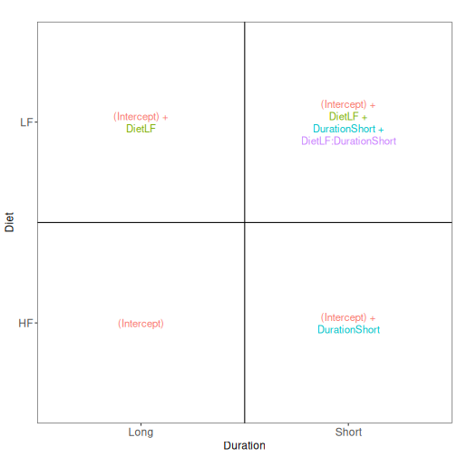
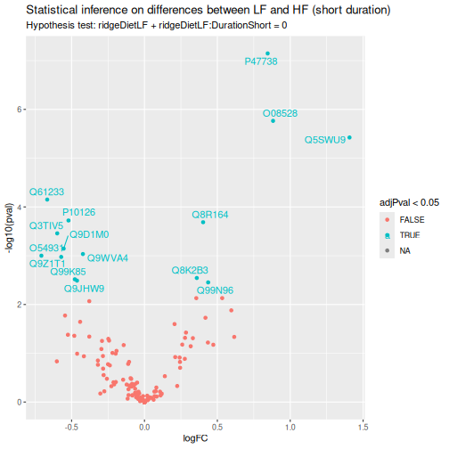
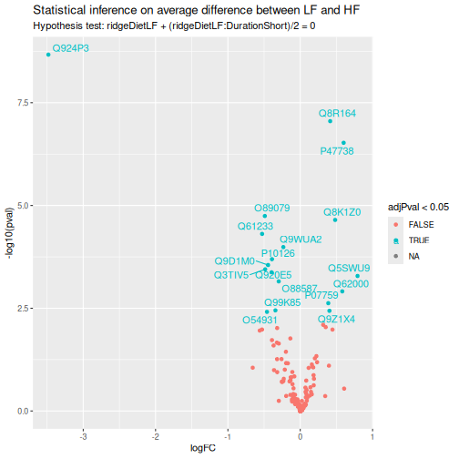
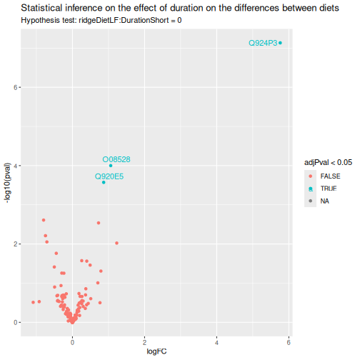
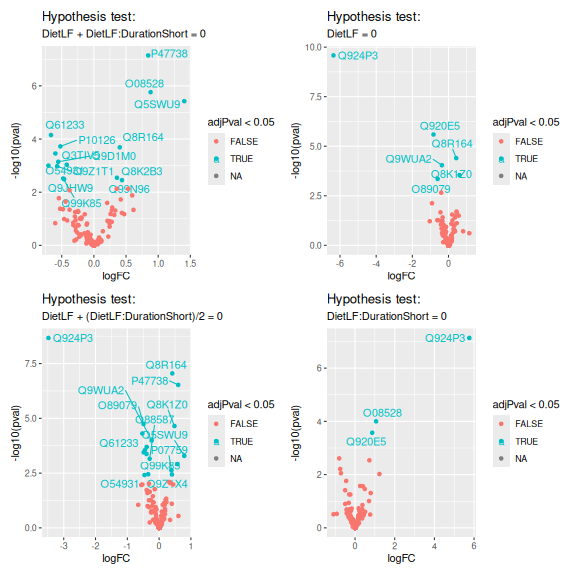

# The mouse diet use case: a Skyline TMT DDA dataset {#sec-mouse_diet}


## Introduction

If you never used `msqrob2`, we suggest to familiarise yourself with
the [basic concepts chapter](#sec-basics) first. Note that TMT
experiments imposes complex designs, hence we also suggest reading the
[advanced concepts chapter](#sec-advanced).

We will demonstrate the msqrob2TMT workflow, a data processing and
modelling workflow dedicated to the analysis of TMT-based proteomics
datasets. We will demonstrated the workflow using the study published
by @Plubell2017-th, illustrating the statistical concepts using a
real-life use case.

Since this chapter uses a real-life study, we cannot objectively
assess the results. The [advanced concepts chapter](#sec-advances)
demonstrates an msqrob2TMT analysis with ground truth information.

Before delving further into the use case, let us prepare our
computational environment.

## Load packages

First, we load the `msqrob2` package and additional packages for data
manipulation and visualisation.


``` r
library("msqrob2")
library("ggplot2")
library("patchwork")
library("ggrepel")
library("dplyr")
```

We also configure the [parallelisation](#sec-parallel) framework.


``` r
library("BiocParallel")
register(SerialParam())
```

## Load data

### Experimental context{#sec-exp_design_mouse}

The data used in this vignette has been published by @Plubell2017-th
(PXD005953). The objective of the experiment was to explore the impact
of low-fat and high-fat diets on the proteomic content of adipose
tissue in mice. It also assesses whether the duration of the diet may
impact the results. The authors assigned twenty mice into four groups
(5 mice per group) based on their diet, either low-fat (LF) or
high-fat (HF), and the duration of the diet, which was classified as
short (8 weeks) or long (18 weeks). Samples from the epididymal
adipose tissue were extracted from each mice. The samples were then
randomly distributed across three TMT 10-plex mixtures for analysis.
In each mixture, two reference labels were used, each containing
pooled samples that included a range of peptides from all the samples.
Not all labels were used, leading to an unbalanced design. Each TMT
10-plex mixture was fractionated into nine parts, resulting in a total
of 27 MS runs.

<div class="figure">

<p class="caption">Overview of the experimental design. Taken from Plubell et al. 2017.</p>
</div>

### Getting the data

The data were reanalyzed by @Huang2020-lu and have been deposited in
the `MSV000084264` MASSiVE repository, but we will retrieve the
timestamped data from our [Zenodo
repository](https://zenodo.org/records/14767905). We need 2 files: the
Skyline identification and quantification table generated by the
authors and the sample annotation files^[note that these files are
[locally cached](#sec-caching)].


``` r
library("BiocFileCache")
bfc <- BiocFileCache()
psmFile <- bfcrpath(bfc, "https://zenodo.org/records/14767905/files/mouse_psms.txt?download=1")
annotFile <- bfcrpath(bfc, "https://zenodo.org/records/14767905/files/mouse_annotations.csv?download=1")
```

This analysis starts with the [PSM table](#sec-psm_table). Note that
columns that start with `"Abundance."` contain the quantitative values
for each TMT label.


``` r
psms <- read.delim(psmFile)
```

|Checked |Confidence |Identifying.Node |PSM.Ambiguity |Annotated.Sequence    |Modifications                   | X..Protein.Groups| X..Proteins|Master.Protein.Accessions |Master.Protein.Descriptions |Protein.Accessions     |Protein.Descriptions                                                                                                                                                                                                                  | X..Missed.Cleavages| Charge| DeltaScore| DeltaCn| Rank| Search.Engine.Rank| m.z..Da.| MH...Da.| Theo..MH...Da.| DeltaM..ppm.| Deltam.z..Da.|Activation.Type |MS.Order | Isolation.Interference....| Average.Reporter.S.N| Ion.Inject.Time..ms.| RT..min.| First.Scan|Spectrum.File                                                     |File.ID | Abundance..126| Abundance..127N| Abundance..127C| Abundance..128N| Abundance..128C| Abundance..129N| Abundance..129C| Abundance..130N| Abundance..130C| Abundance..131|Quan.Info | Ions.Score| Identity.Strict| Identity.Relaxed| Expectation.Value| Percolator.q.Value| Percolator.PEP|
|:-------|:----------|:----------------|:-------------|:---------------------|:-------------------------------|-----------------:|-----------:|:-------------------------|:---------------------------|:----------------------|:-------------------------------------------------------------------------------------------------------------------------------------------------------------------------------------------------------------------------------------|-------------------:|------:|----------:|-------:|----:|------------------:|--------:|--------:|--------------:|------------:|-------------:|:---------------|:--------|--------------------------:|--------------------:|--------------------:|--------:|----------:|:-----------------------------------------------------------------|:-------|--------------:|---------------:|---------------:|---------------:|---------------:|---------------:|---------------:|---------------:|---------------:|--------------:|:---------|----------:|---------------:|----------------:|-----------------:|------------------:|--------------:|
|False   |High       |Mascot (A2)      |Unambiguous   |[K].aIDILDR.[SM]      |N-Term(TMT6plex)                |                 1|           1|                          |                            |Q61084                 |Mitogen-activated protein kinase kinase kinase 3 OS=Mus musculus GN=Map3k3 PE=1 SV=1                                                                                                                                                  |                   0|      2|          0|       0|    1|                  1| 522.8161| 1044.625|       1044.625|        -0.14|      -0.00008|CID             |MS2      |                   2.279464|                 10.5|               42.390|  63.4111|      16103|PAMI-194_Mouse_U-Dd_TMT_40ug_28pctACN_25cm_120min_20160426_OT.raw |F3.6    |       2382.454|        2429.068|        2707.243|        3317.650|        5035.093|       3031.7993|       4808.5522|        2583.115|        3103.613|       2795.283|NA        |         40|              25|               18|         0.0003802|          0.0008956|      0.0111900|
|False   |High       |Mascot (C2)      |Unambiguous   |[K].aLEENNNFSk.[M]    |N-Term(TMT6plex); K10(TMT6plex) |                 1|           1|                          |                            |P55821                 |Stathmin-2 OS=Mus musculus GN=Stmn2 PE=1 SV=1                                                                                                                                                                                         |                   0|      2|         NA|       0|    1|                  2| 812.4410| 1623.875|       1623.874|         0.26|       0.00021|CID             |MS2      |                  20.489330|                  0.8|              116.000|  38.9028|       7622|PAMI-176_Mouse_A-J_TMT_40ug_22pctACN_25cm_120min_20160223_OT.raw  |F1.3    |       1112.530|              NA|              NA|              NA|              NA|        389.5883|        963.0698|              NA|              NA|             NA|NA        |         49|              29|               22|         0.0000932|          0.0000000|      0.0000510|
|False   |High       |Mascot (C2)      |Rejected      |[K].eMISDIk.[F]       |N-Term(TMT6plex); K7(TMT6plex)  |                 0|           1|                          |                            |Q5SQM0                 |Echinoderm microtubule-associated protein-like 6 OS=Mus musculus GN=Eml6 PE=2 SV=1                                                                                                                                                    |                   0|      2|          0|       0|    1|                  1| 647.3786| 1293.750|       1293.749|         0.84|       0.00054|CID             |MS2      |                  62.114720|                 25.4|               50.658|  45.5494|      10094|PAMI-176_Mouse_A-J_TMT_40ug_24pctACN_25cm_120min_20160223_OT.raw  |F1.4    |       8606.559|       10042.301|        7976.240|        5196.599|        9381.061|      12227.7070|       6418.2720|        5791.740|        9665.493|       5747.680|NA        |         11|              28|               21|         0.5635688|          0.0016120|      0.0284500|
|False   |High       |Mascot (C2)      |Unambiguous   |[KR].iIDFGLAR.[HQRT]  |N-Term(TMT6plex)                |                 4|           3|                          |                            |Q3UIZ8; Q5SUV5; Q8VCR8 |Myosin light chain kinase 3 OS=Mus musculus GN=Mylk3 PE=1 SV=1; Myosin light chain kinase family member 4 OS=Mus musculus GN=Mylk4 PE=1 SV=2; Myosin light chain kinase 2, skeletal/cardiac muscle OS=Mus musculus GN=Mylk2 PE=1 SV=2 |                   0|      2|          0|       0|    1|                  1| 567.3476| 1133.688|       1133.688|        -0.09|      -0.00005|CID             |MS2      |                  30.288610|                 13.5|               41.830|  70.4334|      19108|PAMI-176_Mouse_A-J_TMT_40ug_30pctACN_25cm_120min_20160223_OT.raw  |F1.7    |       4964.429|        5950.643|        3133.549|        3321.042|        2914.397|       3274.3197|       3284.3334|        4714.300|        3846.105|       5461.438|NA        |         41|              24|               17|         0.0002663|          0.0000983|      0.0004159|
|False   |High       |Mascot (B2)      |Unambiguous   |[KR].iQLWDTAGQER.[FY] |N-Term(TMT6plex)                |                 7|           1|                          |                            |O35963                 |Ras-related protein Rab-33B OS=Mus musculus GN=Rab33b PE=1 SV=1                                                                                                                                                                       |                   0|      3|         NA|       0|    1|                  2| 515.9459| 1545.823|       1545.822|         0.49|       0.00025|CID             |MS2      |                  14.174430|                  5.2|              116.000|  63.1792|      15687|PAMI-176_Mouse_K-T_TMT_40ug_26pctACN_25cm_120min_20160223_OT.raw  |F2.5    |       2202.812|        1313.995|        1942.837|        2381.060|        1443.969|       1701.8316|        968.0946|        1867.904|         910.823|       1371.243|NA        |         28|              28|               21|         0.0092083|          0.0000000|      0.0000261|
|False   |High       |Mascot (A2)      |Unambiguous   |[K].aIDILDR.[SM]      |N-Term(TMT6plex)                |                 1|           1|                          |                            |Q61084                 |Mitogen-activated protein kinase kinase kinase 3 OS=Mus musculus GN=Map3k3 PE=1 SV=1                                                                                                                                                  |                   0|      2|          0|       0|    1|                  1| 522.8161| 1044.625|       1044.625|        -0.14|      -0.00008|CID             |MS2      |                  21.614820|                 19.0|              116.000|  62.4027|      15935|PAMI-194_Mouse_U-Dd_TMT_40ug_26pctACN_25cm_120min_20160426_OT.raw |F3.5    |       6064.501|        3790.208|        4328.930|        6528.889|        6080.098|       7705.8087|       7836.0572|        4606.420|        5347.845|       5869.469|NA        |         42|              25|               18|         0.0002350|          0.0005618|      0.0067230|

We also load the [annotation table](#sec-annotation_table). Each row
in the annotation table contains information for one sample (the table
below shows the first 6 rows).


``` r
coldata <- read.csv(annotFile)
```

|Channel |Condition |Run                                                              |BioReplicate            |Mixture            |Fraction                           | TechRepMixture|
|:-------|:---------|:----------------------------------------------------------------|:-----------------------|:------------------|:----------------------------------|--------------:|
|126     |Long_LF   |PAMI-176_Mouse_A-J_TMT_40ug_30pctACN_25cm_120min_20160223_OT.raw |PAMI-176_Mouse_A-J.X126 |PAMI-176_Mouse_A-J |40ug_30pctACN_25cm_120min_20160223 |              1|
|126     |Long_LF   |PAMI-176_Mouse_A-J_TMT_40ug_28pctACN_25cm_120min_20160223_OT.raw |PAMI-176_Mouse_A-J.X126 |PAMI-176_Mouse_A-J |40ug_28pctACN_25cm_120min_20160223 |              1|
|126     |Long_LF   |PAMI-176_Mouse_A-J_TMT_40ug_90pctACN_25cm_120min_20160223_OT.raw |PAMI-176_Mouse_A-J.X126 |PAMI-176_Mouse_A-J |40ug_90pctACN_25cm_120min_20160223 |              1|
|126     |Long_LF   |PAMI-176_Mouse_A-J_TMT_40ug_40pctACN_25cm_120min_20160223_OT.raw |PAMI-176_Mouse_A-J.X126 |PAMI-176_Mouse_A-J |40ug_40pctACN_25cm_120min_20160223 |              1|
|126     |Long_LF   |PAMI-176_Mouse_A-J_TMT_40ug_22pctACN_25cm_120min_20160223_OT.raw |PAMI-176_Mouse_A-J.X126 |PAMI-176_Mouse_A-J |40ug_22pctACN_25cm_120min_20160223 |              1|
|126     |Long_LF   |PAMI-176_Mouse_A-J_TMT_40ug_24pctACN_25cm_120min_20160223_OT.raw |PAMI-176_Mouse_A-J.X126 |PAMI-176_Mouse_A-J |40ug_24pctACN_25cm_120min_20160223 |              1|

We perform a little cleanup of the sample annotations to generate the
information needed for later data modelling, namely 

1. We extract the diet type from the condition variable.
2. We extract the diet duration from the condition variable. 
3. We rename the `Channel` column to `Label` for more clarity with the
   main text.


``` r
coldata$Duration <- gsub("_.*", "", coldata$Condition) ## 1.
coldata$Diet <- gsub(".*_", "", coldata$Condition) ## 2.
colnames(coldata)[1] <- "Label" ## 3.
```

We will also subset the data set to reduce computational costs. If you
want to run the vignette on the full data set, you can skip this
chunk. We here randomly sample 500 proteins from the experiment.


``` r
proteinIds <- unique(psms$Protein.Accessions)
set.seed(1234)
psms <- psms[psms$Protein.Accessions %in% sample(proteinIds, 500), ]
```

### The `QFeatures` data class

We combine the two tables into a [`QFeatures` object](#sec-qfeatures).
We need to point to the column containing the run information. For the
annotation table, this is simply the `Run` column. For the Skyline
table, this is the `Spectrum.File` column. We also add a `quantCols`
column in the annotation table. We also simply the run names upon
conversion for conciseness.


``` r
coldata$runCol <- coldata$Run
coldata$quantCols <- paste0("Abundance..", coldata$Label)
mouse <- readQFeatures(psms, colData = coldata,
                       quantCols = unique(coldata$quantCols),
                       runCol = "Spectrum.File", name = "psms")
names(mouse) <- sub("^.*(Mouse.*ACN).*raw", "\\1", names(mouse))
mouse
```

```
## An instance of class QFeatures (type: bulk) with 27 sets:
## 
##  [1] Mouse_A-J_TMT_40ug_14pctACN: SummarizedExperiment with 198 rows and 10 columns 
##  [2] Mouse_A-J_TMT_40ug_20pctACN: SummarizedExperiment with 481 rows and 10 columns 
##  [3] Mouse_A-J_TMT_40ug_22pctACN: SummarizedExperiment with 514 rows and 10 columns 
##  ...
##  [25] Mouse_U-Dd_TMT_40ug_30pctACN: SummarizedExperiment with 726 rows and 10 columns 
##  [26] Mouse_U-Dd_TMT_40ug_40pctACN: SummarizedExperiment with 566 rows and 10 columns 
##  [27] Mouse_U-Dd_TMT_40ug_90pctACN: SummarizedExperiment with 251 rows and 10 columns
```

We now have a `QFeatures` object with 27 sets, each containing data
associated with an MS run. 

## Data preprocessing

`msqrob2` relies on the `QFeatures` data structure, meaning that we
can directly make use of `QFeatures`' data preprocessing
functionality (see also the `QFeatures`
[documentation](https://rformassspectrometry.github.io/QFeatures/articles/Processing.html)).

### Encoding missing values

Peptides with zero intensities are missing peptides and should be
represent with a `NA` value rather than `0` (see [Encoding missing
values]).


``` r
mouse <- zeroIsNA(mouse, names(mouse))
```

### Sample filtering

We remove the reference samples that were used by the MSstatsTMT
authors to obtain normalisation factors since msqrob2TMT workflows do
not require normalisation from reference label. The information
about which samples are normalisation samples is available from the
`colData`, in the `Condition` column.


``` r
table(mouse$Condition)
```

```
## 
##  Long_HF  Long_LF   Long_M     Norm Short_HF Short_LF 
##       45       45       36       54       45       45
```

We remove any sample that is marked as `Norm`. We also remove sample
that are annotated as `Long_M` since we could not find documentation
for this group.


``` r
mouse <- subsetByColData(
    mouse, mouse$Condition != "Norm" & mouse$Condition != "Long_M"
)
```

### PSM filtering

We [filter features](#sec-filter) for which more than 70% of the
intensities are missing in a run. We keep the spectrum as soon as the
reporter ions are observed in at least 3 out of 10 TMT labels of the
run (same cut-off as applied in @Huang2020-lu).


``` r
mouse <- filterNA(mouse, names(mouse), pNA = 0.7) ## 2.
```

We next remove PSMs that could not be mapped to a protein or that map
to multiple proteins (the protein identifier contains multiple
identifiers separated by a `;`). We use `filterFeatures()` that will
keep the row that fulfill the condition below. Note that
`Protein.Accessions` is a column generated by Skyline that is
available in the `rowData`.


``` r
mouse <- filterFeatures(
    mouse, ~ Protein.Accessions != "" & ## Remove failed protein inference
        !grepl(";", Protein.Accessions)) ## Remove protein groups
```

Peptide ions that were identified with multiple PSMs in a run are
collapsed to the PSM with the highest summed intensity over the
labels, a strategy that is also used by MSstats. We will again use
`filterFeatures()`, but the highest summed intensity for each PSM 
is not available in the `rowData`, so we need to create it manually.

We therefore loop over each set:

1. Make a new variable for ionID in the `rowData`, which is defined as
   the peptide sequence and its charge.
2. We calculate the `rowSums` for each ion.
3. Make a new variable `psmRank` that ranks the PSMs for each ion
   based on the summed intensity.
4. We store the new information back in the `rowData`.
5. We keep the PSM with the highest summed intensity, that is that
   ranks first (note that PSM unique to an ion will always rank 
   first).


``` r
for (i in names(mouse)) {
    rowdata <- rowData(mouse[[i]])
    rowdata$ionID <- paste0(rowdata$Annotated.Sequence, rowdata$Charge) ## 1.
    rowdata$rowSums <- rowSums(assay(mouse[[i]]), na.rm = TRUE) ## 2.
    rowdata <- data.frame(rowdata) |>
        group_by(ionID) |>
        mutate(psmRank = rank(-rowSums)) ## 3.
    rowData(mouse[[i]]) <- DataFrame(rowdata) ## 4.
}
mouse <- filterFeatures(mouse, ~ psmRank == 1) ## 5.
```

So, we implicitly collapsed the PSM-level data into **peptide-ion**
data, where each row represents a PSM, but also a unique ion within a
run. So we will refer to the data as  "ion-level".

### Standard preprocessing workflow

We can now prepare the data for modelling. The workflow ensures the
data complies to `msqrob2`'s requirements:

1. Intensities are log-transformed.
2. Samples are normalised.
3. (optionally) PSMs intensities are summarised into protein abundance
   values for protein-level workflows.


``` r
sNames <- names(mouse)
mouse <- logTransform( ## 1.
    mouse, sNames, name = paste0(sNames, "_log"), base = 2
)
mouse <- normalize( ## 2.
    mouse, paste0(sNames, "_log"), name = paste0(sNames, "_norm"),
    method = "center.median"
)
mouse <- aggregateFeatures( ## 3.
    mouse, i = paste0(sNames, "_norm"), name = paste0(sNames, "_proteins"),
    fcol = "Protein.Accessions", fun = MsCoreUtils::medianPolish,
    na.rm=TRUE
)
```

We conclude the preprocessing by joining the assays of the different
runs in a single ion set for ion-level models. In order to correctly
match peptide ions across rus, we use `ionID` as a row identifier.


``` r
mouse <- joinAssays(mouse, paste0(sNames, "_norm"), fcol = "ionID", "ions_norm")
```

We also join the protein sets for protein-level models. We omit `fcol`
and will merge rows based on their row name (protein identifier).


``` r
mouse <- joinAssays(mouse, paste0(sNames, "_proteins"), "proteins")
```

## Data exploration

As [described above](#sec-exp_design_mouse), the samples originate from mice
that were either subject to a low-fat (`LF`) or high-fat (`HF`) diet.
Moreover, each diet was maintained for a short duration
(`Short`) or a long duration (`Long`). Note that each group contains 5
mice but the peptides from each sample have been fractionated in 9
fractions, leading to 45 units per group.

In this case, we are interested in the effects of diet type and the
effect of diet duration. The table below confirms we have a balanced
design for each condition.


``` r
table(Diet = mouse$Diet, Duration = mouse$Duration)
```

```
##     Duration
## Diet Long Short
##   HF   45    45
##   LF   45    45
```

Furthermore, there are potential unwanted sources of variation: the
experimental unit (i.e. the mouse, `BioReplicate`), the fraction
(`Fraction`), the run (`Run`), the TMT mixture (`Mixture`).

We will explore the main sources of variation in the
data (see [Data exploration]). Unfortunately, the peptide ion
data contains too many missing values and cannot be explored using
standard dimension reduction approaches. `omicsGMF` [@Segers2025-ce]
provides an interesting alternative, but is still in its early stage
and will not be included here. We will therefore run a MDS analysis on
the protein-level data instead, which contains less missing values.


``` r
library("scater")
se <- getWithColData(mouse, "proteins") |> 
  as("SingleCellExperiment") |> 
  runMDS(exprs_values = 1)
```

We can now plot the MDS and colour each sample based on different
potential sources of variation.


``` r
plotMDS(se, colour_by = "Run") + ggtitle("Coloured by Run") +
  scale_colour_manual(values = rainbow(27)) +
  plotMDS(se, colour_by = "Fraction") + ggtitle("Coloured by Fraction") +
  plotMDS(se, colour_by = "BioReplicate") + ggtitle("Coloured by BioReplicate") +
  plotMDS(se, colour_by = "Mixture") + ggtitle("Coloured by Mixture") +
  plotMDS(se, colour_by = "Diet") + ggtitle("Coloured by Diet") +
  plotMDS(se, colour_by = "Duration") + ggtitle("Coloured by Duration") &
  theme(legend.position = "none") 
```


The data exploration leads to several observations: 

- The strongest source of variation is associated with the MS 
  acquisition run. 
- Part of this run effect is influenced by which fraction it contains
  since samples from the same fraction tend to be closer than samples from different
  fractions. (**TODO DISCUSS**)
- It is difficult to identify an effect of mouse (biological
  replicate) because every run contains distinct mice. However, this
  does not exclude an effect of mice which has been identified as a
  potential source of variation and hence should still be modelled. (**TODO DISCUSS**)
- There is potentially also an effect of TMT mixture since samples
  from the same mixtures tend to cluster together (in the center of
  the plot). However, this effect are more subtle to detect and
  difficult to disentangle from the run and fraction effects.
- Although again very subtle, we can see within each run that samples
  from the mice with the same diet tends to group together. However,
  these effects are overwhelmed by the run effects. An effect of
  duration is to subtle to pinpoint from the current data exploration.

Data modelling disentangles the different sources of variation, given
their are properly defined in the model, hence the next section. 

## Data modelling

The preprocessed data can now be modelled to answer biologically
relevant questions. 

### Sources of variation

Proteomics data contain several sources of variation that need to be
accounted for by the model:

1. **Treatment of interest**: we model the source of variation induced
   by the experimental treatment of interest as a **fixed effect**.
   Fixed effects are effect that are considered non-random, i.e. the
   treatment effect is assumed to be the same and reproducible across
   repeated experiments, but it is unknown and has to be estimated. We
   will include `Diet` as a fixed effect that models the fact that a
   change in diet type can induce changes in protein abundance.
   Similarly, we also include `Duration` as a fixed effect to model
   the change in protein abundance induces by the diet duration.
   Finally, we will also include an interaction between the two
   variables allowing that the changes in protein abundance induced by
   diet type can be different whether the mice were fed for a short or
   long duration.

2. **Pseudo-replication effect**: the experiment involves biological
   replication as the adipose tissue extracts were sampled from 20
   mice (5 mice per Diet x Duration combination). The tissue from each
   mouse was prepared in a single TMT mixture, but each mixture was
   acquired in 9 fractions, so we have 9 measures for each mice. While
   the treatment is applied at the mice level (experimental unit), we
   actually measure 9 fractions as an outcome (observational unit). We
   refer to **pseudo-replication** when the observational unit is
   different from the experimental unit. We therefore need to account
   for the potential increased correlation among pseudo-replicates
   from the same mouse compared to between different mice. These
   effects are typically modelled as [random
   effects](#sec-random_effect), and are assumed to be i.i.d normally
   distributed with mean 0 and constant variance, $u_{mouse} \sim
   N(0,\sigma^{2,\text{mouse}})$. The use of random effects thus
   models the correlation in the data, explicitly.


``` r
length(unique(mouse$BioReplicate))
```

```
## [1] 20
```

3. **Labelling effects**: the 20 mouse adipose tissue samples have been
   labelled using 18-plex TMT. We can expect that samples measured
   within the same TMT label may be more similar than samples
   measured within different TMT labels. Since these effects may not
   be reproducible from one experiment to another, for instance
   because each TMT kit may potentially contain different impurity
   ratios, we can account for this source of variation using a random effect
   for TMT label.


``` r
length(unique(mouse$Label))
```

```
## [1] 10
```

4. **Mixture effects**: the 20 mouse samples were assigned to one out
   of 3 mixtures. Again, we expect that protein intensities from the same
   mixture will be more alike than those of different mixtures. Hence,
   we will add a random effect for mixture.


``` r
table(mouse$Mixture)
```

```
## 
##  PAMI-176_Mouse_A-J  PAMI-176_Mouse_K-T PAMI-194_Mouse_U-Dd 
##                  54                  63                  63
```

5. **Run effects**: protein intensities that are measured within the 
   same run will be more similar than protein intensities between
   runs. We will use a random effect for run to explicitly model this
   correlation in the data. Note that each sample has been acquired in
   9 fractions, each fraction being measured in a separate run.
   Accounting for the effects of run will also absorb the effects of
   fraction.


``` r
length(unique(mouse$Run))
```

```
## [1] 27
```

6. **Spectrum effects**: we will directly estimate the treatment effect
   at the protein-level from ion-level data. This will again induce
   additional levels of correlation. The intensities for the different
   TMT labels in the same spectrum (PSM) within a run will be
   more similar than the intensities between spectra. We therefore
   need to add a random effect term to account for the within spectrum
   correlation structure. Note that a spectrum here contains the data
   from one peptide ion within a run. Hence, modelling a random effect
   for spectrum boils down to modelling a random effect for peptide
   ion nested within run.

7. **Labelling effects nested in run**: modelling the data at the
   ion-level also implies that a label in a run contains multiple
   ion intensities for each protein. Hence, intensities from different
   peptide ions for a protein with the same label within a run will be
   more alike than intensities of different PSMs for the same protein
   with different labels and/or runs, and we will address this
   correlation with a random effect for label nested in run.

`msqrob2` workflows rely on linear mixed models, which are models that
can estimate and predict fixed and random effects, respectively.

Now we have identified the sources of variation, we can define a
model. We will model the main effects for `Diet` and `Duration`, and a
`Diet:Duration` interaction, to account for proteins for which the
`Diet` effect changes according to `Duration`, and vice versa, which
can be written as `Diet + Duration + Diet:Duration`, shortened into
`Diet * Duration`. Adding the technical sources of variation, the
model becomes.


``` r
model <- ~ Diet * Duration + ## (1) fixed effect for Diet and Duration with interaction
  (1 | BioReplicate) +  ## (2) random effect for biological replicate (mouse)      
  (1 | Label) + ## (3) random effect for label
  (1 | Mixture) + ## (4) random effect for mixture
  (1 | Run) + ## (5) random effect for MS run
  (1 | Run:ionID) + ## (6) random effect for spectrum, i.e. ionID nested in run
  (1 | Run:Label)  ## (7) random effect for label nested in MS run
```

We can run the `msqrob2` statistical workflow.

### Model estimation

We estimate the peptide-ion-level model with `msqrobAggregate()` 
(see [the modelling section](#sec-run_model)). Recall that
variables defined in `model` are automatically retrieved from the
`colData` (`"Diet"`, `"Duration"`, `"Label"`, `"Mixture"`) and
from the `rowData` (`"ionID"`). We also enable M-estimation
(`robust = TRUE`) for improved robustness against outliers and ridge
penalisation (`ridge = TRUE`) to stabilise the parameter estimation.


``` r
mouse <- msqrobAggregate(
    mouse, i = "ions_norm",
    formula = model,
    fcol = "Protein.Accessions",
    modelColumnName = "msqrob_ion",
    name = "proteins_msqrob",
    ridge = TRUE, robust = TRUE
)
```

Once the model is estimated, we can start answering biological
questions.

### Hypothesis testing

In this section, you will learn how to convert a biological question
into a statistical hypothesis.

#### Difference between low fat and high fat diet after short duration

A first question one can ask is: how are protein abundance affected by
diet when only considering a short diet duration? We need to convert
this question in a combination of the model parameters, also referred
to as a contrast. To aid defining contrasts, we will visualise the
experimental design using the `ExploreModelMatrix` package. 
Note that with ExploreModelMatrix we can only visualise fixed effects
part of the model. This is fine as the mean protein abundances can
only systematically differ from each other according to the
main effects for `Diet` and `Duration` and the `Diet:Duration` interaction.


``` r
library("ExploreModelMatrix")
vd <- VisualizeDesign(
    sampleData =  colData(mouse),
    designFormula = ~ Diet * Duration,
    textSizeFitted = 4
)
vd$plotlist[[1]]
```



Assessing the difference between low-fat and high-fat diets for short
duration boils down to assessing the difference between the `Short_LF` and
`Short_HF`. The mean for the short low-fat diet group is defined by
`(Intercept) + DietLF + DurationShort + DietLF:DurationShort`. The
mean for the short high-fat diet group is defined by `(Intercept) +
DurationShort`. The difference between the two results in the
contrast below:


``` r
contrast <- "ridgeDietLF + ridgeDietLF:DurationShort"
```

Note that because we used ridge regression for modelling, we need to
prefix the parameter names with `ridge`. We can further specify the
null hypothesis, that is we are interest whether the differences 
between the two groups is different from zero.


``` r
(hypothesis1 <- paste(contrast, "= 0"))
```

```
## [1] "ridgeDietLF + ridgeDietLF:DurationShort = 0"
```

We next use `makeContrast()` to build a contrast matrix.


``` r
(L <- makeContrast(
    hypothesis1,
    parameterNames = c("ridgeDietLF","ridgeDurationShort","ridgeDietLF:DurationShort")
))
```

```
##                           ridgeDietLF + ridgeDietLF:DurationShort
## ridgeDietLF                                                     1
## ridgeDurationShort                                              0
## ridgeDietLF:DurationShort                                       1
```

We can now test our null hypothesis.


``` r
mouse <- hypothesisTest(
    mouse, i = "proteins_msqrob", L, modelColumn = "msqrob_ion"
)
```

Let us retrieve the result table from the `rowData`. Note that the
model column is named after the column names of the contrast matrix `L`.


``` r
inference <- rowData(mouse[["proteins_msqrob"]])[[colnames(L)]]
inference$Protein <- rownames(inference)
head(inference, 10)
```

```
##                logFC           se       df             t      pval adjPval
## A2AJB7  3.491872e-09 9.284189e-05 67.35093  3.761096e-05 0.9999701       1
## A2AJK6            NA           NA       NA            NA        NA      NA
## A2AQP0            NA           NA       NA            NA        NA      NA
## A2AWP8            NA           NA       NA            NA        NA      NA
## A6H8H2            NA           NA       NA            NA        NA      NA
## B1AVY7            NA           NA       NA            NA        NA      NA
## B2RSH2  2.296647e-09 8.045105e-05 52.17788  2.854713e-05 0.9999773       1
## C0HKD8            NA           NA       NA            NA        NA      NA
## D3Z5L6            NA           NA       NA            NA        NA      NA
## E9Q5C9 -1.798058e-09 6.822108e-05 29.11140 -2.635634e-05 0.9999792       1
##        Protein
## A2AJB7  A2AJB7
## A2AJK6  A2AJK6
## A2AQP0  A2AQP0
## A2AWP8  A2AWP8
## A6H8H2  A6H8H2
## B1AVY7  B1AVY7
## B2RSH2  B2RSH2
## C0HKD8  C0HKD8
## D3Z5L6  D3Z5L6
## E9Q5C9  E9Q5C9
```

The table contains the hypothesis testing results for every protein.
Notice that several rows contain missing values. This is because data
modelling resulted in a `fitError`. The model cannot be estimated for
some proteins either because of patterns in missing values, or because a protein was measured from a single peptide ion
alleviating the estimation of spectrum effects (see [how to deal with
`fitError`s](#sec-fiterror)).

We can use the table above directly to build a volcano plot using
`ggplot2` functionality.


``` r
ggplot(inference) +
    aes(x = logFC, y = -log10(pval), color = adjPval < 0.05) +
    geom_text_repel(data = filter(inference, adjPval < 0.05),
                    aes(label = Protein)) +
    geom_point() +
    ggtitle("Statistical inference on differences between LF and HF (short duration)",
            paste("Hypothesis test:", gsub("ridgeCondition", "", colnames(L)), "= 0"))
```



In this example (remember this is a subset of the complete data set),
only a few proteins pass the significance threshold of 5%. Let us
visualise the protein with the largest fold change.


``` r
(targetProtein <- rownames(inference)[which.max(inference$logFC)])
```

```
## [1] "Q5SWU9"
```

To obtain the required data, we perform a little data manipulation
pipeline:

1. We use the `QFeatures` subsetting functionality to retrieve all
   data related to Q5SWU9 and focusing on the `ions_norm`
   set that contains the preprocessed peptide ion data used for
   modelling.
2. We use `longForm()` to convert the object into a table suitable
   for plotting.
3. We remove missing values for plotting and focus only on the data
   with short diet duration.
4. We reorder the sample identifiers to improve visualisation.


``` r
ionData <- mouse[targetProtein, , "ions_norm"] |> #1
    longForm(colvars = colnames(colData(mouse)), #2
               rowvars = c("Protein.Accessions", "ionID")) |>
    data.frame() |>
    filter(!is.na(value) & Duration == "Short") |> #3
    mutate(colname = factor(colname, levels = unique(colname[order(Condition)]))) #4
```

We can now plot the log normalised intensities. Since the protein is
modelled at the peptide ion level, multiple ion intensities are
recorded in each sample. Each ion is linked across samples using a
grey line. Samples are coloured according to the diet type. Finally,
we split the plot in facets, one for each mixture, to visualise the
heterogeneity induced by different pools of mice.


``` r
ggplot(ionData) +
    aes(x = colname,
        y = value) +
    geom_line(aes(group = ionID), linewidth = 0.1) +
    geom_point(aes(colour = Condition)) +
    facet_grid(~ Mixture, scales = "free") +
    labs(x = "Sample", y = "log2 intensity") +
    ggtitle(targetProtein) +
    theme_minimal() +
    theme(axis.text.x = element_blank())
```


The statistical analysis revealed a significant increase (positive log
fold change) of the abundance for Q5SWU9 in the group fed
with a low-fat diet compared to the high-fat diet fed group (upon
early diet duration). This finding can be visually validated as there
is a systematic increase in peptide ion intensities between the
low-fat diet group (blue) compared to the high-fat diet group (red).

#### Difference between low fat and high fat diet after long duration

The second question one can ask is what proteins are affected by diet
when only considering, this time, a long diet duration. Following the
same approach as above, the contrast becomes.


``` r
hypothesis2 <- "ridgeDietLF = 0"
```

We run the same statistical analysis pipeline as above.


``` r
L <- makeContrast(
    hypothesis2,
    parameterNames = c("ridgeDietLF","ridgeDurationShort","ridgeDietLF:DurationShort")
)
mouse <- hypothesisTest(
    mouse, i = "proteins_msqrob", L, modelColumn = "msqrob_ion"
)
inference <- rowData(mouse[["proteins_msqrob"]])[[colnames(L)]]
inference$Protein <- rownames(inference)
```

And we plot the results.


``` r
ggplot(inference) +
    aes(x = logFC, y = -log10(pval), color = adjPval < 0.05) +
    geom_text_repel(data = filter(inference, adjPval < 0.05),
                    aes(label = Protein)) +
    geom_point() +
    ggtitle("Statistical inference on differences between LF and HF (long duration)",
            paste("Hypothesis test:", gsub("ridgeCondition", "", colnames(L)), "= 0"))
```


Again, only a few proteins come out differentially abundant between
the two diets, but after a long diet duration. Surprisingly, there
is only a small overlap between differential protein after short
duration and after long duration. One hypothesis is that there is not
sufficient data to detect a reliable difference. A solution would be
to combine both short and long diet duration to retrieve an averaged
systematic effect between diets that combine all available data.
Another hypothesis is that diet duration may influence the effect of
diet on the protein abundances. We will explore the two hypothesis in
the following two sub-sections.

#### Average difference between low fat and high fat diet

One may want to identify the set of proteins that are systematically
differentially abundant between diets, irrespective of the duration.
To answer this question, we want to infer on the average difference
between group `LF` and group `HF`. The average low-fat diet is defined
by `((Intercept) + DietLF + DurationShort + DietLF:DurationShort +
(Intercept) + DietLF)/2`. The average high-fat diet group is defined
by `((Intercept) + DurationShort + (Intercept))/2`. The difference
between the two results in the hypothesis below:


``` r
hypothesis3 <- "ridgeDietLF + (ridgeDietLF:DurationShort)/2 = 0"
```

We next run again the same statistical analysis pipeline as above.


``` r
L <- makeContrast(
    hypothesis3,
    parameterNames = c("ridgeDietLF","ridgeDurationShort","ridgeDietLF:DurationShort")
)
mouse <- hypothesisTest(
    mouse, i = "proteins_msqrob", L, modelColumn = "msqrob_ion"
)
inference <- rowData(mouse[["proteins_msqrob"]])[[colnames(L)]]
inference$Protein <- rownames(inference)
```

And we plot the results.


``` r
ggplot(inference) +
    aes(x = logFC, y = -log10(pval), color = adjPval < 0.05) +
    geom_text_repel(data = filter(inference, adjPval < 0.05),
                    aes(label = Protein)) +
    geom_point() +
    ggtitle("Statistical inference on average difference between LF and HF",
            paste("Hypothesis test:", gsub("ridgeCondition", "", colnames(L)), "= 0"))
```



We find much more significant proteins when combining all available
data to infer the differences between low-fat and high-fat diets,
irrespective of duration. We also retrieve a good overlap between this
set of significant proteins and the two previous sets, indicating
that more data helped improving the statistical power.

#### Interaction: does the diet effect change according to duration?

We will now explore whether the effect of diet on protein abundance
may be affected by duration, i.e. we want to infer on the difference
of differences. The difference between hypothesis 1 and 2 is `(DietLF
+ DietLF:DurationShort) - (DietLF)` and results in the hypothesis
below:


``` r
hypothesis4 <- "ridgeDietLF:DurationShort = 0"
```

We can proceed with the same statistical pipeline.


``` r
L <- makeContrast(
    hypothesis4,
    parameterNames = c("ridgeDietLF","ridgeDurationShort","ridgeDietLF:DurationShort")
)
mouse <- hypothesisTest(
    mouse, i = "proteins_msqrob", L, modelColumn = "msqrob_ion"
)
inference <- rowData(mouse[["proteins_msqrob"]])[[colnames(L)]]
inference$Protein <- rownames(inference)
```

And we plot the results.


``` r
ggplot(inference) +
    aes(x = logFC, y = -log10(pval), color = adjPval < 0.05) +
    geom_text_repel(data = filter(inference, adjPval < 0.05),
                    aes(label = Protein)) +
    geom_point() +
    ggtitle("Statistical inference on the effect of duration on the differences between diets",
            paste("Hypothesis test:", gsub("ridgeCondition", "", colnames(L)), "= 0"))
```



There are only 3 proteins for which the effect of
diet changes according to the duration. Let us visually explore this changes for the most significant
protein.


``` r
(targetProtein <- rownames(inference)[which.min(inference$adjPval)])
```

```
## [1] "Q924P3"
```

We use again `Qfeatures`'s data manipulation pipeline.


``` r
ionData <- mouse[targetProtein, , "ions_norm"] |> #1
    longForm(colvars = colnames(colData(mouse)), #2
               rowvars = c("Protein.Accessions", "ionID")) |>
    data.frame() |>
    filter(!is.na(value)) |> #3
    mutate(colname = factor(colname, levels = unique(colname[order(Condition)]))) #4
```

And we explore the peptide ion data by visualising the differences
between LF and HF separately for each mixture and diet duration in
order to highlight changes in direction between these differences
according to duration. We link data points belonging to the same
peptide ion using a grey line.


``` r
ggplot(ionData) +
    aes(x = colname,
        y = value) +
    geom_line(aes(group = ionID), linewidth = 0.1) +
    geom_point(aes(colour = Diet)) +
    facet_grid(Mixture ~ Duration, scales = "free") +
    labs(x = "Sample", y = "log2 intensity") +
    ggtitle(targetProtein) +
    theme_minimal() +
    theme(axis.text.x = element_blank())
```


The graph hints towards a slight increase in protein abundance in the
low-fat diet group compared to the high-fat diet group during a short
diet duration, but this increase disappears after a long diet
duration. However, the visual inspection of the results also shows
that the result rely on sparse and highly unbalanced data. The results
may hence require further experimental validation.

Note that we performed the statistical analysis for each hypothesis
separately. However, `msqrob2` can assess multiple hypotheses at once.


``` r
L <- makeContrast(
    c(hypothesis1, hypothesis2, hypothesis3, hypothesis4),
    parameterNames = c("ridgeDietLF","ridgeDurationShort","ridgeDietLF:DurationShort")
)
mouse <- hypothesisTest(
    mouse, i = "proteins_msqrob", L,
    modelColumn = "msqrob_ion", overwrite = TRUE
)
```

Note that since we already generated results for the contrast, we
overwrite the results with the argument `overwrite = TRUE`.

We retrieve the inference tables from the `rowData` to generate the
volcano plot.


``` r
inferenceTables <- rowData(mouse[["proteins_msqrob"]])[, colnames(L)]
```

We here use a `lapply()` loop to generate the plots. The code chunk is
elaborate, but follows the same structure as in the previous section.
This generates a list of volcano plots, one for each hypothesis.


``` r
volcanoPlots <- lapply(colnames(inferenceTables), function(i) {
    inference <- inferenceTables[[i]]
    inference$Protein <- rownames(inference)
    ggplot(inference) +
        aes(x = logFC, y = -log10(pval), color = adjPval < 0.05) +
        geom_text_repel(data = filter(inference, adjPval < 0.05),
                        aes(label = Protein)) +
        geom_point() +
        ggtitle("Hypothesis test:",
                paste(gsub("ridge", "", i), "= 0"))
})
```

We combine all the plots in a single figure using the `patchwork`
packages.


``` r
wrap_plots(volcanoPlots)
```



### Protein-level model

This section illustrates data modelling starting from protein data 
instead of ion data.

Here, the workflow will use the summarised peptide ion intensities, as
performed during the preprocessing. Note, that we no longer have
multiple quantitative values for a protein in the same label of a run.
Hence, we can omit the nested effects for label and ionID in run.


``` r
modelSum <- ~ Diet * Duration + ## fixed effect for Diet and Duration with interaction
        (1 | Label) + ## (1) random effect for label
        (1 | Mixture) + ## (2) random effect for mixture
        (1 | Run) + ## (3) random effect for MS run
        (1 | BioReplicate)  ## (6) random effect for biorepeat (mouse)
```

For protein-level modelling, we use `msqrob()` instead of
`msqrobAggregate()`, but their function arguments closely overlap.


``` r
mouse <- msqrob(
    mouse, i = "proteins",
    formula = modelSum,
    modelColumnName = "msqrob_rrilmm",
    ridge = TRUE, robust = TRUE
)
```

We perform hypothesis tests for the early, late, average and
interaction effects. Note that the contrasts remain unchanged.


``` r
mouse <- hypothesisTest(
    mouse, i = "proteins", L, modelColumn = "msqrob_rrilmm"
)
```

The inference tables were all stored in the `rowData` as separate
columns, like previously.


``` r
inferenceTablesSum <- rowData(mouse[["proteins"]])[, colnames(L)]
```

We here use again the `lapply()` loop that generates the list of
volcano plots, one for each hypothesis.


``` r
volcanoPlotsSum <- lapply(names(inferenceTablesSum), function(i) {
    inference <- inferenceTablesSum[[i]]
    inference$Protein <- rownames(inference)
    ggplot(inference) +
        aes(x = logFC, y = -log10(pval), color = adjPval < 0.05) +
        geom_text_repel(data = filter(inference, adjPval < 0.05),
                        aes(label = Protein)) +
        geom_point() +
        ggtitle("Hypothesis test:",
                paste(gsub("tests_|ridge", "", i), "= 0"))
})
```


``` r
wrap_plots(volcanoPlotsSum)
```


## Conclusion

In this chapter, we have demonstrated the application of msqrob2TMT
workflows on a real-life case study.

The preprocessing workflow relies on the the `QFeatures` package. The
package provides functionality to carry out many steps like data
filtering, missing values management, normalisation,
log-transformation, imputation, summarisation, etc. The functions also
provide different methods for each step, meaning that the
preprocessing pipeline can be easily adapted to the researcher's
needs based on their experiment and data set.

Once preprocessed, we used the `msqrob2` package to model all sources
of variability as identified from the experimental design (and in part
validated by data exploration): effect of diet and duration, effect of
the MS acquisition run, effect of TMT mixture, effect of spectrum, and
effect of sample. Modelling these different sources of variability
allows to correctly infer changes in protein abundances between groups
of interest while using ion-level data, although we also illustrate
how to model the data at the protein level.

The experiment aims to understand the proteomic changes in mouse
adipose tissue that occur upon feeding the mice with low-fat or
high-fat diets, during a short or a long duration. We showed how to
model the effect of these two factors using main effects and an interaction, which allows that the effect of diet can change according to the duration, and vice versa. We also showed how to translate biological
questions into statistical hypothesis and corresponding contrast matrices using our
msqrob2TMT workflow. 

A unique
feature of `msqrob2` is that its flexible approach can include more
than 2 variables (with multiple interaction terms) as well as
including numerical variables, which may be essential in other
experimental contexts.

Modelling TMT-based data with biological replication leads to one of
the most complex designs. These have to be further complexified with
upcoming single-cell proteomics design where a new source of
variability arises as cells belonging to the same experimental unit
(subject or cell culture) are more similar than cells belonging to
different experimental units. However, the model simplifies for other
use cases. For instance, we saw how a protein-level model upon
aggregation simplifies the model. However, spectrum effects can no
longer be accounted for. This means that an appropriate summarisation
approach is needed to correctly account for these spectrum effects
when computing the protein-level summaries. Median polish (exemplified here) or
robust summary do account for this, at least partially depending on
the experimental design. 

Label-free experiments, which do not perform
chemical labelling of the samples, do not contain labelling effects
which therefore are omitted. Moreover, every sample is acquired as
part of a single run hence no run effect can be modelled. This
simplified model is easier to understand but bear in mind that these sources of variation (eg. spectrum effects or run effect)  end up in the residual variance, which might reduce statistical power.

Hence, we here demonstrated the power and flexibility of `msqrob2` and
the msqrob2TMT workflows to help researchers answer
biologically-relevant questions from their MS proteomics data.
